# Advanced Concepts

## Computed Attributes

It is possible to produce computed attributes. These attributes then automatically appear in the output of the data discovery, even if they are not part of the initial file.  
Computed attributes are frequently used to process data quality issues (formatting), and type transformation (strings into Boolean values or dates). The computed attributes can contain static or dynamic values.  
Dynamic values can rely on any other values of the current record. The component uses JavaScript macro syntax laid out in the "Collector Guide."  
To create a computed attribute, right-click on the upper left side of the editor, and select "Create a computed attribute."  

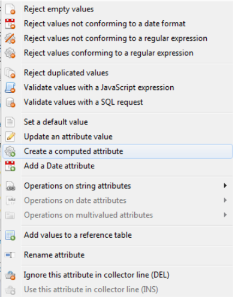  

An editor appears, allowing you to enter the new attribute's name, the static or dynamic value, and the conditions necessary for the creation of the attribute.  

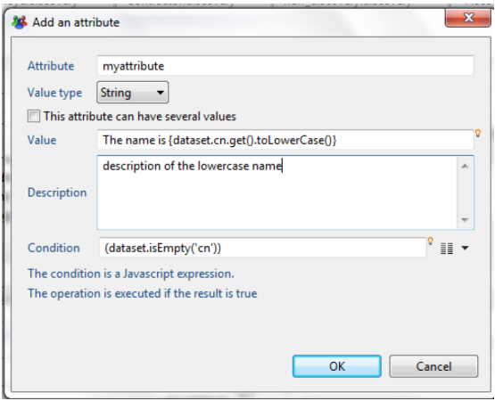  

The keyboard shortcut "Ctrl+Space" allows you to display the JavaScript query wizard.  
A wizard is also present on the right side of the "Condition" setting. It enables you to configure the conditions without needing to write the corresponding JavaScript code.  

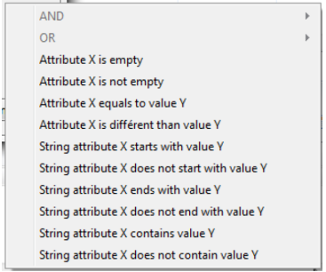  

## Operation on Multivalued Attributes

### Clean List

This action allows you to clean up a list:  

- By deleting empty values
- By deleting duplicates (in this case, only one value will be retained)

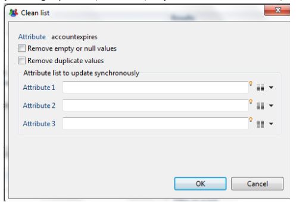

### Add a Value at the End of the List

This action allows the addition of a new value in a multivalued attribute.  
This value can be either:  

- The value of another attribute
- A static or dynamic value (via a macro type expression)

You can also choose to not add the value if it is already present, and to not perform this action if the necessary conditions are not met.  

### Filter Some Values of the List

You can filter some values of a multivalued attribute. There are two possible filtering operations:  

- retain only the values that meet the condition
- delete the values that meet the condition  

The condition can be:  

- a comparison of the value with the another attribute's value
- a comparison of the value with a static or dynamic value (using macro syntax)
- the application of a regular expression  

  

Note that this action can be associated with a runtime condition.

### Replace Each Value of the List

This action allows you to replace the values of a multivalued attribute.  

For this, you must indicate:  

- The replacement value (static or dynamic, using macro syntax)
- The condition for which to apply the replacement

The condition will apply to every value of the multivalued attribute; the replacement operation will only be effective if the condition is valid.  

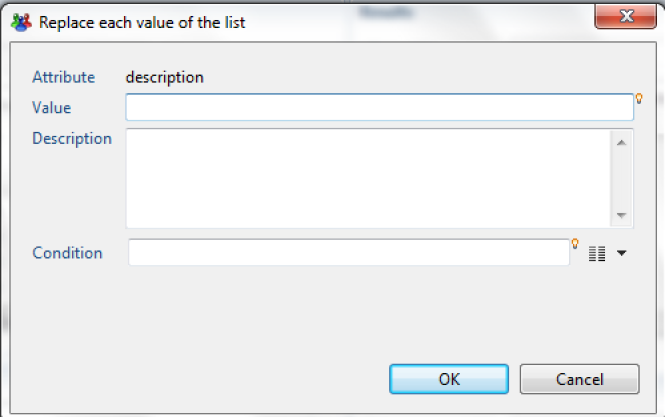

## Reference Tables

The Identity Ledger contains various attributes entered as references: positions, titles, types of hierarchical links, etc.  
The references must be created before the corresponding collector targets use them. For this reason, there is a dedicated target in the collector.  
It is also possible to automatically, and in a transparent manner, enter these references during data discovery. This operation is useful when you dedicate a discovery configuration to a specific collector line. This allows the collector line to be simplified by avoiding adding irrelevant reference targets.  
To use the values of an attribute as a reference, right-click on the attribute, then select "Add values to a reference table."  

")  

An editor appears, allowing you to enter the reference in question based on an attribute.  

")

## Data Filtering

### Filter Using a SQL Request

The data discovery motor allows data filtering with a query in SQL format. SQL filtering offers a simple way to select data attributes based on certain criteria using a standard syntax. This syntax also allows attribute values to be processed.  
The SQL query works by considering the source data file as a table containing a collection of results, where each result corresponds to a record in the file.  
In the example below, if the ID contains the value NULL, the dataset is rejected because the criteria in the WHERE clause specifies that the ID must not be empty.  
_SELECT \* FROM dataset WHERE dataset.registration_ID <> NULL_  

Perform the filtering operation by right-clicking on any attribute in the "Attributes" view, then selecting the option "Validate values with an SQL request."  

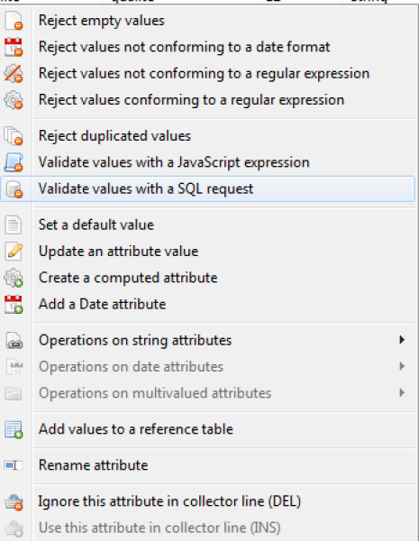  

Next, you need to add information to the WHERE clause by clicking on the lightbulb icon and selecting the option "dataset.registration_ID".  
Finally, manually enter the expression "<> NULL".  

  

The SQL query syntax is explained in more detail in the Collector Guide. Please refer to that documentation for a complete explanation of the syntax.

### Filter Using a Regular Expression

The use of a regular expression allows the data to be filtered with the retention of only a part of the available information in the source file.  

Two options are given for filtering with a regular expression:  

- Reject values not conforming to a regular expression
- Reject values conforming to a regular expression  

The dialog that appears allows you to test your regular expression. You can also set an event name for every rejected record.  
Please refer to the chapter "Regular-Expression-Basic-Syntax-Reference" available on this web site for more information about regular expression syntax and available objects.  

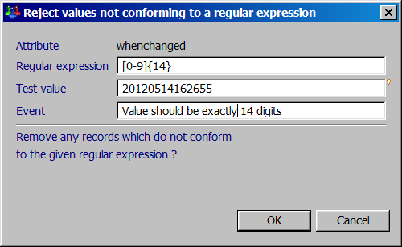  

### Filter Using a JavaScript Expression

It is also possible to perform data filtering operations that retain only the records that match the configured JavaScript expression.  

Please refer to the "Macros and Scripts" chapter of the "Collector Guide" for more information about JavaScript syntax and the available objects.  

The operation is available in the "Attributes" view of the work area by right clicking on any attribute in the view and choosing the option "Validate values with a JavaScript expression."  

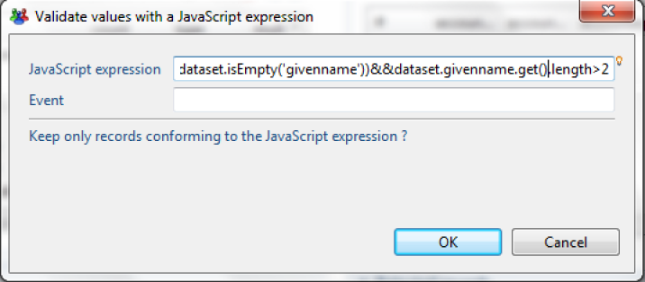  

This JavaScript expression verifies whether the attribute "givenname" is empty and whether the value contains at least three characters.  
The result returned contains the records that satisfy the JavaScript expression.

## Managing transformation and rejection macros

All of the operations configured in the "Analysis" tab are visible in the first tab, "Configuration":  

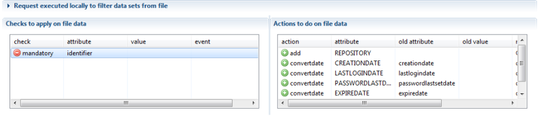  

Double-click on a line to open the appropriate editor. Right-click on a macro to perform the corresponding management operations.  

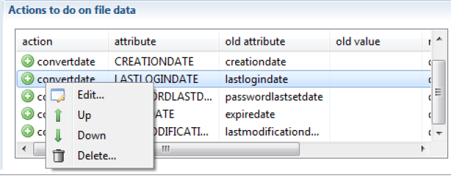  

It is also possible to use keyboard shortcuts for the following operations:  

- "Enter" opens the editor
- "Ctrl+up arrow" moves the macro up in the list
- "Ctrl+down arrow" moves the macro down in the list
- «Del» deletes the macro

## Persistent Attributes

This feature allows the propagation of a value from the preceding row into the following rows in the same column, if that value is empty. The operation is available when you change the attribute value of the corresponding "persistent" column to "true."  
This operation is very useful when you analyze a formatted Excel file whose vertical groupings were set up for esthetic reasons.  

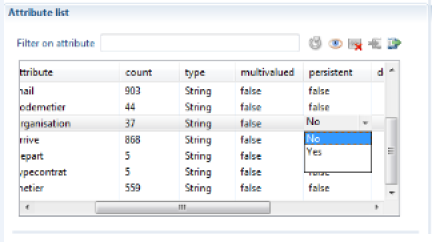  

## Using Data Discovery Templates

Many pre-configured data discovery models (templates) are available in the product. These models allow you to handle standard file formats from most solutions on the market.  
To use a data model, create a new "data discovery," then instead of selecting a "generic format," select a "discovery template."  

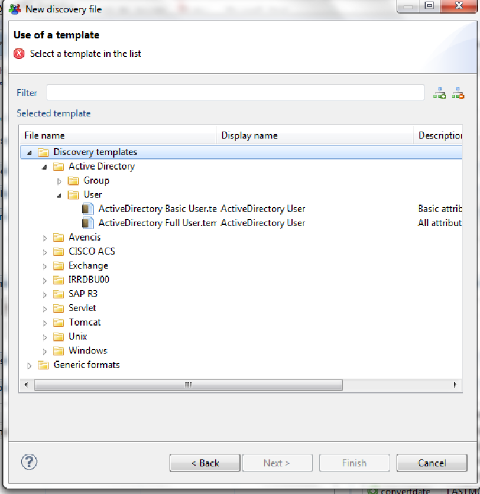  

The "data discovery" creation wizard is identical to the corresponding generic format wizard at this point.  

Upon exiting the wizard, the data discovery that is created contains actions/rejections, and the attributes are commented.  
Some data models also include collector line wizards so that adding a target component (account, identity...) makes a dialog box appear. This box offers to configure the attributes' mapping automatically.  

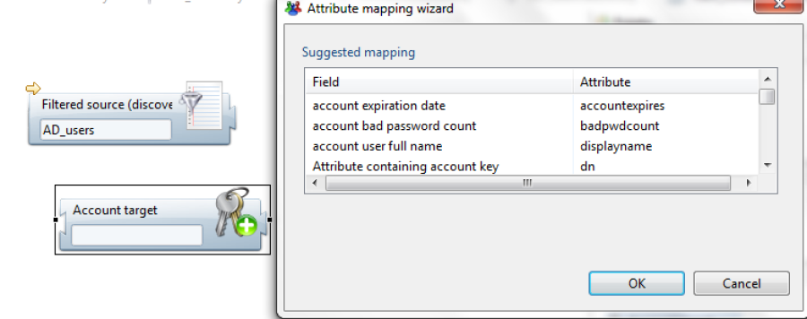  

Data discovery templates are found in the /library/templates subdirectory of your project. We invite you to consult this sub-tree in order to familiarize yourself with the various complementary elements (readme...) that will allow you to take advantage of the available data discovery models.

## Create a Data Discovery Template

It is possible to create your own data discovery models. This operation is useful if you process standard file formats on a regular basis.  
To do this, just create a data discovery, and then configure it (transformations, filtering, attribute descriptions...).  
Once you have configured it, click on the "packaging" button of your data discovery.  

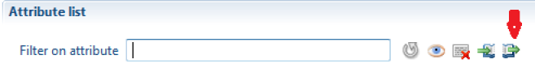  

A wizard opens and allows you to configure your new model.

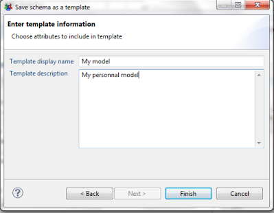  

Once the wizard has finished, your model is available in the /library/templates subdirectory of your project, and it is available automatically when you create a new data discovery.  
To use this model in another audit project, simply copy your model with the (*.template) extension into your new project.

## Using a Collector Source Component in the Data Discovery

You can use a collector source component in the data discovery.  
This operation is particularly useful when you need to process proprietary file formats that require algorithmic processing in order to isolate records and attributes (TSS dump files from a mainframe, for example).  

The procedure is then as follows:  

1. Create a collector line that takes care of "parsing" the data file. You can use any available source component for this, including the "JavaScript" source component if you wish to perform this operation algorithmically. The objective is to isolate the records and their attributes. The entire analysis may be performed later, in the data discovery.
2. Package the collector line as a "source" component. Please refer to the Data Collection Guide for more information.

When creating a data discovery, your source component is automatically displayed in the list of available formats in the "collector components" section:  

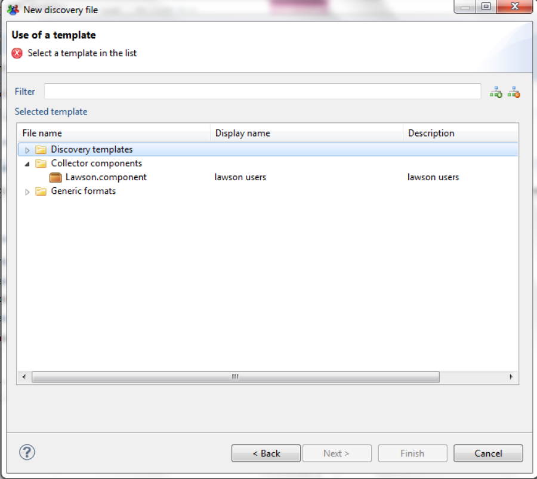  

If you wish to use this data discovery in another project, don't forget to recover the source component with the (*.component) extension used by this data discovery.
