# General information about discovery

Data file discovery is an elementary and intermediate step in data collection in the Identity Ledger. It consists of analyzing files in different formats (CSV, LDIF, XML, etc.) and applying simple processing to them. Examples of processing types are: adding new attributes, computing new attributes from those that are already present, removing or editing certain values or records.    
Data discovery automates data filtering/transformation/quality assurance before loading it into the Identity Ledger through "Data collection."  
As such, "data discovery" may be used as a source of data when configuring "Data collection." All the configured operations on the "data discovery" level are then performed in real time, transparently, before the collector line.    

Contrary to classic ETL solutions where it quickly becomes necessary to rely on a programming language (Java, JavaScript, C#) for transformation or filtering operations, the association and wealth of "data discovery" concepts and "data collection" allow these operations to be performed without programming.  

This "data discovery" component can also be used autonomously if you wish to apply transformation/filtering operations on data files regularly. In this case, the results will be available in CSV format. This is an alternative solution that is much more powerful than the filtering tools available in Excel.    
This objective of this documentation is to give you basic instructions that will allow you to use the Discovery component. You will find numerous "screencasts" on how to configure data "discovery" and "collection" on this site: [Discovery Editor](igrc-platform/getting-started/product-description/using-the-editors/discovery-editor/discovery-editor.md)   

# Data sources

The file discovery motor accepts the following data sources:

- **CSV:**  format in which each column is separated by a delimiter. A header row may be present to indicate column names. The delimiter is configurable (generally a comma or semicolon).

- **LDIF** : directory exchange format representing hierarchically structured entries (LDAP, X500). You may process a small part of the entries by filtering on a sub-tree and on one or more object classes.

- **XML** : format made up of hierarchically structured tags. Only a sub-section of the tags is taken into account when giving a path in the XML nodes tree.

- **Formatted:**  format consisting of fixed-sized fields. There is no separator between the values, so to configure this type of file, indicate the number of characters each column uses.

- **Log files:**  format consisting of access logs. The lines often contain "Who, What, Where, When, Why" type information (who performed which action, from where, when, with which rights and what was the result).

- **Microsoft Excel files:**  desktop spreadsheet or pivot table type format. Excel files may contain several tables per page and several pages. The product can handle XLS and XLSX file formats.

# File encoding

Please note that selection of the file encoding impacts the quality of the data. If the file encoding information is not included in the file encoding then no error will occure in the execution of a discovery, however non standard characters can be incorrectly handled.  

To avoid this type of issue it is recommended to use the file encodings that includes `BOM` to avoid issues when collecting data. For example by using `UTF-8 BOM`. In this sittution if a file is provided using the wrong file encoding then an error will error in the execution plan avoiding to collect incorect data.  

# Basic Concepts

The "Discovery" component allows you to discover source data and apply filtering, verification, and transformation rules to them.    
Among the available operations in Discovery, you will find:   

- Verification of the format of a string of characters or a date;
- Filtering records based on an arbitrary criterion, using pseudo-SQL or JavaScript syntax;
- Filtering records according to rules of de-duplication or verification of the presence of attributes;
- Computing new attributes from source data (format conversions, concatenation, normalizing values...)   

Thanks to this component, it is very easy to see the source data, no matter what entry format is used (CSV, LDIF, XML...) and to immediately evaluate the quality of the data.   
The Discovery component moves on to a systematic analysis of the file to produce the histogram of each attribute's values and allows you to build a list of rejected records exportable in Excel format as the rules are applied.    
All the operations performed in the Discovery are recorded as macros, and can therefore be reapplied by batch on any new file, which greatly reduces the repetitive verification tasks.   
Data filtering and transformation operations are performed in two stages:   

1. First perform the rejection operations
2. If the record was not rejected, the transformation operations are performed

The rejection operations are the first actions in the contextual menu, as seen below :   

    
**_The rejection operations in the contextual menu_**  

These operations appear in the left side of the configuration summary   

     
**_Example of results of a rejection operation_**

## Types of Files

### CSV

CSV discovery allows the analysis of files whose data are separated by a character (",", ";"...)   

The CSV format is specified in the RFC 4180, but CSV discovery is also able to analyze files that don't correspond to the specification as long as they contain separators.   

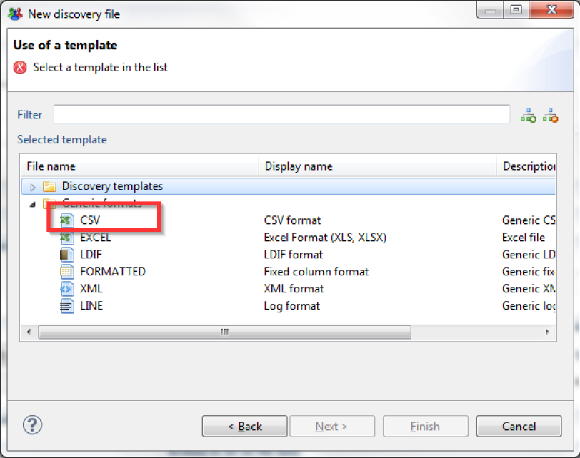    
**_Selecting CSV template for a new CSV discovery_**    

Once the CSV format has been selected and the file chosen, file analysis configuration is automatically suggested. These settings may be changed if needed:   

- File encoding format
- Column separators
- Multivalued value separator
- Text value separator
- Indicate whether the file contains a header with column names or not
- Ignore the X first lines before starting the file analysis.

     
**_Import of the CSV file being processed_**

### Excel

EXCEL discovery allows the analysis of files in Microsoft XLS or XLSX format. EXCEL discovery allows the analysis of both spreadsheets and pivot tables.   

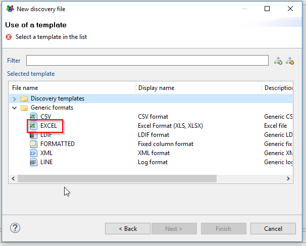   
**_Selecting an Excel file template_**      

Once the EXCEL wizard has been selected and the file chosen, a wizard displays the various options, and it is possible to:   

- select the sheet to process (by its name or an order number)
- indicate which row the table starts on
- indicate which column the table starts on
- indicate up to which row the table should be processed
- indicate which column the table ends on
- indicate whether the table contains a header row

    
**_Import of the Excel file being processed_**      

It is also possible to process pivot tables with the option "All data must be gathered in a multivalued attribute starting with column X." If this option is checked, all the values starting in column X are gathered in a multivalued attribute. A second multivalued attribute is created with the corresponding header rows.   

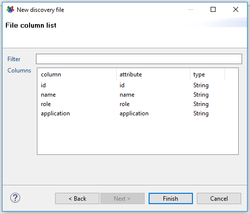     
**_Verifying the attributes of the imported Excel file_**   

This pre-processing, associated with actions on the multivalued attributes (5.2) and the collector numbering component, allows the analysis and loading of data from pivot tables.

### LDIF

LDIF discovery allows the analysis of files in LDIF format (RFC 2849). LDIF files are exported LDAP or X500 directory files.    

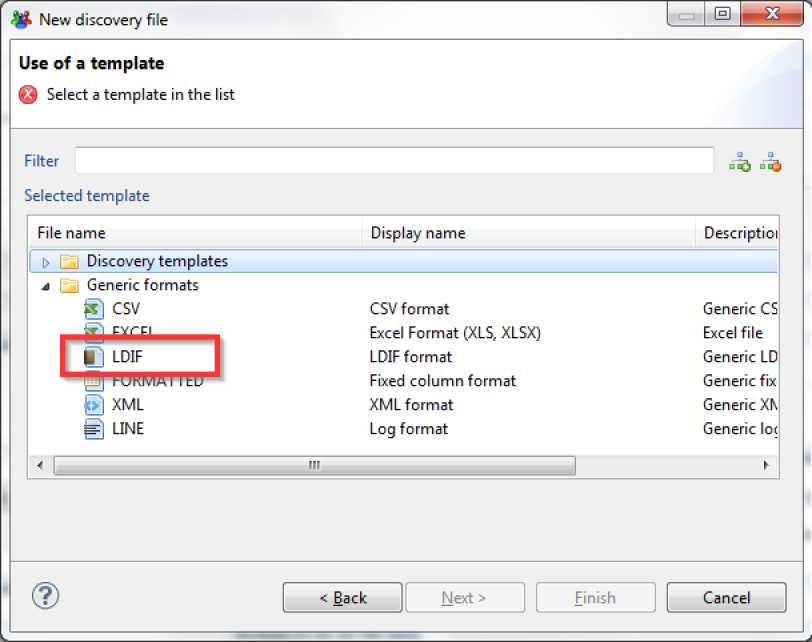   
**_Selecting an LDIF file template_**    

Once the LDIF wizard has been selected and the file chosen, a wizard displays the various options.

   
**_Import of the LDIF file being processed_**    

In particular, it is possible to:   

- select the file encoding
- select the sub-tree to process and the depth of the search; a dedicated wizard displays the arborescence for this

   
**_Type of object to be selected with an imported LDIF file_**   

- select the type of object to analyze and the associated filtering restrictions (strict filtering or not on object classes). A dedicated wizard allows you to select a typical entry

   
**_Detail of the selected object for filtering an imported LDIF file_**

### Formatted

Formatted files are often text report type files from centralized sites (Mainframe). They don't contain separators; fields are identified by their position (characters 1 to 8 = field 1, characters 9 to 15 = field 2...)

   
**_Selecting FORMATTED file template_**    

Once the FORMATTED wizard has been selected and the file chosen, a wizard displays the various options.    

   
**_Import of the Formatted file being processed_**  

It is possible to specify:   

- the file encoding
- the separation character used for multivalued attributes
- whether the file contains a header line with column names
- whether it needs to skip X lines before starting to process the file
- whether only certain rows of the file should be taken into account. Filtering is then performed with a regular expression. This setting may be useful in the case of a "dump" file from a central site that contains many elements of a varying nature.   

If you wish to adjust the column selection, just place the cursor in the right spot in the preview area, and then click on the "Set/Remove a Separation" button.

    
**_Verification of the attributes of the imported FORMATTED file_**

### XML

XML discovery allows you to extract data from an XML type file.   

   
**_Selecting an XML file template_**   

Once the XML wizard has been selected and a file chosen, a wizard appears. It allows you to select the object to extract from the XML file. Object selection is performed with the help of the "Selected elements" setting. This setting must contain an XPATH expression that references the element in question.    

It is also possible to click on the element in the preview pane to fill in this field.   

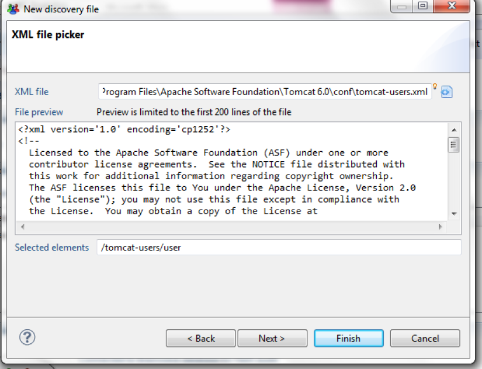   
**_Import of the XML file being processed_**     

The Discovery's attributes correspond to the various attributes of the selected objects.   
Here is an example of attributes extracted on the basis of an XML object that contains XML sub-objects:   

If the selected object contains sub-objects, their attributes are also extracted as attributes. Careful, though: this principle does not handle multiple sub-objects, only 1/1 relationship types. In this case, only one of the sub-objects will be taken into account.

   
**_Verification of the attributes of the imported XML file_**

### Line

LINE type discovery allows the analysis of log files.

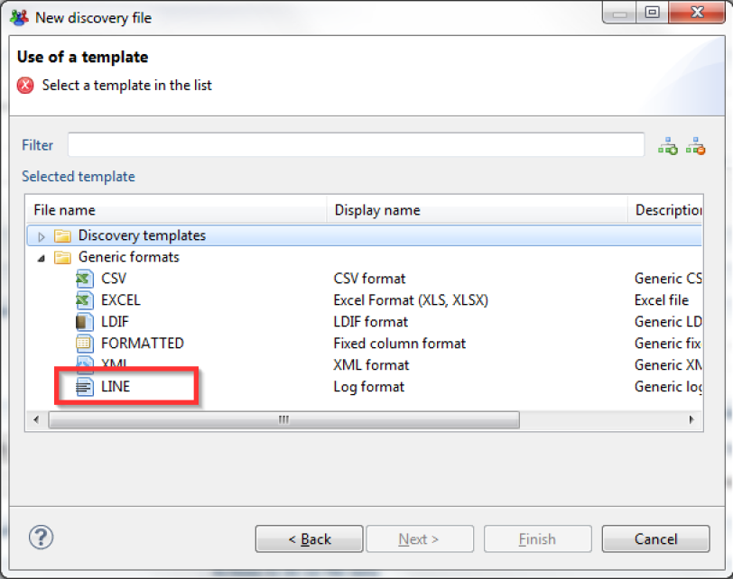   
**_Selecting a LINE file template_**     

Once the LINE wizard has been selected and the file chosen, a wizard appears. This wizard allows you to:    

- Select the file encoding type
- Indicate whether you wish to ignore empty lines
- Indicate whether it should skip X lines before beginning the file analysis

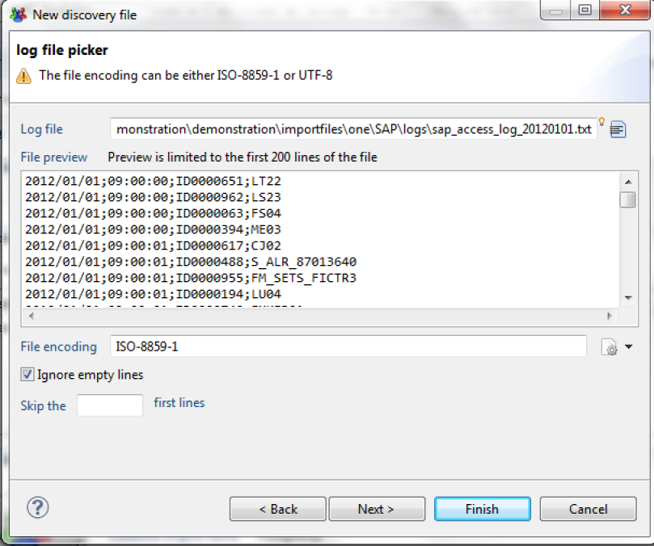   
**_Import of the LINE file being processed_**   

A LINE type discovery loads the lines in a single attribute named "line." The true analysis of this line is then performed with actions like "Extract the characters into a new attribute," which will go through the line and extract the information in typed attributes.   

      
**_Overview of the LINE file attribute_**    

We invite you to consult the "screencasts" of examples on [http://expert-exchange.brainwavegrc.com](http://expert-exchange.brainwavegrc.com/). They illustrate in particular how the log files are analyzed with this discovery.

## First Level of Record Filtering

### Skip the X First Records

This setting allows you to skip X lines (or X records in the case of formatted data such as LDIF files) before starting the processing.   

   
**_Ignoring the first X records_**    

### Select a Maximum of X Records

This setting allows you to limit the analysis to the first X records.  
We recommend that you use this setting when you are setting up your Discovery on large files (\>100MB) in order to limit the analysis to the first few records. This will allow you to have a more reactive configuration interface when you are setting up the Discovery.   

   
**_Limit the analysis to the X first records_**   

### Filter with a Query in SQL Format

It is possible to select only a subset of records. Do this by using a query in SQL format. You will find the corresponding documentation in the "Collector Configuration Guide."   
Note that this first-level filtering does not start any event or rejection; it is only used for preselecting data. If you wish to perform data rejection, to process data quality issues, for example, we suggest that you use the "rejection" actions, as these will allow you to associate events with rejections in order to generate log files.    

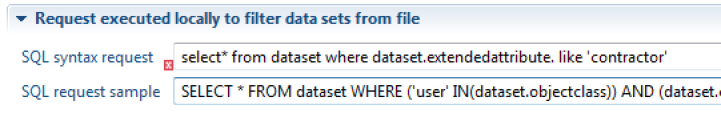   
**_Filter using a query format_**

## Data Types Settings

It is possible to change the type of data of an attribute to convert it into another data format. To do so, click on the type column that corresponds to the attribute.   

   
**_Setting the type of an attribute_**     

The attribute will then be converted into a numerical value, date, or Boolean value as the file is read.   
Format configuration happens in the first tab:   

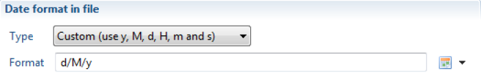    

Regarding the dates, the format to use is the Java Format. To do so, you need to rely on the following table:   

    

For example, the format of date like:   

- "12/24/2019 4:23:30 PM" is "MM/dd/yyyy h:mm:ss a" which will be converted to "20191224162330"  
- "24/12/2019 16:23:30" is "dd/MM/yyyy HH:mm:ss" which will be converted to "20191224162330"   

**_Setting the attribute format_**    

_<u>Warning</u>:_ The source file data must be correctly formatted to set a date/Boolean/whole value. If the attributes must be pre-processed or filtered, you must use transformation actions in order to convert these attributes into the right type in new computed attributes.   

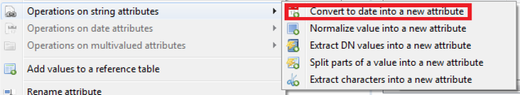    
**_Converting the attribute format to date format_**  

    
**_Creating a Boolean attribute_**

## Rejects

### Reject Empty Values

This action allows the rejection of empty values for an attribute.   

Rejecting empty values is done by right-clicking on the attribute then choosing "reject empty values".   

   
**_Rejection of empty values_**

### Reject Values not Conforming to a Specific Date Format

This action will compare the date records in the source file and reject the ones who do not conform to the format you specified.

### Reject Duplicated Values

## Set a Default Value

This action allows you to set a value in an attribute if it is empty.     
The value can be a static or dynamic value (with syntax like macro {...}, illustrated in chapter 5.1).   

   
**_Setting a default value for an empty attribute_**     

It is thus possible to associate a condition to the application of this action. Also, this action used consecutively on the same attribute, with the use of the conditional clause, allows (if, else if, else) type operations to be performed. We invite you to consult the "screencasts" on [http://expert-exchange.brainwavegrc.com](http://expert-exchange.brainwavegrc.com/) for a demonstration of this type of use.

## Operations

### Operations on String Attributes

This entry contains all the operations that can be performed on string type attributes, such as:    

#### Convert to Date into a New Attribute

To convert a string type attribute into a date format, just right-click on the attribute -\> **Operations on string attributes**  -\> **Convert to date into a new attribute.**   

   
**_Converting a string type attribute into a date_**    

Then enter the settings of the new attribute.   

Local language gives an indication as to how the days are written in the file.
For instance, if the month are written in plain text in your source file, you might see this:   
04 Feb 2016   
"Feb" means that the local language is English, so you would have to put "en" in the local language field.   

   
**_Configuring a new date type attribute_**    

Once the new attribute has been created, it will appear in the list of attributes. The date format must be filled out with a pattern. You will find the documentation about the pattern at this link:   
[http://docs.oracle.com/javase/1.4.2/docs/api/java/text/SimpleDateFormat.html](http://docs.oracle.com/javase/1.4.2/docs/api/java/text/SimpleDateFormat.html*)   

Here are some examples:

   
**_Date format pattern_**   

#### Normalize the Value into a New Attribute

The principle is to eliminate all the special characters contained in the composition of the attribute's values (example of special characters: "ç", "\_", "'" "^"...). You can perform this operation by right-clicking on the attribute name-\> **operations on string attributes-\>Normalize value into a new attribute**.   

#### Extract DN Values into a New Attribute

You can extract the values of a DN type attribute into a multivalued attribute. The values are stacked so that the first value of the multivalued attribute corresponds to the end of the DN value.    

   
**_Extracting a DN value into a new attribute_**   

A practical usage case is as follows:   
The DN of users contains useful complementary information (example: the organization to which the person belongs) in this format:    
cn=abdel Kader, or=DSICORP, or=users, or=acme, or=com   
The application of this action on the DN in order to build a new "DNS" attribute will then allow the simple creation of a computed attribute "organization" which contains the sought-after value in the syntax {dataset.DNS.get(1)}.

#### Separate the Parts of a Value into a New Attribute

The operation separates the parts of an attribute's value into a new multivalued attribute.  
Example of value to separate: DSIO/OPS/CORP. In this example, we will put the parts of the value into a new multivalued attribute. To do this, just:   

- Right-click on the attribute name-\> **Operations on string attributes** -\> **Split parts of a value into a new attribute**.

   
**_Example of extracting an attribute's value_**   

- then enter the name of the new attribute and the separating character

   
**_Configuring the new multivalued attribute_**   

It is important to note that the operation works if and only if the separator between the value's elements is the same.   

#### Extract the Characters into a New Attribute

It is possible to extract a value's characters into a new attribute. This operation is generally used to extract the elements present in a log file. In order to perform the operation, right-click on the attribute name-\> **Operations on string attributes-\>Extract characters into a new attribute**.   

   
**_Extracting the values from an attributes_**    

You have two options:   

- Extract the N first characters: this allows you to set the number of characters to put into a new attribute. You can go through the string from the beginning or the end by checking the appropriate box.
- Extract the N first characters until the first occurrence of the separator. You can go through the string from the beginning or the end by checking the appropriate box.

   
**_Extracting the characters from an attribution_**    

**_<u>Warning</u>_** : The extracted characters will be consumed, which means that the initial attribute value is modified at the end of the operation.

### Operations on Date Attributes

Two types of operations are possible on date type attributes:

#### Compute the Time between Two Dates into a New Attribute

This operation allows you to deduct the number of days since a person left the company, for example. To perform this operation, right-click on the first date type attribute \> **Compute time between two dates in a new attribute**.   

   

Then enter the new attribute name, the second attribute date, and chose a unit of time.   

   

#### Add/Subtract Time to a Date in a New Attribute

This is the opposite operation of "Compute time between two dates in a new attribute." To perform this operation, right-click on the date type attribute-\> **Operations on date attributes-\>Add/Subtract time to a date in a new attribute**.   

   

Then fill out the new attribute's name, the length of time, and the unit of time.   

   

### Operations on Attributes

#### Rename an Attribute

You can change an attribute's name by choosing "Rename Attribute".   

   

In the dialog that opens, you just have to write the new name you want to give to the attribute.   

   

Before you click OK, clicking on "Preview \>" gives you a list of files impacted by the renaming.   

   

Here we can see that two files will be impacted: the discovery file we are using, and the collector that was using the attribute that was renamed. This means that the product will change the name in the collector file automatically in addition to changing it in the discovery.    

When there are modifications on another file as in this case, the other file will be closed if it was opened in another tab.   

#### Rename Attribute Values

You can rename attribute values on the fly. To do so, select the appropriate value(s) in the lower left part of the editor, right-click, and choose "Replace selected values."

   
**_Renaming a list of attributes_**   

An editor opens and allows you to set the replacement value(s).   

   
**_Setting the replacement value(s) of a list of attributes_**    

#### Ignore this Attribute in Collector Line

You can ignore attributes that will not be in the collector file, in order to have less clutter when selecting them.   
There are two ways of doing this:  

- you can select the attribute and press "DEL"
- or you can right click the attribute and select "Ignore this attribute in collector line (DEL)   

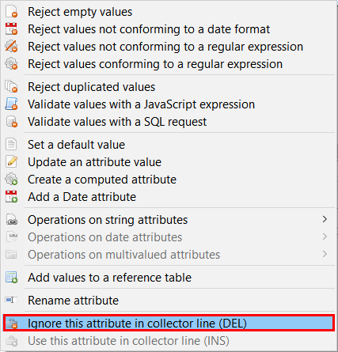   

The attribute will not be shown by default anymore. If you want to see ignored attributes, you can do so by clicking on the "eye" icon in the top right corner of the attribute list:   

   

The ignored attributes will appear, you can tell them apart because they will be greyed out.

#### Use this Attribute in Collector Line

Of course, the opposite operation is also possible. For this you have to select the ignored attribute (it should be greyed out) that you want to use again, right click and choose "Use this attribute in collector line (INS)":   

   

The attribute will be back with the used attributes and you will be able to select it in the collector file.   

## Exports

### Export Rejected Values

You can do a CSV export of rejected values. To do so, right-click on any value in the "Rejected records" view.    

   
**_Exporting rejected values_**    

### Export Transformed Data

You can do a CSV export of all the data processed in the discovery. To do so, right-click on any value in the "Results"' block.   

   
**_Exporting transformed data_**

## Add a Date Attribute

Adding a Date attribute gives two choices :

- **Adding the current date**   

For this option, the attribute will contain the date when it has been computed. It could be useful if you need to show the exact loading date of the data.   

   

- **Adding the last modified date of the file**   

Choosing this will create an attribute with the source file's last modification date.   

    

Please note that these attributes will not show up in the attributes list, but you will see their value in the "Results" block on the upper right side of the Analysis screen.   

Here are the results you will get:   

    

## Update an Attribute Value

It is possible to update an attribute's value from the discovery interface.   
This action is different from the other discovery actions because it will modify the actual value of the attribute, not create a new one.   

Similarly to computed attributes, the update can contain static or dynamic values. Dynamic values can rely on any other values of the current record. The component uses JavaScript macro syntax laid out in the "Collector Guide."    
To update an attribute's value, right-click on the attribute and select "Update an atribute value".   

   
**_Updating an attribute's value_**   

You can also use conditions, which can be generated   

   
**_Updating an attribute to 'true' for rows with a 'cn' starting by 'systemmailbox'_**   

The keyboard shortcut "Ctrl+Space" allows you to display the JavaScript query wizard.    
A wizard is also present on the right side of the "Condition" setting. It enables you to configure the conditions without needing to write the corresponding JavaScript code.   

   
**_JavaScript query assistant_**

# Advanced Concepts

## Computed Attributes

It is possible to produce computed attributes. These attributes then automatically appear in the output of the data discovery, even if they are not part of the initial file.   
Computed attributes are frequently used to process data quality issues (formatting), and type transformation (strings into Boolean values or dates). The computed attributes can contain static or dynamic values.   
Dynamic values can rely on any other values of the current record. The component uses JavaScript macro syntax laid out in the "Collector Guide."    
To create a computed attribute, right-click on the upper left side of the editor, and select "Create a computed attribute."   

   
**_Creating a computed attribute_**    

An editor appears, allowing you to enter the new attribute's name, the static or dynamic value, and the conditions necessary for the creation of the attribute.   

   
**_An example of a computed attribute value_**   

The keyboard shortcut "Ctrl+Space" allows you to display the JavaScript query wizard.   
A wizard is also present on the right side of the "Condition" setting. It enables you to configure the conditions without needing to write the corresponding JavaScript code.   

    
**_JavaScript query assistant_**   

## Operation on Multivaluated Attributes

### Clean List

This action allows you to clean up a list:   

- By deleting empty values
- By deleting duplicates (in this case, only one value will be retained)

   
**_Deleting empty values from a list_**

### Add a Value at the End of the List

This action allows the addition of a new value in a multivalued attribute.   
This value can be either:   

- The value of another attribute
- A static or dynamic value (via a macro type expression)

You can also choose to not add the value if it is already present, and to not perform this action if the necessary conditions are not met.   

   
**_Adding a value at the end of a list_**
### Filter Some Values of the List

You can filter some values of a multivalued attribute. There are two possible filtering operations:   

- retain only the values that meet the condition
- delete the values that meet the condition   

The condition can be:   

- a comparison of the value with the another attribute's value
- a comparison of the value with a static or dynamic value (using macro syntax)
- the application of a regular expression   

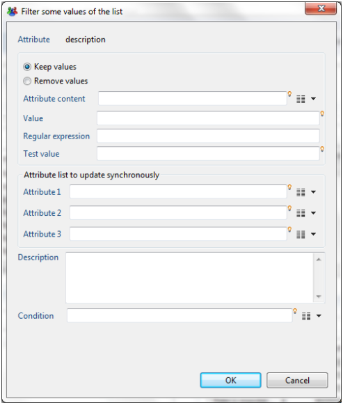   
**_Filter some values in a list using a regular expression_**  

Note that this action can be associated with a runtime condition.

### Replace Each Value of the List

This action allows you to replace the values of a multivalued attribute.   

For this, you must indicate:   

- The replacement value (static or dynamic, using macro syntax)
- The condition for which to apply the replacement

The condition will apply to every value of the multivalued attribute; the replacement operation will only be effective if the condition is valid.   

[   
**_Replacing multivalued attribute values_**

## Reference Tables

The Identity Ledger contains various attributes entered as references: positions, titles, types of hierarchical links, etc.      
The references must be created before the corresponding collector targets use them. For this reason, there is a dedicated target in the collector.    
It is also possible to automatically, and in a transparent manner, enter these references during data discovery. This operation is useful when you dedicate a discovery configuration to a specific collector line. This allows the collector line to be simplified by avoiding adding irrelevant reference targets.  
To use the values of an attribute as a reference, right-click on the attribute, then select "Add values to a reference table."   

   
**_Reference table: adding values to a reference table (1)_**    

An editor appears, allowing you to enter the reference in question based on an attribute.   

   
**_Reference Table: adding values to a reference table (2)_**

## Data Filtering

### Filter Using a SQL Request

The data discovery motor allows data filtering with a query in SQL format. SQL filtering offers a simple way to select data attributes based on certain criteria using a standard syntax. This syntax also allows attribute values to be processed.   
The SQL query works by considering the source data file as a table containing a collection of results, where each result corresponds to a record in the file.    
In the example below, if the ID contains the value NULL, the dataset is rejected because the criteria in the WHERE clause specifies that the ID must not be empty.   
_SELECT \* FROM dataset WHERE dataset.registration\_ID \<\> NULL_   

Perform the filtering operation by right-clicking on any attribute in the "Attributes" view, then selecting the option "Validate values with an SQL request."   

   
**_Filtering data with an SQL query_**     

Next, you need to add information to the WHERE clause by clicking on the  icon and selecting the option "dataset.registration\_ID".   
Finally, manually enter the expression "\<\> NULL".   

    
**_Example of data filtering with an SQL query_**     

The SQL query syntax is explained in more detail in the Collector Guide. Please refer to that documentation for a complete explanation of the syntax.

### Filter Using a Regular Expression

The use of a regular expression allows the data to be filtered with the retention of only a part of the available information in the source file.    

Two options are given for filtering with a regular expression:   

- Reject values not conforming to a regular expression
- Reject values conforming to a regular expression    

The dialog that appears allows you to test your regular expression. You can also set an event name for every rejected record.   
Please refer to the chapter "Regular-Expression-Basic-Syntax-Reference" available on this web site for more information about regular expression syntax and available objects.   

   
**_Filtering records not conforming to a regular expression_**   

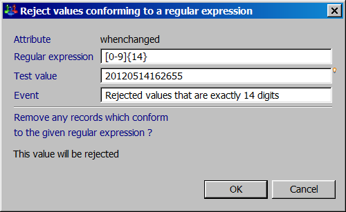    
**_Filtering records conforming to a regular expression_**   

### Filter Using a JavaScript Expression

It is also possible to perform data filtering operations that retain only the records that match the configured JavaScript expression.   

Please refer to the "Macros and Scripts" chapter of the "Collector Guide" for more information about JavaScript syntax and the available objects.   

The operation is available in the "Attributes" view of the work area by right clicking on any attribute in the view and choosing the option "Validate values with a JavaScript expression."   

   
**_Filtering values with a JavaScript expression_**      

This JavaScript expression verifies whether the attribute "givenname" is empty and whether the value contains at least three characters.    
The result returned contains the records that satisfy the JavaScript expression.

## Managing transformation and rejection macros

All of the operations configured in the "Analysis" tab are visible in the first tab, "Configuration":   

   
**_Configuration tab: display all operations performed in the analysis tab_**    

Double-click on a line to open the appropriate editor. Right-click on a macro to perform the corresponding management operations.   

    
**_Configuration tab: Actions to perform on filtered data_**       

It is also possible to use keyboard shortcuts for the following operations:   

- "Enter" opens the editor
- "Ctrl+up arrow" moves the macro up in the list
- "Ctrl+down arrow" moves the macro down in the list
- «Del» deletes the macro

## Persistent Attributes

This feature allows the propagation of a value from the preceding row into the following rows in the same column, if that value is empty. The operation is available when you change the attribute value of the corresponding "persistent" column to "true."   
This operation is very useful when you analyze a formatted Excel file whose vertical groupings were set up for esthetic reasons.    

   
**_Operations on persistent attributes_**  

## Using Data Discovery Templates

Many pre-configured data discovery models (templates) are available in the product. These models allow you to handle standard file formats from most solutions on the market.   
To use a data model, create a new "data discovery," then instead of selecting a "generic format," select a "discovery template."   

   
**_Using a data Discovery model_**    

The "data discovery" creation wizard is identical to the corresponding generic format wizard at this point.   

Upon exiting the wizard, the data discovery that is created contains actions/rejections, and the attributes are commented.   
Some data models also include collector line wizards so that adding a target component (account, identity...) makes a dialog box appear. This box offers to configure the attributes' mapping automatically.   

   
**_Detail of a data Discovery model_**    

Data discovery templates are found in the /library/templates subdirectory of your project. We invite you to consult this sub-tree in order to familiarize yourself with the various complementary elements (readme...) that will allow you to take advantage of the available data discovery models.

## Create a Data Discovery Template

It is possible to create your own data discovery models. This operation is useful if you process standard file formats on a regular basis.   
To do this, just create a data discovery, and then configure it (transformations, filtering, attribute descriptions...).   
Once you have configured it, click on the "packaging" button of your data discovery.   

   
**_Creating customized data Discovery model_**    

A wizard opens and allows you to configure your new model.

   
**_Saving the template of a customized data Discovery model_**    

Once the wizard has finished, your model is available in the /library/templates subdirectory of your project, and it is available automatically when you create a new data discovery.   
To use this model in another audit project, simply copy your model with the (\*.template) extension into your new project.

## Using a Collector Source Component in the Data Discovery

You can use a collector source component in the data discovery.   
This operation is particularly useful when you need to process proprietary file formats that require algorithmic processing in order to isolate records and attributes (TSS dump files from a mainframe, for example).   

The procedure is then as follows:    

1. Create a collector line that takes care of "parsing" the data file. You can use any available source component for this, including the "JavaScript" source component if you wish to perform this operation algorithmically. The objective is to isolate the records and their attributes. The entire analysis may be performed later, in the data discovery.
2. Package the collector line as a "source" component. Please refer to the Data Collection Guide for more information.

When creating a data discovery, your source component is automatically displayed in the list of available formats in the "collector components" section:   

    
**_Discovery template: selecting a source component format_**      

If you wish to use this data discovery in another project, don't forget to recover the source component with the (\*.component) extension used by this data discovery.
