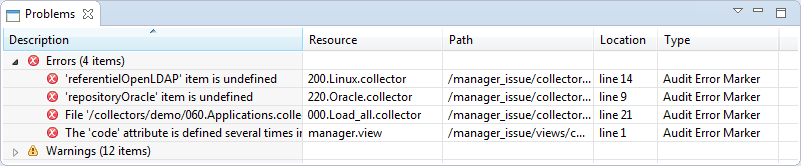

# Understanding the Execution Plan

Feeding the Identity Ledger requires a number of actions to be performed in order:

1. Load data into a sandbox
2. Switch the data in the production tables to "active" state
3. Carry over the reconciliation information from the previous load
4. Identify the identities that are no longer part of the company and flag them
5. Reconcile orphan user accounts (new or old)
6. Identify any movements on objects since the last load (new, modified, deleted)
7. Identify cardinal changes to the accounts and the groups (change of occupation, of organization, of accounts, of permissions, of groups)
8. Load the information about the theoretical rights models
9. Execute the rules whose results have to be saved as a base
10. Execute the controls whose results have to be saved as a base
11. Check for data coherence in relation to the last load
12. Confirm the timeslots

Thankfully, the product is capable of taking on all of these actions automatically, in such a way that it is possible to carry out a new data load with 1 click and even to automate the data load (for example a weekly load every Sunday at 2 am).  
Automation of the loading actions corresponds to the "execution plan" concept in the Brainwave Identity GRC product.  
Execution plans are unique to each project and are set with the help of Analytics during the project configuration under the "Execution Plan" tab.  
An execution plan can be started in three different ways:

- With the help of the banner in the general menu in Analytics
- With the help of the buttons in the settings of the Execution Plan, notably the "Start all steps" button
- With the help of the "batch" launch mode (details of setting this mode are given in Batch mode configuration)

Only the settings interface of the execution plan allows a subsection of the stages of the execution plan to be executed.

## Automatic Consistency Check of the Project

This feature adds an automatic check of the consistency of the before key phases:

- Before running an execution plan
- Exporting the web portal
- Exporting the project archive

If errors are detected in the project a confirmation dialogue will appear to continue or abort the operation.  

Details of detected errors are displayed in "Problems" view. This includes a list with the files in error and a quick description of the root cause of the error, as displayed in the image below.

## Collect and Activation

This step is mandatory.  
This step corresponds to running a collector line that will reload all of the information into a new timeslot in the Ledger.
The collector line that is called up should, therefore, ideally contain sequential calls towards all of the set line in order to load the organizations, identities, accounts, etc.
Most often, the line called up is a collector line created in Analytics with the help of the Collector line series assistant.

This first step will automatically lead to these operations:

1. creation of a new sandbox
2. loading of the data into the sandbox
3. activation of the sandbox

The operation of activating the sandbox brings about the following stages:

1. reconstruction of the user ID of the objects
2. Identification of object movements (new, modified, etc.)
3. Carrying over of reconciliation information from the account and automatic flagging of accounts corresponding to people who have left the company as "account without an owner" under the reason "leaved".

From within the execution plan it is possible to only launch the sandbox load. If you want to launch a load in the sandbox, you will need to go through the launch menu in the collector lines editor to do so.

## Determining Active Identities

This step is optional.
One the data is loaded and activated, it is possible to identify the identities that have been loaded in the Ledger but are no longer part of the company.  
This operation can be of particular use when loading the data for the first time. It results in the valorization of the "active" Boolean attribute of the identified object.  
The identification of active identities is carried out with the help of an audit rule. This rule turns up all of the identities that are still part of the company. It is possible to make use of any data from within the Ledger in order to determine whether the identity is still part of the company.

It is advisable to adopt the following strategy when loading identities into the Ledger:  
On the first data load, load all of the identities, including people who have already left the company. Ideally you should load the departure dates. If this is not possible because the information is not available load a "flag" to indicate if the person is still in the company or not. Set step 2 of the Execution Plan to identify active identities on the basis of this information.  
During future loads, only load people who are still part of the company into the Ledger. In the collector lines, filter the people who are no longer part of the company (if this information is actually made available in the files).  
This allows the results of account reconciliation to be maximized during the first data load and afterwards to not pollute the Ledger and the analyses with false positives that in fact correspond to people who have left the company.

## Account Reconciliation

This step is mandatory.
Once the identities are marked as being active/inactive comes the step where the accounts are reconciled.  
Reconciling the accounts amounts to finding, for each account, the identity of the owner of the account. Reconciliation applies to all the "orphan" accounts, that is accounts on which no status is given (attaching an account to its owner, an ownerless account with a special status, etc.).  
This corresponds to executing an account reconciliation policy. This policy seeks to reconcile all of the orphan accounts.  
At the end the reconciliation policy execution, the change in cardinality status of the identities are updated. This corresponds to detecting changes in which accounts are attributed to people (attribute accountchanged on the identity object) and permissions are attributed (attribute permissionchanged on the identity object).

It is standard for the reconciliation information to be retained between timeslots. In practice only new accounts and accounts that were not reconciled during the preceding timeslot are reconciled. For all the other accounts (including service accounts whether they are marked through the collect or through a reconciliation rule), the reconciliation status is carried over from the preceding timeslot.  
A special situation can occur when an account was reconciled to a person and that person is no longer present in the current timeslot (because he or she has left the company). In this case, the reconciliation status of the account automatically becomes that of an "ownerless account", the reason for reconcilation becomes "leaved" and the description of the reconciliation contains the full name of the owner of the account.

## Manager Policy

This step is optional.
This step corresponds to the resolution of managerial links between a concept (identity, application, permission...) and the identity managing it when it is not possible to do so during the Collect phase.

This corresponds to running a manager policy. This policy will seek to weave links between the concept and the identity that is in charge of this concept, using data collected during the previous parts of the Execution Plan.
To do so, it will execute one or severals manager rules.

## Theoretical Rights Model

This step is optional.
This step corresponds to the construction of theoretical rights on the basis of "raw" information that was loaded during the data collection.  
This corresponds to running a rights model policy. This policy will seek to weave links between identities and applicable entitlements on the basis of the available raw data. To do this, it will sequentially execute a series of model right rules.

## Rules

This step is optional.
This step corresponds to running all the rules that were indicated as being part of the execution plan. The rules are executed and the results are saved in the Ledger in the active timeslot.

## Controls

This step is optional.
This step corresponds to running all of the controls that were indicated as being part of the execution plan.  
The controls are executed and the results are saved in the Ledger in the active timeslot.

## Validation

This step is mandatory.
Once all of the data is loaded, and the rules and controls carried out, it will be necessary to validate the timeslot so that all of the users can have access to it in the web portal.  
This operation can be carried out automatically by the execution plan, and this is particularly useful in cases where the loads are automated. In these cases, it is possible to set the integrity controls that are to be executed ahead of time when confirming the timeslot. These controls will proceed to comparisons between the data from the previous timeslot and the active data. Thresholds are also set either as absolute values or as a percentage. If at least one of the thresholds is reached, the data will not be automatically validated.  
This mechanism allows notably for quality concerns with the data to be tackled ahead of time (corrupt source files, etc.). If the load is carried out in "batch" mode, an email giving a summary of it will be sent to the Analytics administrator.  
It is also possible to not automatically validate the timeslot in the execution plan, but to carry out a manual validation within the "Ledger" interface in Analytics.

## Running the execution plan

Running the execution plan allows to execute all data loading steps in a new timeslot. Optionally automatic data validation can be carried out.  
If the execution plan is launched in batch mode, an email summarizing the operation can be automatically sent when the execution has been completed.  
It is also possible to carry out automatic maintenance operations on the data base at the time of each load. This corresponds to updating the base statistics. It is strongly recommended to choose this option as it allows performance of the data base to be maintained with each subsequent load.
