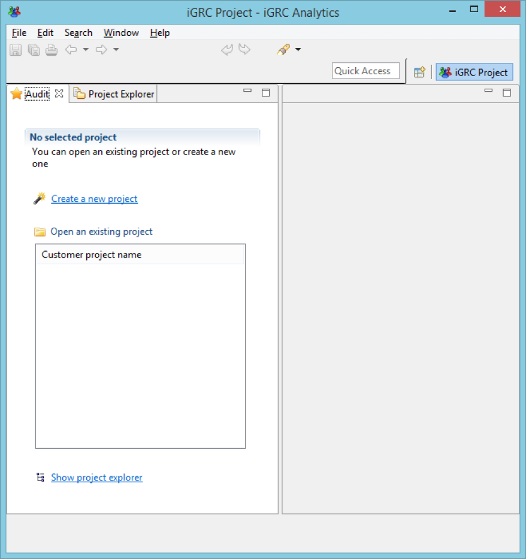
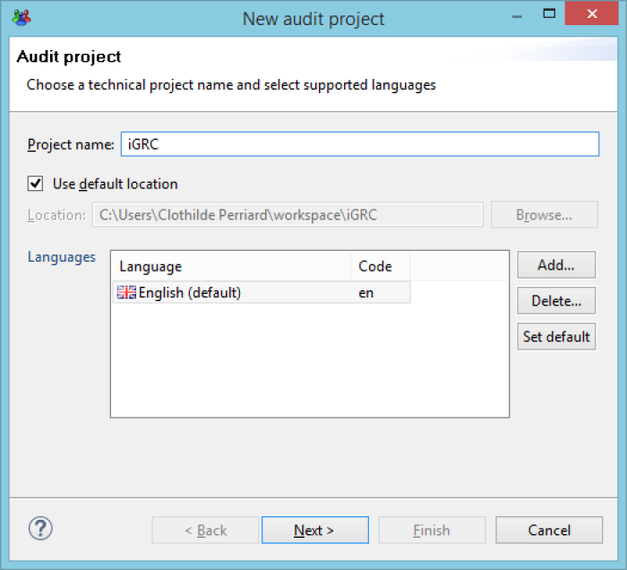
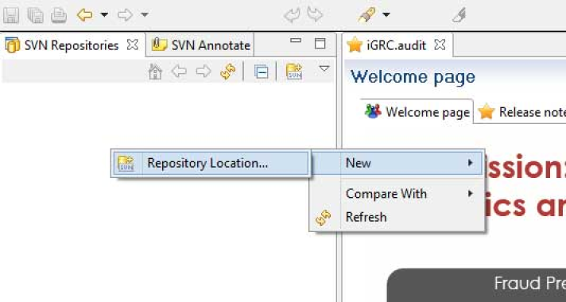

## Creation and Configuration of a Project

### Create an iGRC Project

In the **Audit**  tab, click the **Create a new project**  link.  

This opens a wizard that allows the user to create a project. It is the just a question of following the steps detailed to create the new project.

In the **Project name**  field, type the technical name of the project (do not use spaces nor special characters):  

In the **Languages**  section, it is possible to choose the different languages you wish to use in the project as well as change the default language. Click the **Next**  button to continue to the next step of the wizard.

In the **Customer project name**  field, type the project display name and in the **Customer name**  field, type the customer display name. The other fields are optional. Click the **Next**  button to continue to the next step of the wizard.

Fill in the **Configuration name**  (mandatory) and optionally the configuration description:  

It is necessary to select or create the database connection profile to use in the project. To create the database, proceed as follows:

1. Click the  **icon** and select the driver type (Oracle, PostGreSQL or SQL Server):  

2. Type a name and a description for the connection, then click **Next**.  
3. Enter the information for connection to the base: name of the base, server address and port and name of the base (to be detailed in the connection's URL), connection login and password. The information to provide is based on the database types selected
4. Check the **Save password**  checkbox and click the **Test Connection**  button to check that the details are correct.
5. Click **Finish**.

If the option **Create tables in database** is selected then the database schema will automatically be created upon completion of the wizard.

If applicable, select the option the **Database is a production one**. This option deactivates the initialize the database funcitonnalities in the technical configuration.

Click **Finish**  to complete the creation of the project.

### Integration with Version Management Systems

IGRC Analytics offers innate integration with the Subversion, CVS and Git version managers. This integration enables version handling and sharing amongst several users of the iGRC Analytics configuration: collection, rules, reports etc.  
It is strongly advised that this functionality be configured in order to benefit from all the functionalities provided by Subversion.

#### Prerequisites

Subversion integration requires an SVN server, version 1.6 or higher.

#### Configuration of the Subversion Integration

1. Launch the iGRC Analytics Client.
2. In the main menu, click **Window** > **Open Perspective** > **Other¦**  and select **SVN Repository exploring**.  
3. On the left side of the screen, under the **SVN Repositories**  tab, right click **New**  \> **Repository Location**.  

4. In the **Url**  field, type in the URL details for the Subversion server and click **Finish**.

The Subversion server is registered and the list of projects is displayed.

Depending on the configuration of the Subversion server, you may be required to enter authentication information.

#### Add an iGRC Project into the Subversion Directory

1. On the left side of the screen, in the **iGRC Project explorer** , right click on the name of the project that you wish to load into Subversion and select **Team** > **Share Project**.
2. Select the repository type (SVN for Subversion).
3. Choose the repository corresponding to the Subversion server.
4. Follow the assistant's instructions up to the project loading stage. The loading is done in the task background and takes a few moments.

Depending on the configuration of the Subversion server, you may be required to enter authentication information.  

#### Load an Existing Project from the SVN Repository into the iGRC Analytics Client

1. Open the **SVN Repository Exploring**  perspective;
2. On the left side of the screen, under the **SVN Repositories**  tab, deploy the Subversion server by clicking on the **+**  icon;
3. Select the project and right click **Checkout**.
4. Select the **Checkout as a project in the workspace**  option, then click **Finish**.

The project creation takes a few moments.
Depending on the configuration of the Subversion server, you may be required to enter authentication information.

#### Synchronize your Project

The synchronization operations of a project enable the Subversion repository to be updated from the local project, or vice-versa:

##### Update the Subversion Repository

1. Under the **Project Explorer**  tab, select the project or subdirectory corresponding to the items, updated locally, that you wish to synchronize.
2. Right click **Team** > **Commit.**
3. Enter the description relating to the updated configuration items and click **OK**  to perform the update.

##### Update the Local Project

1. Under the **Project Explorer**  tab, select the project or subdirectory that you wish to update from the Subversion server.
2. Right click **Team** > **Update to HEAD**.

The update will start immediately.
