## Step-by-step Tutorial

### My First Discovery

This section will allow you to discover the data discovery editor. After this tutorial, you will be able to import, analyze, and process a file in CSV format.
You can also see the various "screencasts," videos about discovery creation, by logging on to [http://expert-exchange.brainwavegrc.com](http://expert-exchange.brainwavegrc.com/)

#### Create a Discovery

Follow the steps below to create a discovery:

1. Create a new audit project and add the demonstration facet
2. Activate the 'iGRC Project' view.
3. Go to the main menu of your audit project
4. Click on New -> Data file inspector  
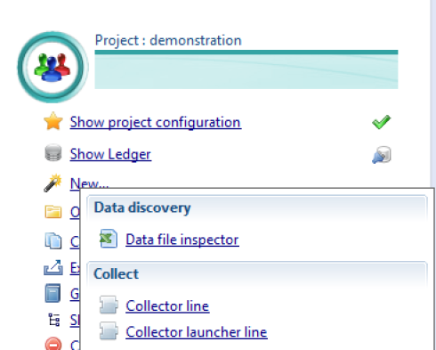

5. Name your discovery, and don't forget to use its extension  
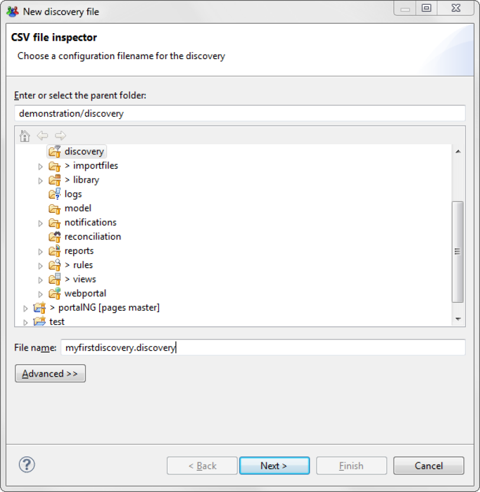

6. Click on generic formats and select CSV format.  

7. Select the CSV file to import. Don't forget to specify the type of separator (";", ",", "|"...) in the file.  
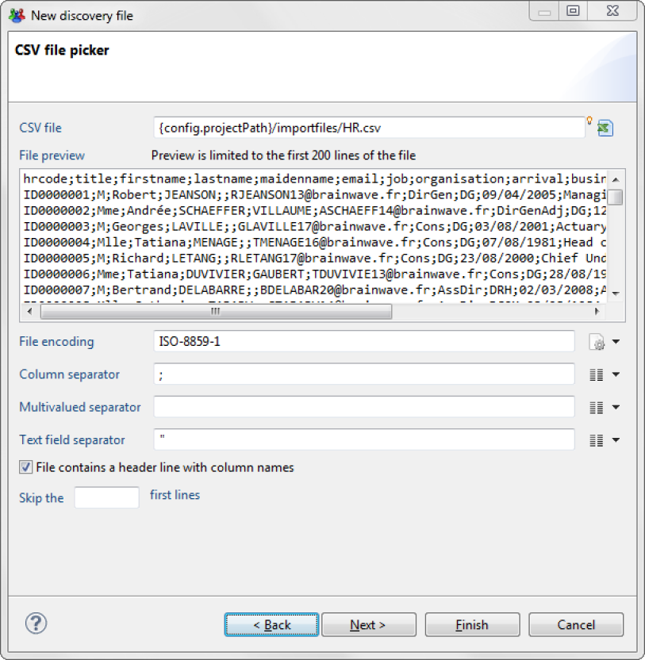

8. Click on "Next"  

9. Click on "Finish"  

#### Set up Rejection of Empty Data

Follow these steps to reject empty data

1. Go to the "Analysis" tab
2. Right-click on any attribute in the Attributes view, then on "Reject empty values"  
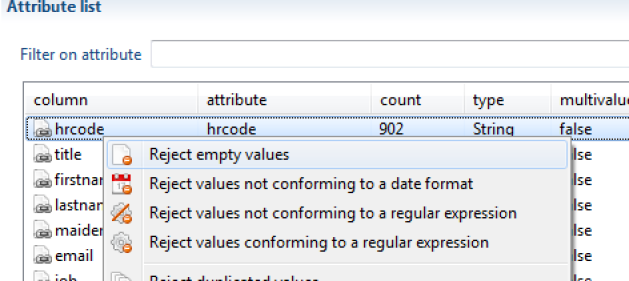

3. Enter a reason for the rejection  
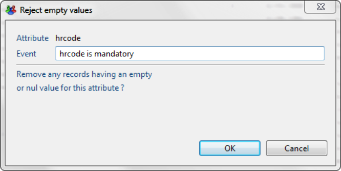  
4. Click on OK  
The rejected values are automatically added in the Rejected Values view of the work area.  

#### Delete Duplicates

These steps are required to delete duplicates:

1. Go to the "Analysis" tab
2. Right-click on any attribute, then select the "Reject duplicated values" option  

3. Enter the event, then click on OK  

The rejected values are automatically added to the "rejected values" view.  
  

#### Add an Additional Attribute

To add an additional attribute, follow these steps:

1. Go to the "Analysis" tab
2. Right-click on any attribute in the "Attributes" view
3. Select the **Create a computed attribute**  option  
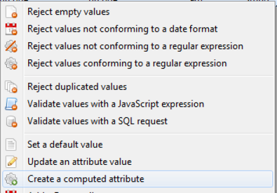  
4. Name your new attribute and give it a value and a description  
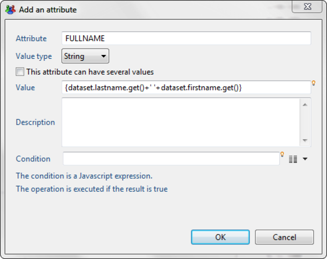  
5. Then click OK  
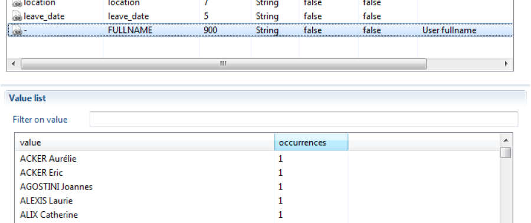

#### Export the Results in CSV Format

To export the results in CSV format, follow these steps:

1. Right-click in the upper right side of the editor
2. Select "Export all in CSV and open in external editor"  

### My First Reconciliation Rule

This section will introduce you to the reconciliation rules editor. To do this we are going to configure a rule that will seek to reconcile an account based on the user's email.

#### Create the Reconciliation Rule

In the software's main menu, click "New..." and choose "Reconciliation rule".

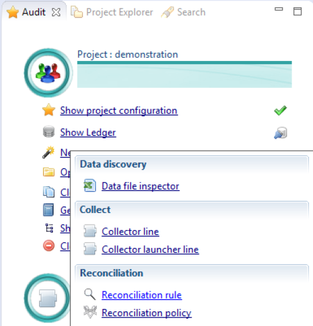

Name your reconciliation rule remembering to add the extension ( **.reconrule** ) and click on **Next**

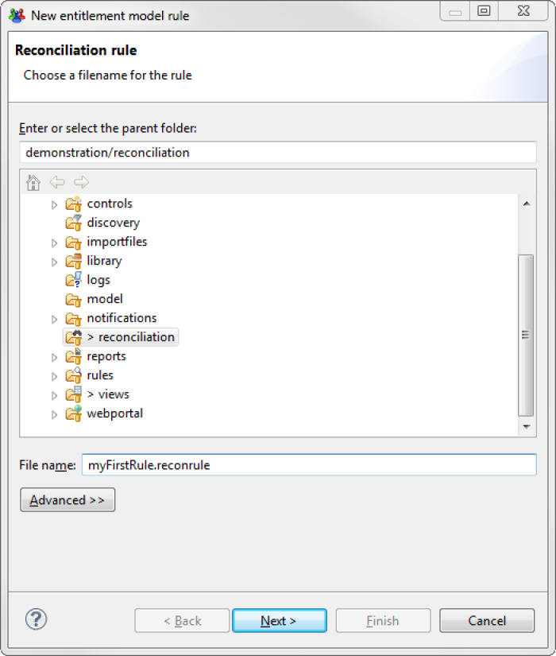

1. Enter a unique identifier for your reconciliation rule, for example **'account_reconciliation'**
2. Enter a description for your reconciliation rule, for example **'Reconciliation based on email address'**
3. Click **Finish**

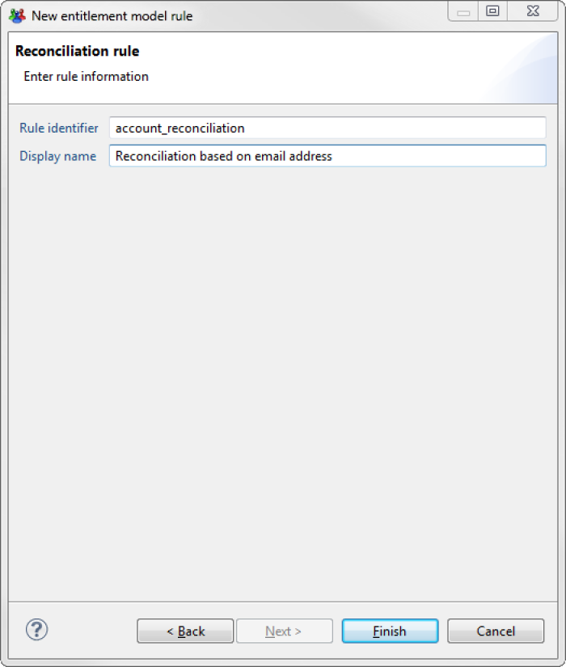

#### Select Main Concept Criteria

1. Click the magnifying glass. Criteria applicable to the 'Identity' concept appear in the palette
2. Open the **'Criteria on email and phone'**  section
3. Drag and drop the **'mail is {mail}'** criteria onto the magnifying glass

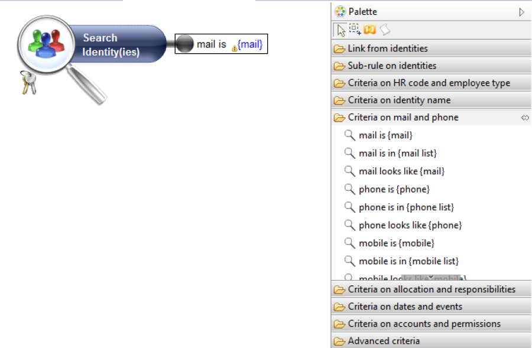

1. Double click the hyperlink **'{mail}'**
2. Check **'Set the criterion with a global parameter of the rule'** box and select **'account user email'** , in the list of parameters.
3. Confirm the criteria entry by clicking **OK**

#### Configure a Relationship Constraint

It is possible to link the identity repository with the repository when the reconciliation criterion is not in the identity repository.

1. Open the **'Link from identities'**  section
2. Drag and drop the **'link with accounts (using reconciliation)'** relationship on the magnifying glass.

#### Select Criteria Based on Linked Concepts

1. Click on the 'Account' join. The criteria which are applicable to the 'Account' concept appear in the palette
2. Open the **'criteria on identifiers'**  section
3. Drag and drop the **'account login is {login}'** criteria on the Account join

#### Display Results

1. Click the **'Results'** tab
2. You can click on the items, from the Ledger tab, to see them in detail,
3. You can select another 'Time slot' to execute this analysis on another Ledger data import date
4. You can filter the displayed results by clicking on 'Filter' and by replacing the text in the search field.

### My First Reconciliation Policy

This section will introduce you to the reconciliation policy editor. To do this, we are going to configure a policy that will execute a reconciliation rule in each of the Active Directive (ADD) and OpenLDAP depositories.
We will consider two reconciliation rules ('identity **full name**  looks like **account user name'** ) for the AD repository and the login ('**HR Code**  looks like **account login**') for the OpenLDAP repository.

- Enable the '**iGRC Analytics**' view

1. In the product's main menu, click on "New..." and choose "Reconciliation policy".  
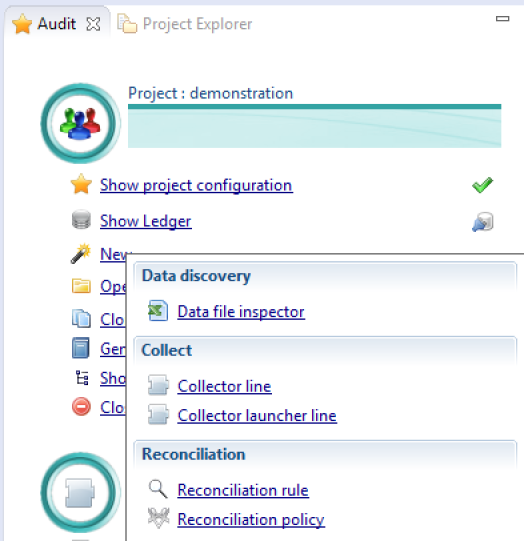

2. Name your reconciliation policy remembering to add the extension ( **.reconpolicy** ) and click **Next**  

3. Enter a unique identifier for your reconciliation policy, for example **'reconPolicy'**
4. Enter a description for your reconciliation policy, for example **'Reconciliation policy'**
5. Click **Finish**  
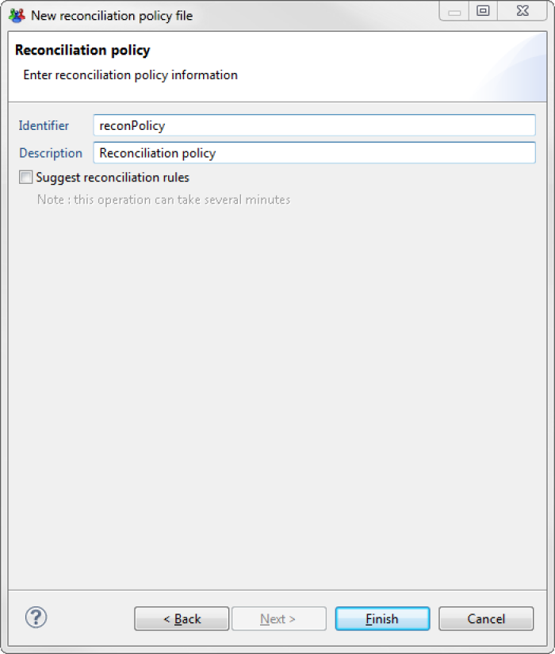

6. Click on ' **Add...**' located in the center of the policy editor. The list of all the repositories which have been declared in the Ledger can be open in the "Repository" field.
7. Select the AD repository (BRAINWAVE in our screenshot).  
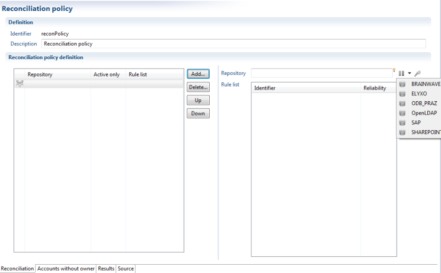  

#### Add AD Repository

1. In order to select the rules associated with the AD repository, click on '**Add...**' located on the right of the reconciliation policy editor.
2. Double click on the reconciliation rule name that you want to associate with the AD repository. Check that the rule appears in the '**Rule list**' column.  
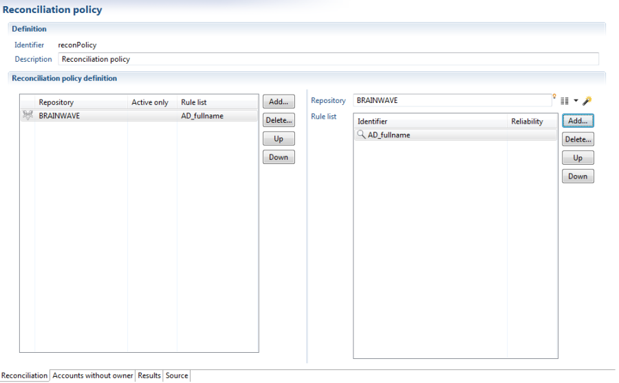

3. Follow the same principle for the OpenLDAP repository  
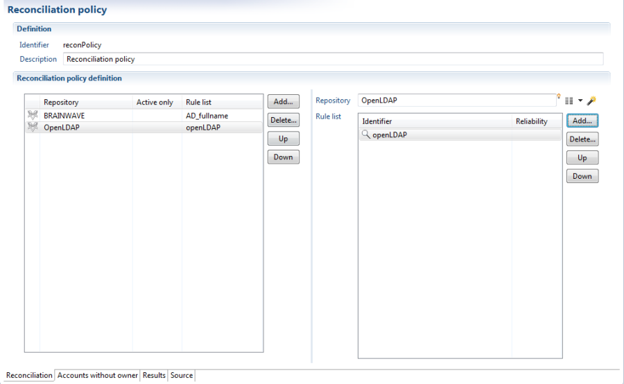

#### Display Results

1. Click on the '**Results**' tab  
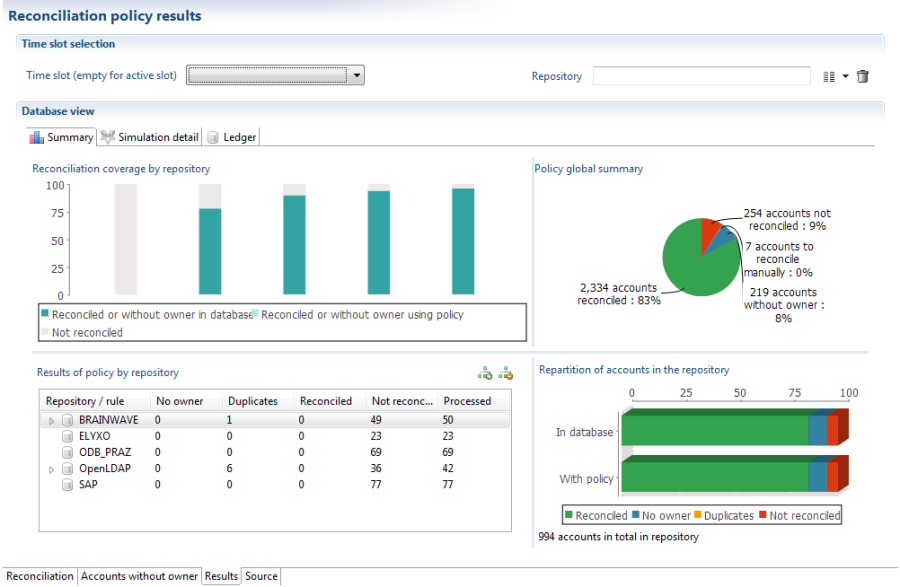  
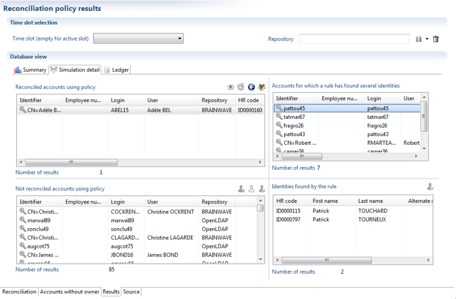

The reconciliation policy results are displayed in the same way as reconciliation rules.

1. You can click the items, from the Ledger tab, to see them in detail
2. You can select another 'Time base' to execute this policy on another Ledger data import date
3. You can filter the displayed results by clicking on 'Filter' and by replacing the search field text.
4. By selecting an account, you can display the result of the policy for this account with the 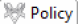
5. You can intervene dynamically in an account reconciliation to perform manual reconciliation operations.

### My First Audit View

This section will get you to be more familiar with the Audit View Editor. To this end, you will create an Audit View that lists all the identities contained within the Main Ledger and for each one, list the entire range of access accounts.
You can also see a video capture of a report being created with an associated Audit View by visiting [http://screencasts.brainwave.fr](http://screencasts.brainwave.fr/)

#### Create an Audit View

1. Activate the 'iGRC Analytics' view
2. Open the 'views/custom' folder in the project view and right click
3. Select 'new/audit view'
4. Name your Audit View, making sure to add the .view extension and click on **Next**  
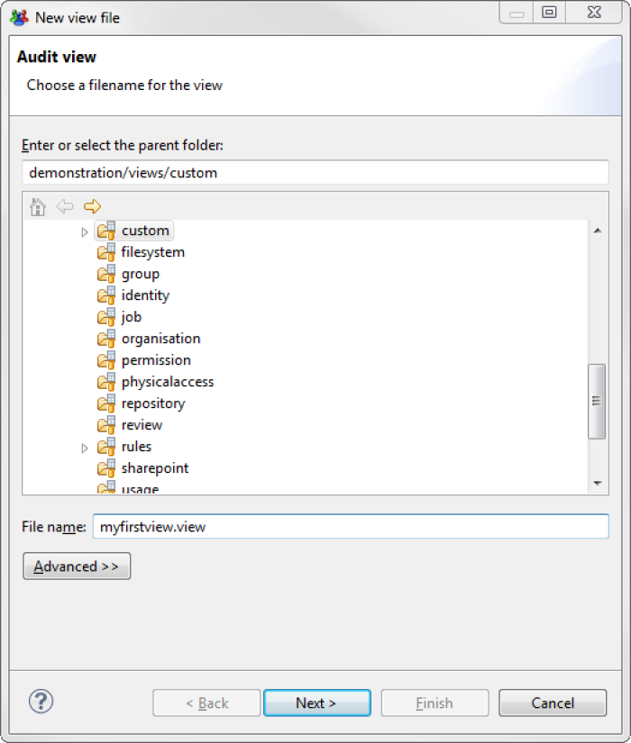

5. Key in a unique identifier for your Audit View and a description, and select _Identities_ from the drop-down  
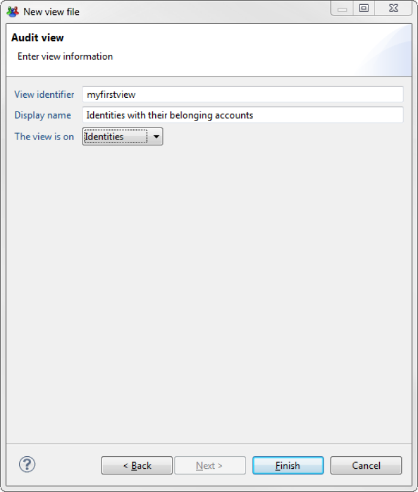

#### Set Attributes of the Main Concept

1. Drag and drop the following attributes from the **'Identity Attributes'**  toolbox to your **'identity'** concept:

- recorduid
- hrcode
- givenname
- surname
- mail
- internal

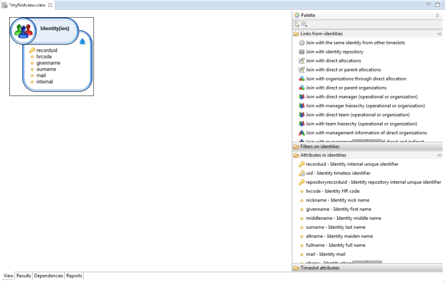

#### Configure a Link to a Secondary Concept

1. Drag and drop the 'Join with accounts through reconciliation' from the 'Links from identities' toolbox
2. Select the 'Account(s)' concept in the graphical editor

#### Sett Attributes of a Secondary Concept

1. Drag and drop the following attributes from the 'Account attributes' toolbox to your 'account' concept:

- recorduid
- login
- username
- disabled
- locked

#### Rename Attributes of a Secondary Concept

1. Right-click on the 'account' concept and select 'Modify table prefix'
2. Key in the 'account_' value

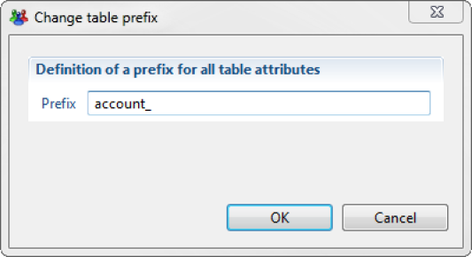

#### Sort Search Results

1. Select the 'Sort' tab in the Properties Editor
2. Configure a sort operation by 'hrcode', then by 'account_login'

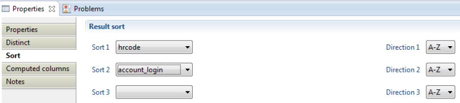

#### View Audit View Results

1. Click on the 'Results' tab of the Audit View Editor
2. If desired, click on 'Export to CSV and open in linked program' to view values in your spreadsheet software

### My First Report

This section allows you to familiarize yourself with the graphic report editor by creating a report yourself with just a few clicks. This report lists the identities contained in the Identity Ledger with, for each identity, his/her position and the organization s/he is attached to. The data is sorted by the HR unique ID of the identities displayed.

#### Create a List Report

1. Activate the 'iGRC Reports' perspective
2. Place the cursor on the 'reports/custom' directory in the project view, and right click
3. Select 'new/audit report'
4. Enter a name for your report, without forgetting its extension (.rptdesign) and click on Next
5. Select the template 'Search List Report' and click on 'Finish'

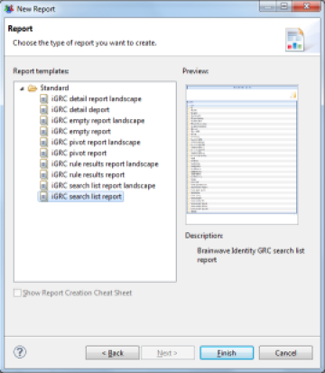

The report editor then opens with your new report.

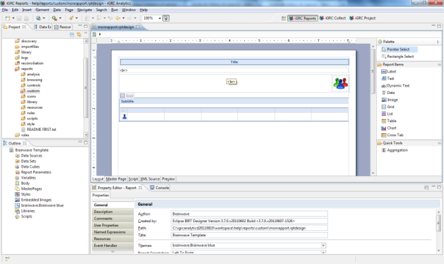

#### Reference Data to be Used

1. Select the 'Data Explorer' view
2. Right-click on the 'Data Sets' entry, then select 'New Data Set'
3. Name your Dataset, then do Next
4. Click on the 'folder' icon to select the Ledger view to associate with this Dataset
5. Select the 'identity/identitydirectorganisation.view' entry and click on OK
6. Click on Finish

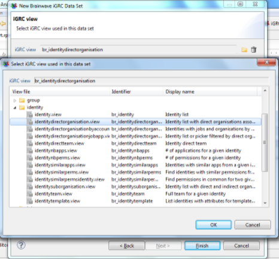

The Dataset editor then opens and allows you to verify the attributes that are retrieved by the view, to refine the dataset settings, and to preview the data in an unformatted display.  
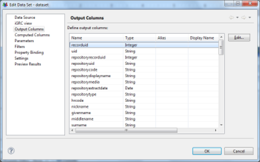  

7. Click OK

#### Associate Data with the Table

1. Select the table in the report editor
2. Select the 'Binding' tab in the properties area
3. Select your Dataset in the 'Data Set' drop-down list
Your table is now paired with your Dataset, it is therefore now able to display data from this Dataset.  
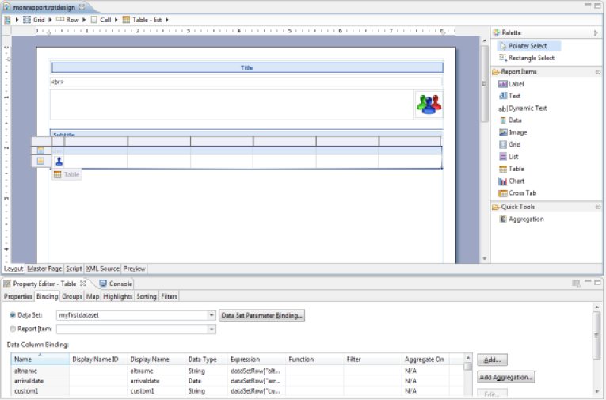

4. Expand the tree section under your dataset in the 'Data Explorer' view
5. All of the attributes associated with the Dataset appear ; drag/drop the following columns in your table:

- hrcode
- givenname
- surname
- internal
- jobtitledisplayname
- org_displayname

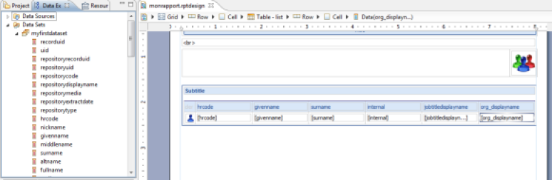

#### Format Columns

1. From the palette, drag and drop the 'label' item in each column header
2. Double-click on the various labels to edit them

- hrcode
- givenname
- surname
- internal
- jobtitledisplayname
- org_displayname

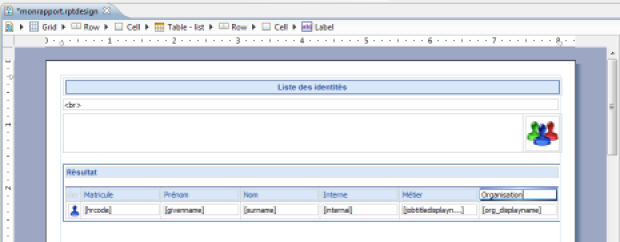

#### Organize Data

1. Select the table in the graphical editor
2. Select the 'Sorting' tab in the property editor
3. Click on 'Add' and then select the 'hrcode' value in the drop-down list, click on OK

#### View the Results

1. On the main menu, click on Run/View report/In Web Browser

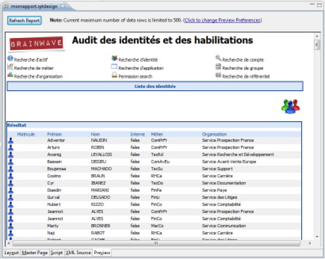
