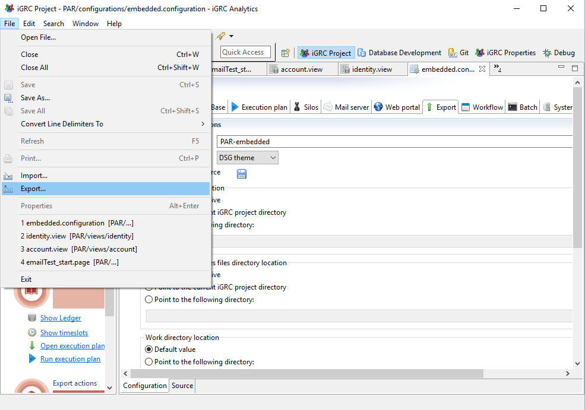
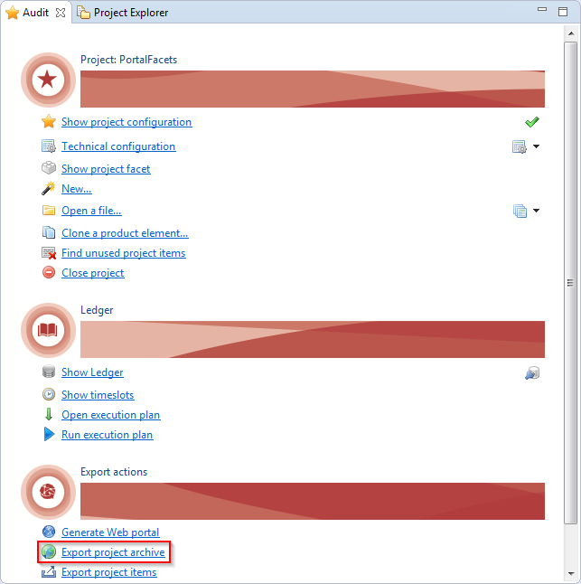

# The Project Archive Concept

## Context

This new feature provides an easy method to update the web portal content during run-time. This method can be used to include updated Reports, Pages and even Workflows to a currently running instance of the web portal.  
This method does not require a reboot of the web server nor a redeployment of the web portal.

Through the studio, a project archive (`.par` files) can be created that can later be uploaded onto the web portal using the dedicated pages.

## Prerequisites

This functionality is available as of version 2016 R3 only.  

## Recommendation

It is highly recommended that only one person be responsible for the action of uploading the project archives. This will allow to avoid conflicts between several versions of the same product that do not include the same files.  
If you are working in a team, please use a version management software such as git or svn that allows you to follow the evolution of your project.  

## Project Archive Content

A project archive contains the difference between the installed default project and the current version of project.

> When using project archive to update web portal it is not recommended to update web portal manually because manual update will be lost.
>
> - Web portal and project archive must be based on same default project version.
> - Only last installed project archive can be uninstalled.
> - Project archive can not be installed on web portal generated with IGRC version older then 2016 R3.

## Exporting Web Portal

To use the project archive feature you must export your web portal using version 2016 R3 or greater of IGRC. If your web portal was generated using an older version, project archives cannot be exported/uploaded and used.

This feature adds two new files to web archive:

- Default project facet
- The hidden `.installedarchive` file

These two files are mandatory when using the project archive feature.

When exporting the web archive several configurations are possible for the location of the project:

1. Embedding the project into the Web archive
2. Point to the current iGRC project directory
3. Point to a specified directory

The configuration used will determine the method used to export the project.

> [!warning] Using project archives will **ONLY** work when the project is:
>
> - Embedded in the web archive
> - Pointing to a specified directory
>
> Uploading par files is **NOT** compatible when the export is configured to point to the current iGRC project studio

### Embedded Project

If the project is embedded the product will automatically include a the previously mentioned files to the web archive. No further manipulations are necessary.  

### Detached Project: Pointing to a Specific Folder

If the export of the web archive is configured such that the project is located in a separate folder it is necessary to export a version of the project compatible with the Project archive feature. In order to accomplish this the export functionality of the studio has been enhanced.  

Navigate to File > Export:

Select the Export project functionality under iGRC analytics and then chose the project to export using the displayed combo box:

Select the desired format of the exported project. It is possible to export the project to an archive (`.auditprj` extension archive) or directly to a folder
Please remember to add the `.auditprj` extension when exporting to an archive file (see caption bellow).

The `.auditprj` is a zip file. You can simply extract the project into the specified folder and then launch the webportal

## Exporting Project Archive

Project archive can be exported from "Audit" menu:

> When exporting a project archive the product will ignore the flowing folders and their contents:
>
> - collector
> - db
> - discovery
> - importfiles
> - logs
> - `.settings`
> - `library/facet` (except of default project facet)
>
> This means that all files present in the previously mentioned folders will never be updated using this method.

## Installing and uninstalling project archive in web portal

Please see the following link for more information:  
[Project Update Manager](igrc-platform/getting-started/default-project/project-update-manager.md)
