# Default Project

The Default project includes the standard views, rules, reports and pages that are installed when creating a new project. The included pages will provide you with a description of how it is setup.  

Please consider using the various capabilities of the default project with care as they can have large impacts on performance.  

## Default Featuresets and Roles

### Prerequisites  

The following only applies to IGRC 2016R3 and newer

### Context

The default project includes a set of features and featurest to easily hide or show some features that can be useful to users with certain roles.

Many features included in the default project provide fine-grained control on individual pages or even widgets like groups or buttons. However, these features are grouped into features that represent global actions or functionalities. Featuresets represent generally an action that is more user-oriented.

For example, in order to be able to reconcile accounts manually using the webportal, a user may need to see and be able to use many widgets in different pages. He will need to have access to a number of features that have already been grouped into a default featureset : accountreconciliation. This makes it easier to give a user access to the reconciliation functionality by using this featureset.

For more information on features and featuresets please see product documentation : [Features and Roles](igrc-platform/pages/features-and-roles/features-and-roles.md)

### Default Featuresets

The file `webportal/features/default.featuresets`, includes the following featuresets:

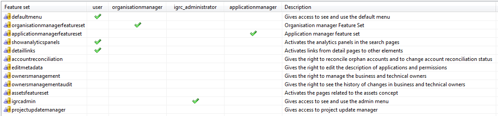

#### defaultmenu

This featureset is associated to the default menu items. Users with this featureset will be able to see and use the default menu item: **Search** and its associated page.  
By default this feature is associated with the **user** role. So that all the users have this featureset. By disabling this featureset we will hide the default menu item **Search**.

#### organisationmanagerfeatureset

This featureset gives access to a homepage dedicated to the managers of an organisation. The home page is `webportal/pages/home/organisationmanager.page`
This featureset is by default associated to the role **organisationmanager**.

#### applicationmanagerfeatureset

It gives access to the homepage for the managers of an application.
The home page is `webportal/pages/home/applicationmanager.page`
By default associated with the role **applicationmanager**.

#### showanalyticspanels

The search pages have an option to select all the elements that result from a given search and send them as parameters to a very specific type of "analytics" reports.  
By default this feature is associated with the **user** role. So that all the users can access.  
However, the panel **will not be displayed** if there are no analytics reports installed. Since these reports are very particular because they receive as parameter a group of elements, they are generally distributed in a separated facets.

> [!warning] The default project does not include any of these reports. They need to be added by installing the corresponding facet.

### detaillinks

This featureset groups the activation of several links from detail pages to other elements. For example, from the detail page of an identity we can have a link to the manager of the identity, this link will take the user to the detail page of the manager.  
By default this feature is associated with the **user** role. So that all the users can access. By disabling this featureset we can disable the links.

### accountreconciliation

Users with this featureset will be able to see and use a few icons in the account detail page that will allow to manually modify the reconciliation of an account.  
This featureset is not assigned to any role by default. [See more about this featuresets](igrc-platform/getting-started/default-project/web-reconciliation.md)

### editmetadata

This featureset enables to option to edit the description of permissions and applications.  
This featureset is not assigned to any role by default. [See more about this featureset](igrc-platform/getting-started/default-project/edit-metadata.md)

### ownersmanagement

Groups the options to manage (edit create delete) business or technical owners to the supported concepts. These functionalities are included in the default project but the access is controlled using this featureset.  
It concerns the following concepts: permission, application, group, repository and account. Links will be activated in all the detail pages of those concepts to modify the owners.

> [!warning] Activating this featureset will allow the use of workflows that required the existence of the expertise domains: _businessowner_ and _technicalowner_. The creation of these expertise domains in the database needs to be done at collect time.

This featureset is not assigned to any role by default. [See more about this featureset](igrc-platform/getting-started/default-project/business-and-technical-owners.md)

#### ownersmanagementaudit

In addition to being able to modify the business or technical owners of a given concept, the user can also have access to an "audit" view of all the modifications that have been done related to the owners.  
Users that have this featureset will have access to that information for the concepts: permission, application, group, repository and account.  
This featureset is not assigned to any role by default. [See more about this featureset](igrc-platform/getting-started/default-project/business-and-technical-owners.md)

#### assetsfeatureset

This featuresets groups all the pages / reports and links associated to the concept "assets". Since they are not commonly used, the option to display them or not is controlled using this featureset.  
This featureset is not assigned to any role by default.

#### igrcadmin

It concerns the Admin menu button. A user with this featureset will be able to see and use the menuitem **Admin**. This menu will lead to an admin page.  
The options provided in the admin page depends on the facets installed in the project. Many facets, include administration pages that will be appear in this section.  
By default associated with the role **igrc_administrator**.

#### projectupdatemanager

This featureset gives access to the Project Update Manager that allows to update the project by installing Project Archive Files (PAR)

> [!warning] This is an administrator featureset, The access will be located in the Admin page. This means that the users also need to have the featureset **igrcadmin** to see the **Admin** menu.

This featureset is not assigned to any role by default.  [See more about this featureset](igrc-platform/getting-started/default-project/project-update-manager.md)

### Default Roles

Users can have many roles and assigning a user to a role can be done by the web application server or can be set to match IGRC rules. For more information on roles please see the product documentation [Features and Roles](igrc-platform/pages/features-and-roles/features-and-roles.md)

The file webportal/features/default.roles defines 4 roles:

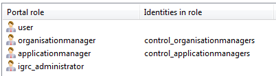

#### user

This roles contains all the users that can be authenticated into the webportal.
According the the defatult featuresets, users in this group can by default:

- See the default menu: search and access the search page (via the featureset defaultmenu)
- See the analytics panels in the search pages if compatible reports are present
- Use the links present in the detail pages to browse to related concepts  

#### organisationmanager

This role groups all organisation managers.
By default, users in this role will be able to see the dedicated homepage for organisation managers.  
This role is by default configured to include the identities returned by the rule _control_organisationmanagers_ that can be found in `/rules/controls/identity/organisationmanagers.rule` :

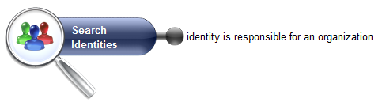

#### applicationmanager

This roles groups all application managers.
By default, users in this role will have access to the dedicated homepage for application managers.
This role is by default configured to include the identities returned by the rule _control_applicationmanagers_ that can be found in /rules/controls/identity/applicationmanagers.rule :

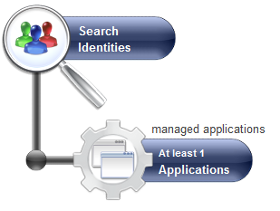

#### igrc_administrator

This role is meant to be assigned to administrators.  
By default, users in this role will be able to see the menu Admin. In this menu they can find admin pages included in the installed facets.

## Reports Featuresets

<u>Version</u>
Applicable as of Brainwave's iGRC version 2016 R3.

All the reports that are delivered with the default project and that are accessible in the webportal are declared in a page file that is located in :
`webportal/pages/reports/standard.page`

Each report is tagged following the [default tagging system](igrc-platform/pages/new-webportal-features/tagging-system-for-pages-and-reports.md), these tags can make these reports available automatically in different pages:

- In [detail pages](igrc-platform/pages/new-webportal-features/links-to-reports-and-pages-from-detail-pages.md), the reports tagged by concept and byuid
- In the home page webportal/pages/default.page if the reports are tagged as generic

### Report Classification

At the same time, reports are classified into different categories :

- Browsing Reports
- Review Reports
- Mining Reports
- Analytics Reports
- Control Reports  

Each report has one feature associated , the full list of features linked to reports is in `webportal/features/reports.features`

We can also see that the default project includes a featureset file  in `webportal/features/reports.featuresets` :

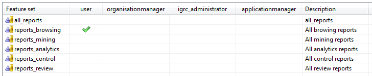

It includes 1 featureset for each one of the available categories. This makes it easy to control the access for each role to each one of the categories of reports in blocks.  
The browsing reports block is the only one that is available by default to all users. The rest of the reports can be activated to certain roles depending on the requirements of each implementation.  
For a detailed  list of all the available reports and their category please see the [dedicated section](igrc-platform/getting-started/default-project/full-report-list.md)

#### allreports

This featureset includes all delivered reports. Roles that have this featuresets will be able to see all the available reports.  
Even if this featureset can be useful in developments, using this featureset is strongly discouraged in production environments.  

#### reports_browsing

Includes all the browsing reports. Is assigned by default to all users.  

#### reports_mining

Includes all mining reports. Disabled by default.  

#### reports_analytics

Includes all analytics reports. Disabled by default.

#### reports_control

Includes all controlreports. Disabled by default.

#### reports_review

Includes all the review reports. Is assigned by default to all users.

### Custom Group of Reports

In some cases, the default categories of the groups is not enough to answer a particular need.  
For example, a particular user might need to access just a little list of reports from the different categories.  
The best practice to implement this is to start by creating a new featureset file :

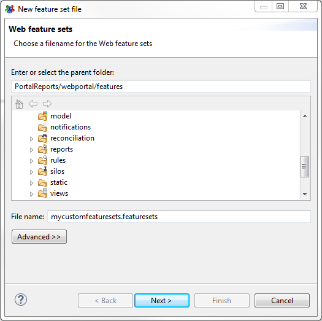

Then we provide information for our new featureset file:

Once the file create we click on the button **Add** to create a new featureset :

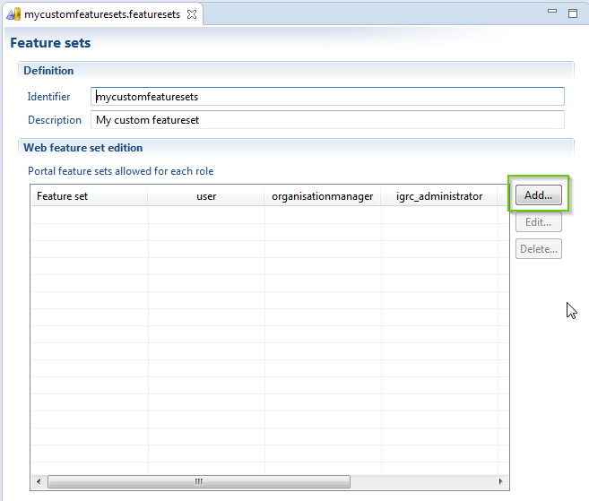

And we provide a name for our new custom featureset :

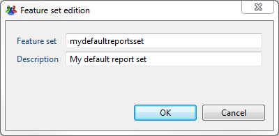

Our new featureset is created , in this case its called **mydefaultreportset,** we can now assign this new featureset to our roles:

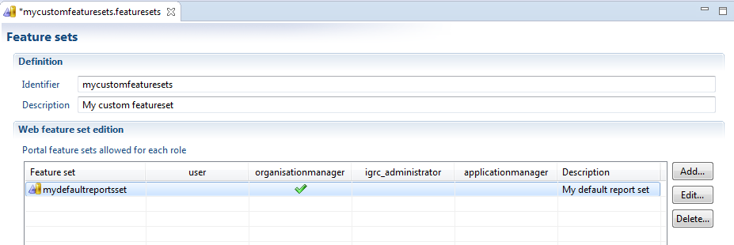

Don't forget to save the changes in the file when its done.

The next step is to modify the file `webportal/features/reports.features`

In this file we will find a feature for each one of the available reports.  We can also see the classification for each report.
We select the file that we need to include in our custom group and click **Edit:**

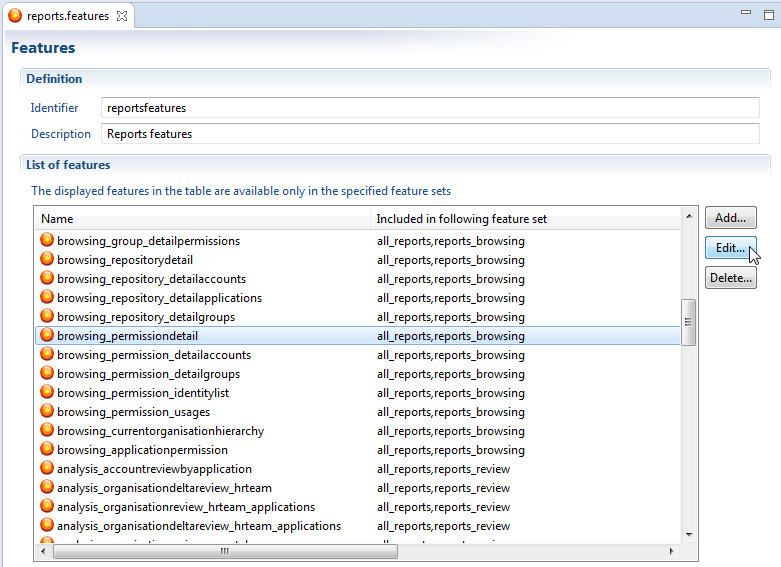

We will edit the feature by adding it to our new custom featureset and click **OK** :

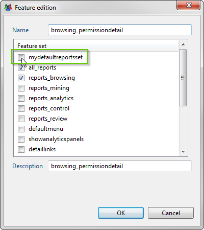

Now, the report will also be part of our new featuresets **mydefaultreportset**

This is then applied to all reports that are to be added to the new group.
We just finished creating or new custom group of reports that will be available for the users that have the selected roles.

For a detailed list of all reports delivered in the default project , you can take a look at the [dedicated section](igrc-platform/getting-started/default-project/full-report-list.md)

## Full Report List

<u>Version</u>
This is applicable as of version 2016 R3 and above  

### Browsing Reports

| **Concept**  | **Feature** | **Title** |
|-|-|-|
|  Account |  browsing_accountdetail |  Printable Version |
|  Account |  browsing_account_allgroups |  Account Groups |
|  Account |  browsing_account_detailapplications |  Applications Details |
|  Account |  browsing_account_detailpermissions |  Permissions of the Account |
|  Account |  browsing_account_usages |  Account Usages |
|  Application |  browsing_applicationdetail |  Printable Version |
|  Application |  browsing_application_detailaccounts |  Accounts Details |
|  Application |  browsing_application_identitylist |  Identity List |
|  Application |  browsing_application_permissionsbyaccount |  Permissions Detailed by Account |
|  Application |  browsing_application_permissionsbyidentity |  Permission Detailed by Identity |
|  Application |  browsing_application_usages |  Usages |
|  Application |  browsing_application_detailassets* |  Associated Assets |
|  Organisation |  browsing_organisationdetail |  Printable Version |
|  Organisation |  browsing_organisation_identities |  Members of the Organisation |
|  Organisation |  browsing_organisation_suborgs |  Sub Departments |
|  Organisation |  browsing_organisation_detailassets* |  Associated Assets |
|  Identity |  browsing_identitydetail |  Printable Version |
|  Identity |  browsing_identity_detailaccounts |  Accounts Details |
|  Identity |  browsing_identity_detailapplications |  Applications Details |
|  Identity |  browsing_identity_detailpermissions |  Detailed Permissions |
|  Identity |  browsing_identity_team |  Complete Team |
|  Identity |  browsing_identity_usages |  Usages |
|  Group |  browsing_groupdetail |  Printable Version |
|  Group |  browsing_group_allaccounts |  All Accounts |
|  Group |  browsing_group_detailpermissions |  Permissions |
|  Repository |  browsing_repositorydetail |  Printable Version |
|  Repository |  browsing_repository_detailaccounts |  Account List |
|  Repository |  browsing_repository_detailapplications |  Applications Details |
|  Repository |  browsing_repository_detailgroups |  Group List |
|  Permission |  browsing_permissiondetail |  Printable Version |
|  Permission |  browsing_permission_detailaccounts |  Accounts Details |
|  Permission |  browsing_permission_detailgroups |  Groups that Give Access |
|  Permission |  browsing_permission_identitylist |  Identities with the Permission |
|  Permission |  browsing_permission_usages |  Usages |
|  Generic |  browsing_currentorganisationhierarchy |  Organization hierarchy |
|  Generic |  browsing_applicationpermission |  Applications and permissions |

### Review Reports

| **Concept**  | **Feature** | **Title** |
|-|-|-|
|  Application |  analysis_accountreviewbyapplication |  Account Review |
|  Organisation |  analysis_organisationdeltareview_hrteam |  Organisation Review (Differences) |
|  Organisation |  analysis_organisationreview_hrteam_applications |  Application Review (Full) |
|  Organisation |  analysis_organisationdeltareview_hrteam_applications |  Application Review (Differences) |
|  Organisation |  analysis_organisationreview_crosstab |  Crosstab Review |
|  Organisation |  analysis_organisationreview_hrteam_permissionsprofiles |  Permission Review (Full) |
|  Organisation |  analysis_organisationdeltareview_hrteam_left_permissionsprofiles |  Permission Review of People who Left the Organisation |
|  Organisation |  analysis_organisationreview_hrteam_deltapermissionsprofiles |  Permission Review (Differences) |
|  Identity |  analysis_accountreviewbymanager |  Accounts Review (By Organisation) |

### Mining Reports

| **Concept**  | **Feature** | **Title** |
|-|-|-|
|  Application |  browsing_application_detailaccountproblems |  Accounts with Controls Defects |
|  Application |  browsing_application_detailidentityproblems |  People with Controls Defects |
|  Application |  analysis_applicationassociatedwith |  Applications Associated with this Application |
|  Organisation |  analysis_organisationreview_hrteam |  Organisation Review (Full) |
|  Organisation |  analysis_organisationsimilarapps |  Applications Associated with this Organisation and its Sub Organisations |
|  Organisation |  analysis_organisationdirectsimilarapps |  Applications Associated with this Organisation |
|  Organisation |  analysis_organisationsimilarperms |  Permissions Associated with this Organisation and its Sub Organisations |
|  Organisation |  analysis_organisationdirectsimilarperms |  Permissions Associated with this Organisation |
|  Identity |  analysis_templateanalysis |  Use as Reference to Compare Permissions |
|  Identity |  analysis_identitysimilarapps |  Identities with Similar Applications |
|  Identity |  analysis_identitysimilarperms |  Identities with Similar Permissions |
|  Permission |  analysis_permissionassociatedwith |  Permissions Associated with This Permission |
|  Generic |  analysis_organisations_applications_withsubs |  Application mining by organisation type (including sub organisations) |
|  Generic |  analysis_organisations_applications_nosubs |  Application mining by organisation type |
|  Generic |  analysis_jobs_applications |  Application mining by job |
|  Generic |  analysis_organisations_permissions_withsubs |  Permission mining by organisation type (including sub organisations) |
|  Generic |  analysis_organisations_permissions_nosubs |  Permission mining by organisation type |
|  Generic |  analysis_jobs_permissions |  Permission mining by job |

### Analytics Reports

| **Concept**  | **Feature** | **Title** |
|-|-|-|
|  Application |  analysis_applicationorphanaccounts |  Orphan Accounts |
|  Application |  analysis_applicationjoborgpivot |  Application Job Organisation Pivot |
|  Application |  analysis_permissionjobpivot_application |  Permission and Job Pivot |
|  Application |  analysis_permissionorgpivot_application |  Permission and Organisation Pivot |
|  Organisation |  analysis_joborganisationpivot |  Job Organisation Pivot |
|  Organisation |  analysis_organisationappsuborgpivot |  Applications Job Organisation Pivot |
|  Organisation |  analysis_organisationappjobpivot_detail |  Job Application Pivot |
|  Organisation |  controls_SoDtopControlsFltOrg |  SoD Analysis |
|  Repository |  analysis_repositoryreconciliation |  Reconciliation Statistics |
|  Repository |  analysis_repositoryorphanaccounts |  Orphan Accounts |
|  Repository |  analysis_repositoryaccounttopgroups |  Accounts with the most/the least Amount of Groups |
|  Repository |  analysis_repositorygrouptopaccounts |  Groups with the most/the least Amount of Accounts |
|  Repository |  analysis_repositoryidentitiesnbperm |  Identities the most/the least Amount of Permissions |
|  Repository |  analysis_repositoryaccountsnbperm |  Accounts the most/the least Amount of Permissions |
|  Permission |  analysis_permissionorphanaccounts |  Orphan Accounts |
|  Permission |  analysis_permissionjobpivot |  Permission and Job Pivot |
|  Permission |  analysis_permissionorgpivot |  Permission and Organisation Pivot |
|  Permission |  analysis_permissionjoborgpivot |  Permission Job and Organisation Pivot |
|  Generic |  analysis_joborganisationpivot_generic |  Job Organisation Pivot |

### Control Reports

| **Concept**  | **Feature** | **Title** |
|-|-|-|
|  Generic |  dashboard_datasources |  Datafiles used to feed the Identity Ledger |
|  Generic |  dashboard_reconciliationappsynthesis |  Application Reconciliation synthesis |
|  Generic |  dashboard_reconciliationsynthesis |  Repository Reconciliation synthesis |
|  Generic |  analysis_repositoryreconciliation_control |  Reconciliation Statistics |
|  Generic |  analysis_accountenabledusergone |  Active accounts, identities gone |
|  Generic |  analysis_accountscreatedmodified |  Accounts created/modified since the last import |
|  Generic |  analysis_accountsdeleted |  Accounts deleted on next import |
|  Generic |  controls_SoDtopControlsNoOrg |  SoD controls Top N for people W/O org |
|  Generic |  controls_identitycontrols |  Identities controls |
|  Generic |  controls_accountcontrols |  Accounts controls |
|  Generic |  controls_applicationcontrols |  Applications controls |
|  Generic |  controls_permissioncontrols |  Permissions controls |
|  Generic |  controls_organisationcontrols |  Organisations controls |
|  Generic |  controls_assetcontrols* |  Assets controls |
|  Generic |  controls_SoDtopControlsFltOrg_control |  SoD Analysis |
|  Generic |  custom_identity_changes |  Identity Changes |

(*) These reports are related to the assets concepts. In order to see them, the assets featuresets must be activated. See more details [here](igrc-platform/getting-started/default-project/default-featuresets.md)

## Web Reconciliation

<u>Version</u>
This is applicable as of version 2016 R3.

Manual reconciliation from the webportal is possible. This functionality is disabled by default and to enable it:
Modify the featuresets file in `webportal/features/default.featuresets`, and assign the featureset **accounreconciliation** to the proper roles. ([See more](igrc-platform/getting-started/default-project/default-featuresets.md))

### Modify the Reconciliation

After the functionality is enabled for the selected roles. The users will activate some icons in the detail page of the account.
If the account is already reconciled , then it will display 3 icons next to the identity field :

The tooltip on each of this buttons will provide more information:

#### Delete this Reconciliation

Will delete the reconciliation

#### This account has an owner

Allows to modify the reconciliation. It provides a dialog box with an identity picker and a comment :  

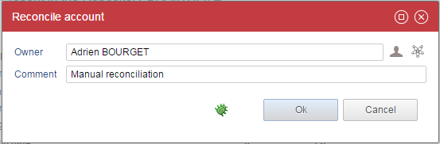

#### The owner of this account has left

Will modify the reconciliation. Allows to select an identity that has left:

If the account has not been reconciled, we will still have the last three options. But we will also mark the account as a no-owner account with two more icons :

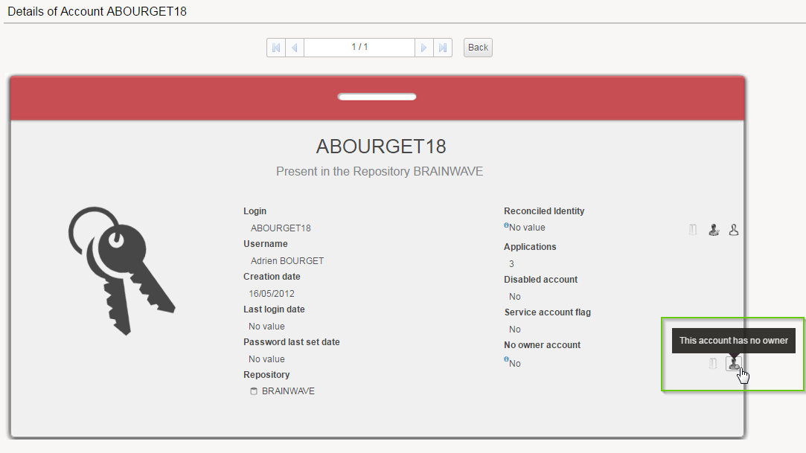

The tooltip for these two new icons :

#### This account has no owner

This allows to mark the account as an no-owner account. It will bring a dialog box to select an existing no-owner code or create one :  

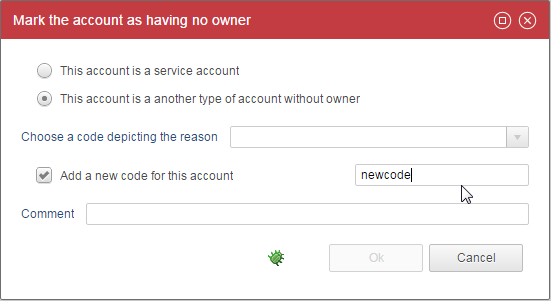

#### Delete this Reconciliation

Will delete the reconciliation.

## Business and Technical Owners

<u>Version</u>
This is applicable as of version 2016 R3.

The default project includes the functionality to manage the business and technical owner of the following concepts: permission, application, group, repository and account.  
However, this a functionality that is disabled by default.  
To enable it modify the featuresets file in `webportal/features/default.featuresets`, and assign the featureset **ownersmanagement** to the proper roles. ([See more](igrc-platform/getting-started/default-project/reports-featuresets.md))

### Manage the Business and Technical Owners

When this featureset is activated. The users in the selected roles will see new icons in the detail page of concerned concepts. For example, application :

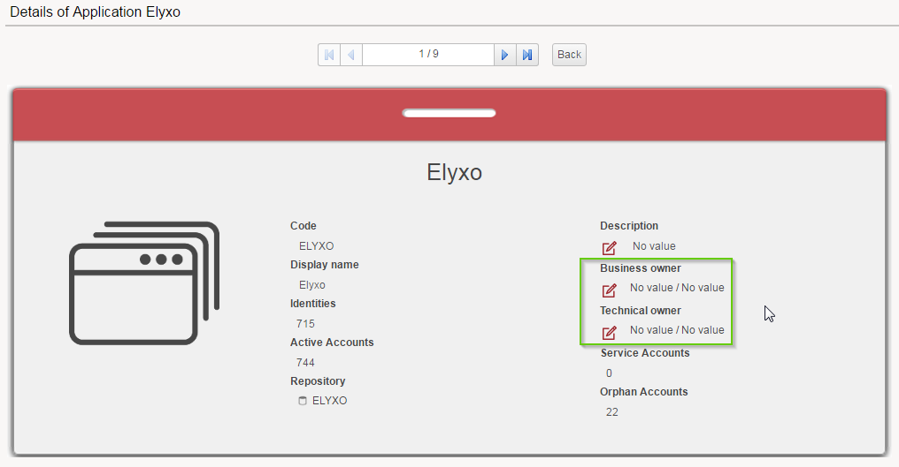

The edit icons will display a dialog box that allows to select an owner :

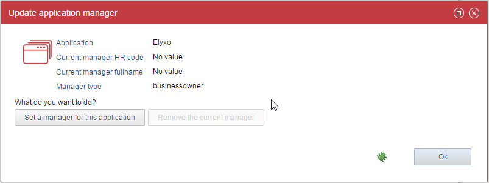

It will display an identity picker to select the manager.

### Auditing the Modifications

The default project also includes the possibility to audit the modifications on the business and technical owner.

But this feature is not activate by default , to activate it modify the `featuresets file in
webportal/features/default.featuresets`, and assign the featureset **ownersmanagementaudit** to the proper roles. ([See more](igrc-platform/getting-started/default-project/default-featuresets.md) about this featuresets file).

When this option is enabled, the users will see a third button in the previous dialog box:

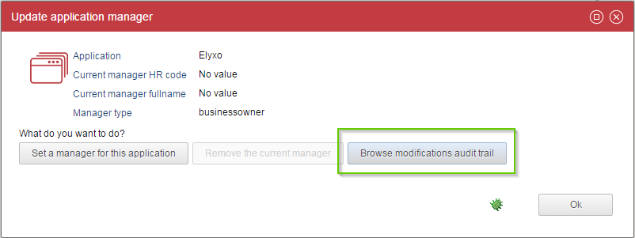

And this new button will open a new dialog box with an audit trail :

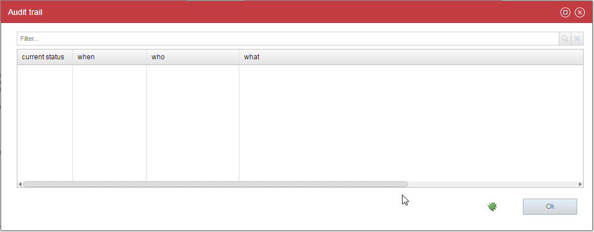

### About the Expertise Domains

Managing the Business and Technical owners in the Ledger is done by making a manager relationship between the element and the corresponding identities. To make a difference between a _business owner_ or a _technical owner_ , this relationship needs to be "typed" and this is done using the **expertise domain**.

It is possible to create as many expertise domains as we need; However, this functionality requires the presence of 2 expertise domains:

- Expertise domain with code : _businessowner_
- Expertise domain with code : _technicalowner_

The expertise domains **cannot** be created on-the-fly, they need to be collected into the Ledger. If you try to use this functionality and the expertise domains are not present in the ledger, it will not work and it will cause an exception.
Its very important to keep in mind that when this functionality is activated, we should include a collect line that creates the expertise domains in the ledger. This is done using a **Reference Target**.

In the Expertise domain section of the **Reference Target** :

For example, we can use multivalued variables created in an update target :

In the update we can create two multivalued attributes to handle the code and descriptions :

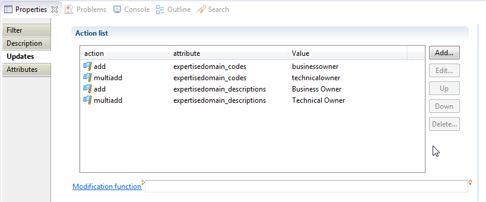

And in the reference target :

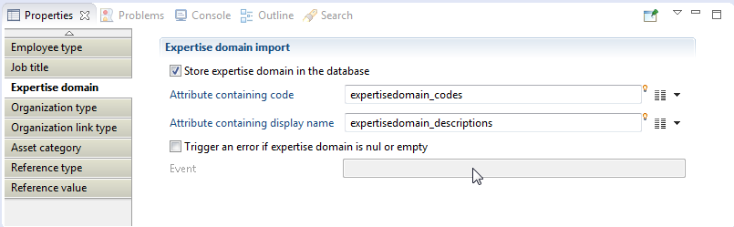

Now we just need to make sure that our collect lines gets executed in our execution plan

## Edit Metadata

<u>Version</u>
This is applicable as of version 2016 R3.

Some concepts include by default the option to edit associated metadata such as a description. The concepts concerned : **Application** and **Permission**. This functionality is disabled by default.  
To enable it :  
Modify the featuresets file in webportal/features/default.featuresets , and assign the featureset **editmetadata** to the proper roles. ([See more](igrc-platform/getting-started/default-project/default-featuresets.md) about this featuresets file)

### Editing the Metadata

Both application and permission concepts allow to edit their associated description. Users in a role that has this featureset will be able to see an option to edit in the default page.

For example for an application :

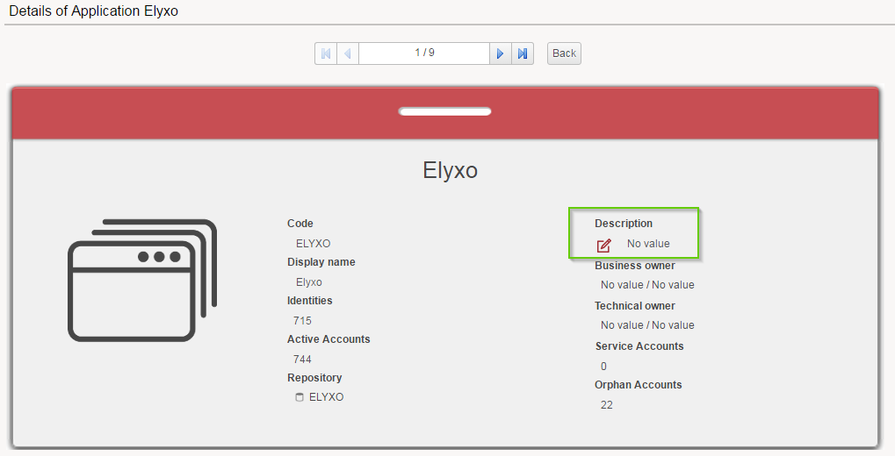

#### Update Application Metadata

Will give the option to modify the description of the application.

## Project Update Manager

<u>Version</u>
This is applicable as of version 2016 R3.

The default project includes a administration functionality to support the update of the project using the webportal. This functionality is disabled by default.
To enable it modify the featuresets file in `webportal/features/default.featuresets`, and assign the featureset **projectupdatemanager** to the proper roles. ([See more](igrc-platform/getting-started/default-project/default-featuresets.md) about this featuresets file).

> [!warning] This feature adds a button in the admin page. This means that in order to see this features, users must have also the featureset **igrcadmin**  to have access to the admin menu.

The project can be updated using the Project Archive Files (PAR) that can be generated using iGRC Analytics. The extension of PAR files is .par

### Access the Project Update Manager

To access the Project Update Manager you can use the link in the admin page that can be reached by using the **Admin** menu:

### Installing a PAR File

The Project Update Managers offers the possibility to upload a PAR file previously created using iGRC Analytics by clicking "Upload a new PAR file":

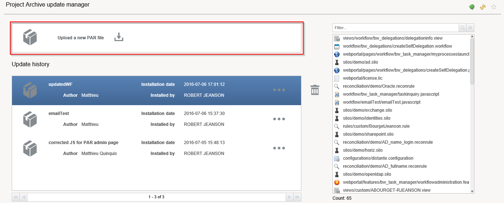

This open a pop-up window where, for security reasons, it is necessary to tick the option and enter the corresponding confirmation code in order to select and upload the PAR file.

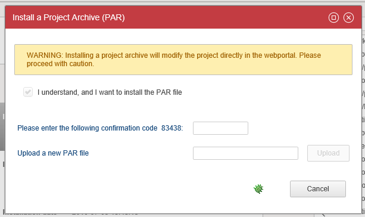

> [!warning] The PAR file will be automatically installed after the upload.

Once the operation completed a a message box is displayed with the result of the installation process.  
Once a PAR file is installed it is possible to see all update files corresponding to the selected file on the right hand side of the screen.

### Uninstalling a PAR File

In the page the history of all previously installed PAR files is displayed:

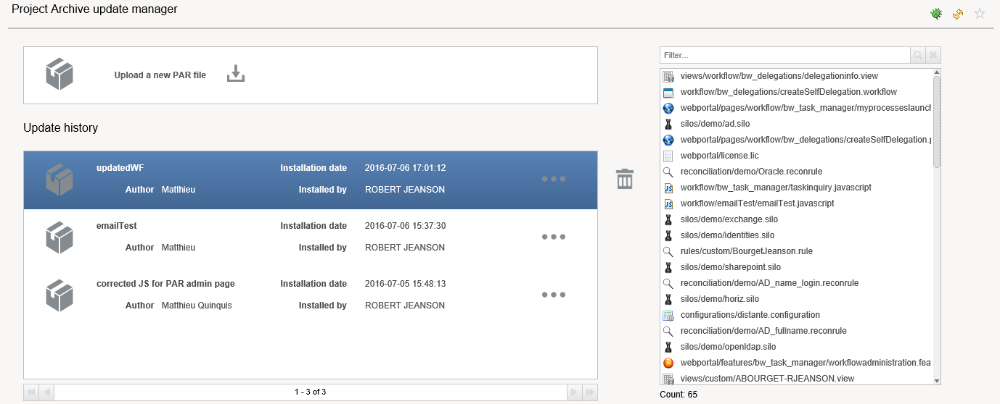

To uninstall the latest PAR files, select the latest uploaded PAR file and click the dustbin icon. You will receive a confirmation in a message box after the PAR file has been deleted.
