## Navigating in the Studio

The iGRC Analytics graphic interface consists of several fields:  
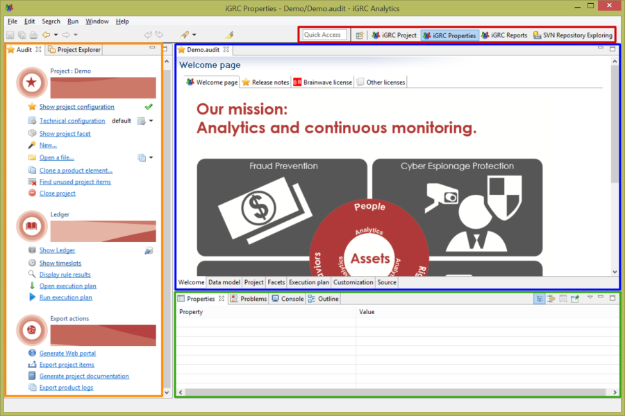

- The Work space and Project Explorer tab (in orange) displays the main actions that can be performed on the current project as well as the list of existing projects.
- The perspectives zone (in red) allows selection of the perspective to be displayed (cf. below).
- The principal editing zone (in blue) enables configuration operations through graphic editors to be carried out.
- The status zone (in green) enables contextual views to be displayed in the principal editing zone. In particular, you will find here the "Properties" tab that enables entry of the properties of objects edited in the principal zone.

### Workspace

The workspace is divided in tabs. The two most used tabs are:

- Audit: enables to launch most generic actions related to the project.
- Project explorer: enables to browse project files and to open the different elements such as controls, rules, etc.

### Perspectives

A perspective is a pre-set configuration of panels and tabs suited for a particular activity. IGRC Analytics supplies several default perspectives:

- iGRC Project
- iGRC Properties
- iGRC Reports

The icon  placed to the right on the perspectives bar enables to add perspectives.  
Modifications to the arrangement are automatically registered in the current perspective.  
It is possible to restore the default arrangement of a perspective by right clicking on the perspective button and selecting "Reset".

## Using the Editors

### Discovery Editor

To best take advantage of the "data discovery" editor features, known as "Discovery" in the Identity Ledger, open the 'iGRC Project' view. The discoveries are located in the '/discovery' subdirectory of your audit project and use the '.discovery' extension.
It is possible to create a new discovery by using the copy/paste mechanism on an existing discovery through the main product menu, or by using the new discovery creation wizard (contextual menu 'New' \> 'Data file inspector').

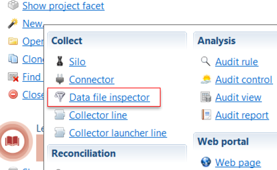

#### Configuration Tab

This tab contains all the parameters that were entered in the discovery creation wizard.  
The "Configuration" tab also contains all the operations that were configured in the discovery:

- Creation wizard (file format, format of date and Boolean type values, first level filtering, number of records to process)
- Data filtering actions (validations)
- Data transformation actions


##### Analysis Tab  

This tab presents the results of the analysed file.
The Analysis view is the discovery editor's main view. This view presents the information from the data file to be analyzed.
The presentation makes it easy to identify the attribute names, their type, the number of values per attribute, and the detail of the values per attribute, with their distribution.
This mode of representation at first looks like what we might see with the "Sort and Filter" function in Microsoft Excel, but we will see further along in this documentation that in fact, we can perform data filtering and transformation operations that are much more extensive than those done in Excel.


##### Validation Tab

The validation tab is used to configure some data quality checks on the input data.  
Two fields are displayed in the tab.

1. Definition of data validation test
2. Validation results

An analysis is performed either by clicking on the analysis tab or when validating data using the [Silo Validation](igrc-platform/getting-started/product-description/using-the-editors/silo-editor/silo-editor.md).  

> Data validation occurs **after** the actions defined in the `Configuration` tab of the discovery, as described in the Studio (version `Curie R2` or newer)  
> 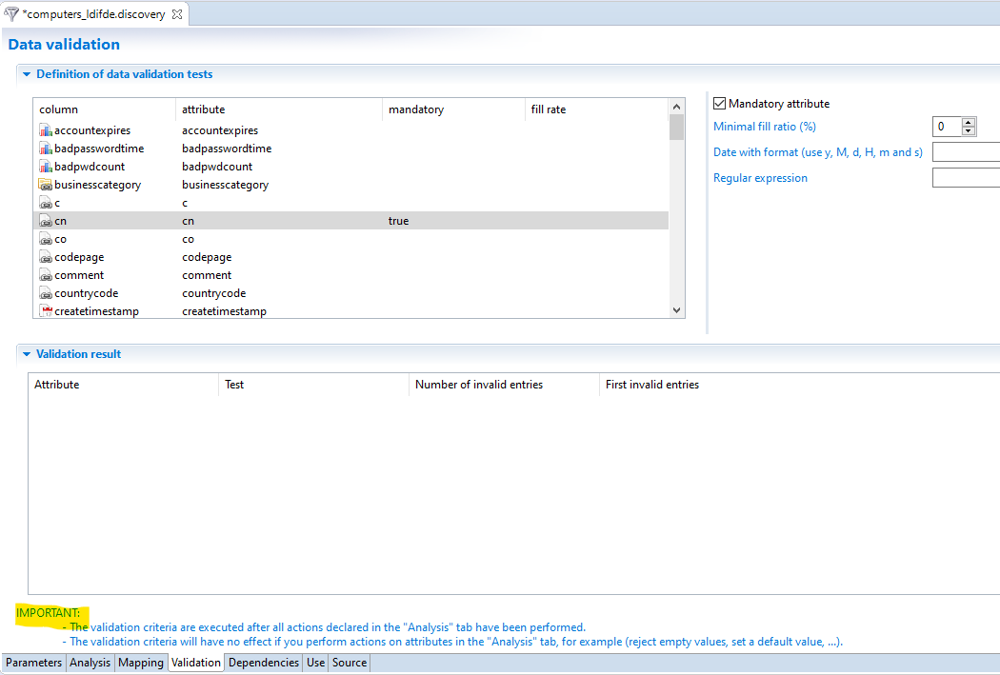  
> You can also validate data in the **collector**, using the [validation filter](igrc-platform/collector/components/filters/validation-filter/validation-filter.md)

##### Usage Tab

This tab presents the list of collector components that use "Discovery" when loading data.  


##### Source Tab

This tab contains the description of the Discovery in its definition's XML format.  


#### Details of the Analysis Tab

The analysis tab presents the content of the analyzed file. No matter what its initial format, the file is presented as a series of records. Each record is composed of a group of different single-valued or multivalued attributes depending on the type of file:

- In the case of a formatted or Excel CSV type file, the attributes correspond to the various columns in the file. The records correspond to the various lines in the file.
- In the case of an LDIF file, the attributes correspond to the different attributes of the LDAP object analyzed, such as "sn, givenname, mail, objectclass..." in the case of an "inetorgperson" type object. The records correspond to the various LDAP objects depending on the type of object selected in the file.
- In the case of an XML file, the attributes correspond to the various attributes of the selected object.

The analysis tab will allow an analysis to be performed not by attribute instead of by record, with the objective of:

1. discovering the values and the meaning of the various attributes, notably in order to "map" them to Identity Ledger concepts during collector configuration
2. transforming attribute values, or creating new attributes in order to "map" them in the Identity Ledger
3. filtering records based on attribute values (or the absence of values), particularly if we consider that these data are required in the Identity Ledger in order to perform the analysis properly. Rejection files are generated in order to pass these data quality issues on to the relevant application owners.

All of these operations performed on the attributes (filtering, creation, modification, transformation, deletion...) take place in the left side of the editor. The right side allows us to view the results of the transformation and any rejected records.

##### Left Part - First Section: List of Attributes

This section allows us to list the various attributes present in the records, and identify their name, their type, the number of different values...  


You can configure transformation or filtering actions by right-clicking on the attributes.  


A toolbar is present in this section. The buttons correspond to the following actions:  


##### Left Part - Second section: List of Values

Once an attribute is selected in the first section, the second section of the analysis editor (List of values) allows you to view all of the various values of the attribute as well as the number of occurrences of each value.  
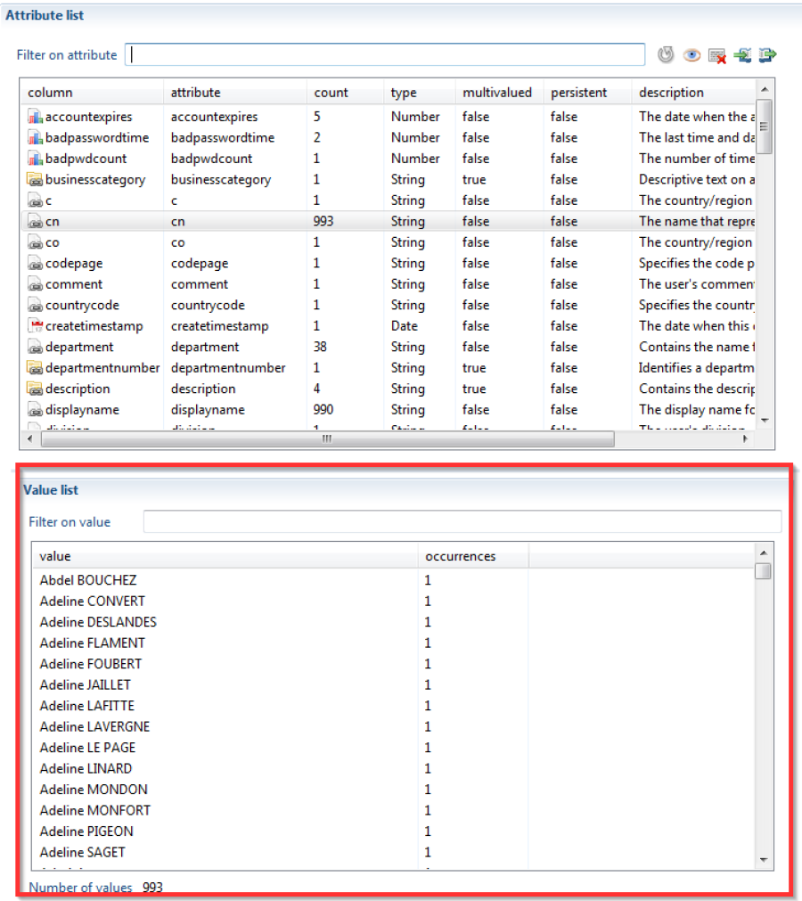

Right-clicking on a value allows you to configure filtering or transformation operations on the basis of the selected value. It is possible to select several values by holding down the "Control" key while you click.  


##### Right part - First Section: Results

The first section, "Results," presents the results after the application of the various transformation operations. The results are displayed as a table, with columns corresponding to the initial columns and/or computed columns. The values correspond to the values that were potentially transformed.  


It is possible to sort the results by right-clicking on the column headers. It is also possible to filter the results in order to display only a subset of them. You can perform this operation by right-clicking on the column headers.  
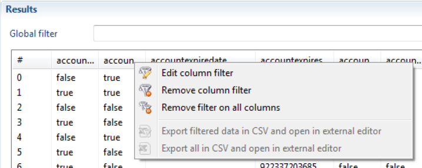

It is also possible to configure filtering by right-clicking on a value or series of values in the lower left side of the editor.  


Right-clicking in the results area allows you to export the results in CSV format.  
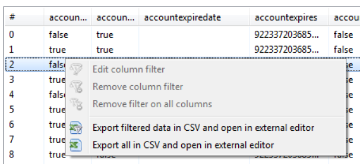

##### Right Part - Second Section: Rejected Records

The second section, "Rejected Records," presents the records that were filtered during the file analysis. This filtering is the consequence of the configuration of "rejection" actions or filtering actions, such as requiring a value or series of values in a given record. An event may be associated with a rejection; in this case, the event is displayed in the first column.  


As in the "Results" section, it is possible to filter the values and export the content of the section in CSV format.
The rejected records that contain an event name will be saved in a rejection file when the collector is run. We invite you to consult the documentation about the "runtime plan" for more information about the log files.  

#### Preferences

The product automatically keeps the order and the width of the columns in tables. As such, after editing the position and the width of columns in tables trough the product, the changes made by the user are preserved as long the file being worked on is kept open.

> This functionality is available, among others, in:
>
> - The view editor
> - The rule editor
> - The discovery editor

### Collector Editor

To be able to comfortably use the collector editor, the first thing to do is to switch to the iGRC Analytics perspective. A _perspective_ is an organization of windows in the workflow. The iGRC Analytics perspective is structured around the editing window. The editing window alone is not sufficient to carry out a collector work session (editing and/or execution). You must also display other windows called _views_ in the center of the screen that complement the collector line editor. The most important view is the Properties view displayed below the editor because it allows you to change the settings of the component selected in the editor.

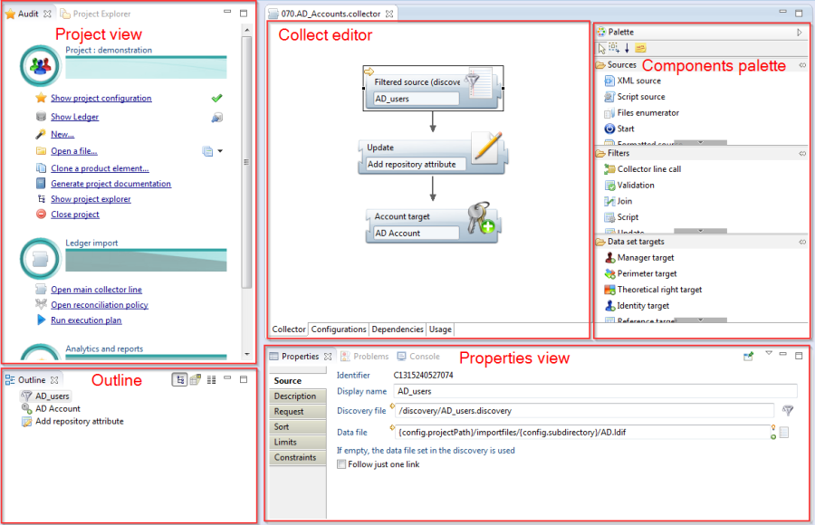

#### Editor

The editor allows you to create, edit and save a collector line. To create a collector line, you must go through the wizard, which asks for the name of the file, some background information, as well as a script selection. The script referenced here is where the JavaScript functions used in the collector line must be created.
The wizard creates one or two files depending on the option chosen for the script in the collector's directory:

- .collect file: file containing the collector line
- .javascript file: initially empty file, able to contain the JavaScript functions

Once the editor is open, the Collector tab is selected and two parts are visible:

- the editing area: This is the area in which the collector components are dropped and connected to form a collector line
- the component palette: The palette displays the tools and all the available components

The collector editor offers the following tabs:

- Collector tab: Graphic editor to create the sequence of components involved in the collector.
- Properties tab: Not to be confused with the properties view, the properties tab in the collector editor displays the information entered in the collector line wizard.
- Configuration tab: Allows you to define different configurations for running the collector line. Each configuration contains variables, which may have a different value in each configuration.
- Dependencies tab: List of files used by the collector line. Note that the dependency tree only has one level.
- Usage tab: List of files that reference this collector line.
- Source tab: XML source of the collector line.

#### Component Palette

The component palette separates the components into three categories: sources, filters and targets. The upper part of the palette provides some tools which allow you to change editing mode. The editor provides three editing modes depending on the tool or component selected in the palette.

- Selection: This mode is activated by clicking the cursor  in the palette toolbar or on the selection marquee 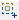. It allows you to select one or more components in the editing area.
- Link: This mode is activated by clicking on the arrow icon  in the palette toolbar. This provides the means to connect two components by selecting the first and then the second.
- Creation: This mode is activated by clicking on a component in one of the three categories. It lets you create a component in the editing area.

##### Editing Area

There are two ways to create a component in the editing area.

- The first way is to click on the desired component in the palette, then click in the editing area.
- The second method is to drag/drop the desired component from the palette to the editing area.

The component then appears in its default size. If the component is not in the desired size, it can be resized horizontally by using the handles. A toolbar is available under the menu to position, align or resize several components automatically. The meaning of the icons is given below:

-  : This icon left-aligns the selected components vertically.  
- 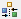 : This icon centers the selected components vertically.
- 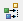 : This icon right-aligns the selected components vertically.
- 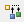 : This icon top-aligns the selected components horizontally.
- 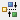 : This icon centers the selected components horizontally
-  : This icon bottom-aligns the selected components horizontally.
- 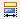 : This icon resizes the width of the selected components.
- 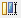 : This icon resizes the height of the selected components.

> [!warning] CSV, LDIF, XML and formatted source type components open a wizard to select the file to be processed. This dialog box only opens if the properties view (bottom window) is displayed.
When you click once on a component, it is selected and a border appears allowing you to resize it. By double-clicking on the editing box (the white area inside the component), the component enters editing mode and a cursor appears to allow you to enter the title.


All the traditional functions like cut, copy, paste, delete, undo and redo are available to manipulate the selected component(s).
By right-clicking on a component, a contextual menu opens. Menu items specific to the collector are shown in the screenshot below:  

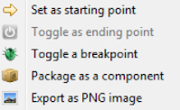

- Set as starting point: This menu item is only activated if the selected component is a source. It allows you to identify the main source in the collector line. Once activated, an arrow icon  appears in the upper left of the component. There can only be one starting point. If a starting point has already been set for a component, setting a starting point on another component will remove the old starting point.
- Enable/Disable as an ending point: This menu item may only be activated for a terminal component (having no transition to other components). An ending point designates the component that gives its datasets to the calling collector line. Once activated, an icon symbolizing the ending point  appears at the upper left of the component. There can be only one ending point.
- Toggle a breakpoint: This menu item allows you to set or remove a breakpoint. Another way to place it is to double-click on the component. An icon representing an insect 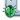 appears at the bottom left of the component. When running in debug mode, the collector engine stops at the component's entry if it is marked with a breakpoint. This allows you to inspect the contents of the current dataset.
- Package as a component: This menu item applies to the entire collector line and not to the selected component. It can be activated even when the contextual menu is open without selecting a component. A packaging wizard opens and asks a few questions to transform the entire collector line into a library (a .component file in the library directory). The collector line is not affected, however, and can always be edited and executed independently of the new component, each of them being uncorrelated now.

##### Properties

By default, the properties view displays the diagram of the collector line. When a component is selected in the edit box, the view displays the properties of the component. The properties are grouped by themes in tabs. To display the diagram of the collector line again, just select the bottom of the edit box without clicking on a component or connection. The properties view displays the following table:

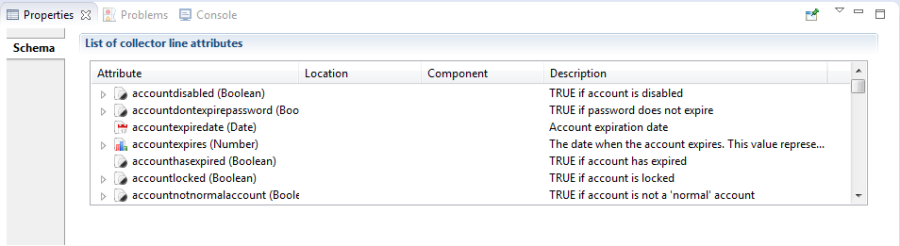

Information modified in the properties view is taken into account immediately. It is not necessary to confirm by pressing the Enter key. However, some fields, such as text boxes, are validated only when the focus moves to another field. To do this, after you enter the information, simply click on another field in the properties view or another component of the editing area.
Most of the fields in the properties view offer data entry help in the form of an icon  to the right of the field. This is usually an icon that opens a menu with various entry options for the field. This is particularly true of fields requesting an attribute name. A click on the Help icon opens a menu displaying all of the attributes. Selecting an attribute will replace the contents of the field with the name of the selected attribute.

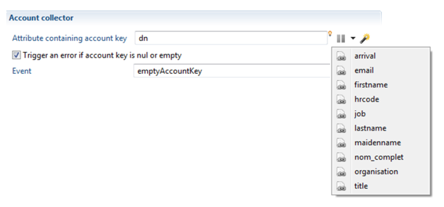

Some fields are text fields in which it is possible to insert a JavaScript expression in the middle of text. This type of field provides two forms of assistance:

- An icon to the right of the field: The light bulb icon  opens a menu with suggestions as in most other fields.
- Auto-completion: This assistance is activated by simultaneously pressing the keys Control-Space. A menu appears with suggestions relating to the context. This contextual menu is very different from the menu opened by the icon to the right of the field because suggestions depend on the location of the cursor within the text. The type of help offered is related to the JavaScript language. It either completes a partially entered keyword or gives suggestions on method names or attribute names.

##### Overview

The overview is a view that displays information about the collector line in three different ways. In the overview toolbar, there are three icons to change the view mode:

-  : This icon displays the list of components present in the collector line. A click on the component selects it in the editing box.
-  : This icon displays the complete diagram of the collector line with a frame indicating the visible part if the editing box is not large enough to display the entire line. By moving this rectangle, the editing area displays the corresponding portion of the collector line.
-  : This icon displays the diagram of the collector line. This is the same display as in the properties view, but presented vertically.

#### Configuration Variables

In a collector line, it is recommended that you not hard-code the values ​​that depend on the technical environment. The best example is the name of the file to load into a source component. If this name is hard-coded by the collector line's designer from his local file tree (C:\Users\Paul\test.csv), the collector line will not work when it is published on a Linux server.
To manage this, we must define two configurations, one for development and another for production. In each of these configurations, the same variables are defined but their value depends on the configuration in which they are located. For example:

|**Variable**|**Development**|**Production**|
|:--|:--:|:--:|
|`source_file`    |`C:\Users\Paul\test.csv`|`/var/applis/rh/export_rh.csv`|
|`external_import`|False                   |true                          |

All the variables are single-valued strings. These variables are local to the collector line. If multiple collector lines must use the same variables, it then becomes necessary to define variables at the project level. The project editor contains the same configuration and system variables, but these variables are all accessible from any collector line.
If a variable is defined in both the collector line and at the project level, the collector line value always has precedence over the project value. This allows you to override the suggested project variables in a collector line to give them a different value locally.

#### Component Properties

The properties view of a component is related to the selection in the collector editor. When a component is selected, the properties view displays the information about that component. Most of the information to be entered in the properties is populated with values independent of context, or with attribute names.
However, some fields require the use of configuration variables or JavaScript expressions to make the property values dynamic when the collector line is run. This chapter explains how to use a configuration variable as well as a JavaScript expression.

##### Using a Configuration Variable

Configuration variables, whether they are defined in the collector line or in the project, are always used in the same way. In a field where a value is expected, part of the value may be a configuration variable. The syntax uses the keyword `config` followed by a dot and the name of the variable, all within brackets like this:
`{config.source_file}`

The above content may be entered directly into the 'CSV File' of the 'Source CSV' component properties. At runtime, the collector engine detects opening and closing brackets, and concludes that we must evaluate the content inside the brackets and use the result as a CSV file name. The following screenshot shows an example of properties from a CSV source:

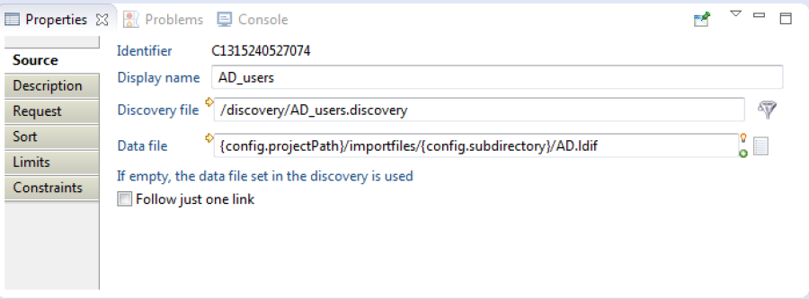

Instead of entering `{config.source\file}` in the 'CSV File' field, it is better to click on the small light bulb  to the right of the field and select the variable. This fills the field with the correct syntax and without typos. However, you must have already created the variable in the Configuration tab before you can select it with the small light bulb.  
In practice, it is rare to enter a configuration variable directly into a field. In the example with the CSV file name, it is more likely that the file was selected through the wizard, which, when it closes, fills in the 'CSV File' field with the path of the selected CSV file. The initial situation is then different because the 'CSV File' field is filled and the `source_file` variable does not exist in the Configuration tab. In this situation, simply click on the small plus icon  which opens a dialog box like this:


Now you just need to enter the name of the variable (in this case `source_file`). When the dialog box is validated, the `source_file` variable is created in the configuration, the value C:\Users\Paul\test.csv is given to the variable, and the field content is replaced by the syntax {config.`source_file`} in order to use the variable.

##### Using a JavaScript Expression

The use of configuration variables is not always sufficient, in particular when it is necessary to modify the content of a dataset attribute with a calculated expression. In this case, the product provides the possibility of entering a JavaScript expression in a field so that the when the collector engine runs, it may calculate the result of the expression and use it as the field value.
The syntax is the same as for a configuration variable. The expression must be enclosed in brackets so that the engine collector recognizes its presence. JavaScript expressions are very useful in the modifying component. Its purpose is to create or modify an attribute in the dataset. It is valuated with a value that may be a constant, but a JavaScript expression may be used to make the allocation more dynamic. For example, a new attribute containing the first name followed by a space and the last name in uppercase will be valuated as follows:

```javascript
{dataset.firstname.get() + ' ' + dataset.lastname.get().toUpperCase()}    
```

The full syntax is described in the chapter on [macros and scripts](igrc-platform/collector/macros-and-scripts/macros-and-scripts.md).  
Fields that allow entry of a JavaScript expression also have a small light bulb icon  to the right of the field. These fields also offer auto-completion to help enter an expression. Pressing the Control-Space keys at the same time opens a pop-up window with suggestions related to the cursor position as shown in the screenshot below:  
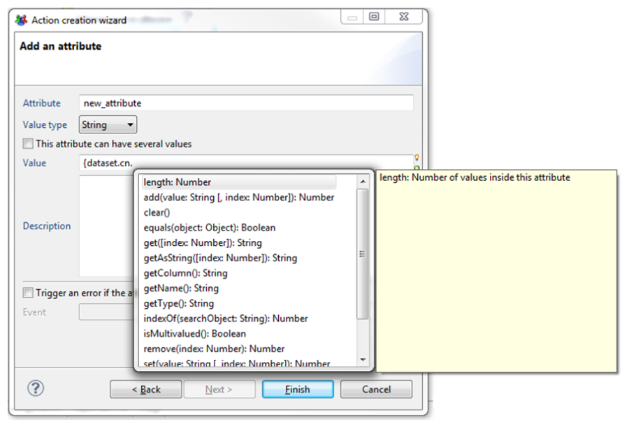

The syntax is identical between the configuration variables and JavaScript expressions because the configuration variables are referenced in JavaScript. The `{config.source_file}` syntax is a JavaScript expression using the predefined variable config and the `source_file` property of this variable.  
It is quite possible, in the same JavaScript expression, to manipulate both the dataset and the configuration as shown in the example below:  

```javascript
{dataset.unique_ID.get().toUpperCase() + config.suffix.toUpperCase()}
```

#### Running a Collector Line

There are three different methods for running a collector line:

- Debugging in the studio: This method of execution allows you to put breakpoints on a component or in a JavaScript script. The execution pauses when a breakpoint is reached, allowing you to verify the content of the dataset and the proper sequencing of components. All the messages generated by the collector line are sent to the Console view.
- Running in the studio: This method of execution is to be used when the collector line has been verified in the debugging mode. It runs the collector line without leaving records in the Console view.
- Batch mode execution: The purpose of this method of execution is to run the collector line in a recurring fashion through a command line on a production environment. The product's installation directory contains two files, one for Windows and the other for Linux, to start the collector engine without a graphical interface. Note that the command line only starts the collector. To automate the launch at a certain time and in a repetitive fashion, you must use the tools offered by the system (Task Planner in Windows and cron in Linux).

In all of the execution methods, the messages generated by the collector engine are systematically sent to log files located in the log directory of the project.

##### Selecting a Sandbox

The objective of the collector is to create timeslots in the ledger. Running a collector line does not directly fill out a timeslot in the ledger, but in a sandbox corresponding to the temporary storage area before validation. The overall operation is to create a sandbox, launch all the collector lines, check the integrity of everything that was imported, and then validate the whole thing to create a new timeslot in the ledger.
Running a collector line in the studio always opens a dialog box asking whether to create a new sandbox or whether to continue in an earlier sandbox. The idea is to create a sandbox for running the first collector line, and continue in the same sandbox when other collector lines are run. The screenshot below shows these two choices when a collector line runs:

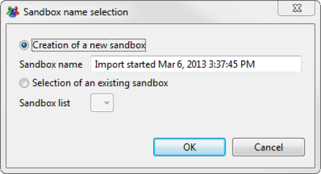

The Cancel button cancels the launch of the collector, while the OK button starts it with the selected sandbox.

##### Debugging

Activate running in debug mode by right-clicking inside the work area of the collector line editor. In the menu 'Debug As', choose 'Collector line' as shown in the menu below:
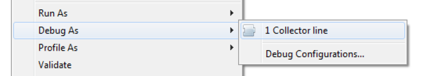

If the execution of the collector line was launched in debug mode, the collector engine reflects breakpoints positioned on the components or in the JavaScript. Breakpoints may be defined at any time, even while the collector line is running, but it is easier to choose the breakpoints before running the collector. In the collector editor, an breakpoint is enabled or disabled through the contextual menu or by double-clicking on a component. An icon representing an insect  appears at the bottom left of the component.
When the collector engine encounters an breakpoint, it asks to switch to a perspective showing the 'Battery runtime', 'Variables', 'Breakpoints' and 'Console' views so it can inspect the current dataset and visualize the route taken among the components. The screenshot below shows the different views in the Debug perspective:
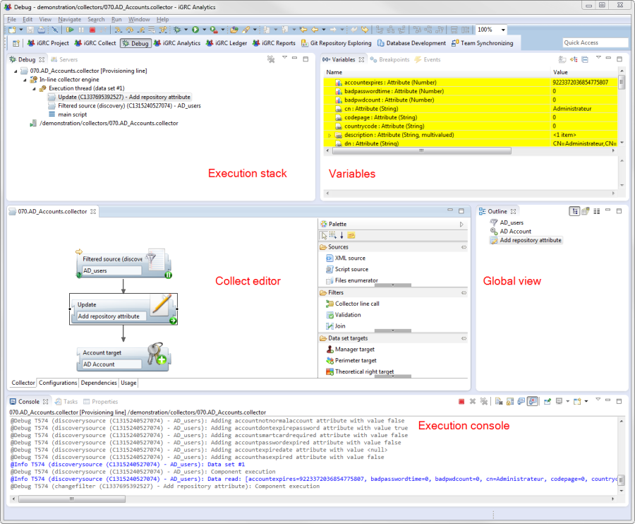

The runtime stack displays the list of components in the reverse order of execution. The first in the component list is always the component that is currently running. The other components correspond to the dataset route starting from the source. The most useful view is probably the Variables view which displays the contents of the current dataset. If an attribute of the dataset has changed in value since the last breakpoint, it is displayed on a yellow background. Finally, the console displays either traces or events in different colors depending on their level, ranging from gray for debug messages to red for errors.

#### Packaging a line as a component

The standard product offers about twenty components. As part of a client project, collector lines are produced, tested, and run. It is very likely that from one project to another, certain parts of collector lines will be reused. Of course, a copy/paste allows you to take all or part of a collector line for use in another collector line.

However, the product provides a more structured method for sharing recurring behavior. The consultant may capitalize from one project to another by packaging a collector line as a component and thus gradually build a complete library of components. All the components created in this way are displayed in the Component Palette of the collector editor and may be used very easily in the same way as standard product components.
Packaging a collector line as a component is very easy, since all you have to do is right-click in the collector line and choose the menu 'Package as a component'. A wizard opens and allows you to choose the title, description and icon. Once the dialog box is validated, the new component is created in the library directory.
But this operation is to be performed only when the collector line to be packaged has been fully debugged and made generic. The whole process to create a reusable component is as follows:

- Creation of a collector line to be packaged: It is important to understand that packaging a collector line covers the whole line and not a selection of components. So you must structure the processes in two collector lines: one line to be packaged, which only contains generic processes, and another line to test the first. The following screenshot shows the collector line to be packaged with a source and a modification component which adds a calculated attribute.

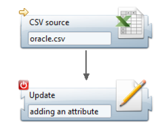

Note that it is important to define a starting point and an ending point, allowing you to specify which source component to execute and which component returns data to the calling line. For now, the path of the CSV file to be processed is directly mentioned in the 'CSV File' parameter of the CSV source component as shown in the screenshot below:

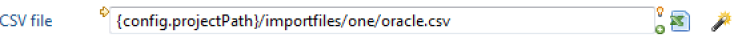

- Creation of a test collector line: This is the second step. To validate the collector line to be packaged, we must create a second one that uses the first one. The following collector line is created with a collector line source component:

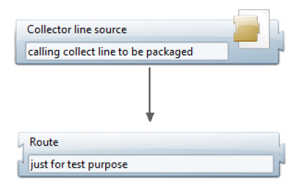

The collector line source component refers to the collector line to be packaged.

- Debugging the two collector lines: The test collector line can now be run in debug mode to verify that it is functioning properly. To this end, a route type component has been placed after the source collector line. This component does nothing, but it allows us to add a breakpoint to follow the dataset content returned by the source collector line.
- Using configuration variables: When both collector lines are working, we must make the filename of the line to be packaged configurable. Otherwise, there is no point in packaging the line since it will be read-only in the intern1.csv file. Configuration variables are used to pass parameters from one collector line to the other. A variable must be defined in the collector line to be packaged and it will be valuated by the test collector line. To do this, you must edit the collector line to be packaged again and create a variable by clicking on the plus button  at the bottom right of the 'CSV File' field. After entering the variable name 'file\_path' and validating the dialog box, the box will close and the 'CSV File' field content is replaced by a macro like this:


The configuration variable must now be valuated by the test collector line. To do this, you must edit the test collector line, select the source collector line component and, in the properties view, Configuration tab, click on the Add button to complete the dialog box as follows:


The two collector lines may be tested again to verify that everything works as before.

- Packaging the collector line: The first collector line is now ready to be packaged. To do so, open the contextual menu in the first collector line with the right mouse button and choose 'Package as a component'. In the dialog box, choose to create a source type component, since the collector line is used as a data source. **Warning:**  the inclusion of the new component only occurs when the studio starts up. You must therefore exit the application and restart it to see the component appear in the palette of the collector line editor.
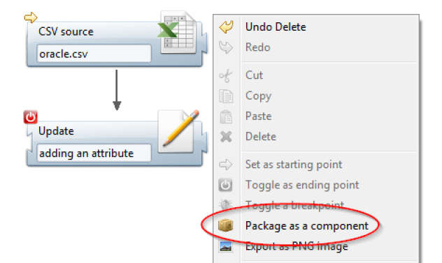  
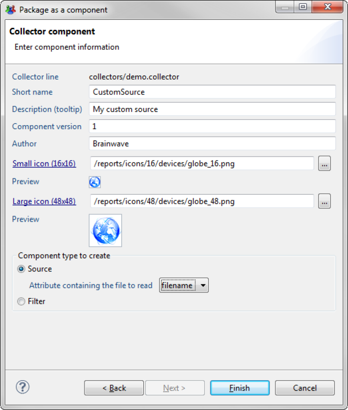
- Test the component in the main collector line: The test collector line may be modified to test the new component. To do this, you must remove the source collector line and drag/drop the new component into the palette. Do not forget to connect the new component to the route component and define the new component as a starting point as shown in the screenshot below:

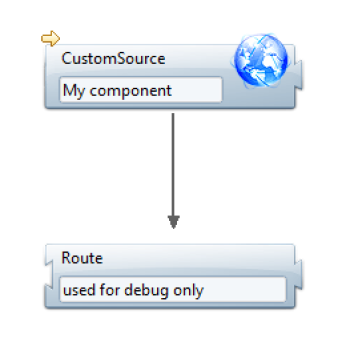

Modifying the test collector line

In the same way, you must edit the configuration tab of the new component's properties to pass on the file name that is defined as a variable. Same method as above, by clicking the Add button and entering the full path for the 'file\_path' variable. Once the dialog box is validated, the table of variables passed to the component looks like this:

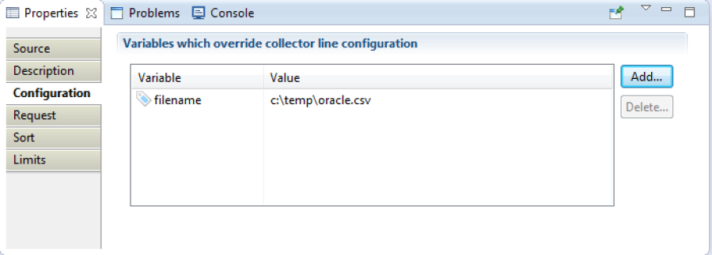

Table of variables passed to the new component

The collector line may be tested again to verify that its behavior is identical.
Note that it is possible to see the contents of a component present in the library directory. If you double-click on it, a window opens to show the dependencies between libraries, an image of the packaged collector line, and the list of variables expected, with their default values.

### Silo Editor

#### Silo Creation

To creating a new silo can be done either by clicking on the new \> silo options of the audit menu:

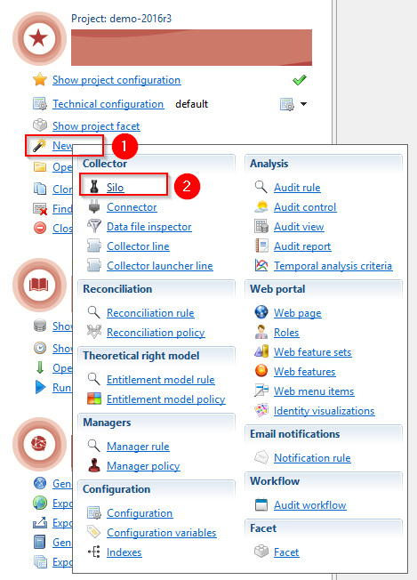

Or by right clicking in the Project Explorer New \> New silo file:  

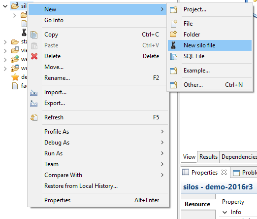

This opens the creation wizard where you have to:

- Name the silo file
- Provide the silo identifier, this has to be unique in your project
- Declare the silo type (see [here](igrc-platform/timeslots-and-execution-plan/collecte-et-silos/dependances.md) for more information)
- Provide a description for the silo (option)


#### The Silo Editor

This silo editor includes different tabs :

##### Silo

The .silo files are separated into three different sections:  

- Silo parameters
- Collector
- Constants for use in collect lines and mapped into dataset  

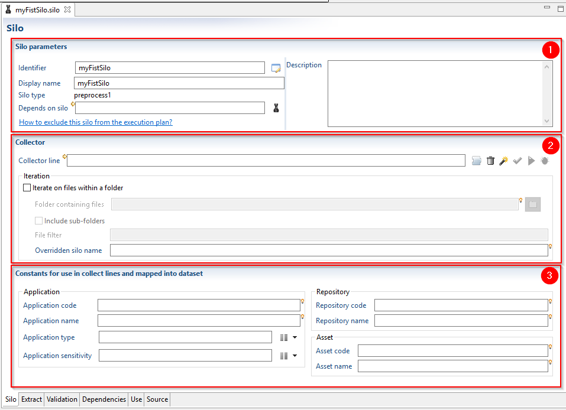

The parameters section provides the information related to the silo. This is where you can configure the dependencies of the silo (see [here](igrc-platform/timeslots-and-execution-plan/collecte-et-silos/dependances.md) for more information).

> It is not possible to change the type of the silo once it has been created.

The collector section allows you to define the collector line associated to the silo. A number of buttons are at you disposal to:

- select an existing collect line
- clear the field
- create a new collect line
- run the silo validation to check the integrity of the loaded data
- run the silo
- run the silo in debug mode

The collector section also allows you to configure if you which to iterate over several files (such as different AD domains which include one import file per domain). Please see [here](igrc-platform/timeslots-and-execution-plan/collecte-et-silos/iteration-collect-and-silos.md) for more information.

Finally, the constant section allows you to declare some fixed constants and/or attributes to map to your targets. Please see [here](igrc-platform/timeslots-and-execution-plan/collecte-et-silos/using-silo-contants.md) for more information.  

##### Extract  

This section allows you to configure your data extraction performed by using the the connector capabilities of the product.  

For more information on Extractors and connectors please refer to the corresponding documentation ([here](how-to/how-to.md)).

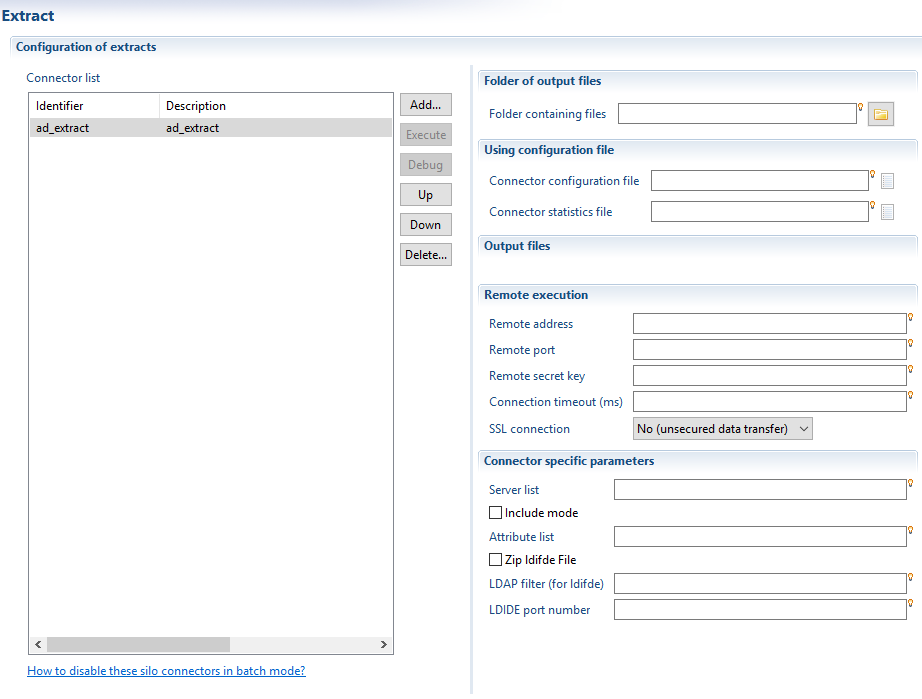

##### Validation  

This tab allow part of the configuration of the automatic data validation.  

> You need to configure validation on the [Discovery](igrc-platform/getting-started/product-description/using-the-editors/discovery-editor/discovery-editor.md)  

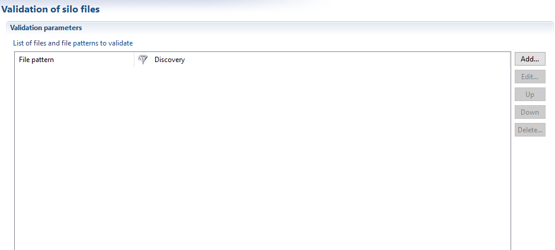

##### Dependencies /usage / Source  

These final tabs that are in common with the other editors allow you to:  

- Find the files that depend on the current silo  
- Find where the current files is used in the project
- visualize the XML source format of the current file

> The calculation of the dependencies and the usage of the current file requires to search the entire brainwave model and can be relatively time consuming.

### Audit Rule Editor

#### Context

The audit rules are located in the _'/rules'_ sub-directory of your audit project. The audit rules carry the extension `.rule`.

New audit rules can be created by copying and pasting the existing rules or by using the Creating Audit Rules Assistant (contextual menu 'New'>'Audit rule'). Your audit rules should be located in the `/rules` sub-directory of your audit project.
To get the best from the functionalities of the audit rules editor, open the '_iGRC Analytics_' perspective.
The audit rules editor looks like this:

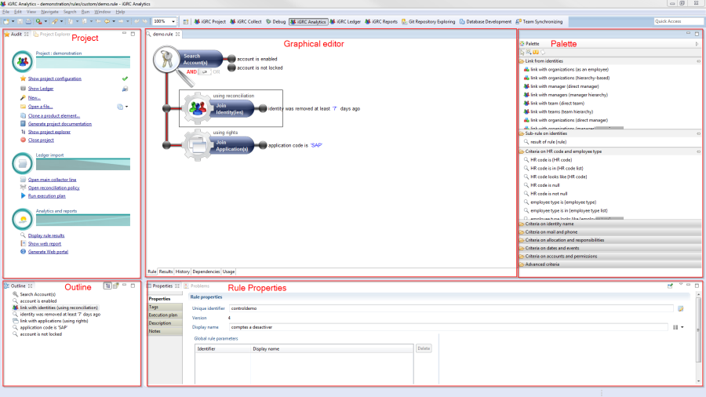

The audit rules editor is made up of the following views:

- Central panel: Graphic editor for creating audit rules
- Right: Palette containing the various available Ledger components for creating the audit rule
- Bottom: Properties of the audit rule area
- Bottom left: Overall view of the components of the Ledger used in the audit rule
- Top left: Project files

#### Available Tabs

The graphic editor for the creation of audit rules is made up of a series of tabs:

##### Rule

Graphic editor for creating the audit rule.  
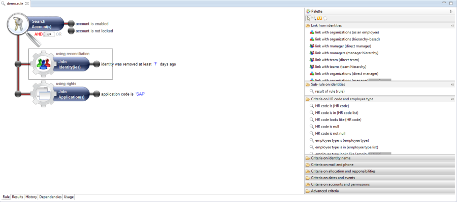

##### Results

Results of the audit rule.  
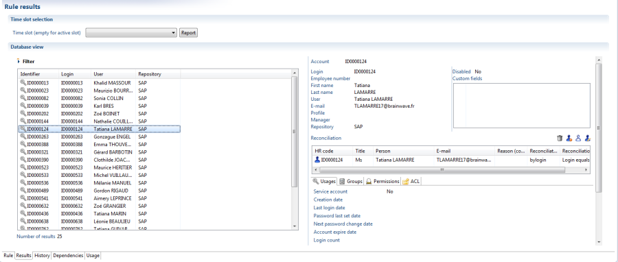

##### History

Management of the history of the audit rule's results.  
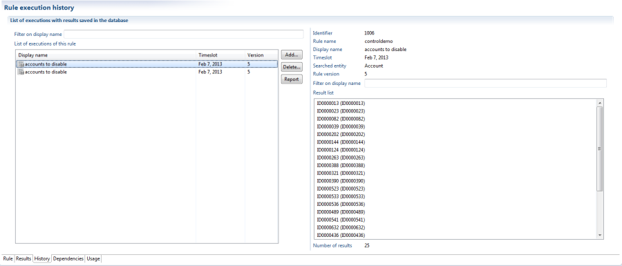

##### Dependencies

List of the rules for the project on which the audit rule relies  
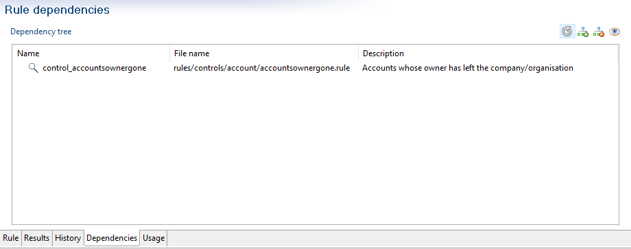

##### Usage

List of the rules, views and reports from the project using this audit rule.  
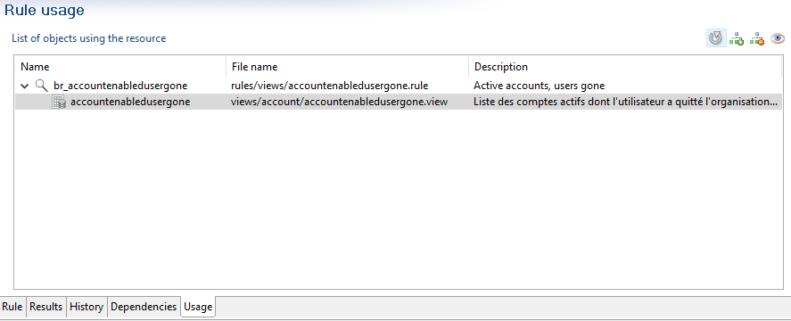

#### Editing a Rule

Adding criteria to the audit rule is carried out by simply dragging and dropping the questions about the attributes of the Ledger from the components palette. Several types of elements can be added to the audit rule:

- Criteria for the chosen concept
- Links from the chosen concept to other Ledger concepts
- Sub-rules of the audit applied to the chosen concept

The rules criteria can have parameters. The parameters can be represented by text in the form of a hyperlink enclosed by the symbols `{}`. Editing a parameter can be performed by double clicking on the hyperlink.

Several types of parameters exist:

- Mono valued text value

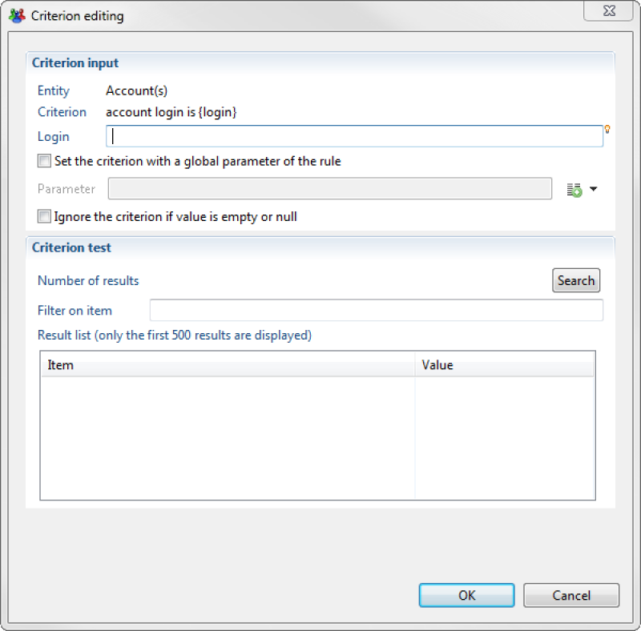

- Multi valued text value

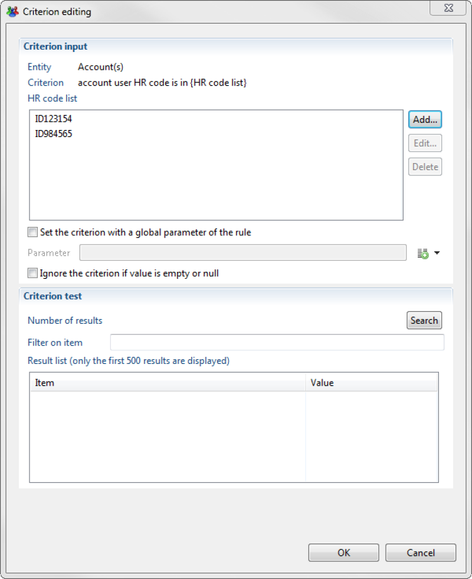

- Numeric value

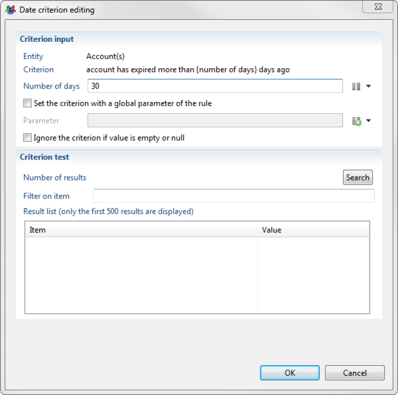

- Date

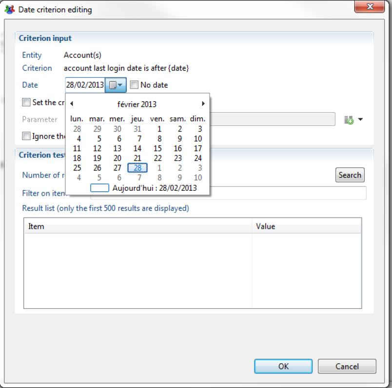

> The contents of the palette of components are subjugated to the selected element in the audit rule editor.

The test values can either be static values or parameters of the audit rule.
The results of the configuration can be tested directly in the parameter editing box with the help of the lower section of the box 'Test the criterion'.  
It is also possible to access an assistant for data entry in text fields by positioning the cursor within the field and pressing the 'Ctrl+Space' keys.  
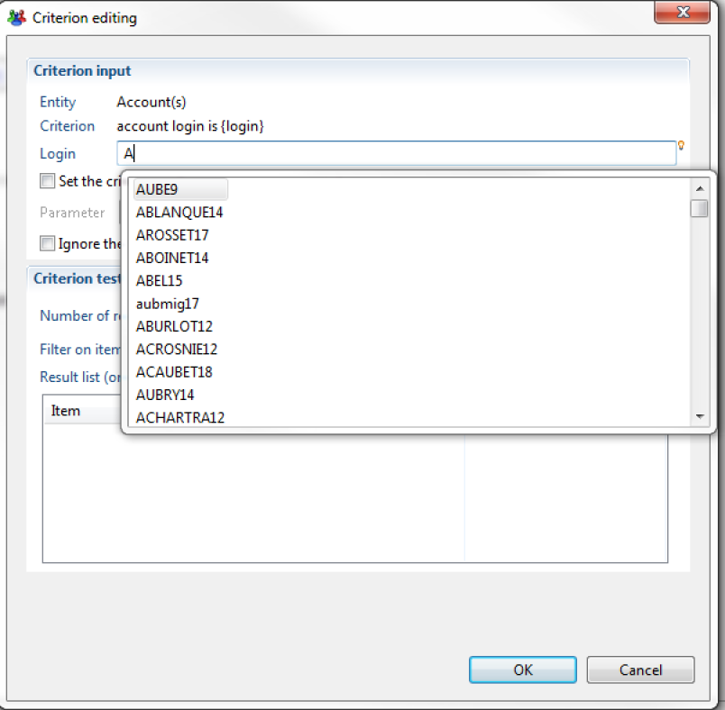

In the case where several rule criteria are applied to a concept, it is possible to choose to apply the grouping condition (AND/OR). This operation is performed by double clicking on the AND/OR switch of the concept or by selecting the contextual entry in the menu 'Change operator between the criteria (AND/ OR)'. The links that follow this concept change colour depending on the chosen operation and thereby allow visualization of the range of the combination: red links for an AND operation and green links for an OR operation.

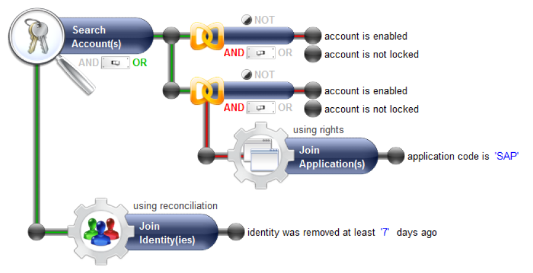  

It is also possible to make sub-combinations of criteria. This operation is carried out with the help of the component of the group of criteria present in the upper section of the palette . To do this simply drag and drop this component into the audit rule editor. The group operator allows AND/OR/NO operations to be performed on the criteria. In the case where the criterion 'NO' is used, the condition is formulated as 'NO OR' or 'NO AND'.

  

It is possible to facilitate the clarification of the audit rules by displaying the intermediate results of the rule. This operation is performed with the help of the contextual menu 'Show/Hide the numbers of results'   . Activating this option displays the number of results returned for each criterion as well as the unit time taken to extract the information from the Ledger.

  

It is also possible to display partial results of the criteria or sub-concepts of the audit rule by double clicking on the criteria text or by double clicking on the sub-concept icon.

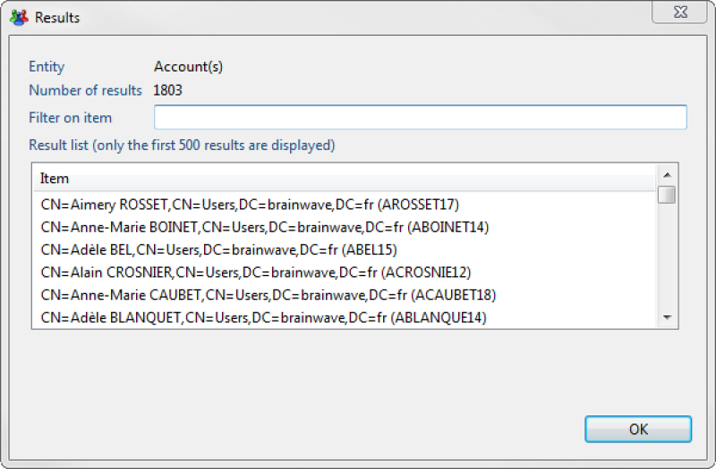  

In the case where links are used between concepts it is possible to configure enumeration constraints. This operation is performed with the help of the contextual menu 'Modify the enumeration parameters' on the sub-concepts of the rule.

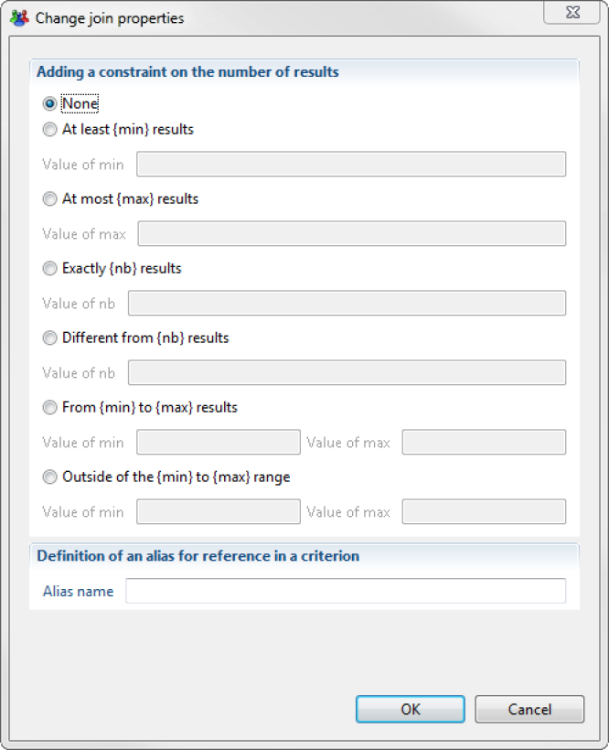  

Once it has been configured, the enumeration will appear in the upper section of the concept.

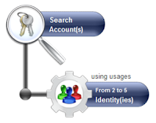  

A 'text' version of the configured rule is accessible through the rule properties editor under the 'Description' tab. Double clicking on the hyperlinks allows the parameters to be edited.

  

### Reconciliation Rule Editor

#### Context

The reconciliation rules are located in the `/reconciliation` subfolder of your audit project. Reconciliation rules have the extension `.reconrule`.

It is possible to create new reconciliation rules by copying and pasting existing rules or with the reconciliation rule creation wizard, in the contextual menu 'New > Reconciliation rule'. The reconciliation rules are located in the `/reconciliation` subfolder of your audit project.
To make the most of the reconciliation rule editor's functions, open the 'iGRC Analytics' view.  
Here is an overview of the reconciliation rule editor:

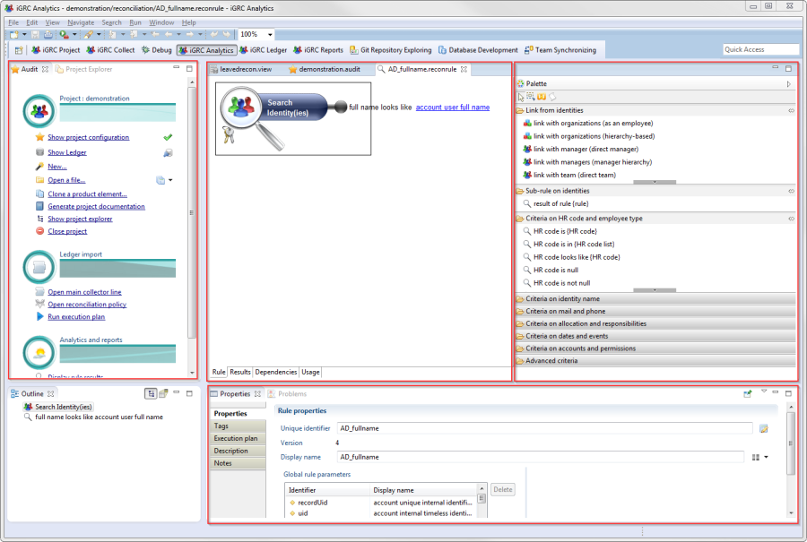  

The reconciliation rule editor is made up of the following views:

- Central panel: Graphical editor for creating reconciliation rules
- Right: Palette that contains the different Ledger items available to create reconciliation rules
- Bottom: Reconciliation rule properties
- Left: Project files

Graphical editor for creating reconciliation rules is made up of a series of tabs.

#### Available Tabs

##### Rule

Reconciliation rules creation graphical editor.  


##### Result

Reconciliation rule result tab. The "**Results**" tab is made up of the following sub-tabs:

- Rule simulation:

Allows you to simulate the reconciliation rule results. It is not possible to perform these actions in the sub-tab because there is still no information entered in the database.  


- Ledger:

Allows you to consult reconciliations that are already found in the ledger and to carry out manual reconciliations on an account.  
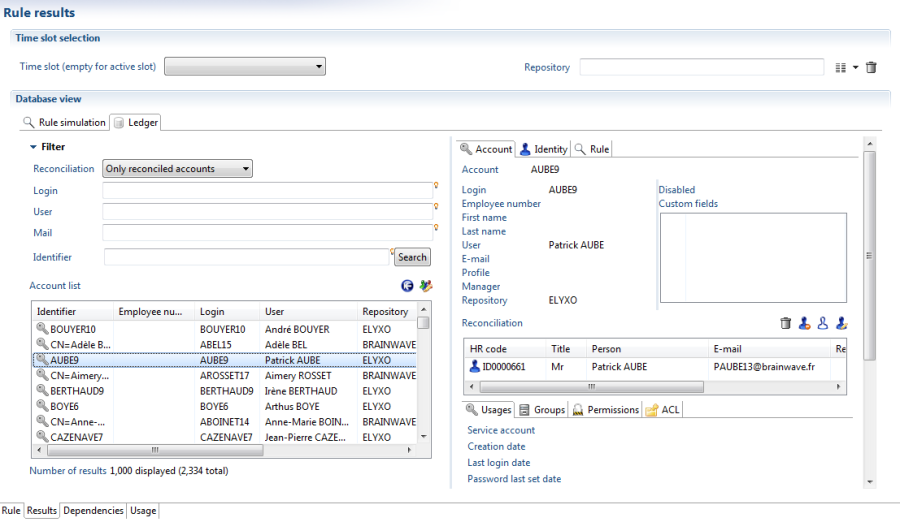

##### Dependencies

List of project rules on which the reconciliation rule is based.  
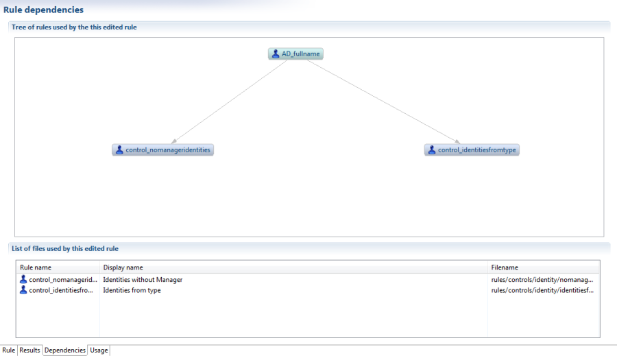

##### Usage

List of project rules, views and reports that use this reconciliation rule  


#### Editing a Reconciliation Rule

The addition of criteria to the reconciliation rule is done by simply dragging and dropping Ledger attribute questions from the item palette. Several types of items can be added to the reconciliation rule:

- Selected concept criteria
- Links from the selected concept to other Ledger concepts.
- Selected concept reconciliation sub-rules

Reconciliation rule criteria have parameters. These parameters are represented by text in the form of a hyperlink enclosed in curly brackets `{}`. A parameter can be edited by double clicking on the hyperlink. Please consult the 'Audit rule editor manual' for more information about the types of parameters that exist.

> The content of the item palette is controlled by the item selected in the reconciliation rule editor.

### Audit View Editor

#### Context

Audit views are found in the `/views` sub-folder of your audit project. Audit views have a `.view` file extension.
It is possible to create new audit views by copying and pasting existing views or via the Audit View Creation Assistant (contextual menu 'New' > 'Audit View'). Your Audit Views must be located in the `/views/custom` subfolder of your audit project.
To make best use of the functions of the Audit View Editor you can open the 'iGRC Analytics' display. The Audit View Editor is displayed as follows:
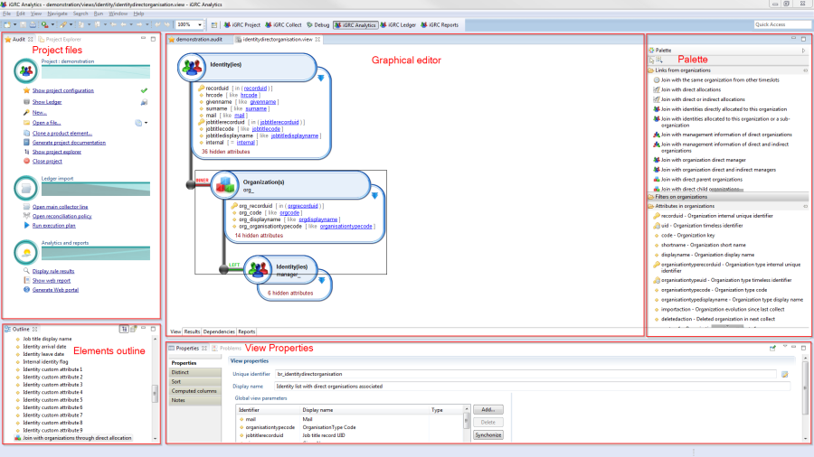<br>
**_Audit View Editor_**

The Audit View Editor can be broken down into the following views:

- Central panel: Graphical Audit View Editor
- Right: Palette containing the elements of the Main Ledger available for Audit View creation
- Bottom right: Audit View properties
- Bottom left: Summary of the Main Ledger elements used in Audit View
- Top left: Project folders

The graphical Audit View Editor consists of a series of tabs.

#### Available tabs

##### View

Graphical Audit View Editor to create and edit views.  


##### Results

Results of the Audit View.  


##### Dependencies

List of the project rules that underpin the Audit View.  
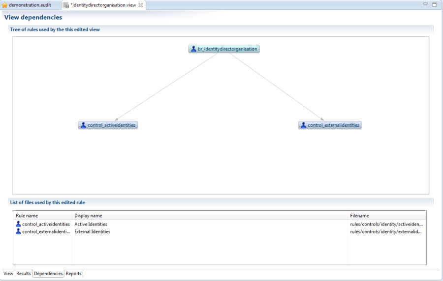

##### Usage

List of objects using this Audit View.  
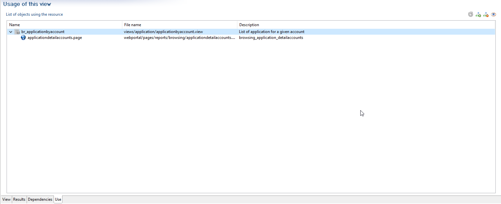

#### Editing a View

Elements are added to the Audit View by dragging and dropping elements from the Main Ledger to the toolbox. Several types of elements can be added in the Audit View:

- Attributes of the selected concept
- Links between the selected concept and other Main Ledger concepts
- Audit rules applied to the selected concept

> The content of the toolbox is subject to the element selected in the Audit View Editor.
>
> It is also possible to add time-based attributes to the concept in the root of the Audit View.
>
> Attributes that are merely linked to concepts are hidden by default in the View Editor to improve the readability of complex views. You can hide or un-hide these attributes by double clicking on the  icon. The number of hidden attributes appears in red at the end of the concept.

Labels of attributes are editable by double clicking on the attribute or via the 'Edit Attribute Properties' contextual menu.  
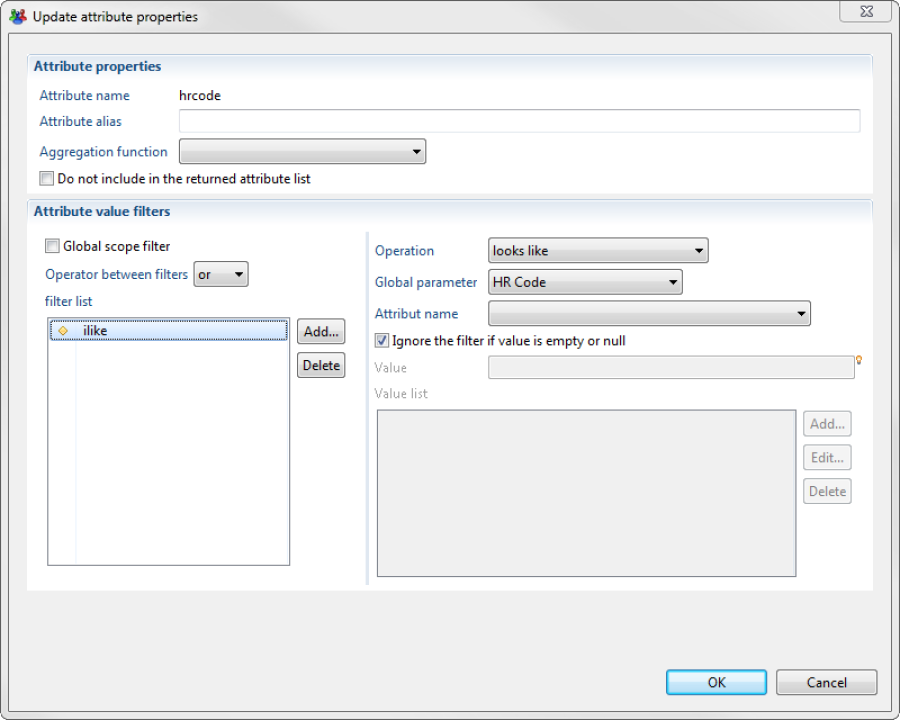

Attributes may be masked from the results table. This is particularly useful when the user wishes to apply a filter to an attribute, without this attribute affecting in turn the multiplicity of the results returned.
This operation is carried out by checking the 'Do not include in the list of attributes returned' in the editing window of the attribute's properties.  
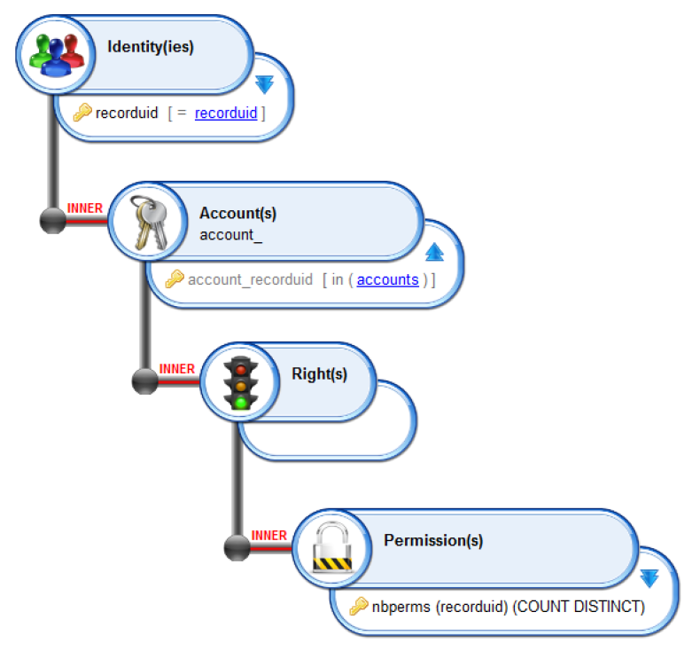

A prefix may be added to all attribute names in a view by double clicking on the concept icon in the graphical editor, or via the 'Modify table prefix' contextual menu.  
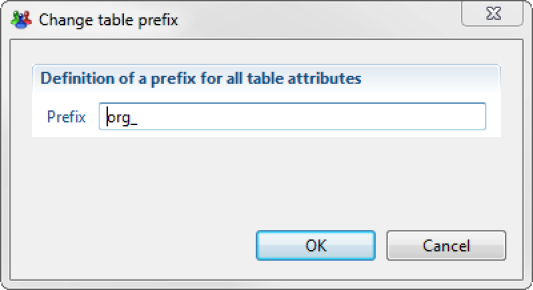

All attributes of a concept may be added via the contextual menus:

- **Add all standard attributes:**  Adds all the concept's attributes, except custom attributes ('custom') and those relating to ad-hoc naming ( **'refvalue'** )
- **Add all attributes** : Adds all the concept's attributes, including custom attributes ( **'custom'** ) and those relating to ad-hoc naming ('refvalue').
- INNER: '[inner join](http://en.wikipedia.org/wiki/Join_%28SQL%29#Inner_join)' between the Audit View Concepts
- LEFT: '[left outer join](http://en.wikipedia.org/wiki/Join_%28SQL%29#Left_outer_join)' between the Audit View Concepts

Finally, it is possible to change the multiplicity of relationships between the Concepts used in the Audit View by double clicking on the text over the links.

### Report Editor

To make the most of the features of the report editor, open the 'iGRC Reports' perspective. The report editor looks like this:

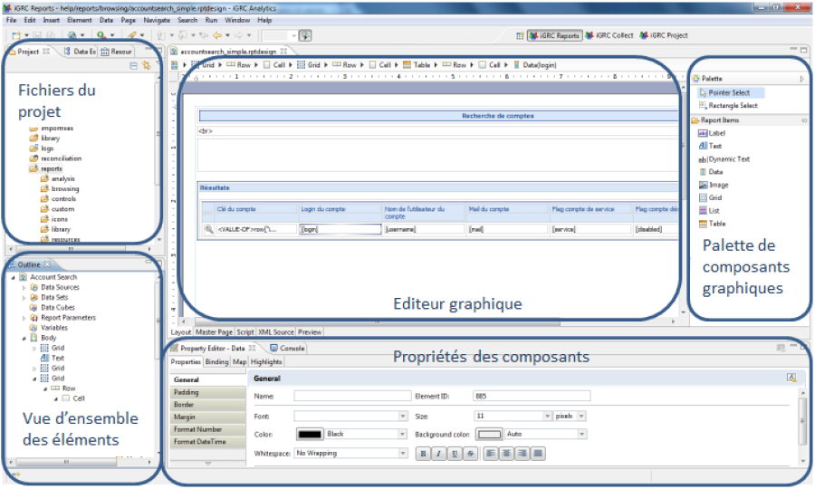

The report editor consists of the following views:

- Central panel: Graphical editor for report layout
- Right: Palette containing the various chart elements available for reports
- Bottom: contextual properties area, associated with the selected item in the graphical layout editor
- Bottom, left: Overview of elements used in the current report
- Top, left: Project Files

The area at the top left contains two additional tabs, these tabs are:

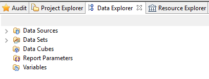

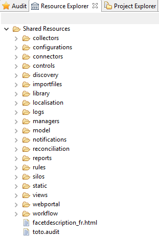

- Report data configuration area: Allows you to configure access to the data of the identity ledger from the report, as well as the various parameters it is possible to pass to the report
- Share resources selection area: Allows you to select shared resources to use in this report

The graphical editor of the report layout consists of a series of tabs (Layout, Master Page, Script, XML Source, Preview). The tab that is useful initially is the Layout tab for graphical editing of reports.

It is possible to preview the reports while clicking the 'View report' button on the Brainwave Identity GRC Analytics toolbar, choosing "In Web Browser".

> If you're using Internet Explorer 11, please follow [those directions](how-to/misc/IE-11-preview-errors.md).|

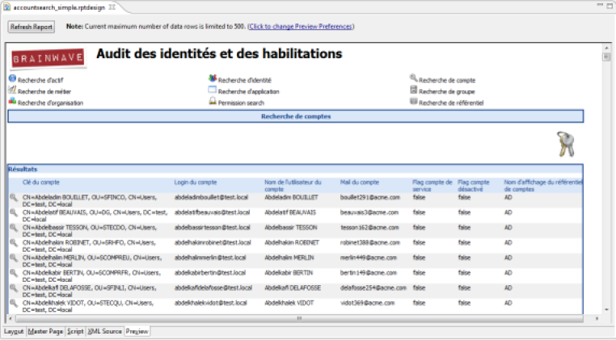

Reports can be run and generated in multiple formats. To do this, use the 'View report' button on the Brainwave Identity GRC Analytics toolbar. Supported formats are:

- HTML
- PDF
- Postscript
- Microsoft Word
- Microsoft Excel
- Microsoft PowerPoint
- OpenDocument Text
- OpenDocument SpreadSheet
- OpenDocument Presentation

It is also possible to export the parts of a report in CSV format.

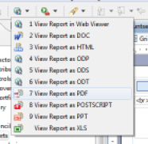

#### Viewing Interface

When you use the 'View report' button on the Brainwave Identity GRC toolbar, or when you use the Brainwave Identity GRC web portal, you can access the web interface for viewing reports. This interface dynamically generates reports in HTML format as the user browses. The report settings may be dynamically edited; it is possible to export the information presented in various formats, and to print. It is also possible to dynamically change the report settings and regenerate it. Finally, the reports are formatted: A table of contents can be generated, and the display is paginated. This chapter describes the user interface of the report viewer.

The report viewer consists of a central window which displays the report, as well as a toolbar allowing many actions: navigation, exporting, printing, and configuration. The reports are dynamically generated in HTML format. Hyperlinks are included in the report, allowing the user to navigate between reports in the same way as in a traditional application.

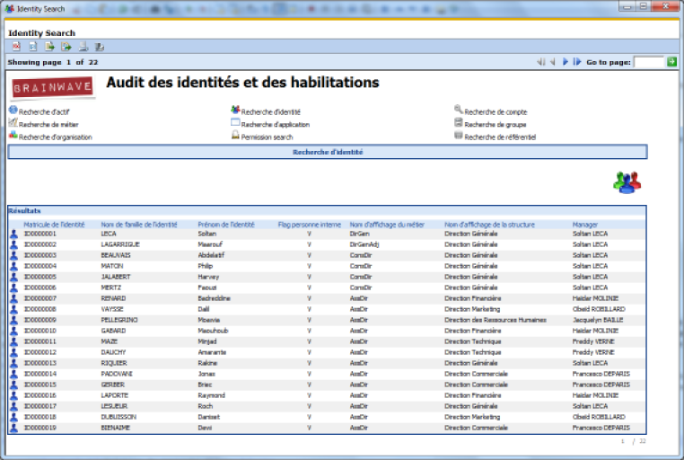

The upper part of the report viewer consists of the following toolbar:


- Table of Contents: Displays the contents of the report on the left side of the report, in the form of a series of hyperlinks providing direct access to relevant parts of the report. Please note: not all reports have tables of contents
- Report Settings: Allows you to dynamically change the settings of the current report. This interface is particularly useful in research and analysis reports. Changing report settings triggers the generation and display of a new report.

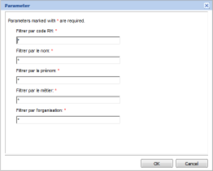

- Export a part of the report in CSV format: Allows you to export a part of the report (list, table) in CSV format so you may use it in a third-party tool. The export uses a configuration box allowing you to select the part of the report to export, the columns to export, and the format in which to export

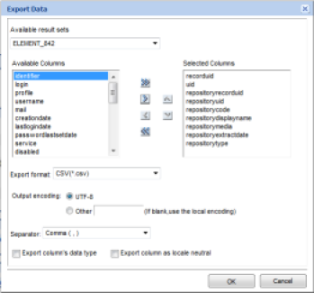

- Generating the report in a different format: Allows you to generate and download the current report layout locally in a different format (PDF, Word, Excel, ...). An export interface allows you to select the export format and layout options of the report when it is created

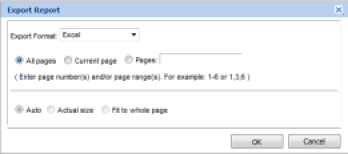

- Printing the report on the client's computer: Starts printing report locally. Two print options are available: Creation in HTML format suitable for printing, or report creation in PDF ready for printing


- Printing a report on a server printer: Allows you to print the report with the help of a printer configured on the server hosting the Brainwave Identity GRC web portal. This feature is particularly useful when the client navigation interfaces do not have a local printer configuration

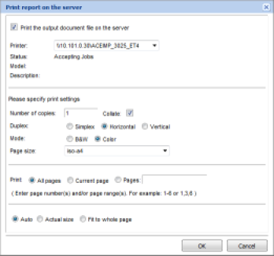

- Current page and number of pages in the report: Displays the information related to the report's pagination. To optimize the display, reports are paginated. If the report consists of several pages, use the buttons on the right side of the toolbar to navigate through the report. Another alternative is to use the table of contents if the latter is present
- Navigation in the pages of the report: Allows navigation through the paginated report if it consists of several pages
- Direct access to a page of the report: Allows you to access a specific page of the report

#### Create Dedicated Reports

All reports available in Brainwave Identity GRC are located in the `/reports` subdirectory of your audit project. Reports are sorted according to whether they are related to navigation or to data analysis. Reports have the extension: `.rptdesign`.

Dedicated reports may be created either by performing an operation to copy/paste an existing report in the file view of the project, or through the wizard to create new reports. Dedicated reports must be located in the `/custom` subdirectory of the `/reports` directory of your project.

### Configuration Editor

#### Introduction  

The aim of the configuration file is to help separate between what belongs to the project configuration and what is specific to a local instance of Brainwave GRC (_e.g._ database configuration, absolute paths etc).

This also has the further advantage of preventing data loss when your local configuration or project file gets overwritten. This can occur if you share your project using a version management tool for instance.  

It is also now possible to maintain several configurations concurrently, edit them, share them, even prepare configurations that will not be used locally (like a production configuration for example).  

Finally, all the local configuration is now grouped within a single file. This allows the user to review all the information in a dedicated editor instead of having to browse scattered properties files ; namely, this file will hold the configuration for the database connection, the mail server, the web portal, the workflow database and values for the project global variables.

You can select, create or clone a configuration using the the audit menu:  
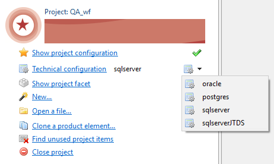

The configuration files must all be located in the configurations folder of the project (in the project explorer).

Here is an overview of what the configuration editor look likes:  
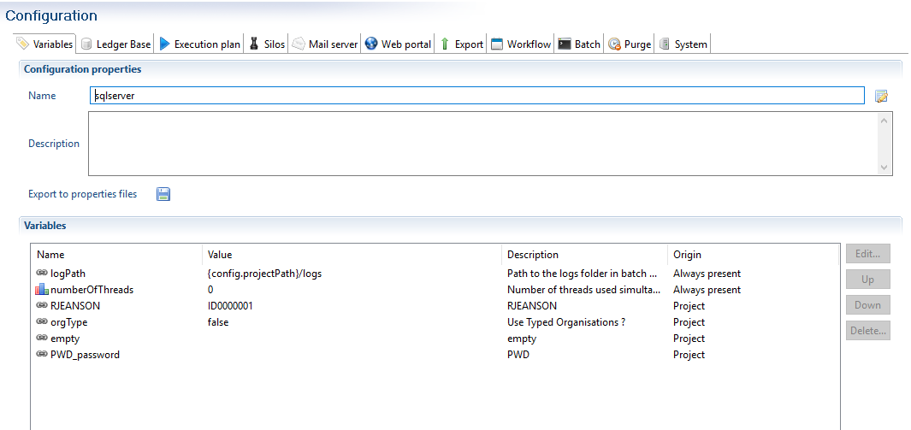

#### Migrating From Previous Versions

If you have been using a version prior to 2015 R1, you might notice that the features that were once included in the project configuration have now been moved to the configuration editor.

This is the case for the database configuration. It is no longer available as a tab in the project file. This is the reason why **it is imperative that you take the steps to migrate your project** , otherwise you won't even be able to connect to the database. Fortunately, this is quite easily done.

The first time you open your project in the main menu, you will be prompted to create a new configuration from the existing files.
Alternatively, you can manually migrate your projects configuration manually. Navigate to the "Project" tab of your project configuration. A new option "Migrate old project configurations" is now available, which when clicked will examine your previous configuration and will create as many configurations as were defined for the global variables, and automatically select the default configuration as the current one.

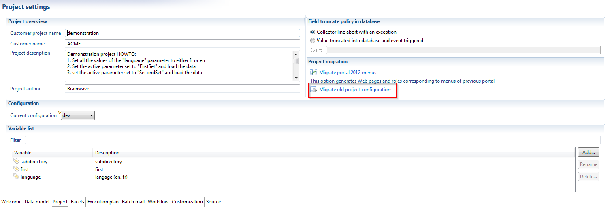

The active configuration can be selected in the "Current configuration" combo.  

#### The Technical Configuration Tabs  

##### Variables

This tab contains all project variables. These can be defined directly within the project tab of the project configuration or using the `.configvariables` files.
Those variables will then be available in every .configuration file, where specific values for those variables can be edited.

> All variables whose name contain "password" (in a case insensitive manner) will be considered as passwords, and will automatically be encrypted.

##### Ledger Base  

The ledger base tab allows the user to configure the connection to the ledger database (iGRC).

This tab allows you to:

- Create update or modify the connection profiles to the database
- Manually update the statistics of the database
- Define the database as a 'Production database'. This removes the possibility to delete the data loaded in the database
- Initialize ore re-initialize the database by deleting all the data
- Create the project indexes (see the corresponding documentation for more information)

The connection parameters corresponding to the selected database configuration are displayed on the right hand side of the top section.

In the bottom section of the tab the user has the possibility to manually edit the connection parameters to the database.
This is especially useful if you want to prepare a configuration while not having direct access to the database that will be used.


##### Execution Plan Configuration  

The execution plan tab includes all parameters relating to the execution plan.

> The execution actions, either a global or step by step run, are still located in the project configuration.

These parameters are separated into 3 different sections:

###### The Configuration of the Execution Plan Steps

This allows the user to configure the name of the executed timeslot. However, This name must incorporate a date parameter to be taken into account when launching the execution plan in batch mode. The temporal criteria can be selected by using the selector on the right of the field.

This section also allows the user to define:

- The rule listing the active identities to use during the execution plan
- The reconciliation policy to use during the execution plan
- The manager policy to use during the execution plan
- The entitlement policies to use during the execution plan

###### The execution Plan Options

This section allows the user to define which additional steps are executed during the execution plan.

- Continue if an error occurs in the collect step

This allows the product to systematically finish the data collection phase. If an error occurs, they are logged into an event file, without influencing the process of the data collection phase.

- Run temporal analysis criteria automatically

This option allows the temporal criteria to be saved to the database if the temporal criteria definition option 'Include in the execution plan' has been checked.

- Run rules automatically

This option allows the rules to be saved to the database if the temporal criteria definition option 'Include in the execution plan' has been checked.

- Run controls automatically

This option allows the controls to be saved to the database if the temporal criteria definition option 'Include in the execution plan' has been checked.

- Run identity visualization automatically

This option allows the identity visualization to be saved to the database if the temporal criteria definition option 'Include in the execution plan' has been checked.

- Automatic update of the database statistics

This option allows the database the update it's statistics during the execution plan. This action may be useful to optimize the SQL queries if the database contains a large number of records.

- Rebuild table indexes concerning activation

This option allows the product to automatically rebuild the indexes during the execution plan. The targeted tables are only those containing the historical data. This option should be used to optimise the data collection and activation phases of the next data loading phase as well as the response times when browsing the history of data.

This operation takes place during the execution plan, after the calculation of controls.

> The time spent rebuilding the indexes is dependent on the number of timeslots and the volume of loaded data. As a result, this phase can be time consuming.
>
> If a limited time is allocated to the data loading phase, please check that the systematic use of this option does not result in an overshoot of the maintenance window.
>
> If possible please use this option systematically as it greatly reduces the response times of the database.

- Rebuild table indexes concerning the portal tables

This option allows the product to automatically rebuild the indexes during the execution plan. Only the portal tables (current timeslot) are concerned in this case. This option should be used to enhance the user experience in the portal by reducing the query response times.  
This operation takes place once the timeslot has been validated

> This phase is not very time consuming as the rebuild action of the indexes is only performed on a subset of tables.
>
> It is recommended to use this option to reduce the database response times when navigating in the portal and enhancing the user experience.

- Automatic validation after comparing the dataset with the previous one

This option allows the automatic validation of the timeslot if the validation controls defined in the following section do not detect any arrors

###### The Comparison with a Previous Timeslot

When the option to automatically validate the timeslot after comparing the collected data with the previous data is selected. The comparison rules are defined in this third section.

A number of predefined rules are available but it is possible to create customs rules specific for your project.

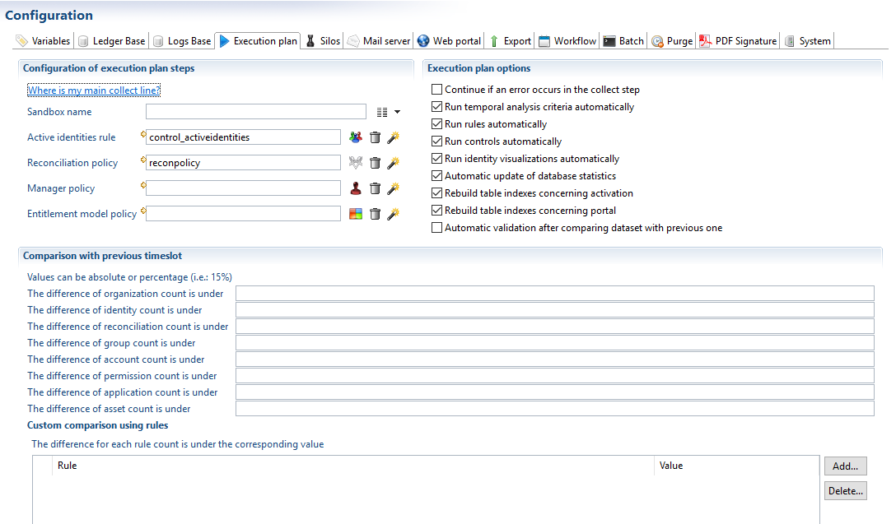

> When migration from a version of the product that does not include the silo concept it is possible to create a 'default' silo by clicking on the link 'Where is my main collect line?'  
> Using this option creates a unique silo that emulates the use of the unique collect line.

##### Silos Configuration

The 'Silos' tab displays the list of all the silos defined in the project. There are two actions available in this section:

- Choose which silos will be included in the execution plan.
Please note that by default all silos will be included in the execution plan. It is, however, possible to exclude certain silos from the execution plan. For instance test silos that are not yet in a production stage, or conversely well tested silos that are excluded in dev environments to speed up testing and collecting other silos.
- The behavior on error when silo validation fails on one or several input files, either terminating the whole data collection (by default) or continuing without the invalid silo.
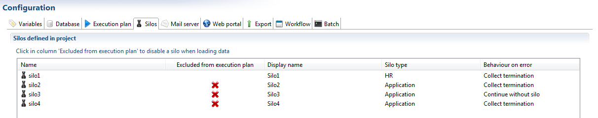

##### Mail Server Configuration

The email server configuration is quite straightforward, but there is a checkbox that will avoid sending any email (the emails will however be computed, and thus the possible errors will occur).  
You can also test the connectivity of the mail server, and send a test email to check connection parameters are all correctly set.  


In the above snapshot, all emails sent by the portal, the workflow or the notify rules will be prefixed by [Brainwave] in the subject. This allows the user to change the prefix of the project without having to edit each notify rule.

A black list is now part of the configuration. You can specify several email addresses separated by a coma. These recipients will never receive an email from the product.

This feature is often used to avoid sending emails to the president or C-level employees within the company when rules are used to select candidates for workflow tasks.

> The prefix, blacklist and test options will only function within notification rules, not in the mail sent at the end of the execution plan.
>
> In the case of a workflow the recipient will not receive the associated email, however the task will be present the their "inbox" in the webportal.

A test mode has also been implemented.
If you wish to test a workflow process with real data, the real email addresses will be used by the workflow engine as they are found in the Ledger. To prevent the product from sending emails everybody while performing your test, you can specify one (and only one) recipient who will receive all the emails sent by the product. This way, you can check that the process has sent all the expected notifications by reading the mailbox of this unique recipient. The real recipient emails are however lost, replaced by the unique recipient.
It is also possible the check the original list of recipients. You can check an option to add a text file as an attachment. This text file contains the list of real email addresses initially found in To, Cc and Bcc fields.

The property `mail.splitsize` should be set with the size limit of your mail server. If the product needs to send a message with several attachments with a total size greater than this limit, it will split the message in several ones to keep each message under the limit.

In version 2016 R3 SP13 a new parameter, `mail.maxmailsbysession`, has been added that allows the user to configure the maximum number of emails sent by session. By default this value is set to 0 which corresponds to an unlimited number of emails.

> [!warning] Note that this feature is only used to dispatch attachments in different messages but it does not cut, truncate or split a single attachment into several pieces.

##### Web Portal  

The web portal configuration is very extensive, but the properties that you will most likely need to change have been highlighted in the "General parameters", "Date and time format" and "Display" sections.  
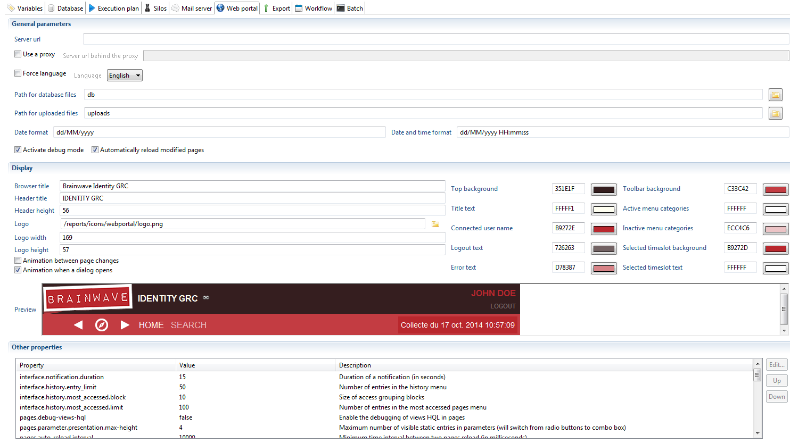

##### Export  

The configuration of the web portal application (`.war` file) is defined in the 'Export' tab of the configuration.
This helps store the options used to export the application, which means that once it is set you can use the web portal generation as many times as you want without having to remember the right settings. It is also possible to have different settings for each configuration, and thus each environment, which can be quite handy.

Aside from the application name, you can choose to embed the project inside the archive or conversely to have it separated, either at the current studio location or in a given folder. The same applies to the folder holding the license, and optional overriding properties files as well as the location of the webapps workspace.  

A notable option is the possibility to very easily set up a standard JNDI data source, which will bear the same name as the web application itself. The disk button generates the additional configuration file that has to be dropped inside the Tomcat container. There is no additional setup required, which is why we recommend to use this option as a best practice whenever possible.  

> [!warning] If "Use a JNDI data source" is enabled, you will have to configure an other technical configuration and choose it when you will run the Execution Plan (batch) or execute a `igrc_notify` batch.


For more information on the configuration of the webportal please refer to the corresponding documentation:
[Brainwave's webportal](igrc-platform/installation-and-deployment/brainwaves-web-portal.md)

##### Workflow Configuration

In addition to the workflow database settings, the workflow configuration holds two interesting options to help debugging the processes:

- It is possible to execute all processes in a a non-persistent database held in memory, which can help save the time needed to set up a database, and cleaning it up regularly while implementing new processes. It goes without saying that it remains crucial to test the processes in a real database when they are ready enough.
- A special option helps tinker with the timers, to the effect described [here](/docs/how-to/workflow).


##### Batch Mail Configuration

The batch mail settings, which existed previously in the project editor, have been moved to the configuration, so that there can be a different mail sent for each configuration.


##### PDF Signature Configuration

This functionality allows the user to activate and configure the signature of PDF files issued from workflows (i.e. the compliance reports) and attached in mail notification. This functionality has been implemented for security reasons to verify that the produced reports are not tampered with.

> PDF files exported for pages and reports using the export to PDF option will not be signed.

The configuration is done in the tab detailed below:  
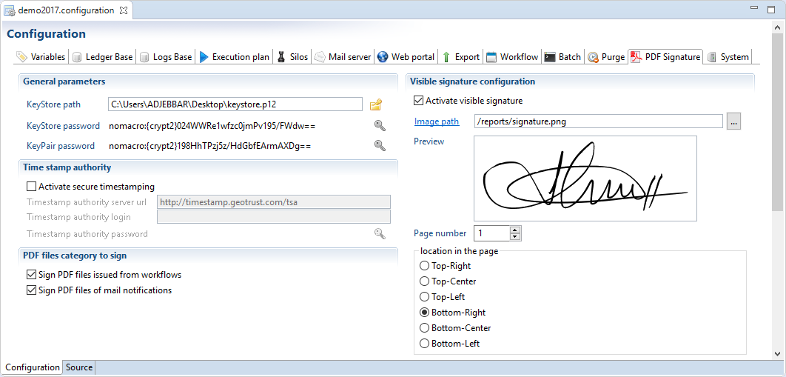

- **KeyStore path:** The path of the keystore file containing certificate
- **KeyStore passsword:** The password used to unlock the keystore
- **KeyPair passsword:** Pin code protecting the private key
- **Activate secure timstamping:** Activates a secure timestamping. It is necessary to configure a timestamp authority provider  
- **Timestamp authority server url:** The url of timestamp authority service  
- **Timestamp authority login:** The username used to log into timestamp server
- **Timestamp authority password:** The password used to log into the timestamp server
- **Activate visible signature:** Activates a visible signature in PDF files
- **Image path:** The image to use in the PDF file
- **Page number:** The page number that will contain signature image
- **Location in the page:** The location in the page where to include the signature image  

#### Exporting and overriding properties

Having a single configuration file can prove inconvenient, as it will need to be updated regularly from various persons.

For instance, if there is a policy enforcing that passwords are changed on a regular basis, the database, the mail server and the workflow database will have their password changed, probably by different people, who only need to know the information pertaining to their specific task. Furthermore, editing an XML file is not always easy if you have to do it remotely without the help of a dedicated editor.

This is why the `datasource.properties`, `mail.properties`, `config.properties`, `workflow.properties` and project.properties (for the global variable values) files are still active, and will override the selected configuration.

You can generate them from a given configuration using the "export to properties files" option in the configuration editor.  
This will create files with minimal key settings, so that they can be edited and updated separately from the rest of the configuration.
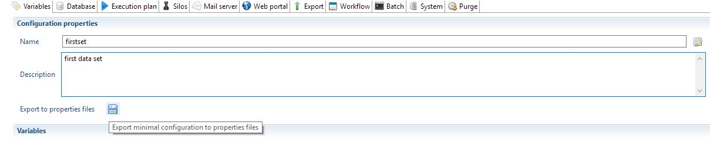

These properties are not taken into account in the studio, where only the active configuration file will be used.
