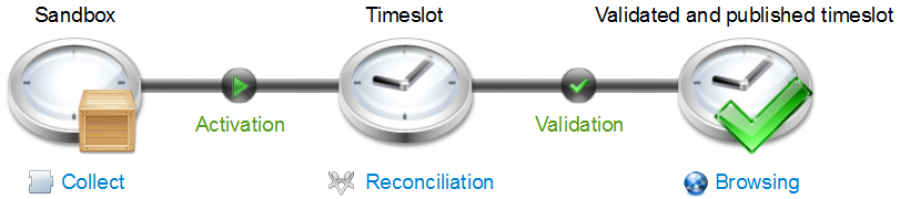

# Time Management: The Lifecycle of Timeslots

Correct time management is an essential feature of any management tool. Whether for reasons of traceability, retrospective audit, or operations management, time management is a core concept.  
The Brainwave Identity GRC solution features fully integrated time management. Brainwave Identity GRC works like a camera, taking a complete and detailed snapshot of users and the information system at regular intervals. It is thus possible to:

1. Navigate and analyze any snapshot whatsoever;
2. Identify the changes that have taken place between snapshots.

This is set out in the article relating to the Brainwave data model.  
To create a more customizable solution, each upload is not directly related to a user-accessible "snapshot" but rather the snapshots follow a lifecycle during which users may add to them, refine them or delete them prior to their final publication on the portal.  
This lifecycle is crucial to ensure that the data published in the Identity Ledger meets the standard for analysis and validation purposes.  
The "snapshots" are known as "analysis periods" or "timeslots" in the Brainwave Identity GRC.

## Timeslot Lifecycle

The lifecycle of a timeslot is closely linked to the sequence of operations needed to upload data into the Identity Ledger:

1. The data is prepared in a temporary area of the IdentityLedger, also known as the "sandbox":
    1. This operation is carried out during the data collection stage;
    2. Referential integrity is not necessarily maintained in the sandbox (e.g., organisations with no parent as yet can exist, etc.);
    3. The sandbox can be deleted to restart processing or to create multiple sandboxes simultaneously for test purposes;
    4. Information presented in the sandbox can be increased by means of multiple uploads (running of a first data stream, followed by a second, on and so on);
    5. Analytics functions, such as analysis rules, validation, account reconciliation, reports and the web portal, cannot be used in sandbox mode;
    6. Only limited views of the data are available from the "IdentityLedger" interface of Analytics. In particular, it is not possible to view account/permission relationships.
2. Data is loaded into the IdentityLedger and then placed into a quarantined state, known as "data activation":
    1. Once this operation has been completed, referential integrity checking is implemented (so that parent: child links are confirmed, etc.);
    2. It is no longer possible to add to the information presented in the analysis period with new accounts, new applications, or the like;
    3. Nevertheless, an activated analysis period may be deleted;
    4. It is possible (but strongly discouraged) to make use of several activated timeslots at the same time;
    5. It is possible to use analysis functions on an activated analysis period, such as audit rules, validation and portal access;
    6. It is possible to work on the reconciliation of accounts as well as to save the results of audit rules and controls for the analysis period;
    7. This information is only available to a limited group of people:
        1. Users with access to Analytics;
        2. Users with specific role permissions in the web portal (TSEXTENDEDACCESS)
3. Data is validated in the Identity Ledger
    1. Once this operation is complete, the analysis period is locked and becomes read only
        1. It is no longer possible to change the reconciliation, the results of audit rules or audit validation;
    2. It is no longer possible to delete validated timeslots; the only functionality still available is to hide the timeslot
    3. When several timeslots are validated consecutively, only one timeslot is considered "current": other timeslots are given an "old" status. All timeslots remain accessible; the only difference between current and old timeslots is that the current timeslot is the default timeslot used for analysis and mapping.

This is illustrated by the following diagram:

These operations are carried out systematically when the upload is done stage by stage, globally with the implementation plan, or automatically (for instance with scripted weekly uploads).

## Timeslot statuses

### The Sandbox

The concept of the "sandbox" is useful when data is being uploaded into the Identity Ledger.  
It is possible to modify the data in the sandbox by running successive data streams, with objects already in place being automatically updated if new attributes are added.  
It is possible to work with multiple sandboxes to carry out different tests. Sandboxes do not take into account other timeslots.  

### Activated Timeslots

 (to be filled in)

### Validated Timeslots

A validated timeslot is a timeslot that has been published on the portal.
One final stage is carried out upon validation:

- The deletion attribute of the object (deletedaction) is updated for the previous timeslot. A validated timeslot is read only and as such validated data can no longer be changed in any way, nor is it possible to delete validated timeslots. This is due to high standards of traceability and integrity for the data, because:
- Data is used to consolidate customer flags and also action plans, which should not be developed after the fact, as these customer flags and action plans are intended to be used by operational teams;
- Third party auditors may require evidence that the data has not been deliberately misused within Brainwave Identity GRC.

Validated timeslots are visible to all portal users.

When multiple timeslots are validated successively, they may have one of two statuses, depending on the situation. The latest timeslot to be validated becomes the current timeslot. This is the timeslot that is used in the Portal and Analytics by default; other timeslots are given the old status, which means that they remain accessible in the Portal and Analytics if they are selected from the GUI.

### Hidden Timeslots

A hidden timeslot is a timeslot that has been deliberately hidden by the solution administrator. It may be useful to hide a timeslot if it contains multiple errors and is unusable in practice.

It is not recommended to hide an old timeslot as time-based attributes are not recalculated (actionchanged, etc.) Reports that consolidated historic information may therefore generate inconsistent results. Hiding a timeslot is therefore only suitable for the current timeslot.

### Dates Applicable to Timeslots

Each timeslot has multiple dates:

- Data upload date: Corresponds to the date the sandbox was created
- Data activation date: Corresponds to the date the timeslot was activated.

These dates are available in the Identity Ledger, by selecting the "Views" from the timeslot.

### Timeslot Summary

The diagram below summarizes the various statuses possible for timeslots. Note in particular that, in order to become "valid" a timeslot must go through "sandbox" and "activated" statuses in order.

