This section aims at rending Brainwave concepts familiar. Before getting your hands into the product, you can read this section to have a global understanding of the product.    

- [Brainwave Data Model: understanding the relations amongst data in the product](igrc-platform/getting-started/brainwave-data-model/brainwave-data-model.md): Explains how data is organized in the data model. This needs to be properly understood in order to efficiently manipulate data, rules, controls, reports, etc.    

- [Time Management: The Lifecycle of Timeslots](igrc-platform/getting-started/time-management/time-management.md): Explains how the Brainwave iGRC platform manages data over time   

- [Understanding the execution plan](igrc-platform/getting-started/understanding-execution-plan/understanding-execution-plan.md): Explains the necessary steps to load data into the Brainwave iGRC platform

# Brainwave's Data Model

## General principles

###  Characterizing Identities

In practice, carrying out controls usually corresponds to identifying inconsistencies between a person's role and his or her access to the Information Systems. As an example, only people whose occupation is "payroll manager" in HR are authorised to access the payroll files in the HR system.   

In order to accomplish this, Brainwave's data model integrates the following concepts:   

- Organisations
- Occupations
- Managerial links
- User Statuses (dates, types of contract, areas of competence etc.)

Furthermore, it is possible to attach the organisations to the "assets". Assets usually enable the establishment of patterns within the control model of the different processes of the enterprise.   

As we shall see later, Brainwave's data model enables the modelling of the most simple to the most complex organisations (hierarchical organisations, multi-hierarchical organisations, matrix organisations, managerial links by department, interpersonal managerial links etc.).   

###  Finely Grained Standardization of the Representation of Access to the Information Systems

A control-oriented data model is very different from an authorization management data model, such as may be found for example in an identity management solution (IAM).   

The first aim of an identity management system is to improve the operational efficiency of management actions of the authorization managers. In order to do this, the identity management systems usually encourage gathering the permissions into groups of permissions, occasionally interlinked, and to give them a semantic (we often talk of technical roles and occupational roles). From the perspective of identity management, the link chain is thus the following:   

A user has Occupational Roles and these roles give him or her access to Technical Roles, which in turn give access to permissions on the systems. For technical reasons, the notion of "fine" permission is usually absent from the identity management systems, which satisfy themselves by managing automatically the allocation of user accounts to user groups in the target systems. It remains the responsibility of the application's technical administrator to assign fine permissions to user groups.   
Although this data model may be efficient within operational authorization management logic, it rapidly shows its limits, however, with regard to controlling access and meeting compliance requirements.   

In practice, it is the auditors who are directly interested in the fine transactions, as it is a matter of identifying whether the "operational" rights are authorized in an inappropriate way in the systems (for example, does a person have the right to modify clients' IBAN numbers and issue payments to these same clients? Does the responsibility of junior clientele include undertaking 1m$ plus contracts? Etc.).   

In order to do this, it is necessary to examine the fine rights stored in the systems to answer the question "Who has the right to..."   
Only then does the need arise to take an interest in groups and roles in order to answer the question: "Why does this person have the right to..."   
This applies over all the enterprise's systems (the key processes of the enterprise often depending in practice on several applications in order to be completed successfully).   
The link chain for a control model is thus the following: A user has several access accounts. These accounts enable fine transactions on the systems and this is because the user has roles and profiles within the authorization model.   

The Brainwave data model takes up this paradigm:   

1. It prioritizes the loading of fine permissions of all types of IT systems (applications, file servers, physical access, ECM systems etc.).
2. It homogenizes the fine permissions of different systems by putting them on the same level, so that it is then possible to carry out controls mixing fine transactions, access to shared repositories, physical access etc. For this, permissions are "revealed" in order to recreate account links \> fine permissions (by abstracting from roles, profiles, interlinked groups etc.).
3. It enables the paradigm to be changed easily, thus enabling as it goes along, refinement of the controls (and the increasing maturity of the client) and the loading of increasingly finer permissions into the model (for example, we begin with a simple yes/no access, then by loading the profiles, then finally the fine transactions).   

In order to do this, Brainwave data model integrates the following concepts:   

- Access accounts
- Applications
- Permissions
- Rights
- Perimeters

It should be noted that, in the Brainwave data model, everything is modelled in the form of an "application", whether it be IT applications, file servers or even physical access security systems. The notion of permission is in itself declarative. These are the permissions declared in the "applications" (profiles, roles, transactions, shared directories, SharePoint nodes, physical access typology etc.). Finally, as for the concept of "right", this plays the role of link between the access account and the permission. It can carry the information linked to the instantiation of the permission (for example, access to the directory type permission in a single reading, access to the transaction type payment permission with a limit of 10,000€ and on the Perimeter (transaction authorized with regard to Europe clients only etc.).   
Finally, it is possible to attach permissions to assets, in order to identify which permissions participate in which of the assets of the enterprise. One speaks therefore of support assets in the meaning of standard ISO 27005.   

###  Integration of Fine Time Management

Controlling authorization and guaranteeing the compliance of access is a repetitive, recurring task, which is usually aimed at identifying:   

1. Inconsistencies between the functions of individuals and their permissions on the systems (principle of lesser priority)
2. Accumulation of forbidden permissions (principle of task separation)

Once the situation has been taken in hand, it is laborious to maintain this state. In practice, the volume of data to be processed is such that it is difficult to make demands systematically on the managers with the whole of the information.   
Nevertheless, it is interesting to note (particularly on the first point) that an event may be at the origin of new anomalies: the movement/departure of a member of staff of the enterprise, or even the assignment of new permissions.  
It is vital in a control system to be able at least to identify the changes that have taken place since the last audit period, in order to be able to highlight this information.   

Management identity systems integrate this historic notion through tracks left by the different management workflows of the life cycle of the users. Unfortunately, these workflows are inadequate when it comes to controlling authorizations, since they do not give a picture of the fine permissions actually assigned in the systems and they supply a partial and event driven picture, such that it is not possible to map the enterprise at a particular moment. This information is nevertheless vital when it comes to making analyses a posteriori.   

The Brainwave Identity GRC data model fully integrates the notion of time. The model is constructed according to the "discreet time linear" principles. In other words, the product acts as a camera and takes snapshots at regular time intervals of the whole of the information (for example, every week). On the one hand, Brainwave Identity GRC identifies all the modifications occurring between each "snapshot" and, on the other, enables analysis of the mapping of any snapshot (no information is deleted from the model).   

## Data Model Overview

Brainwave's data model can be modelled as following :    


Please refer to the included subpages for a more detailed overview.  

### Identities: the Physical Users who have Access to the Information System

This information often comes out of the enterprise's HR systems. It may also be consolidated from an existing repository (directory, identity management system etc.).   

Standard available attributes :   

- Identifier
- Alias
- Forename
- Second forename
- Family name
- Alternative name
- Full name
- Email
- Arrival date
- Departure date
- Internal


### Organizations: Organizational Nodes

The organizations can be organized in the form of a tree (an organization can be attached to a parent organization). The model supports multiple hierarchies.    
The identities can be attached to organizational nodes (senior management, departments etc.). The attachment is done through an occupation: a person performs roles within organizations.    
This information often comes out of the enterprise's HR systems. It may also be consolidated from an existing repository (directory, identity management system etc.).   

#### Modelling of Organizations

The data model enables modelling of organizations from the simplest to the most complex.   

   

The principle of modelling is based on the following notions:   

- Organization: represents the organizational nodes. The organizational nodes may be organized in the tree fashion (for example, board of directors, then directors of operations, administration and finance directors etc.)
- Occupation: Represents an identity's role
- Organization managers: defines the organizational node managers
- Manager: Defines the interpersonal managerial relationships   

All the power of the model hangs on the fact that the links are given a type (these are in fact ternary links) which enables assignments to be multiplied:   

- When a relationship is defined through connection between two organizational nodes, a type of relationship must be defined. This relationship type enables differentiation between the various relationships that can exist between the organisational nodes, for example: hierarchical relationship, legal, center of competence etc. An organizational node may have several relations, in as much as they are assigned to different related types. For example, a business unit may be attached hierarchically to organization A and legally attached to organization B. Each organizational node can also be typed. The typing of nodes facilitates future analysis in focusing itself on, for example, management, sections, departments etc. This system facilitates modelling of simple hierarchical organizations and also of matrix organizations, which results in the accumulation of several hierarchical organizations, sometimes intermingled.
- When an identity is assigned to an organization, an occupation is assigned that this person carries out within the organization (ternary links). If we take the example of a hospital center, an identity can at the same time be head of geriatrics and doctor in the emergency department. An identity can therefore perform several occupations in different organizations and can be attached to several organizations.
- It is possible to define the organization managers. This relation is a ternary relation: an organization manager is responsible within the limit of his or her field of competence. There may be several managers per organizational node to the extent that each has different areas of competence. Similarly, a given identity may be responsible for several organizations.
- It is ultimately possible to define the interpersonal managerial relationships at the level of identities. A given identity may, moreover, have several managers through his or her organizational attachments. This modelling is useful particularly in the case of matrix organizations where it is necessary to know the manager of the identity.

| **Warning**: <br><br> It is imperative at the time of data collection to specify an occupation when one is seeking to assign an identity to an organizational node. If not, the allocation will not be done. If the occupation is unknown, it is advisable to create the default occupation "Unknown". <br><br> It is imperative at the time of creation of links between the organizations to specify a relationship link. Otherwise the relationship will not be created. <br><br> It is imperative at the time of creation of structure managers to specify the field of competence. Otherwise the relationship will not be created. <br><br> The types of relationship, occupations and fields of competence form part of the tables of nomenclatures. The values corresponding must be detailed in the Ledger via the collection target "Nomenclature" with the aid of the Discovery dedicated action.|

Standard available attributes:   

- Code
- Short name
- Display name
- Type of organisation

### Accounts: the Means of Access to the Information System

These accounts comprise an identifier (login) and a means of authentication (usually a password). The accounts are used by the identities and allow them to carry out operations on the enterprise's applications because of the permissions that are granted to them.   
This information comes from extraction from applications (SAP) or infrastructure repositories (Asset Directory, RACF etc.).   

Standard available attributes:   

- Key
- Login
- Profile
- Forename
- Family name
- Full name
- Email
- Account owner identifier
- Date of creation
- Date of last connection
- Date of last change to password
- Date of expiry
- Service account
- Account deactivated
- Account blocked
- Login number
- Number of incorrect passwords
- Password optional
- Password changeable
- Non-standard account
- Password not expired
- Password expired
- Smart card required

### Applications: an Asset Support of the Enterprise

Identities act within theses applications in order to complete the tasks assigned to them.   
An application may be an IT application (HR Access, SAP, Microsoft Exchange etc.), a data server (shared repositories, Sharepoint etc), a physical access control system, a server etc. In fact, it is possible to model any of the enterprise's asset supports as an application in the Ledger, from when this asset authorizes the identities to interact with it through permissions.    
This information is usually declarative and is occasionally extracted from infrastructure repositories when the latter manage the rights of the whole of an application (Asset Directory, RACF, WAM etc.).   

Standard available attributes:   

- Key
- Display name
- Type

### Permissions: Pieces of Declarative Information that Forms an Integrating Part of an Application

A permission is granted to accounts and permits interaction with all or part of the application. The granularity and type of permission depend on the application. As the Ledger is a data oriented control model, there is no limit or constraint on the type of permission that it is possible to declare in the Ledger. The principle to retain is that it is necessary to load as permission the relevant information to carry out controls. This may be application profiles, transactions and also shared repositories, SharePoint nodes, typology of physical access (access 24/7) etc.   
This information is extracted from applications or infrastructure repositories that manage the rights of a whole application (Active Directory, RACF, WAM etc.).

#### Modeling of Permissions

As we have seen, each access is modelled in the form of the "Application" and "Permission" concepts.   

   

The notion of permission is thus a central notion in the Identities Ledger.    
The general principle is to load as "Permission" the level of information necessary for the control operations or the audit targeted.   

| <u>Example</u> <br><br> If the objective is to do a review of the SAP profiles, it will be a matter of loading the composite roles and the simple SAP roles into the Permissions. <br> If the objective is to do SAP separation tasks it will instead be a case of loading the SAP transactions into the Permissions. <br> The same for the analyses on the semi-structured data. The loading will be prioritized as a Permission of repositories rather than of a groups' Asset Directory, which are used for giving access to repositories via the ACLs.|   

The data model has deliberately "banned" the notion of interlinked permission in the analysis model, the objective being, on the contrary, to standardise the permissions by putting them on the same level. We have, on the other hand, introduced a manner of typing the permissions, enabling the permissions to be regrouped by family of the same type at the time of analyses and reports (profiles, transactions, physical access, etc).   

A permission is a piece of declarative information, forming an intrinsic part of the application. It is a directory, a transaction name, a role name etc.   
When a permission is granted to an access account, this permission is instantiated. It is the concept of "Right" in the Ledger.   

|<u>Example</u> <br><br>The account "ABC" has access to the shared directory type Permission "\\share\COMEX" with a "Read Only" Right type.  <br>   Account "ABC" has access to the SAP transaction type Permission "PAYMENT" with an "Amount \< 10 000$" Right type.   |

The Right therefore details the context in which the Permission may be used by the Account. A Right item in the Ledger has numerous attributes, amongst which: action (the type of action authorized) and limit (the limits of the right).    
It is sometimes necessary to model the Right's gateway also.   

|<u>Example</u> <br> The account "ABC" can carry out trading operations only in the zones "Europe", "Africa"<br> This type of modelling occurs frequently on the ERP systems.|

The Ledger deals well with this notion with the aid of the "Perimeter" concept. The perimeter concept has numerous attributes that enable better characterization of what it represents.   
At the time of assignment of a Permission to an account, two paths are possible:   

1. The account may be seen to assign the permission directly (discretionary right of access)
2. The account may be seen to assign the permission through a group. The assignment then follows an indirection: the Permission is assigned to the Group, all the members of the group, direct and indirect (groups of groups), having access to the permission.   

The notion of group enables both modelling of the application groups and also of roles, interlinked profiles etc. It should be noted that in the Ledger a group may give access to permissions that do not form part of the same Repository.   
Once the accounts are reconciled, it is thus possible to know which persons can access which applications and with which privileges.   

Standard available attributes:   

- Key
- Display name
- Type


### Rights: Constraints Associated with the Account/Permission Couple

Rights models the constraints associated with the account/permission couple.   

A permission is a piece of declarative information, particular to the application. Numerous applications "instantiate" the permissions at the moment they assign the permissions to the user accounts.    
If we take the example of SAP, a fine permission may be, for example, a payment type transaction. At the time an SAP account is authorized to make payments, the parameters are going to be set for a certain number of constraints (to whom the payments are authorized, maximum amount authorized etc.).   
If we take the example of shared repositories, a fine permission is the shared repository (\\share\comex), at the time an account is authorized to access this repository, the parameters are going to be set for the rights granted on this same repository (read only access etc.).    
The concept of "right" in the Identity Ledger enables contextual information to be carried and at the same time the concept of right models the constraints associated with the account/permission couple (maximum amount etc.) and, in addition, the gateway authorized (payments authorized only in the SEPA zone), this notion of gateway coming under the heading of "Perimeter" in the Identity Ledger.    
This information is extracted from the applications or infrastructure repositories that manage the rights of a whole application (Asset Directory, RACF, WAM etc.).   

Standard available attributes:   

- Display name
- Action
- Limit
- Perimeter


### Repositories: Receptacles for Access Accounts and User Groups

The repositories represent in the Ledger the systems that host the access accounts. This may be transverse infrastructure systems (Asset Directory, RACF, etc.) and also usually directly some applications. In this second case, a repository is declared by application in the Ledger.   
The Repository vision is a vision that is closer to the technical infrastructure of the Information System. This enables more technical controls to be carried out as well as data quality controls. It is ultimately on the Repositories that the identity/accounts reconciliation operations are configured.   
This information comes from extraction from applications (SAP etc) or from infrastructure repositories (Asset Directory, RACF etc.).    

#### Modelling of Repositories

   

The accounts and groups are stored in different repositories. The notion of repository enables modelling in the Ledger of the account bases: Asset Directory, RACF, Top Secret and also the application accounts bases (SAP etc.).   

Several applications may depend on the same repository. This is mainly the case at the time the applications delegate the management of their accounts to a Repository (Asset Directory, for example).    
Some Brainwave Identity GRC processing and analyses make direct reference to the notion of repository. This is mainly the case for reconciliation of accounts.   

| **Note:** <br><br> The groups may well be interlinked (acyclic oriented graph).|   

Standard available attributes:   

- Key
- Display name
- Media name
- Date of extraction
- Type of repository


### Groups: Concept Currently Used in the Repositories in order to Regroup the Account Users

This may, for example, correspond to Asset Directory groups but also to everything that allows user accounts to be aggregated in applications such as, for example, the composite roles and the simple roles of SAP.    
The groups enable the user accounts to be linked to the permissions.    
It should be noted that the notion of group in the Ledger is not linked solely to one repository. In other words, a group may contain user accounts coming from several repositories.   
This information comes from extraction from applications (SAP etc.) or from infrastructure repositories (Asset Directory, RACF etc.).   

Standard available attributes:   

- Key
- Display name
- Comments
- Type of group
- Date of creation
- Date of modification

### Assets: Enable Modelling of the Enterprise's Key Processes

The notion of asset approaches its definition in standard ISO 27005.    
The assets usually enable modelling in the Ledger of the enterprise's key processes, thus facilitating the constitution of reports and synthesis dashboards.   
The assets are connected to organizational nodes (the entities in charge of carrying out the process) as well as to permissions on applications. (Thus we talk of support assets, since these permissions participate in the performance of the process).   
This information is declarative or comes out of ITIL management systems (CMDB).   

####  Modelling of Applications and Assets

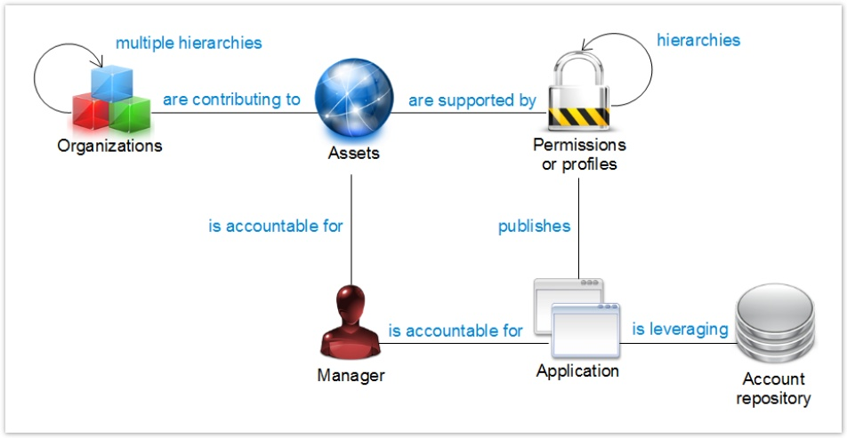   

The notion of asset is a notion inherited from standard ISO 27005. It enables the organizational and technical aspects to be united at the time of control operations:   

The organizations that participate in the process, as well as the application permissions necessary for performing the tasks of the processes.   
The assets may be classed by category. The assets are linked to the organizations and to the permissions. An identity may additionally be appointed manager of the assets.   
With regard to the applications themselves, these make reference to a repository. It is in this same repository that the accounts permitting access to the said application will usually be found.  
The permissions are associated with the applications. The permissions may follow a hierarchy (tree model), as is the case, for example, for shared directories or SharePoint trees.

| **Note**: <br><br> - The notion of hierarchy is suited to the modelling of directories. On the other hand, it is not suited to the modelling of profiles/transactions since, in this second case, we then have to make an acyclic oriented **_graph_**  model. The modelling of roles/transactions is carried out with the aid of the notion of "groups" of accounts. The groups enable accounts and permissions to be united in accordance with a graph model (a graph can, in effect, have several "relations"). <br> - Do not forget that in the data model it is all about application, whether this is IT applications, shared directories, SharePoint servers, physical access etc. An attribute of the application concept enables differentiation between the applications by family in order to adapt the analyses and reports as a function of these same families. This attribute is named "applicationtype". It takes, for example, the following values: "Profile" for the IT applications, "Filesystem" for the file systems, 'Physicalaccess" for the physical access systems etc. You can create completely new types of application, as this attribute is free text.|   

Standard available attributes:   

- Code
- Display name
- Category

#### Collect

In the collect, assets are a combination of three different targets:   

- [Asset target](igrc-platform/collector/components/targets/asset-target/asset-target.md)
- [Support target](igrc-platform/collector/components/targets/support-target/support-target.md)  
- [Actor target](igrc-platform/collector/components/targets/actor-target/actor-target.md)

Here is a preview :


### Reconciliation: Matching Accounts and Identities

In order to be able to complete the controls successfully, it is necessary to match up the users with their access on the Information System. For this reason it is necessary to know to which accounts each person has access. This operation that consists of matching up the accounts and the identities is called "reconciliation".   
Reconciliation is the only information that is deduced from the data in accordance with the rules for reconciliation. The parameters for these rules are set within the Brainwave Identity GRC.   
This information is declarative, which corresponds to a parameter set-up in the product.

### Usage: Operations Carried Out

All of the preceding concepts enable the organization of the enterprise to be modelled, as well as the permissions granted on the various support assets.   
The notion of usage relates to the notion of consolidation and analysis of access logs, in such a way that it is possible at the same time in the Ledger to have information on permissions (this person has access to...) and to operations (this person has accessed...).   
This information comes out of the access logs of the applications and systems.   

#### Modeling of uses

Brainwave Identity GRC consolidates within the Identities Ledger all the information concerning:   

- The users
- Their physical or logical permissions   

The approach of Identity GRC is a control oriented approach. This information is consolidated at a regular time interval in the Ledger, a posteriori. In this sense, Identity GRC has a "photographic" approach to the status of the information system, with a given sampling frequency (often in the order of a week since the objective is to give the operators time to remedy any deviations recorded).    
Identity GRC is also capable of loading information into the Ledger regarding the usages of accounts on the systems: access logs. This information is represented at the centre of the following diagram:   

   

Depending on the richness of the usage log, it is possible to link this information at the same time:   

- To the account
- To the permission used
- To the application accessed
- To the person using the account

This information, loaded as an addition to the authorization map is a precious piece of data since it opens up a new section of analyses:   

- Accounts/permissions/unused applications
- Recorded traceability of access to the critical resources (applications, directories, SharePoint elements etc.).
- "Abnormal" access
  - Access at night, at the weekend, from a remote site etc.
  - Access when the account does not have the permission
  - Repeated failed access
  - ...

At the time the access logs are loaded into the Identities Ledger, Identity GRC aggregates the logs in accordance with categories defined at the time the parameters are set, for example:   

- Access authorized/access refused
- Access as a function of time slots
- Remote/local access
- Data family accessed
- ...

Identity GRC therefore does not store a log (which in any case is present in the file) but usages which are represented by:    

- An account
- An identity
- A permission
- An application
- An aggregation key
- The number of times that this usage has been recorded over the time interval corresponding to the frequency of data loading into the Identity GRC (for example, over the previous week) - this attribute can be either calculated by identity GRC (count of occurences) or the value of an already aggregated attribute.   

This information is consolidated a posteriori, on the basis of the log files presented to the product at the time data is loaded.   

Standard available attributes:   

- Display name
- Aggregation key
- Start date of aggregation slot (Identity GRC determines the MIN value of the date that generated the usage)  
- End date of aggregation slot (Identity GRC determines the MAX value of the date that generated the usage)
- Meter usage


## Order of Supply of Different Concepts of the Model

At the time the data is configured, it is advisable to follow a certain order in the feeding of concepts in order to facilitate the approach between the different sets of information. This is summarized in the following diagram:   

   

Note that for a given concept, it is not necessary that the data be loaded in a particular order. For example, when you load the organizations, you can make references in advance about the relationships that have been connected. Firstly, load a departmental section and then make a reference to the related department, even though the department in question may not have yet been loaded into the Ledger.   


|**Concept**|**Description**|**Graphical representation**|
|Organization|Loading organisations, as well as relationships between the organisational nodes.| |
|Identities|Loading identities, loading occupations, attachment of identities to the organisations, loading organisation managers.||
|Accounts|This stage is repetitive and is done each time a new application is added into the Ledger.Loading repositories, loading accounts, loading groups, attachment of accounts and groups to groups.||
|Applications and permissions|This stage is repetitive and is done each time a new application is added into the Ledger.Loading applications, loading permissions, creation of rights (linking permissions to the accounts/groups).||
|Usage|Loading access log.|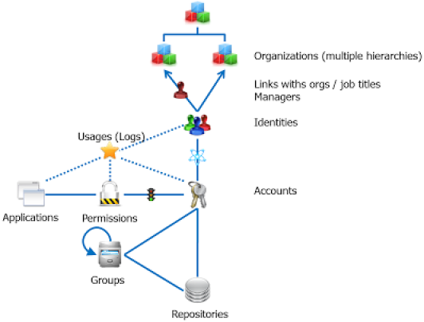|
|Assets|Loading assets||


## Extension of the Data Model

The strength of the data model is homogenization of all the permissions persons have in order to facilitate analyses and reporting.   
It is therefore not possible to modify the cardinalities of the database.  
It is however possible to extend each of the concepts:   

- By adding specific attributes of the project
- By creating specific nomenclatures and linking them to concepts

## Time Management in the Data Model

### General Time Management Principles

Whether it be a question of control, audit and even direction, it is vital to identify the movements and changes occurring in the enterprise: arrivals, departures, HR movements, creation/modification/reactivation of accounts, modification of permissions, rights etc.   
In practice, the control intervals usually result in inconsistencies between the HR assignments to a person and his or her access on the information systems. Highlighting the modifications enables concentration on the sources of new anomalies and thus to tighter management of the System's security.   

Identifying movements is also important when the volume of data to be processed is large. Once the situation returns to a nominally stable state, it is more efficient to concentrate on the movements rather than recommence global control and data validation operations.   
The Brainwave data model integrates time management. The mode of operation is a discreet time linear mode, which means that the data model will to "take a photograph" at a regular time interval of the whole of the information (for example every week) and conduct analysis based on these photographs.   

   

The advantages of this time management model are multiple:   

- Brainwave preserves the photographs taken in their entirety, which means that it is possible to "go back in time" and analyze any photograph. This is especially powerful in the case of forensic analysis, used in conjunction with log analysis tools (SIEM) since Brainwave can even supply the full context of the situations (who was working in such and such a department, what was their access to applications, who was able to write in such and such directory three months ago etc.)   
- Brainwave reconstructs the movements on the basis of simple abstractions from the systems. The systems do not need to supply the list of modifications occurring from one period to another, a simple global export of data suffices. This functionality is vital to the extent that the majority of systems and applications are not able to extract the actions added to their data over a period of time. In the case of Brainwave, for example, a simple weekly HR extraction from the list of employees enables reconstruction of the arrivals, departures, alterations, organizational changes etc.   
Each "photograph" is processed autonomously in the Ledger. It is complete, giving the whole of the information of the organization, identity, account, access etc. This means that at the time of a new loading of data it is necessary to supply the whole of the information.   

| In practice, the data loaded is "tagged" with the date/time of the data source (file) in the Ledger. Good practice is therefore to work in "best effort" mode at the time of a new loading of data: loading all the information using older files if the recent data has not been made available. Note, however, that this can lead to inconsistencies in the analyses (unidentified departures etc.). |  

At the time of a new loading of data, Brainwave Identity GRC automatically processes a certain number of operations:   

- It reconciles the newly loaded concepts with those already previously loaded into the Ledger in order to link them
- It reports the account reconciliation information
- It identifies the organization changes, as well as the changes to assignment of rights

The whole of the previous information corresponds to dedicated attributes in the data model.   

| - One case is quite specifically processed: the departure of an identity of the enterprise. When a person leaves the enterprise, good practice is not to load the corresponding identity concept into the Ledger. This may be implicit (the person disappears from the HR extraction) or explicit (filtering is done at the time of loading of data with the leaving date of the individual). Brainwave Identity GRC automatically detects who has disappeared, changes their status in the Ledger and switches all the accounts that were associated with this person to a "reconciled without owner" status, the reason for which is "leave" and the description is the full name of the person with whom this account was associated.
- The discreet time linear data model implies that several "instances" of the same item are present in the Ledger. For example, for a weekly loading of data the same identity will thus be present 52 times at the Ledger year end: once per photograph.|

### Specific Attributes linked to Time

#### Temporal and Non-Temporal Unique Identifiers of Items

Each data model item has two identifiers:   

- **recorduid**  : Corresponds to a unique global identifier in the Ledger (non temporal identifier). As this identifier is attached to each Ledger item, it enables unique referencing of an item in a photograph. This means that if several photographs are present and an item is loaded each time (for example, a John Doe identity), each John Doe Identity item will have a different recorduid value.  This attribute is an attribute technique that in addition enables relations to be forged between the different Ledger concepts in the same photograph. Good practice: It is recommended that this attribute be used in reports when it is a matter of referencing an item on a given photograph.
- **uid** : Corresponds to a unique identifier per entity in the Ledger (non time related identifier).  This identifier is attached to each different identity in the Ledger, including all the photographs in which this identity is present. If we take the example of the John Doe Identity, a UID value is assigned to the John Doe item at the time it first appears in the Ledger. This value is then kept identical on the John Doe Identity over the whole of the subsequent loadings of data. This attribute is a technical attribute that enables threads to be woven between the photographs in order to, for example, reconstruct all the events that might have occurred in the Ledger items. Good practice: It is recommended that this attribute be used at the time that reports call upon several photographs (historic, trend graphs etc).   

#### New Items, Updated Items, Identical Items, Deleted Items

Each item in the Ledger comprises attributes enabling rapid identification if changes have occurred on this same item.   

- **importaction** : Enables identification if an item is new (it is the first time that this item appears;  it is then created _ex nihilo_, a new UID is created), if attributes comprising the item have evolved since the last loading of data or if the item is identical to the last loading of data. This attribute may also take the following values: C (Created: newly created item), U (Updated: item the attributes of which have been modified since the last loading of data), N (None: item the attributes of which are unchanged since the last loading of data). Good practice: use this attribute to perform filtering in reports (for example: who the newly arrived persons are since 1<sup>st</sup> January 2012).   

The detection of changes only applies to the attributes of the item and not to the cardinalities (for example, an access account that has an additional permission could well stay in "N" status if, in addition, none of the attributes comprising the account (date of last login etc) has changed since the last loading of data.   

- **deletedaction:**  This attribute is a Boolean attribute. It indicates if this item has disappeared in the next photograph. This is the case, for example, with Identities that leave the enterprise and thus disappear from the HR file. Good practice: Use this attribute in reports for highlighting the changes: persons who have left the enterprise, deleted accounts etc.   

|This attribute only has a value on a given photograph when a more recent photograph has been loaded and validated. Similarly, making reports on this attribute presents data from the photograph following. It is best therefore to be vigilant over the presentation associated with these reports. |

#### Specific Attributes on Identities

The Identity items have a certain number of attributes enabling easy identification if changes have occurred in the item's cardinalities. These attributes are calculated automatically at each loading of data, on the basis of the previous photograph.   

- **allocationchanged** : is a Boolean attribute. It enables identification if the identity "assignments" have changed since the last loading of data: change of occupation and/or change of organisation.
- **organisationchanged** : is a Boolean attribute. It enables identification if the assignments to the organisation of the identity have changed since the last loading of data. This attribute concentrates on the organisations and does not take account of changes in occupation.
- **accountchanged** : is a Boolean attribute. It enables identification if the Identity has had a change that has intervened at the level of accounts since the last loading of data: New accounts reconciled, accounts deleted. This attribute also takes account of the "deactivated" status of accounts. It is therefore true if an Identity account has been deactivated, reactivated etc.
- **permissionchanged** : is a Boolean attribute. It enables identification if the Identity has had a change that has intervened at the level of its permissions since the last loading of data. The calculation of this attribute passes through the accounts reconciled to the identity. This attribute takes account of the "deactivated" status of accounts. It only takes account of "asset" accounts reconciled to the identity.

| Brainwave Identity GRC performs an implicit filtering on the rights inherited in the hierarchies of rights (directories etc). This enables, for example, the avoidance of this attribute passing as true if the Ledger contains file trees, that an Identity has a right of access on a directory and that a file has been added to this directory since the last loading. |

#### Specific Attributes on the Accounts

Similarly to Identity items, Account items have a certain number of attributes enabling easy identification if changes have occurred in the item's cardinalities. These attributes are calculated automatically at each loading of data, on the basis of the previous photograph.   

- **permissionchanged** : is a Boolean attribute. It enables identification if the account has had a change that has intervened at the level of its permissions since the last loading of data.   

|Brainwave Identity GRC performs an implicit filtering on the rights inherited in the hierarchies of rights (directories etc). This enables, for example, the avoidance of this attribute passing as true if the Ledger contains trees of files, that an Identity has a right of access on a directory and that a file has been added to this directory since the last loading.|   

- **groupchanged** : is a Boolean attribute. It enables identification if the account has had a change that has intervened at the level of its attachments to groups since the last loading of data. Brainwave Identity GRC only takes account of direct attachments to groups; the modification of a group (addition to a group within a group) will therefore not have an effect on passing this attribute as "true".  

# Time Management: The Lifecycle of Timeslots

Correct time management is an essential feature of any management tool. Whether for reasons of traceability, retrospective audit, or operations management, time management is a core concept.  
The Brainwave Identity GRC solution features fully integrated time management. Brainwave Identity GRC works like a camera, taking a complete and detailed snapshot of users and the information system at regular intervals. It is thus possible to:

1. Navigate and analyze any snapshot whatsoever;
2. Identify the changes that have taken place between snapshots.

This is set out in the article relating to the Brainwave data model.  
To create a more customizable solution, each upload is not directly related to a user-accessible "snapshot" but rather the snapshots follow a lifecycle during which users may add to them, refine them or delete them prior to their final publication on the portal.  
This lifecycle is crucial to ensure that the data published in the Identity Ledger meets the standard for analysis and validation purposes.  
The "snapshots" are known as "analysis periods" or "timeslots" in the Brainwave Identity GRC.

## Timeslot Lifecycle

The lifecycle of a timeslot is closely linked to the sequence of operations needed to upload data into the Identity Ledger:    

1. The data is prepared in a temporary area of the IdentityLedger, also known as the "sandbox":
    1. This operation is carried out during the data collection stage;
    2. Referential integrity is not necessarily maintained in the sandbox (e.g., organisations with no parent as yet can exist, etc.);
    3. The sandbox can be deleted to restart processing or to create multiple sandboxes simultaneously for test purposes;
    4. Information presented in the sandbox can be increased by means of multiple uploads (running of a first data stream, followed by a second, on and so on);
    5. Analytics functions, such as analysis rules, validation, account reconciliation, reports and the web portal, cannot be used in sandbox mode;
    6. Only limited views of the data are available from the "IdentityLedger" interface of Analytics. In particular, it is not possible to view account/permission relationships.
2. Data is loaded into the IdentityLedger and then placed into a quarantined state, known as "data activation":
    1. Once this operation has been completed, referential integrity checking is implemented (so that parent: child links are confirmed, etc.);
    2. It is no longer possible to add to the information presented in the analysis period with new accounts, new applications, or the like;
    3. Nevertheless, an activated analysis period may be deleted;
    4. It is possible (but strongly discouraged) to make use of several activated timeslots at the same time;
    5. It is possible to use analysis functions on an activated analysis period, such as audit rules, validation and portal access;
    6. It is possible to work on the reconciliation of accounts as well as to save the results of audit rules and controls for the analysis period;
    7. This information is only available to a limited group of people:
        1. Users with access to Analytics;
        2. Users with specific role permissions in the web portal (TSEXTENDEDACCESS)
3. Data is validated in the Identity Ledger
    1. Once this operation is complete, the analysis period is locked and becomes read only
        1. It is no longer possible to change the reconciliation, the results of audit rules or audit validation;
    2. It is no longer possible to delete validated timeslots; the only functionality still available is to hide the timeslot
    3. When several timeslots are validated consecutively, only one timeslot is considered "current": other timeslots are given an "old" status. All timeslots remain accessible; the only difference between current and old timeslots is that the current timeslot is the default timeslot used for analysis and mapping.

This is illustrated by the\ following diagram:    


These operations are carried out systematically when the upload is done stage by stage, globally with the implementation plan, or automatically (for instance with scripted weekly uploads).

## Timeslot statuses

### The Sandbox

The concept of the "sandbox" is useful when data is being uploaded into the Identity Ledger.  
It is possible to modify the data in the sandbox by running successive data streams, with objects already in place being automatically updated if new attributes are added.  
It is possible to work with multiple sandboxes to carry out different tests. Sandboxes do not take into account other timeslots.  

### Activated Timeslots
 (to be filled in)
### Validated Timeslots

A validated timeslot is a timeslot that has been published on the portal.   
One final stage is carried out upon validation:   

- The deletion attribute of the object (deletedaction) is updated for the previous timeslot. A validated timeslot is read only and as such validated data can no longer be changed in any way, nor is it possible to delete validated timeslots. This is due to high standards of traceability and integrity for the data, because:
- Data is used to consolidate customer flags and also action plans, which should not be developed after the fact, as these customer flags and action plans are intended to be used by operational teams;
- Third party auditors may require evidence that the data has not been deliberately misused within Brainwave Identity GRC.   

Validated timeslots are visible to all portal users.   

|When multiple timeslots are validated successively, they may have one of two statuses, depending on the situation. The latest timeslot to be validated becomes the current timeslot. This is the timeslot that is used in the Portal and Analytics by default; other timeslots are given the old status, which means that they remain accessible in the Portal and Analytics if they are selected from the GUI.|

### Hidden Timeslots

A hidden timeslot is a timeslot that has been deliberately hidden by the solution administrator. It may be useful to hide a timeslot if it contains multiple errors and is unusable in practice.   

|It is not recommended to hide an old timeslot as time-based attributes are not recalculated (actionchanged, etc.) Reports that consolidated historic information may therefore generate inconsistent results. Hiding a timeslot is therefore only suitable for the current timeslot.|

### Dates Applicable to Timeslots

Each timeslot has multiple dates:   

- Data upload date: Corresponds to the date the sandbox was created
- Data activation date: Corresponds to the date the timeslot was activated.

These dates are available in the Identity Ledger, by selecting the "Views" from the timeslot.

### Timeslot Summary

The diagram below summarizes the various statuses possible for timeslots. Note in particular that, in order to become "valid" a timeslot must go through "sandbox" and "activated" statuses in order.   

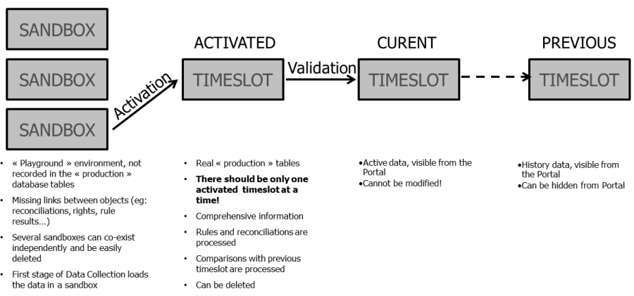

# Understanding the Execution Plan

Feeding the Identity Ledger requires a number of actions to be performed in order:
1. Load data into a sandbox
2. Switch the data in the production tables to "active" state
3. Carry over the reconciliation information from the previous load
4. Identify the identities that are no longer part of the company and flag them
5. Reconcile orphan user accounts (new or old)
6. Identify any movements on objects since the last load (new, modified, deleted)
7. Identify cardinal changes to the accounts and the groups (change of occupation, of organization, of accounts, of permissions, of groups)
8. Load the information about the theoretical rights models
9. Execute the rules whose results have to be saved as a base
10. Execute the controls whose results have to be saved as a base
11. Check for data coherence in relation to the last load
12. Confirm the timeslots

Thankfully, the product is capable of taking on all of these actions automatically, in such a way that it is possible to carry out a new data load with 1 click and even to automate the data load (for example a weekly load every Sunday at 2 am).  
Automation of the loading actions corresponds to the "execution plan" concept in the Brainwave Identity GRC product.  
Execution plans are unique to each project and are set with the help of Analytics during the project configuration under the "Execution Plan" tab.  
An execution plan can be started in three different ways:

- With the help of the banner in the general menu in Analytics
- With the help of the buttons in the settings of the Execution Plan, notably the "Start all steps" button
- With the help of the "batch" launch mode (details of setting this mode are given in Batch mode configuration)

|Only the settings interface of the execution plan allows a subsection of the stages of the execution plan to be executed.|

## Automatic Consistency Check of the Project

This feature adds an automatic check of the consistency of the before key phases:
- Before running an execution plan
- Exporting the web portal
- Exporting the project archive

If errors are detected in the project a confirmation dialogue will appear to continue or abort the operation.
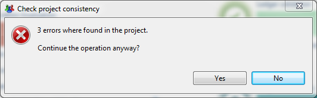

Details of detected errors are displayed in "Problems" view. This includes a list with the files in error and a quick description of the root cause of the error, as displayed in the image below.


## Collect and Activation

This step is mandatory.  
This step corresponds to running a collector line that will reload all of the information into a new timeslot in the Ledger.   
The collector line that is called up should, therefore, ideally contain sequential calls towards all of the set line in order to load the organizations, identities, accounts, etc.   
Most often, the line called up is a collector line created in Analytics with the help of the Collector line series assistant.    

This first step will automatically lead to these operations:   

1. creation of a new sandbox
2. loading of the data into the sandbox
3. activation of the sandbox

The operation of activating the sandbox brings about the following stages:   

1. reconstruction of the user ID of the objects
2. Identification of object movements (new, modified, etc.)
3. Carrying over of reconciliation information from the account and automatic flagging of accounts corresponding to people who have left the company as "account without an owner" under the reason "leaved".   

|From within the execution plan it is possible to only launch the sandbox load. If you want to launch a load in the sandbox, you will need to go through the launch menu in the collector lines editor to do so.|

## Determining Active Identities

This step is optional.   
One the data is loaded and activated, it is possible to identify the identities that have been loaded in the Ledger but are no longer part of the company.   
This operation can be of particular use when loading the data for the first time. It results in the valorization of the "active" Boolean attribute of the identified object.   
The identification of active identities is carried out with the help of an audit rule. This rule turns up all of the identities that are still part of the company. It is possible to make use of any data from within the Ledger in order to determine whether the identity is still part of the company.   

|It is advisable to adopt the following strategy when loading identities into the Ledger: <br> On the first data load, load all of the identities, including people who have already left the company. Ideally you should load the departure dates. If this is not possible because the information is not available load a "flag" to indicate if the person is still in the company or not. Set step 2 of the Execution Plan to identify active identities on the basis of this information. <br> During future loads, only load people who are still part of the company into the Ledger. In the collector lines, filter the people who are no longer part of the company (if this information is actually made available in the files).<br>This allows the results of account reconciliation to be maximized during the first data load and afterwards to not pollute the Ledger and the analyses with false positives that in fact correspond to people who have left the company.|

## Account Reconciliation

This step is mandatory.   
Once the identities are marked as being active/inactive comes the step where the accounts are reconciled.   
Reconciling the accounts amounts to finding, for each account, the identity of the owner of the account. Reconciliation applies to all the "orphan" accounts, that is accounts on which no status is given (attaching an account to its owner, an ownerless account with a special status, etc.).   
This corresponds to executing an account reconciliation policy. This policy seeks to reconcile all of the orphan accounts.   
At the end the reconciliation policy execution, the change in cardinality status of the identities are updated. This corresponds to detecting changes in which accounts are attributed to people (attribute accountchanged on the identity object) and permissions are attributed (attribute permissionchanged on the identity object).   

| It is standard for the reconciliation information to be retained between timeslots. In practice only new accounts and accounts that were not reconciled during the preceding timeslot are reconciled. For all the other accounts (including service accounts whether they are marked through the collect or through a reconciliation rule), the reconciliation status is carried over from the preceding timeslot. <br> A special situation can occur when an account was reconciled to a person and that person is no longer present in the current timeslot (because he or she has left the company). In this case, the reconciliation status of the account automatically becomes that of an "ownerless account", the reason for reconcilation becomes "leaved" and the description of the reconciliation contains the full name of the owner of the account.|

## Manager Policy

This step is optional.   
This step corresponds to the resolution of managerial links between a concept (identity, application, permission...) and the identity managing it when it is not possible to do so during the Collect phase.   

This corresponds to running a manager policy. This policy will seek to weave links between the concept and the identity that is in charge of this concept, using data collected during the previous parts of the Execution Plan.   
To do so, it will execute one or severals manager rules.

## Theoretical Rights Model

This step is optional.   
This step corresponds to the construction of theoretical rights on the basis of "raw" information that was loaded during the data collection.    
This corresponds to running a rights model policy. This policy will seek to weave links between identities and applicable entitlements on the basis of the available raw data. To do this, it will sequentially execute a series of model right rules.

## Rules

This step is optional.   
This step corresponds to running all the rules that were indicated as being part of the execution plan. The rules are executed and the results are saved in the Ledger in the active timeslot.

## Controls

This step is optional.   
This step corresponds to running all of the controls that were indicated as being part of the execution plan.   
The controls are executed and the results are saved in the Ledger in the active timeslot.

## Validation

This step is mandatory.    
Once all of the data is loaded, and the rules and controls carried out, it will be necessary to validate the timeslot so that all of the users can have access to it in the web portal.    
This operation can be carried out automatically by the execution plan, and this is particularly useful in cases where the loads are automated. In these cases, it is possible to set the integrity controls that are to be executed ahead of time when confirming the timeslot. These controls will proceed to comparisons between the data from the previous timeslot and the active data. Thresholds are also set either as absolute values or as a percentage. If at least one of the thresholds is reached, the data will not be automatically validated.   
This mechanism allows notably for quality concerns with the data to be tackled ahead of time (corrupt source files, etc.). If the load is carried out in "batch" mode, an email giving a summary of it will be sent to the Analytics administrator.   
It is also possible to not automatically validate the timeslot in the execution plan, but to carry out a manual validation within the "Ledger" interface in Analytics.

## Running the execution plan

Running the execution plan allows to execute all data loading steps in a new timeslot. Optionally automatic data validation can be carried out.   
If the execution plan is launched in batch mode, an email summarizing the operation can be automatically sent when the execution has been completed.   
It is also possible to carry out automatic maintenance operations on the data base at the time of each load. This corresponds to updating the base statistics. It is strongly recommended to choose this option as it allows performance of the data base to be maintained with each subsequent load.


# Default Project

The Default project includes the standard views, rules, reports and pages that are installed when creating a new project. The included pages will provide you with a description of how it is setup.  

Please consider using the various capabilities of the default project with care as they can have large impacts on performance.  

## Default Featuresets and Roles

### Prerequisites  

The following only applies to IGRC 2016R3 and newer

### Context

The default project includes a set of features and featurest to easily hide or show some features that can be useful to users with certain roles.   

Many features included in the default project provide fine-grained control on individual pages or even widgets like groups or buttons. However, these features are grouped into features that represent global actions or functionalities. Featuresets represent generally an action that is more user-oriented.   

For example, in order to be able to reconcile accounts manually using the webportal, a user may need to see and be able to use many widgets in different pages. He will need to have access to a number of features that have already been grouped into a default featureset : accountreconciliation. This makes it easier to give a user access to the reconciliation functionality by using this featureset.   

For more information on features and featuresets please see product documentation : [Features and Roles](igrc-platform/pages/features-and-roles/features-and-roles.md)

### Default Featuresets

The file `webportal/features/default.featuresets`, includes the following featuresets:   

   

#### defaultmenu

This featureset is associated to the default menu items. Users with this featureset will be able to see and use the default menu item: **Search** and its associated page.   
By default this feature is associated with the **user** role. So that all the users have this featureset. By disabling this featureset we will hide the default menu item **Search**.

#### organisationmanagerfeatureset

This featureset gives access to a homepage dedicated to the managers of an organisation. The home page is `webportal/pages/home/organisationmanager.page`    
This featureset is by default associated to the role **organisationmanager**.

#### applicationmanagerfeatureset

It gives access to the homepage for the managers of an application.   
The home page is `webportal/pages/home/applicationmanager.page`   
By default associated with the role **applicationmanager**.

#### showanalyticspanels

The search pages have an option to select all the elements that result from a given search and send them as parameters to a very specific type of "analytics" reports.   
By default this feature is associated with the **user** role. So that all the users can access.   
However, the panel **will not be displayed** if there are no analytics reports installed. Since these reports are very particular because they receive as parameter a group of elements, they are generally distributed in a separated facets.   

| **Important**: <br><br> The default project does not include any of these reports. They need to be added by installing the corresponding facet.|

### detaillinks

This featureset groups the activation of several links from detail pages to other elements. For example, from the detail page of an identity we can have a link to the manager of the identity, this link will take the user to the detail page of the manager.   
By default this feature is associated with the **user** role. So that all the users can access. By disabling this featureset we can disable the links.

### accountreconciliation

Users with this featureset will be able to see and use a few icons in the account detail page that will allow to manually modify the reconciliation of an account.   
This featureset is not assigned to any role by default. [See more about this featuresets](igrc-platform/getting-started/default-project/web-reconciliation.md)

### editmetadata

This featureset enables to option to edit the description of permissions and applications.     
This featureset is not assigned to any role by default. [See more about this featureset](igrc-platform/getting-started/default-project/edit-metadata.md)

### ownersmanagement

Groups the options to manage (edit create delete) business or technical owners to the supported concepts. These functionalities are included in the default project but the access is controlled using this featureset.     
It concerns the following concepts: permission, application, group, repository and account. Links will be activated in all the detail pages of those concepts to modify the owners.

| **Important**: <br><br> Activating this featureset will allow the use of workflows that required the existence of the expertise domains: _businessowner_ and _technicalowner_. The creation of these expertise domains in the database needs to be done at collect time.|   

This featureset is not assigned to any role by default. [See more about this featureset](igrc-platform/getting-started/default-project/business-and-technical-owners.md)

#### ownersmanagementaudit

In addition to being able to modify the business or technical owners of a given concept, the user can also have access to an "audit" view of all the modifications that have been done related to the owners.   
Users that have this featureset will have access to that information for the concepts: permission, application, group, repository and account.   
This featureset is not assigned to any role by default. [See more about this featureset](igrc-platform/getting-started/default-project/business-and-technical-owners.md)

#### assetsfeatureset

This featuresets groups all the pages / reports and links associated to the concept "assets". Since they are not commonly used, the option to display them or not is controlled using this featureset.   
This featureset is not assigned to any role by default.

#### igrcadmin

It concerns the Admin menu button. A user with this featureset will be able to see and use the menuitem **Admin**. This menu will lead to an admin page.   
The options provided in the admin page depends on the facets installed in the project. Many facets, include administration pages that will be appear in this section.   
By default associated with the role **igrc\_administrator**.

#### projectupdatemanager

This featureset gives access to the Project Update Manager that allows to update the project by installing Project Archive Files (PAR)   

| **Important**: <br><br> This is an administrator featureset, The access will be located in the Admin page. This means that the users also need to have the featureset **igrcadmin** to see the **Admin** menu.|   

This featureset is not assigned to any role by default.  [See more about this featureset](igrc-platform/getting-started/default-project/project-update-manager.md)

### Default Roles

Users can have many roles and assigning a user to a role can be done by the web application server or can be set to match IGRC rules. For more information on roles please see the product documentation [Features and Roles](igrc-platform/pages/features-and-roles/features-and-roles.md)      

The file webportal/features/default.roles defines 4 roles:   


#### user

This roles contains all the users that can be authenticated into the webportal.   
According the the defatult featuresets, users in this group can by default:   

- See the default menu: search and access the search page (via the featureset defaultmenu)
- See the analytics panels in the search pages if compatible reports are present
- Use the links present in the detail pages to browse to related concepts  

#### organisationmanager

This role groups all organisation managers.   
By default, users in this role will be able to see the dedicated homepage for organisation managers.   
This role is by default configured to include the identities returned by the rule _control\_organisationmanagers_ that can be found in /rules/controls/identity/organisationmanagers.rule :   


#### applicationmanager

This roles groups all application managers.   
By default, users in this role will have access to the dedicated homepage for application managers.   
This role is by default configured to include the identities returned by the rule _control\_applicationmanagers_ that can be found in /rules/controls/identity/applicationmanagers.rule :   


#### igrc\_administrator

This role is meant to be assigned to administrators.   
By default, users in this role will be able to see the menu Admin. In this menu they can find admin pages included in the installed facets.

## Reports Featuresets

<u>Version</u>   
Applicable as of Brainwave's iGRC version 2016 R3.   

All the reports that are delivered with the default project and that are accessible in the webportal are declared in a page file that is located in :   
`webportal/pages/reports/standard.page`   

Each report is tagged following the [default tagging system](igrc-platform/pages/new-webportal-features/tagging-system-for-pages-and-reports.md), these tags can make these reports available automatically in different pages:   

- In [detail pages](igrc-platform/pages/new-webportal-features/links-to-reports-and-pages-from-detail-pages.md), the reports tagged by concept and byuid   
- In the home page webportal/pages/default.page if the reports are tagged as generic

### Report Classification

At the same time, reports are classified into different categories :   

- Browsing Reports
- Review Reports
- Mining Reports
- Analytics Reports
- Control Reports  

Each report has one feature associated , the full list of features linked to reports is in `webportal/features/reports.features`

We can also see that the default project includes a featureset file  in `webportal/features/reports.featuresets` :

   

It includes 1 featureset for each one of the available categories. This makes it easy to control the access for each role to each one of the categories of reports in blocks.   
The browsing reports block is the only one that is available by default to all users. The rest of the reports can be activated to certain roles depending on the requirements of each implementation.   
For a detailed  list of all the available reports and their category please see the [dedicated section](igrc-platform/getting-started/default-project/full-report-list.md)

#### allreports

This featureset includes all delivered reports. Roles that have this featuresets will be able to see all the available reports.     
Even if this featureset can be useful in developments, using this featureset is strongly discouraged in production environments.  

#### reports\_browsing

Includes all the browsing reports. Is assigned by default to all users.  

#### reports\_mining

Includes all mining reports. Disabled by default.  

#### reports\_analytics

Includes all analytics reports. Disabled by default.

#### reports\_control

Includes all controlreports. Disabled by default.

#### reports\_review

Includes all the review reports. Is assigned by default to all users.

### Custom Group of Reports

In some cases, the default categories of the groups is not enough to answer a particular need.   
For example, a particular user might need to access just a little list of reports from the different categories.   
The best practice to implement this is to start by creating a new featureset file :   

   

Then we provide information for our new featureset file:   

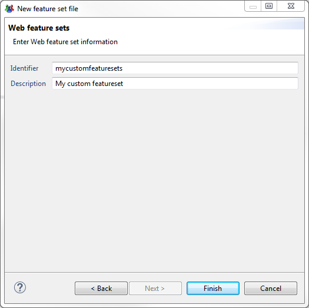   

Once the file create we click on the button **Add** to create a new featureset :   

   

And we provide a name for our new custom featureset :   

   

Our new featureset is created , in this case its called **mydefaultreportset,** we can now assign this new featureset to our roles:   

   

Don't forget to save the changes in the file when its done.   

The next step is to modify the file `webportal/features/reports.features`   

In this file we will find a feature for each one of the available reports.  We can also see the classification for each report.   
We select the file that we need to include in our custom group and click **Edit:**   

   

We will edit the feature by adding it to our new custom featureset and click **OK** :   

   

Now, the report will also be part of our new featuresets **mydefaultreportset**      

This is then applied to all reports that are to be added to the new group.   
We just finished creating or new custom group of reports that will be available for the users that have the selected roles.   

For a detailed list of all reports delivered in the default project , you can take a look at the [dedicated section](igrc-platform/getting-started/default-project/full-report-list.md)

## Full Report List

<u>Version</u>   
This is applicable as of version 2016 R3 and above  

### Browsing Reports

| **Concept**  | **Feature** | **Title** |
|  Account |  browsing\_accountdetail |  Printable Version |
|  Account |  browsing\_account\_allgroups |  Account Groups |
|  Account |  browsing\_account\_detailapplications |  Applications Details |
|  Account |  browsing\_account\_detailpermissions |  Permissions of the Account |
|  Account |  browsing\_account\_usages |  Account Usages |
|  Application |  browsing\_applicationdetail |  Printable Version |
|  Application |  browsing\_application\_detailaccounts |  Accounts Details |
|  Application |  browsing\_application\_identitylist |  Identity List |
|  Application |  browsing\_application\_permissionsbyaccount |  Permissions Detailed by Account |
|  Application |  browsing\_application\_permissionsbyidentity |  Permission Detailed by Identity |
|  Application |  browsing\_application\_usages |  Usages |
|  Application |  browsing\_application\_detailassets\* |  Associated Assets |
|  Organisation |  browsing\_organisationdetail |  Printable Version |
|  Organisation |  browsing\_organisation\_identities |  Members of the Organisation |
|  Organisation |  browsing\_organisation\_suborgs |  Sub Departments |
|  Organisation |  browsing\_organisation\_detailassets\* |  Associated Assets |
|  Identity |  browsing\_identitydetail |  Printable Version |
|  Identity |  browsing\_identity\_detailaccounts |  Accounts Details |
|  Identity |  browsing\_identity\_detailapplications |  Applications Details |
|  Identity |  browsing\_identity\_detailpermissions |  Detailed Permissions |
|  Identity |  browsing\_identity\_team |  Complete Team |
|  Identity |  browsing\_identity\_usages |  Usages |
|  Group |  browsing\_groupdetail |  Printable Version |
|  Group |  browsing\_group\_allaccounts |  All Accounts |
|  Group |  browsing\_group\_detailpermissions |  Permissions |
|  Repository |  browsing\_repositorydetail |  Printable Version |
|  Repository |  browsing\_repository\_detailaccounts |  Account List |
|  Repository |  browsing\_repository\_detailapplications |  Applications Details |
|  Repository |  browsing\_repository\_detailgroups |  Group List |
|  Permission |  browsing\_permissiondetail |  Printable Version |
|  Permission |  browsing\_permission\_detailaccounts |  Accounts Details |
|  Permission |  browsing\_permission\_detailgroups |  Groups that Give Access |
|  Permission |  browsing\_permission\_identitylist |  Identities with the Permission |
|  Permission |  browsing\_permission\_usages |  Usages |
|  Generic |  browsing\_currentorganisationhierarchy |  Organization hierarchy |
|  Generic |  browsing\_applicationpermission |  Applications and permissions |

### Review Reports

| **Concept**  | **Feature** | **Title** |
|  Application |  analysis\_accountreviewbyapplication |  Account Review |
|  Organisation |  analysis\_organisationdeltareview\_hrteam |  Organisation Review (Differences) |
|  Organisation |  analysis\_organisationreview\_hrteam\_applications |  Application Review (Full) |
|  Organisation |  analysis\_organisationdeltareview\_hrteam\_applications |  Application Review (Differences) |
|  Organisation |  analysis\_organisationreview\_crosstab |  Crosstab Review |
|  Organisation |  analysis\_organisationreview\_hrteam\_permissionsprofiles |  Permission Review (Full) |
|  Organisation |  analysis\_organisationdeltareview\_hrteam\_left\_permissionsprofiles |  Permission Review of People who Left the Organisation |
|  Organisation |  analysis\_organisationreview\_hrteam\_deltapermissionsprofiles |  Permission Review (Differences) |
|  Identity |  analysis\_accountreviewbymanager |  Accounts Review (By Organisation) |

### Mining Reports

| **Concept**  | **Feature** | **Title** |
|  Application |  browsing\_application\_detailaccountproblems |  Accounts with Controls Defects |
|  Application |  browsing\_application\_detailidentityproblems |  People with Controls Defects |
|  Application |  analysis\_applicationassociatedwith |  Applications Associated with this Application |
|  Organisation |  analysis\_organisationreview\_hrteam |  Organisation Review (Full) |
|  Organisation |  analysis\_organisationsimilarapps |  Applications Associated with this Organisation and its Sub Organisations |
|  Organisation |  analysis\_organisationdirectsimilarapps |  Applications Associated with this Organisation |
|  Organisation |  analysis\_organisationsimilarperms |  Permissions Associated with this Organisation and its Sub Organisations |
|  Organisation |  analysis\_organisationdirectsimilarperms |  Permissions Associated with this Organisation |
|  Identity |  analysis\_templateanalysis |  Use as Reference to Compare Permissions |
|  Identity |  analysis\_identitysimilarapps |  Identities with Similar Applications |
|  Identity |  analysis\_identitysimilarperms |  Identities with Similar Permissions |
|  Permission |  analysis\_permissionassociatedwith |  Permissions Associated with This Permission |
|  Generic |  analysis\_organisations\_applications\_withsubs |  Application mining by organisation type (including sub organisations) |
|  Generic |  analysis\_organisations\_applications\_nosubs |  Application mining by organisation type |
|  Generic |  analysis\_jobs\_applications |  Application mining by job |
|  Generic |  analysis\_organisations\_permissions\_withsubs |  Permission mining by organisation type (including sub organisations) |
|  Generic |  analysis\_organisations\_permissions\_nosubs |  Permission mining by organisation type |
|  Generic |  analysis\_jobs\_permissions |  Permission mining by job |

### Analytics Reports

| **Concept**  | **Feature** | **Title** |
|  Application |  analysis\_applicationorphanaccounts |  Orphan Accounts |
|  Application |  analysis\_applicationjoborgpivot |  Application Job Organisation Pivot |
|  Application |  analysis\_permissionjobpivot\_application |  Permission and Job Pivot |
|  Application |  analysis\_permissionorgpivot\_application |  Permission and Organisation Pivot |
|  Organisation |  analysis\_joborganisationpivot |  Job Organisation Pivot |
|  Organisation |  analysis\_organisationappsuborgpivot |  Applications Job Organisation Pivot |
|  Organisation |  analysis\_organisationappjobpivot\_detail |  Job Application Pivot |
|  Organisation |  controls\_SoDtopControlsFltOrg |  SoD Analysis |
|  Repository |  analysis\_repositoryreconciliation |  Reconciliation Statistics |
|  Repository |  analysis\_repositoryorphanaccounts |  Orphan Accounts |
|  Repository |  analysis\_repositoryaccounttopgroups |  Accounts with the most/the least Amount of Groups |
|  Repository |  analysis\_repositorygrouptopaccounts |  Groups with the most/the least Amount of Accounts |
|  Repository |  analysis\_repositoryidentitiesnbperm |  Identities the most/the least Amount of Permissions |
|  Repository |  analysis\_repositoryaccountsnbperm |  Accounts the most/the least Amount of Permissions |
|  Permission |  analysis\_permissionorphanaccounts |  Orphan Accounts |
|  Permission |  analysis\_permissionjobpivot |  Permission and Job Pivot |
|  Permission |  analysis\_permissionorgpivot |  Permission and Organisation Pivot |
|  Permission |  analysis\_permissionjoborgpivot |  Permission Job and Organisation Pivot |
|  Generic |  analysis\_joborganisationpivot\_generic |  Job Organisation Pivot |

### Control Reports

| **Concept**  | **Feature** | **Title** |
|  Generic |  dashboard\_datasources |  Datafiles used to feed the Identity Ledger |
|  Generic |  dashboard\_reconciliationappsynthesis |  Application Reconciliation synthesis |
|  Generic |  dashboard\_reconciliationsynthesis |  Repository Reconciliation synthesis |
|  Generic |  analysis\_repositoryreconciliation\_control |  Reconciliation Statistics |
|  Generic |  analysis\_accountenabledusergone |  Active accounts, identities gone |
|  Generic |  analysis\_accountscreatedmodified |  Accounts created/modified since the last import |
|  Generic |  analysis\_accountsdeleted |  Accounts deleted on next import |
|  Generic |  controls\_SoDtopControlsNoOrg |  SoD controls Top N for people W/O org |
|  Generic |  controls\_identitycontrols |  Identities controls |
|  Generic |  controls\_accountcontrols |  Accounts controls |
|  Generic |  controls\_applicationcontrols |  Applications controls |
|  Generic |  controls\_permissioncontrols |  Permissions controls |
|  Generic |  controls\_organisationcontrols |  Organisations controls |
|  Generic |  controls\_assetcontrols\* |  Assets controls |
|  Generic |  controls\_SoDtopControlsFltOrg\_control |  SoD Analysis |
|  Generic |  custom\_identity\_changes |  Identity Changes |

(\*) These reports are related to the assets concepts. In order to see them, the assets featuresets must be activated. See more details [here](igrc-platform/getting-started/default-project/default-featuresets.md)

## Web Reconciliation

<u>Version</u>   
This is applicable as of version 2016 R3.     

Manual reconciliation from the webportal is possible. This functionality is disabled by default and to enable it:   
Modify the featuresets file in `webportal/features/default.featuresets`, and assign the featureset **accounreconciliation** to the proper roles. ([See more](igrc-platform/getting-started/default-project/default-featuresets.md))

### Modify the Reconciliation

After the functionality is enabled for the selected roles. The users will activate some icons in the detail page of the account.   
If the account is already reconciled , then it will display 3 icons next to the identity field :   

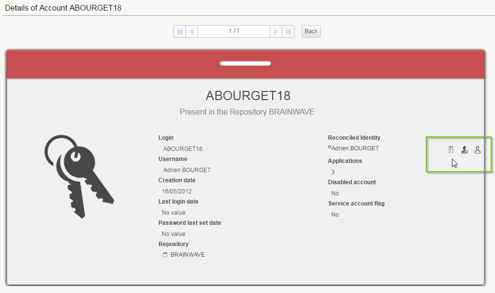   

The tooltip on each of this buttons will provide more information:   

#### Delete this Reconciliation

Will delete the reconciliation   

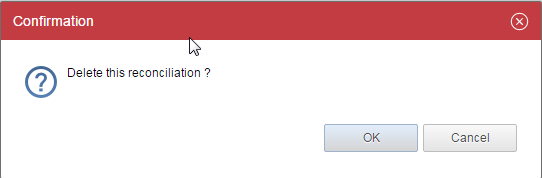

#### This account has an owner

Allows to modify the reconciliation. It provides a dialog box with an identity picker and a comment :  


#### The owner of this account has left

Will modify the reconciliation. Allows to select an identity that has left:       

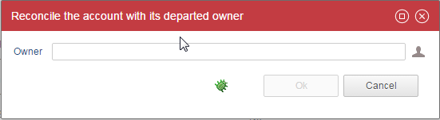   

If the account has not been reconciled, we will still have the last three options. But we will also mark the account as a no-owner account with two more icons :   

   

The tooltip for these two new icons :

#### This account has no owner

This allows to mark the account as an no-owner account. It will bring a dialog box to select an existing no-owner code or create one :  

   

#### Delete this Reconciliation

Will delete the reconciliation.

## Business and Technical Owners

<u>Version</u>    
This is applicable as of version 2016 R3.   

The default project includes the functionality to manage the business and technical owner of the following concepts: permission, application, group, repository and account.      
However, this a functionality that is disabled by default.     
To enable it modify the featuresets file in `webportal/features/default.featuresets`, and assign the featureset **ownersmanagement** to the proper roles. ([See more](igrc-platform/getting-started/default-project/reports-featuresets.md)

### Manage the Business and Technical Owners

When this featureset is activated. The users in the selected roles will see new icons in the detail page of concerned concepts. For example, application :   

   

The edit icons will display a dialog box that allows to select an owner :   

   

It will display an identity picker to select the manager.   

### Auditing the Modifications

The default project also includes the possibility to audit the modifications on the business and technical owner.   

But this feature is not activate by default , to activate it modify the `featuresets file in
webportal/features/default.featuresets`, and assign the featureset **ownersmanagementaudit** to the proper roles. ([See more](igrc-platform/getting-started/default-project/default-featuresets.md) about this featuresets file).   

When this option is enabled, the users will see a third button in the previous dialog box:   

   

And this new button will open a new dialog box with an audit trail :   

   

### About the Expertise Domains

Managing the Business and Technical owners in the Ledger is done by making a manager relationship between the element and the corresponding identities. To make a difference between a _business owner_ or a _technical owner_ , this relationship needs to be "typed" and this is done using the **expertise domain**.   

It is possible to create as many expertise domains as we need; However, this functionality requires the presence of 2 expertise domains:   

- Expertise domain with code : _businessowner_
- Expertise domain with code : _technicalowner_

The expertise domains **cannot** be created on-the-fly, they need to be collected into the Ledger. If you try to use this functionality and the expertise domains are not present in the ledger, it will not work and it will cause an exception.   
Its very important to keep in mind that when this functionality is activated, we should include a collect line that creates the expertise domains in the ledger. This is done using a **Reference Target**.   

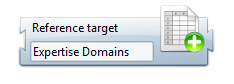   

In the Expertise domain section of the **Reference Target** :   

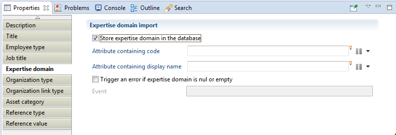   

For example, we can use multivalued variables created in an update target :   

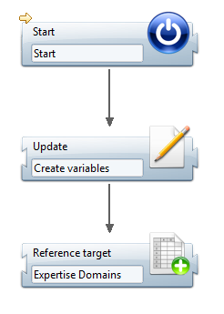   

In the update we can create two multivalued attributes to handle the code and descriptions :   

   

And in the reference target :   

   

Now we just need to make sure that our collect lines gets executed in our execution plan

## Edit Metadata

<u>Version</u>   
This is applicable as of version 2016 R3.    

Some concepts include by default the option to edit associated metadata such as a description. The concepts concerned : **Application** and **Permission**. This functionality is disabled by default.   
To enable it :   
Modify the featuresets file in webportal/features/default.featuresets , and assign the featureset **editmetadata** to the proper roles. ([See more](igrc-platform/getting-started/default-project/default-featuresets.md) about this featuresets file)

### Editing the Metadata

Both application and permission concepts allow to edit their associated description. Users in a role that has this featureset will be able to see an option to edit in the default page.   

For example for an application :   


#### Update Application Metadata

Will give the option to modify the description of the application.   

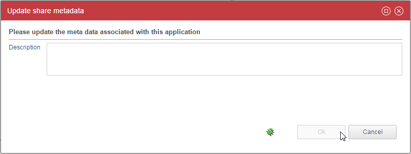

## Project Update Manager

<u>Version</u>   
This is applicable as of version 2016 R3.   

The default project includes a administration functionality to support the update of the project using the webportal. This functionality is disabled by default.   
To enable it modify the featuresets file in `webportal/features/default.featuresets`, and assign the featureset **projectupdatemanager** to the proper roles. ( [See more](igrc-platform/getting-started/default-project/default-featuresets.md) about this featuresets file ).   

| **Important**: <br><br> This feature adds a button in the admin page. This means that in order to see this features, users must have also the featureset **igrcadmin**  to have access to the admin menu.|     

The project can be updated using the Project Archive Files (PAR) that can be generated using iGRC Analytics. The extension of PAR files is .par   

### Access the Project Update Manager

To access the Project Update Manager you can use the link in the admin page that can be reached by using the **Admin** menu:     

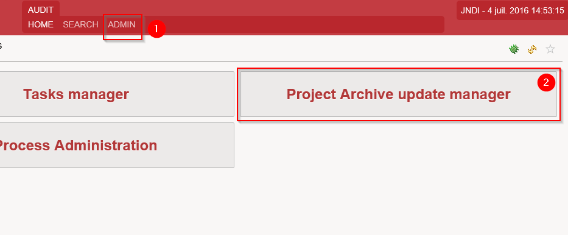   

### Installing a PAR File

The Project Update Managers offers the possibility to upload a PAR file previously created using iGRC Analytics by clicking "Upload a new PAR file":     

   

This open a pop-up window where, for security reasons, it is necessary to tick the option and enter the corresponding confirmation code in order to select and upload the PAR file.   

   

| **Important**: <br><br> The PAR file will be automatically installed after the upload.|   

Once the operation completed a a message box is displayed with the result of the installation process.     
Once a PAR file is installed it is possible to see all update files corresponding to the selected file on the right hand side of the screen.   

### Uninstalling a PAR File

In the page the history of all previously installed PAR files is displayed:   

   

To uninstall the latest PAR files, select the latest uploaded PAR file and click the dustbin icon. You will receive a confirmation in a message box after the PAR file has been deleted.

# Product Description and Use

## Creation and Configuration of a Project

### Create an iGRC Project

In the **Audit**  tab, click the **Create a new project**  link.   


This opens a wizard that allows the user to create a project. It is the just a question of following the steps detailed to create the new project.

In the **Project name**  field, type the technical name of the project (do not use spaces nor special characters):   


In the **Languages**  section, it is possible to choose the different languages you wish to use in the project as well as change the default language. Click the **Next**  button to continue to the next step of the wizard.

In the **Customer project name**  field, type the project display name and in the **Customer name**  field, type the customer display name. The other fields are optional. Click the **Next**  button to continue to the next step of the wizard.

Fill in the **Configuration name**  (mandatory) and optionally the configuration description:
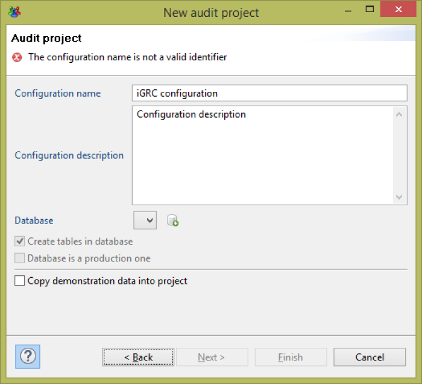

It is necessary to select or create the database connection profile to use in the project. To create the database, proceed as follows:

1. Click the  **icon** and select the driver type (Oracle, PostGreSQL or SQL Server):  
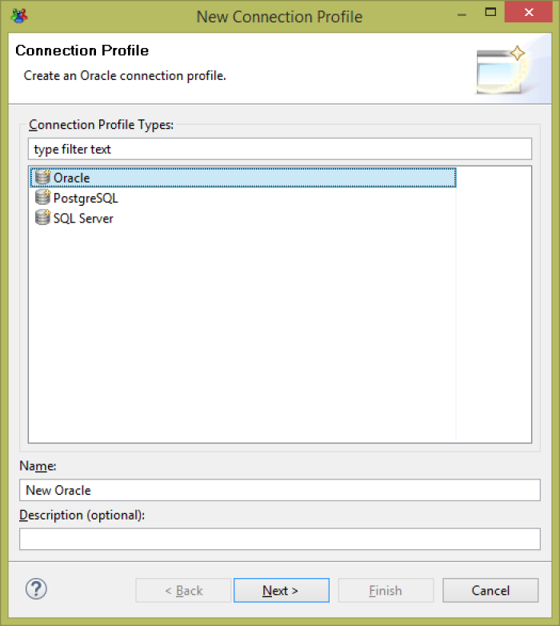   
2. Type a name and a description for the connection, then click **Next**.  
3. Enter the information for connection to the base: name of the base, server address and port and name of the base (to be detailed in the connection's URL), connection login and password. The information to provide is based on the database types selected
3. Check the **Save password**  checkbox and click the **Test Connection**  button to check that the details are correct.
4. Click **Finish**.

If the option **Create tables in database** is selected then the database schema will automatically be created upon completion of the wizard.

If applicable, select the option the **Database is a production one**. This option deactivates the initialize the database funcitonnalities in the technical configuration.

Click **Finish**  to complete the creation of the project.

### Integration with Version Management Systems

IGRC Analytics offers innate integration with the Subversion, CVS and Git version managers. This integration enables version handling and sharing amongst several users of the iGRC Analytics configuration: collection, rules, reports etc.   
It is strongly advised that this functionality be configured in order to benefit from all the functionalities provided by Subversion.

#### Prerequisites

Subversion integration requires an SVN server, version 1.6 or higher.

#### Configuration of the Subversion Integration

1. Launch the iGRC Analytics Client.
2. In the main menu, click **Window**  \> **Open Perspective**  \> **Other¦**  and select **SVN Repository exploring**.
3. On the left side of the screen, under the **SVN Repositories**  tab, right click **New**  \> **Repository Location**.
   
4. In the **Url**  field, type in the URL details for the Subversion server and click **Finish**.   

The Subversion server is registered and the list of projects is displayed.   

Depending on the configuration of the Subversion server, you may be required to enter authentication information.

#### Add an iGRC Project into the Subversion Directory

1. On the left side of the screen, in the **iGRC Project explorer** , right click on the name of the project that you wish to load into Subversion and select **Team**  \> **Share Project**.
2. Select the repository type (SVN for Subversion).
3. Choose the repository corresponding to the Subversion server.
4. Follow the assistant's instructions up to the project loading stage. The loading is done in the task background and takes a few moments.   

Depending on the configuration of the Subversion server, you may be required to enter authentication information.  

#### Load an Existing Project from the SVN Repository into the iGRC Analytics Client

1. Open the **SVN Repository Exploring**  perspective;
2. On the left side of the screen, under the **SVN Repositories**  tab, deploy the Subversion server by clicking on the **+**  icon;
3. Select the project and right click **Checkout**.
4. Select the **Checkout as a project in the workspace**  option, then click **Finish**.

The project creation takes a few moments.   
Depending on the configuration of the Subversion server, you may be required to enter authentication information.

#### Synchronize your Project

The synchronization operations of a project enable the Subversion repository to be updated from the local project, or vice-versa:

##### Update the Subversion Repository

1. Under the **Project Explorer**  tab, select the project or subdirectory corresponding to the items, updated locally, that you wish to synchronize.
2. Right click **Team**  \> **Commit.**
3. Enter the description relating to the updated configuration items and click **OK**  to perform the update.

##### Update the Local Project

1. Under the **Project Explorer**  tab, select the project or subdirectory that you wish to update from the Subversion server.
2. Right click **Team**  \> **Update to HEAD**.

The update will start immediately.

## Navigating in the Studio

The iGRC Analytics graphic interface consists of several fields:   
   

- The Work space and Project Explorer tab (in orange) displays the main actions that can be performed on the current project as well as the list of existing projects.
- The perspectives zone (in red) allows selection of the perspective to be displayed (cf. below).
- The principal editing zone (in blue) enables configuration operations through graphic editors to be carried out.
- The status zone (in green) enables contextual views to be displayed in the principal editing zone. In particular, you will find here the "Properties" tab that enables entry of the properties of objects edited in the principal zone.

### Workspace

The workspace is divided in tabs. The two most used tabs are:   

- Audit: enables to launch most generic actions related to the project.
- Project explorer: enables to browse project files and to open the different elements such as controls, rules, etc.

### Perspectives

A perspective is a pre-set configuration of panels and tabs suited for a particular activity. IGRC Analytics supplies several default perspectives:   

- iGRC Project
- iGRC Properties
- iGRC Reports

The icon  placed to the right on the perspectives bar enables to add perspectives.  
Modifications to the arrangement are automatically registered in the current perspective.  
It is possible to restore the default arrangement of a perspective by right clicking on the perspective button and selecting "Reset".


## Using the Editors

### Discovery Editor

To best take advantage of the "data discovery" editor features, known as "Discovery" in the Identity Ledger, open the 'iGRC Project' view. The discoveries are located in the '/discovery' subdirectory of your audit project and use the '.discovery' extension.    
It is possible to create a new discovery by using the copy/paste mechanism on an existing discovery through the main product menu, or by using the new discovery creation wizard (contextual menu 'New' \> 'Data file inspector').   


#### Configuration Tab

This tab contains all the parameters that were entered in the discovery creation wizard.  
The "Configuration" tab also contains all the operations that were configured in the discovery:   

- Creation wizard (file format, format of date and Boolean type values, first level filtering, number of records to process)
- Data filtering actions (validations)
- Data transformation actions

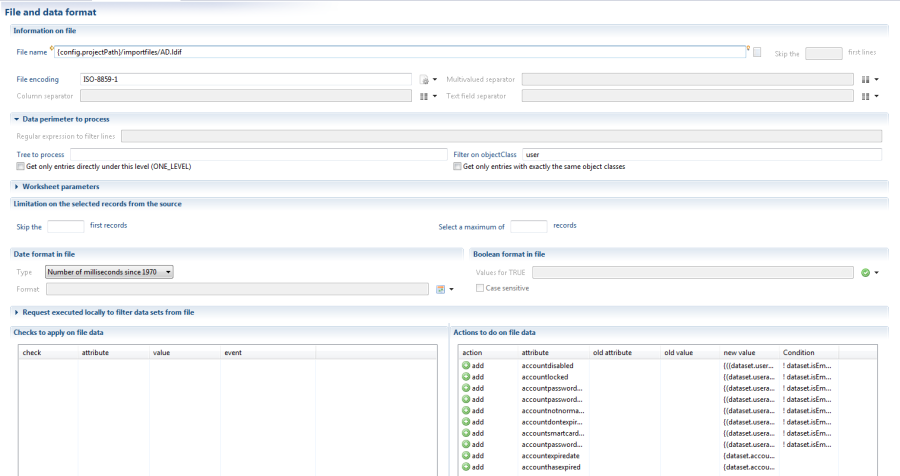   

##### Analysis Tab  

This tab presents the results of the analysed file.   
The Analysis view is the discovery editor's main view. This view presents the information from the data file to be analyzed.    
The presentation makes it easy to identify the attribute names, their type, the number of values per attribute, and the detail of the values per attribute, with their distribution.     
This mode of representation at first looks like what we might see with the "Sort and Filter" function in Microsoft Excel, but we will see further along in this documentation that in fact, we can perform data filtering and transformation operations that are much more extensive than those done in Excel.   

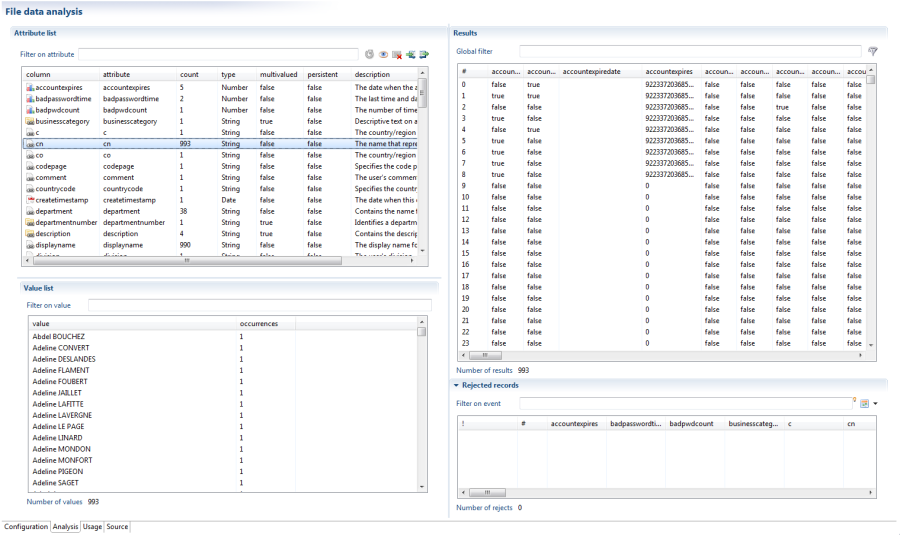   

##### Validation Tab

The validation tab is used to configure some data quality checks on the input data.  
Two fields are displayed in the tab.    

1. Definition of data validation test
2. Validation results

An analysis is performed either by clicking on the analysis tab or when validating data using the [Silo Validation](igrc-platform/getting-started/product-description/using-the-editors/silo-editor/silo-editor.md).  

> Data validation occurs **after** the actions defined in the `Configuration` tab of the discovery, as described in the Studio (version `Curie R2` or newer)  
>   
> You can also validate data in the **collector**, using the [validation filter](igrc-platform/collector/components/filters/validation-filter/validation-filter.md)

##### Usage Tab

This tab presents the list of collector components that use "Discovery" when loading data.
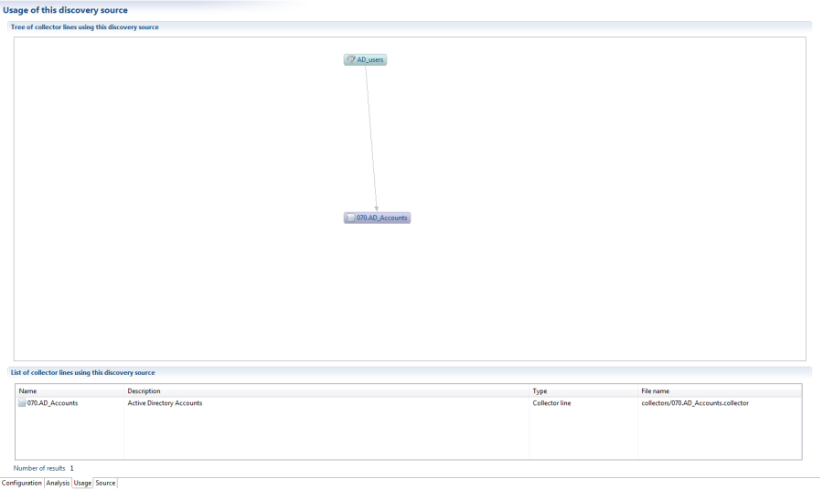    

##### Source Tab

This tab contains the description of the Discovery in its definition's XML format.    
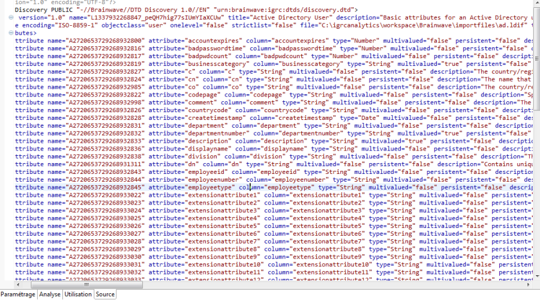    

#### Details of the Analysis Tab

The analysis tab presents the content of the analyzed file. No matter what its initial format, the file is presented as a series of records. Each record is composed of a group of different single-valued or multivalued attributes depending on the type of file:   

- In the case of a formatted or Excel CSV type file, the attributes correspond to the various columns in the file. The records correspond to the various lines in the file.
- In the case of an LDIF file, the attributes correspond to the different attributes of the LDAP object analyzed, such as "sn, givenname, mail, objectclass..." in the case of an "inetorgperson" type object. The records correspond to the various LDAP objects depending on the type of object selected in the file.
- In the case of an XML file, the attributes correspond to the various attributes of the selected object.

The analysis tab will allow an analysis to be performed not by attribute instead of by record, with the objective of:   

1. discovering the values and the meaning of the various attributes, notably in order to "map" them to Identity Ledger concepts during collector configuration
2. transforming attribute values, or creating new attributes in order to "map" them in the Identity Ledger
3. filtering records based on attribute values (or the absence of values), particularly if we consider that these data are required in the Identity Ledger in order to perform the analysis properly. Rejection files are generated in order to pass these data quality issues on to the relevant application owners.

All of these operations performed on the attributes (filtering, creation, modification, transformation, deletion...) take place in the left side of the editor. The right side allows us to view the results of the transformation and any rejected records.   

##### Left Part - First Section: List of Attributes

This section allows us to list the various attributes present in the records, and identify their name, their type, the number of different values...   
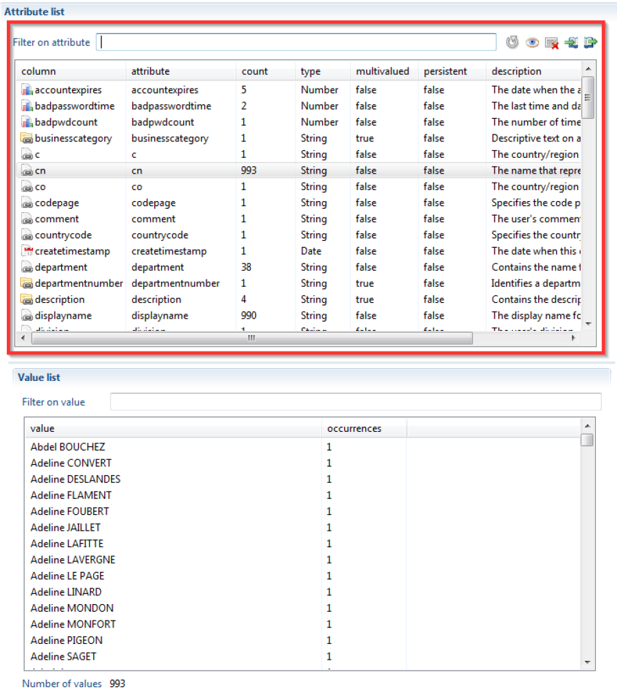    

You can configure transformation or filtering actions by right-clicking on the attributes.   
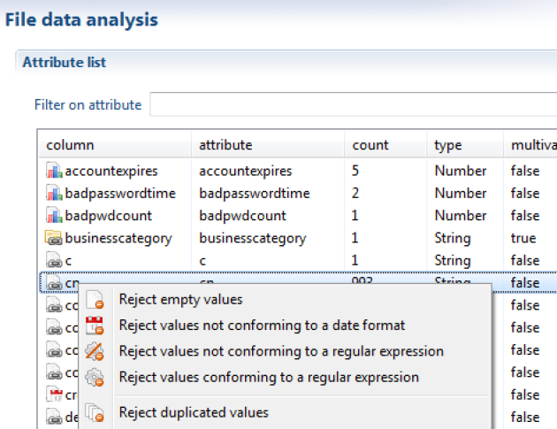    

A toolbar is present in this section. The buttons correspond to the following actions:   
    

##### Left Part - Second section: List of Values

Once an attribute is selected in the first section, the second section of the analysis editor (List of values) allows you to view all of the various values of the attribute as well as the number of occurrences of each value.
    

Right-clicking on a value allows you to configure filtering or transformation operations on the basis of the selected value. It is possible to select several values by holding down the "Control" key while you click.   
    

##### Right part - First Section: Results

The first section, "Results," presents the results after the application of the various transformation operations. The results are displayed as a table, with columns corresponding to the initial columns and/or computed columns. The values correspond to the values that were potentially transformed.   
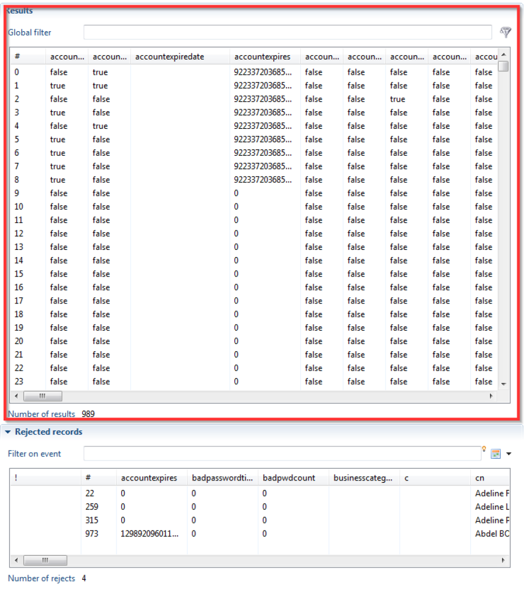    

It is possible to sort the results by right-clicking on the column headers. It is also possible to filter the results in order to display only a subset of them. You can perform this operation by right-clicking on the column headers.   
    

It is also possible to configure filtering by right-clicking on a value or series of values in the lower left side of the editor.   
    

Right-clicking in the results area allows you to export the results in CSV format.
    

##### Right Part - Second Section: Rejected Records

The second section, "Rejected Records," presents the records that were filtered during the file analysis. This filtering is the consequence of the configuration of "rejection" actions or filtering actions, such as requiring a value or series of values in a given record. An event may be associated with a rejection; in this case, the event is displayed in the first column.
    

As in the "Results" section, it is possible to filter the values and export the content of the section in CSV format.    
The rejected records that contain an event name will be saved in a rejection file when the collector is run. We invite you to consult the documentation about the "runtime plan" for more information about the log files.  

#### Preferences

The product automatically keeps the order and the width of the columns in tables. As such, after editing the position and the width of columns in tables trough the product, the changes made by the user are preserved as long the file being worked on is kept open.     

---

<span style="color:grey">**Note**</span> This functionality is available, among others, in: 
- The view editor
- The rule editor
- The discovery editor

---

### Collector Editor

To be able to comfortably use the collector editor, the first thing to do is to switch to the iGRC Analytics perspective. A _perspective_ is an organization of windows in the workflow. The iGRC Analytics perspective is structured around the editing window. The editing window alone is not sufficient to carry out a collector work session (editing and/or execution). You must also display other windows called _views_ in the center of the screen that complement the collector line editor. The most important view is the Properties view displayed below the editor because it allows you to change the settings of the component selected in the editor.   


#### Editor

The editor allows you to create, edit and save a collector line. To create a collector line, you must go through the wizard, which asks for the name of the file, some background information, as well as a script selection. The script referenced here is where the JavaScript functions used in the collector line must be created.   
The wizard creates one or two files depending on the option chosen for the script in the collector's directory:   

- .collect file: file containing the collector line
- .javascript file: initially empty file, able to contain the JavaScript functions

Once the editor is open, the Collector tab is selected and two parts are visible:
- the editing area: This is the area in which the collector components are dropped and connected to form a collector line
- the component palette: The palette displays the tools and all the available components

The collector editor offers the following tabs:
- Collector tab: Graphic editor to create the sequence of components involved in the collector.
- Properties tab: Not to be confused with the properties view, the properties tab in the collector editor displays the information entered in the collector line wizard.
- Configuration tab: Allows you to define different configurations for running the collector line. Each configuration contains variables, which may have a different value in each configuration.
- Dependencies tab: List of files used by the collector line. Note that the dependency tree only has one level.
- Usage tab: List of files that reference this collector line.
- Source tab: XML source of the collector line.

#### Component Palette

The component palette separates the components into three categories: sources, filters and targets. The upper part of the palette provides some tools which allow you to change editing mode. The editor provides three editing modes depending on the tool or component selected in the palette.

- Selection: This mode is activated by clicking the cursor 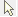 in the palette toolbar or on the selection marquee . It allows you to select one or more components in the editing area.
- Link: This mode is activated by clicking on the arrow icon  in the palette toolbar. This provides the means to connect two components by selecting the first and then the second.
- Creation: This mode is activated by clicking on a component in one of the three categories. It lets you create a component in the editing area.

##### Editing Area

There are two ways to create a component in the editing area.   
- The first way is to click on the desired component in the palette, then click in the editing area.
- The second method is to drag/drop the desired component from the palette to the editing area.

The component then appears in its default size. If the component is not in the desired size, it can be resized horizontally by using the handles. A toolbar is available under the menu to position, align or resize several components automatically. The meaning of the icons is given below:   
- 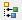 : This icon left-aligns the selected components vertically.  
-  : This icon centers the selected components vertically.   
-  : This icon right-aligns the selected components vertically.
-  : This icon top-aligns the selected components horizontally.   
-  : This icon centers the selected components horizontally   
-  : This icon bottom-aligns the selected components horizontally.   
-  : This icon resizes the width of the selected components.   
-  : This icon resizes the height of the selected components.   

---

<span style="color:red">**Important**:</span> CSV, LDIF, XML and formatted source type components open a wizard to select the file to be processed. This dialog box only opens if the properties view (bottom window) is displayed.   
When you click once on a component, it is selected and a border appears allowing you to resize it. By double-clicking on the editing box (the white area inside the component), the component enters editing mode and a cursor appears to allow you to enter the title.

----

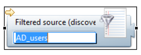   

All the traditional functions like cut, copy, paste, delete, undo and redo are available to manipulate the selected component(s).   
By right-clicking on a component, a contextual menu opens. Menu items specific to the collector are shown in the screenshot below:  

   

- Set as starting point: This menu item is only activated if the selected component is a source. It allows you to identify the main source in the collector line. Once activated, an arrow icon  appears in the upper left of the component. There can only be one starting point. If a starting point has already been set for a component, setting a starting point on another component will remove the old starting point.
- Enable/Disable as an ending point: This menu item may only be activated for a terminal component (having no transition to other components). An ending point designates the component that gives its datasets to the calling collector line. Once activated, an icon symbolizing the ending point  appears at the upper left of the component. There can be only one ending point.
- Toggle a breakpoint: This menu item allows you to set or remove a breakpoint. Another way to place it is to double-click on the component. An icon representing an insect  appears at the bottom left of the component. When running in debug mode, the collector engine stops at the component's entry if it is marked with a breakpoint. This allows you to inspect the contents of the current dataset.
- Package as a component: This menu item applies to the entire collector line and not to the selected component. It can be activated even when the contextual menu is open without selecting a component. A packaging wizard opens and asks a few questions to transform the entire collector line into a library (a .component file in the library directory). The collector line is not affected, however, and can always be edited and executed independently of the new component, each of them being uncorrelated now.

##### Properties

By default, the properties view displays the diagram of the collector line. When a component is selected in the edit box, the view displays the properties of the component. The properties are grouped by themes in tabs. To display the diagram of the collector line again, just select the bottom of the edit box without clicking on a component or connection. The properties view displays the following table:

   

Information modified in the properties view is taken into account immediately. It is not necessary to confirm by pressing the Enter key. However, some fields, such as text boxes, are validated only when the focus moves to another field. To do this, after you enter the information, simply click on another field in the properties view or another component of the editing area.   
Most of the fields in the properties view offer data entry help in the form of an icon  to the right of the field. This is usually an icon that opens a menu with various entry options for the field. This is particularly true of fields requesting an attribute name. A click on the Help icon opens a menu displaying all of the attributes. Selecting an attribute will replace the contents of the field with the name of the selected attribute.

   

Some fields are text fields in which it is possible to insert a JavaScript expression in the middle of text. This type of field provides two forms of assistance:
- An icon to the right of the field: The light bulb icon  opens a menu with suggestions as in most other fields.
- Auto-completion: This assistance is activated by simultaneously pressing the keys Control-Space. A menu appears with suggestions relating to the context. This contextual menu is very different from the menu opened by the icon to the right of the field because suggestions depend on the location of the cursor within the text. The type of help offered is related to the JavaScript language. It either completes a partially entered keyword or gives suggestions on method names or attribute names.

##### Overview

The overview is a view that displays information about the collector line in three different ways. In the overview toolbar, there are three icons to change the view mode:

- 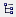 : This icon displays the list of components present in the collector line. A click on the component selects it in the editing box.
-  : This icon displays the complete diagram of the collector line with a frame indicating the visible part if the editing box is not large enough to display the entire line. By moving this rectangle, the editing area displays the corresponding portion of the collector line.
-  : This icon displays the diagram of the collector line. This is the same display as in the properties view, but presented vertically.

#### Configuration Variables

In a collector line, it is recommended that you not hard-code the values ​​that depend on the technical environment. The best example is the name of the file to load into a source component. If this name is hard-coded by the collector line's designer from his local file tree (C:\Users\Paul\test.csv), the collector line will not work when it is published on a Linux server.   
To manage this, we must define two configurations, one for development and another for production. In each of these configurations, the same variables are defined but their value depends on the configuration in which they are located. For example:

|**Variable**|**Development**|**Production**|
|:--|:--:|:--:|
|`source_file`    |`C:\Users\Paul\test.csv`|`/var/applis/rh/export_rh.csv`|
|`external_import`|False                   |true                          |   

All the variables are single-valued strings. These variables are local to the collector line. If multiple collector lines must use the same variables, it then becomes necessary to define variables at the project level. The project editor contains the same configuration and system variables, but these variables are all accessible from any collector line.   
If a variable is defined in both the collector line and at the project level, the collector line value always has precedence over the project value. This allows you to override the suggested project variables in a collector line to give them a different value locally.

#### Component Properties

The properties view of a component is related to the selection in the collector editor. When a component is selected, the properties view displays the information about that component. Most of the information to be entered in the properties is populated with values independent of context, or with attribute names.   
However, some fields require the use of configuration variables or JavaScript expressions to make the property values dynamic when the collector line is run. This chapter explains how to use a configuration variable as well as a JavaScript expression.

##### Using a Configuration Variable

Configuration variables, whether they are defined in the collector line or in the project, are always used in the same way. In a field where a value is expected, part of the value may be a configuration variable. The syntax uses the keyword `config` followed by a dot and the name of the variable, all within brackets like this:   
`{config.source_file}`   

The above content may be entered directly into the 'CSV File' of the 'Source CSV' component properties. At runtime, the collector engine detects opening and closing brackets, and concludes that we must evaluate the content inside the brackets and use the result as a CSV file name. The following screenshot shows an example of properties from a CSV source:    

   

Instead of entering `{config.source\file}` in the 'CSV File' field, it is better to click on the small light bulb  to the right of the field and select the variable. This fills the field with the correct syntax and without typos. However, you must have already created the variable in the Configuration tab before you can select it with the small light bulb.  
In practice, it is rare to enter a configuration variable directly into a field. In the example with the CSV file name, it is more likely that the file was selected through the wizard, which, when it closes, fills in the 'CSV File' field with the path of the selected CSV file. The initial situation is then different because the 'CSV File' field is filled and the `source_file` variable does not exist in the Configuration tab. In this situation, simply click on the small plus icon  which opens a dialog box like this:   

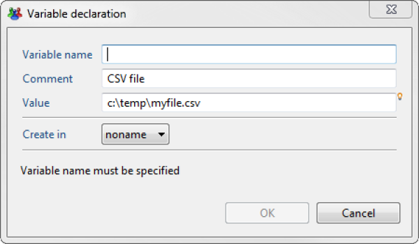    

Now you just need to enter the name of the variable (in this case `source_file`). When the dialog box is validated, the `source_file` variable is created in the configuration, the value C:\Users\Paul\test.csv is given to the variable, and the field content is replaced by the syntax {config.`source_file`} in order to use the variable.

##### Using a JavaScript Expression

The use of configuration variables is not always sufficient, in particular when it is necessary to modify the content of a dataset attribute with a calculated expression. In this case, the product provides the possibility of entering a JavaScript expression in a field so that the when the collector engine runs, it may calculate the result of the expression and use it as the field value.   
The syntax is the same as for a configuration variable. The expression must be enclosed in brackets so that the engine collector recognizes its presence. JavaScript expressions are very useful in the modifying component. Its purpose is to create or modify an attribute in the dataset. It is valuated with a value that may be a constant, but a JavaScript expression may be used to make the allocation more dynamic. For example, a new attribute containing the first name followed by a space and the last name in uppercase will be valuated as follows:

```javascript
{dataset.firstname.get() + ' ' + dataset.lastname.get().toUpperCase()}    
```

The full syntax is described in the chapter on [macros and scripts](igrc-platform/collector/macros-and-scripts/macros-and-scripts.md).  
Fields that allow entry of a JavaScript expression also have a small light bulb icon  to the right of the field. These fields also offer auto-completion to help enter an expression. Pressing the Control-Space keys at the same time opens a pop-up window with suggestions related to the cursor position as shown in the screenshot below:   
    

The syntax is identical between the configuration variables and JavaScript expressions because the configuration variables are referenced in JavaScript. The `{config.source_file}` syntax is a JavaScript expression using the predefined variable config and the `source_file` property of this variable.  
It is quite possible, in the same JavaScript expression, to manipulate both the dataset and the configuration as shown in the example below:

```javascript
{dataset.unique_ID.get().toUpperCase() + config.suffix.toUpperCase()}
```

#### Running a Collector Line

There are three different methods for running a collector line:   

- Debugging in the studio: This method of execution allows you to put breakpoints on a component or in a JavaScript script. The execution pauses when a breakpoint is reached, allowing you to verify the content of the dataset and the proper sequencing of components. All the messages generated by the collector line are sent to the Console view.
- Running in the studio: This method of execution is to be used when the collector line has been verified in the debugging mode. It runs the collector line without leaving records in the Console view.
- Batch mode execution: The purpose of this method of execution is to run the collector line in a recurring fashion through a command line on a production environment. The product's installation directory contains two files, one for Windows and the other for Linux, to start the collector engine without a graphical interface. Note that the command line only starts the collector. To automate the launch at a certain time and in a repetitive fashion, you must use the tools offered by the system (Task Planner in Windows and cron in Linux).   

In all of the execution methods, the messages generated by the collector engine are systematically sent to log files located in the log directory of the project.

##### Selecting a Sandbox

The objective of the collector is to create timeslots in the ledger. Running a collector line does not directly fill out a timeslot in the ledger, but in a sandbox corresponding to the temporary storage area before validation. The overall operation is to create a sandbox, launch all the collector lines, check the integrity of everything that was imported, and then validate the whole thing to create a new timeslot in the ledger.   
Running a collector line in the studio always opens a dialog box asking whether to create a new sandbox or whether to continue in an earlier sandbox. The idea is to create a sandbox for running the first collector line, and continue in the same sandbox when other collector lines are run. The screenshot below shows these two choices when a collector line runs:   
    

The Cancel button cancels the launch of the collector, while the OK button starts it with the selected sandbox.   

##### Debugging

Activate running in debug mode by right-clicking inside the work area of the collector line editor. In the menu 'Debug As', choose 'Collector line' as shown in the menu below:   
    

If the execution of the collector line was launched in debug mode, the collector engine reflects breakpoints positioned on the components or in the JavaScript. Breakpoints may be defined at any time, even while the collector line is running, but it is easier to choose the breakpoints before running the collector. In the collector editor, an breakpoint is enabled or disabled through the contextual menu or by double-clicking on a component. An icon representing an insect  appears at the bottom left of the component.   
When the collector engine encounters an breakpoint, it asks to switch to a perspective showing the 'Battery runtime', 'Variables', 'Breakpoints' and 'Console' views so it can inspect the current dataset and visualize the route taken among the components. The screenshot below shows the different views in the Debug perspective:   
    

The runtime stack displays the list of components in the reverse order of execution. The first in the component list is always the component that is currently running. The other components correspond to the dataset route starting from the source. The most useful view is probably the Variables view which displays the contents of the current dataset. If an attribute of the dataset has changed in value since the last breakpoint, it is displayed on a yellow background. Finally, the console displays either traces or events in different colors depending on their level, ranging from gray for debug messages to red for errors.

#### Packaging a line as a component

The standard product offers about twenty components. As part of a client project, collector lines are produced, tested, and run. It is very likely that from one project to another, certain parts of collector lines will be reused. Of course, a copy/paste allows you to take all or part of a collector line for use in another collector line.   

However, the product provides a more structured method for sharing recurring behavior. The consultant may capitalize from one project to another by packaging a collector line as a component and thus gradually build a complete library of components. All the components created in this way are displayed in the Component Palette of the collector editor and may be used very easily in the same way as standard product components.   
Packaging a collector line as a component is very easy, since all you have to do is right-click in the collector line and choose the menu 'Package as a component'. A wizard opens and allows you to choose the title, description and icon. Once the dialog box is validated, the new component is created in the library directory.   
But this operation is to be performed only when the collector line to be packaged has been fully debugged and made generic. The whole process to create a reusable component is as follows:   

- Creation of a collector line to be packaged: It is important to understand that packaging a collector line covers the whole line and not a selection of components. So you must structure the processes in two collector lines: one line to be packaged, which only contains generic processes, and another line to test the first. The following screenshot shows the collector line to be packaged with a source and a modification component which adds a calculated attribute.   

    

Note that it is important to define a starting point and an ending point, allowing you to specify which source component to execute and which component returns data to the calling line. For now, the path of the CSV file to be processed is directly mentioned in the 'CSV File' parameter of the CSV source component as shown in the screenshot below:   

    

- Creation of a test collector line: This is the second step. To validate the collector line to be packaged, we must create a second one that uses the first one. The following collector line is created with a collector line source component:

    

The collector line source component refers to the collector line to be packaged. 

- Debugging the two collector lines: The test collector line can now be run in debug mode to verify that it is functioning properly. To this end, a route type component has been placed after the source collector line. This component does nothing, but it allows us to add a breakpoint to follow the dataset content returned by the source collector line.
- Using configuration variables: When both collector lines are working, we must make the filename of the line to be packaged configurable. Otherwise, there is no point in packaging the line since it will be read-only in the intern1.csv file. Configuration variables are used to pass parameters from one collector line to the other. A variable must be defined in the collector line to be packaged and it will be valuated by the test collector line. To do this, you must edit the collector line to be packaged again and create a variable by clicking on the plus button  at the bottom right of the 'CSV File' field. After entering the variable name 'file\_path' and validating the dialog box, the box will close and the 'CSV File' field content is replaced by a macro like this:   

    

The configuration variable must now be valuated by the test collector line. To do this, you must edit the test collector line, select the source collector line component and, in the properties view, Configuration tab, click on the Add button to complete the dialog box as follows:   

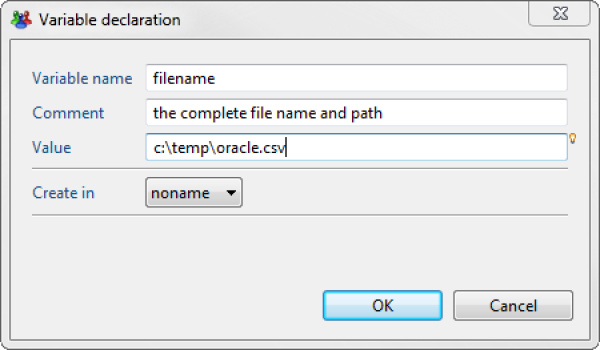    

The two collector lines may be tested again to verify that everything works as before.   

- Packaging the collector line: The first collector line is now ready to be packaged. To do so, open the contextual menu in the first collector line with the right mouse button and choose 'Package as a component'. In the dialog box, choose to create a source type component, since the collector line is used as a data source. **Warning:**  the inclusion of the new component only occurs when the studio starts up. You must therefore exit the application and restart it to see the component appear in the palette of the collector line editor.
    
-     
- Test the component in the main collector line: The test collector line may be modified to test the new component. To do this, you must remove the source collector line and drag/drop the new component into the palette. Do not forget to connect the new component to the route component and define the new component as a starting point as shown in the screenshot below:   

    

Modifying the test collector line   

In the same way, you must edit the configuration tab of the new component's properties to pass on the file name that is defined as a variable. Same method as above, by clicking the Add button and entering the full path for the 'file\_path' variable. Once the dialog box is validated, the table of variables passed to the component looks like this:      

    

Table of variables passed to the new component   

The collector line may be tested again to verify that its behavior is identical.    
Note that it is possible to see the contents of a component present in the library directory. If you double-click on it, a window opens to show the dependencies between libraries, an image of the packaged collector line, and the list of variables expected, with their default values.    

### Silo Editor

#### Silo Creation

To creating a new silo can be done either by clicking on the new \> silo options of the audit menu:    

   

Or by right clicking in the Project Explorer New \> New silo file:  

    

This opens the creation wizard where you have to:    

- Name the silo file
- Provide the silo identifier, this has to be unique in your project
- Declare the silo type (see [here](igrc-platform/timeslots-and-execution-plan/collecte-et-silos/dependances.md) for more information)
- Provide a description for the silo (option)

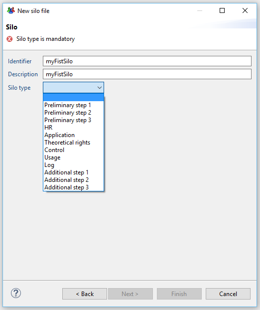    

#### The Silo Editor

This silo editor includes different tabs :

##### Silo

The .silo files are separated into three different sections:  

- Silo parameters
- Collector
- Constants for use in collect lines and mapped into dataset  

     

The parameters section provides the information related to the silo. This is where you can configure the dependencies of the silo (see [here](igrc-platform/timeslots-and-execution-plan/collecte-et-silos/dependances.md) for more information).   

---

<span style="color:grey">**Note:**</span> It is not possible to change the type of the silo once it has been created.

---

The collector section allows you to define the collector line associated to the silo. A number of buttons are at you disposal to:
- select an existing collect line
- clear the field
- create a new collect line
- run the silo validation to check the integrity of the loaded data
- run the silo
- run the silo in debug mode

The collector section also allows you to configure if you which to iterate over several files (such as different AD domains which include one import file per domain). Please see [here](igrc-platform/timeslots-and-execution-plan/collecte-et-silos/iteration-collect-and-silos.md) for more information.    

Finally, the constant section allows you to declare some fixed constants and/or attributes to map to your targets. Please see [here](igrc-platform/timeslots-and-execution-plan/collecte-et-silos/using-silo-contants.md) for more information.  

##### Extract  

This section allows you to configure your data extraction performed by using the the connector capabilities of the product.  

For more information on Extractors and connectors please refer to the corresponding documentation ([here](how-to/how-to.md)).     

     

##### Validation  

This tab allow part of the configuration of the automatic data validation.  

> You need to configure validation on the [Discovery](igrc-platform/getting-started/product-description/using-the-editors/discovery-editor/discovery-editor.md)  

     

##### Dependencies /usage / Source  

These final tabs that are in common with the other editors allow you to:  

- Find the files that depend on the current silo  
- Find where the current files is used in the project
- visualize the XML source format of the current file

---

<span style="color:grey">**Note:**</span> The calculation of the dependencies and the usage of the current file requires to search the entire brainwave model and can be relatively time consuming.

---
### Audit Rule Editor

#### Context

The audit rules are located in the _'/rules'_ sub-directory of your audit project. The audit rules carry the extension `.rule`.   

New audit rules can be created by copying and pasting the existing rules or by using the Creating Audit Rules Assistant (contextual menu 'New'\>'Audit rule'). Your audit rules should be located in the `/rules` sub-directory of your audit project.   
To get the best from the functionalities of the audit rules editor, open the '_iGRC Analytics_' perspective.   
The audit rules editor looks like this:    

    

The audit rules editor is made up of the following views:   

- Central panel: Graphic editor for creating audit rules
- Right: Palette containing the various available Ledger components for creating the audit rule
- Bottom: Properties of the audit rule area
- Bottom left: Overall view of the components of the Ledger used in the audit rule
- Top left: Project files

#### Available Tabs

The graphic editor for the creation of audit rules is made up of a series of tabs:   

##### Rule

Graphic editor for creating the audit rule.
    

##### Results

Results of the audit rule.
   

##### History

Management of the history of the audit rule's results.


##### Dependencies

List of the rules for the project on which the audit rule relies
   

##### Usage

List of the rules, views and reports from the project using this audit rule.
   

#### Editing a Rule

Adding criteria to the audit rule is carried out by simply dragging and dropping the questions about the attributes of the Ledger from the components palette. Several types of elements can be added to the audit rule:   

- Criteria for the chosen concept
- Links from the chosen concept to other Ledger concepts
- Sub-rules of the audit applied to the chosen concept

The rules criteria can have parameters. The parameters can be represented by text in the form of a hyperlink enclosed by the symbols `{}`. Editing a parameter can be performed by double clicking on the hyperlink.   

Several types of parameters exist:   
- Mono valued text value

   

- Multi valued text value

   

- Numeric value

   

- Date

   

---

<span style="color:grey">**Note:**</span> The contents of the palette of components are subjugated to the selected element in the audit rule editor.

---

The test values can either be static values or parameters of the audit rule.   
The results of the configuration can be tested directly in the parameter editing box with the help of the lower section of the box 'Test the criterion'.    
It is also possible to access an assistant for data entry in text fields by positioning the cursor within the field and pressing the 'Ctrl+Space' keys.   
   

In the case where several rule criteria are applied to a concept, it is possible to choose to apply the grouping condition (AND/OR). This operation is performed by double clicking on the AND/OR switch of the concept or by selecting the contextual entry in the menu 'Change operator between the criteria (AND/ OR)'. The links that follow this concept change colour depending on the chosen operation and thereby allow visualization of the range of the combination: red links for an AND operation and green links for an OR operation.   

   

It is also possible to make sub-combinations of criteria. This operation is carried out with the help of the component of the group of criteria present in the upper section of the palette . To do this simply drag and drop this component into the audit rule editor. The group operator allows AND/OR/NO operations to be performed on the criteria. In the case where the criterion 'NO' is used, the condition is formulated as 'NO OR' or 'NO AND'.     

   

It is possible to facilitate the clarification of the audit rules by displaying the intermediate results of the rule. This operation is performed with the help of the contextual menu 'Show/Hide the numbers of results' 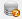  . Activating this option displays the number of results returned for each criterion as well as the unit time taken to extract the information from the Ledger.   

   

It is also possible to display partial results of the criteria or sub-concepts of the audit rule by double clicking on the criteria text or by double clicking on the sub-concept icon.   


In the case where links are used between concepts it is possible to configure enumeration constraints. This operation is performed with the help of the contextual menu 'Modify the enumeration parameters' on the sub-concepts of the rule.   

   

Once it has been configured, the enumeration will appear in the upper section of the concept.   

   

A 'text' version of the configured rule is accessible through the rule properties editor under the 'Description' tab. Double clicking on the hyperlinks allows the parameters to be edited.   

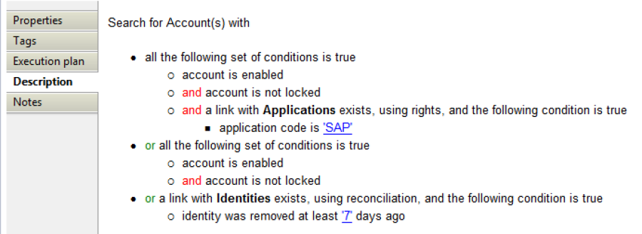
### Reconciliation Rule Editor

#### Context

The reconciliation rules are located in the `/reconciliation` subfolder of your audit project. Reconciliation rules have the extension `.reconrule`.   

It is possible to create new reconciliation rules by copying and pasting existing rules or with the reconciliation rule creation wizard, in the contextual menu 'New  \> Reconciliation rule'. The reconciliation rules are located in the `/reconciliation` subfolder of your audit project.   
To make the most of the reconciliation rule editor's functions, open the 'iGRC Analytics' view.  
Here is an overview of the reconciliation rule editor:   

    

The reconciliation rule editor is made up of the following views:    
- Central panel: Graphical editor for creating reconciliation rules
- Right: Palette that contains the different Ledger items available to create reconciliation rules
- Bottom: Reconciliation rule properties
- Left: Project files   

Graphical editor for creating reconciliation rules is made up of a series of tabs.   

#### Available Tabs
##### Rule

Reconciliation rules creation graphical editor.
    

##### Result

Reconciliation rule result tab. The "**Results**" tab is made up of the following sub-tabs:   

- Rule simulation: 

Allows you to simulate the reconciliation rule results. It is not possible to perform these actions in the sub-tab because there is still no information entered in the database.


- Ledger: 

Allows you to consult reconciliations that are already found in the ledger and to carry out manual reconciliations on an account.   

    

##### Dependencies

List of project rules on which the reconciliation rule is based.   
    

##### Usage

List of project rules, views and reports that use this reconciliation rule   
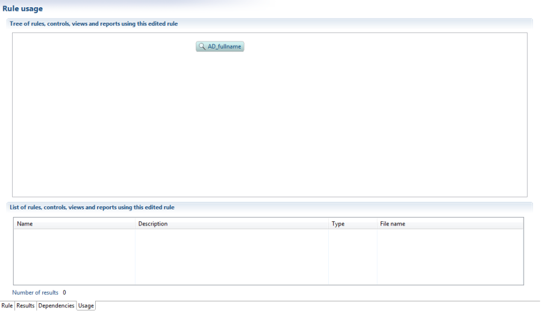    

#### Editing a Reconciliation Rule

The addition of criteria to the reconciliation rule is done by simply dragging and dropping Ledger attribute questions from the item palette. Several types of items can be added to the reconciliation rule:    

- Selected concept criteria
- Links from the selected concept to other Ledger concepts.
- Selected concept reconciliation sub-rules    

Reconciliation rule criteria have parameters. These parameters are represented by text in the form of a hyperlink enclosed in curly brackets `{}`. A parameter can be edited by double clicking on the hyperlink. Please consult the 'Audit rule editor manual' for more information about the types of parameters that exist.   

---

<span style="color:grey">**Note:**</span> The content of the item palette is controlled by the item selected in the reconciliation rule editor.

---

### Audit View Editor

#### Context

Audit views are found in the `/views` sub-folder of your audit project. Audit views have a `.view` file extension.    
It is possible to create new audit views by copying and pasting existing views or via the Audit View Creation Assistant (contextual menu 'New' \> 'Audit View'). Your Audit Views must be located in the `/views/custom` subfolder of your audit project.    
To make best use of the functions of the Audit View Editor you can open the 'iGRC Analytics' display. The Audit View Editor is displayed as follows:   
    
**_Audit View Editor_**   

The Audit View Editor can be broken down into the following views:   

- Central panel: Graphical Audit View Editor
- Right: Palette containing the elements of the Main Ledger available for Audit View creation
- Bottom right: Audit View properties
- Bottom left: Summary of the Main Ledger elements used in Audit View
- Top left: Project folders   

The graphical Audit View Editor consists of a series of tabs.

#### Available tabs

##### View

Graphical Audit View Editor to create and edit views.
    

##### Results

Results of the Audit View.
    

##### Dependencies

List of the project rules that underpin the Audit View.
    

##### Usage

List of objects using this Audit View.
    

#### Editing a View

Elements are added to the Audit View by dragging and dropping elements from the Main Ledger to the toolbox. Several types of elements can be added in the Audit View:   

- Attributes of the selected concept
- Links between the selected concept and other Main Ledger concepts
- Audit rules applied to the selected concept   

---

<span style="color:grey">**Note:**</span> The content of the toolbox is subject to the element selected in the Audit View Editor.

It is also possible to add time-based attributes to the concept in the root of the Audit View.

Attributes that are merely linked to concepts are hidden by default in the View Editor to improve the readability of complex views. You can hide or un-hide these attributes by double clicking on the  icon. The number of hidden attributes appears in red at the end of the concept.

---

Labels of attributes are editable by double clicking on the attribute or via the 'Edit Attribute Properties' contextual menu.   
    

Attributes may be masked from the results table. This is particularly useful when the user wishes to apply a filter to an attribute, without this attribute affecting in turn the multiplicity of the results returned.   
This operation is carried out by checking the 'Do not include in the list of attributes returned' in the editing window of the attribute's properties.   
    

A prefix may be added to all attribute names in a view by double clicking on the concept icon in the graphical editor, or via the 'Modify table prefix' contextual menu.   
    

All attributes of a concept may be added via the contextual menus:   

- **Add all standard attributes:**  Adds all the concept's attributes, except custom attributes ('custom') and those relating to ad-hoc naming ( **'refvalue'** )
- **Add all attributes** : Adds all the concept's attributes, including custom attributes ( **'custom'** ) and those relating to ad-hoc naming ('refvalue').
- INNER: '[inner join](http://en.wikipedia.org/wiki/Join_%28SQL%29#Inner_join)' between the Audit View Concepts
- LEFT: '[left outer join](http://en.wikipedia.org/wiki/Join_%28SQL%29#Left_outer_join)' between the Audit View Concepts     

Finally, it is possible to change the multiplicity of relationships between the Concepts used in the Audit View by double clicking on the text over the links.

### Report Editor

To make the most of the features of the report editor, open the 'iGRC Reports' perspective. The report editor looks like this:    

    

The report editor consists of the following views:   

- Central panel: Graphical editor for report layout
- Right: Palette containing the various chart elements available for reports
- Bottom: contextual properties area, associated with the selected item in the graphical layout editor
- Bottom, left: Overview of elements used in the current report
- Top, left: Project Files   

The area at the top left contains two additional tabs, these tabs are:

    

    

- Report data configuration area: Allows you to configure access to the data of the identity ledger from the report, as well as the various parameters it is possible to pass to the report
- Share resources selection area: Allows you to select shared resources to use in this report   

The graphical editor of the report layout consists of a series of tabs (Layout, Master Page, Script, XML Source, Preview). The tab that is useful initially is the Layout tab for graphical editing of reports.   

It is possible to preview the reports while clicking the 'View report' button on the Brainwave Identity GRC Analytics toolbar, choosing "In Web Browser".   

---

<span style="color:grey">**Note:**</span> If you're using Internet Explorer 11, please follow [those directions](how-to/misc/IE-11-preview-errors.md).|

---

    

Reports can be run and generated in multiple formats. To do this, use the 'View report' button on the Brainwave Identity GRC Analytics toolbar. Supported formats are:   

- HTML
- PDF
- Postscript
- Microsoft Word
- Microsoft Excel
- Microsoft PowerPoint
- OpenDocument Text
- OpenDocument SpreadSheet
- OpenDocument Presentation   

It is also possible to export the parts of a report in CSV format.   

    

#### Viewing Interface     

When you use the 'View report' button on the Brainwave Identity GRC toolbar, or when you use the Brainwave Identity GRC web portal, you can access the web interface for viewing reports. This interface dynamically generates reports in HTML format as the user browses. The report settings may be dynamically edited; it is possible to export the information presented in various formats, and to print. It is also possible to dynamically change the report settings and regenerate it. Finally, the reports are formatted: A table of contents can be generated, and the display is paginated. This chapter describes the user interface of the report viewer.

The report viewer consists of a central window which displays the report, as well as a toolbar allowing many actions: navigation, exporting, printing, and configuration. The reports are dynamically generated in HTML format. Hyperlinks are included in the report, allowing the user to navigate between reports in the same way as in a traditional application.    

    

The upper part of the report viewer consists of the following toolbar:      

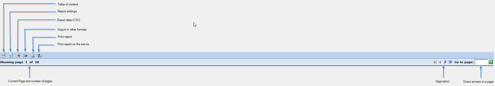    

- Table of Contents: Displays the contents of the report on the left side of the report, in the form of a series of hyperlinks providing direct access to relevant parts of the report. Please note: not all reports have tables of contents
- Report Settings: Allows you to dynamically change the settings of the current report. This interface is particularly useful in research and analysis reports. Changing report settings triggers the generation and display of a new report.


- Export a part of the report in CSV format: Allows you to export a part of the report (list, table) in CSV format so you may use it in a third-party tool. The export uses a configuration box allowing you to select the part of the report to export, the columns to export, and the format in which to export   


- Generating the report in a different format: Allows you to generate and download the current report layout locally in a different format (PDF, Word, Excel, ...). An export interface allows you to select the export format and layout options of the report when it is created   


- Printing the report on the client's computer: Starts printing report locally. Two print options are available: Creation in HTML format suitable for printing, or report creation in PDF ready for printing   

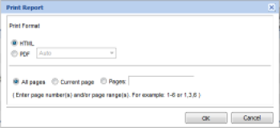

- Printing a report on a server printer: Allows you to print the report with the help of a printer configured on the server hosting the Brainwave Identity GRC web portal. This feature is particularly useful when the client navigation interfaces do not have a local printer configuration   


- Current page and number of pages in the report: Displays the information related to the report's pagination. To optimize the display, reports are paginated. If the report consists of several pages, use the buttons on the right side of the toolbar to navigate through the report. Another alternative is to use the table of contents if the latter is present
- Navigation in the pages of the report: Allows navigation through the paginated report if it consists of several pages
- Direct access to a page of the report: Allows you to access a specific page of the report   

#### Create Dedicated Reports

All reports available in Brainwave Identity GRC are located in the `/reports` subdirectory of your audit project. Reports are sorted according to whether they are related to navigation or to data analysis. Reports have the extension: `.rptdesign`.

Dedicated reports may be created either by performing an operation to copy/paste an existing report in the file view of the project, or through the wizard to create new reports. Dedicated reports must be located in the `/custom` subdirectory of the `/reports` directory of your project.

### Configuration Editor

#### Introduction  

The aim of the configuration file is to help separate between what belongs to the project configuration and what is specific to a local instance of Brainwave GRC (_e.g._ database configuration, absolute paths etc).

This also has the further advantage of preventing data loss when your local configuration or project file gets overwritten. This can occur if you share your project using a version management tool for instance.  

It is also now possible to maintain several configurations concurrently, edit them, share them, even prepare configurations that will not be used locally (like a production configuration for example).  

Finally, all the local configuration is now grouped within a single file. This allows the user to review all the information in a dedicated editor instead of having to browse scattered properties files ; namely, this file will hold the configuration for the database connection, the mail server, the web portal, the workflow database and values for the project global variables.   

You can select, create or clone a configuration using the the audit menu:    
    

The configuration files must all be located in the configurations folder of the project (in the project explorer).   

Here is an overview of what the configuration editor look likes:    
    

#### Migrating From Previous Versions

If you have been using a version prior to 2015 R1, you might notice that the features that were once included in the project configuration have now been moved to the configuration editor.    

This is the case for the database configuration. It is no longer available as a tab in the project file. This is the reason why **it is imperative that you take the steps to migrate your project** , otherwise you won't even be able to connect to the database. Fortunately, this is quite easily done.    

The first time you open your project in the main menu, you will be prompted to create a new configuration from the existing files.   
Alternatively, you can manually migrate your projects configuration manually. Navigate to the "Project" tab of your project configuration. A new option "Migrate old project configurations" is now available, which when clicked will examine your previous configuration and will create as many configurations as were defined for the global variables, and automatically select the default configuration as the current one.   

    

The active configuration can be selected in the "Current configuration" combo.  

#### The Technical Configuration Tabs  

##### Variables

This tab contains all project variables. These can be defined directly within the project tab of the project configuration or using the `.configvariables` files.    
Those variables will then be available in every .configuration file, where specific values for those variables can be edited.   

---

<span style="color:grey">**Note:**</span> All variables whose name contain "password" (in a case insensitive manner) will be considered as passwords, and will automatically be encrypted.

---

##### Ledger Base  

The ledger base tab allows the user to configure the connection to the ledger database (iGRC).    

This tab allows you to:   
- Create update or modify the connection profiles to the database
- Manually update the statistics of the database
- Define the database as a 'Production database'. This removes the possibility to delete the data loaded in the database
- Initialize ore re-initialize the database by deleting all the data
- Create the project indexes (see the corresponding documentation for more information)

The connection parameters corresponding to the selected database configuration are displayed on the right hand side of the top section.   

In the bottom section of the tab the user has the possibility to manually edit the connection parameters to the database.   
This is especially useful if you want to prepare a configuration while not having direct access to the database that will be used.   
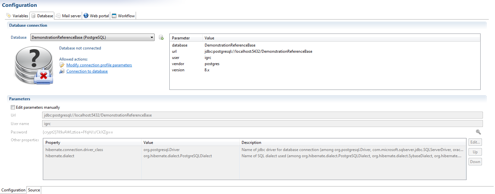    

##### Execution Plan Configuration  

The execution plan tab includes all parameters relating to the execution plan.   

---

<span style="color:grey">**Note:**</span> The execution actions, either a global or step by step run, are still located in the project configuration.   

---

These parameters are separated into 3 different sections:    

###### The Configuration of the Execution Plan Steps   

This allows the user to configure the name of the executed timeslot. However, This name must incorporate a date parameter to be taken into account when launching the execution plan in batch mode. The temporal criteria can be selected by using the selector on the right of the field.   

This section also allows the user to define:   

- The rule listing the active identities to use during the execution plan
- The reconciliation policy to use during the execution plan
- The manager policy to use during the execution plan
- The entitlement policies to use during the execution plan

###### The execution Plan Options    

This section allows the user to define which additional steps are executed during the execution plan.   

- Continue if an error occurs in the collect step   

This allows the product to systematically finish the data collection phase. If an error occurs, they are logged into an event file, without influencing the process of the data collection phase.   

- Run temporal analysis criteria automatically   

This option allows the temporal criteria to be saved to the database if the temporal criteria definition option 'Include in the execution plan' has been checked.   

- Run rules automatically   

This option allows the rules to be saved to the database if the temporal criteria definition option 'Include in the execution plan' has been checked.   

- Run controls automatically   

This option allows the controls to be saved to the database if the temporal criteria definition option 'Include in the execution plan' has been checked.   

- Run identity visualization automatically   

This option allows the identity visualization to be saved to the database if the temporal criteria definition option 'Include in the execution plan' has been checked.   

- Automatic update of the database statistics   

This option allows the database the update it's statistics during the execution plan. This action may be useful to optimize the SQL queries if the database contains a large number of records.   

- Rebuild table indexes concerning activation   

This option allows the product to automatically rebuild the indexes during the execution plan. The targeted tables are only those containing the historical data. This option should be used to optimise the data collection and activation phases of the next data loading phase as well as the response times when browsing the history of data.   

This operation takes place during the execution plan, after the calculation of controls.

---

<span style="color:grey">**Note:**</span>  The time spent rebuilding the indexes is dependent on the number of timeslots and the volume of loaded data. As a result, this phase can be time consuming.

If a limited time is allocated to the data loading phase, please check that the systematic use of this option does not result in an overshoot of the maintenance window.

If possible please use this option systematically as it greatly reduces the response times of the database.

---

- Rebuild table indexes concerning the portal tables   

This option allows the product to automatically rebuild the indexes during the execution plan. Only the portal tables (current timeslot) are concerned in this case. This option should be used to enhance the user experience in the portal by reducing the query response times.   
This operation takes place once the timeslot has been validated   

---

<span style="color:grey">**Note:**</span>  This phase is not very time consuming as the rebuild action of the indexes is only performed on a subset of tables. 

It is recommended to use this option to reduce the database response times when navigating in the portal and enhancing the user experience.

---

- Automatic validation after comparing the dataset with the previous one   

This option allows the automatic validation of the timeslot if the validation controls defined in the following section do not detect any arrors   

###### The Comparison with a Previous Timeslot    

When the option to automatically validate the timeslot after comparing the collected data with the previous data is selected. The comparison rules are defined in this third section.    

A number of predefined rules are available but it is possible to create customs rules specific for your project.   

    

---

<span style="color:grey">**Note:**</span> When migration from a version of the product that does not include the silo concept it is possible to create a 'default' silo by clicking on the link 'Where is my main collect line?'

Using this option creates a unique silo that emulates the use of the unique collect line.

---

##### Silos Configuration

The 'Silos' tab displays the list of all the silos defined in the project. There are two actions available in this section:    

- Choose which silos will be included in the execution plan.
Please note that by default all silos will be included in the execution plan. It is, however, possible to exclude certain silos from the execution plan. For instance test silos that are not yet in a production stage, or conversely well tested silos that are excluded in dev environments to speed up testing and collecting other silos.
- The behavior on error when silo validation fails on one or several input files, either terminating the whole data collection (by default) or continuing without the invalid silo.
    

##### Mail Server Configuration

The email server configuration is quite straightforward, but there is a checkbox that will avoid sending any email (the emails will however be computed, and thus the possible errors will occur).    
You can also test the connectivity of the mail server, and send a test email to check connection parameters are all correctly set.    
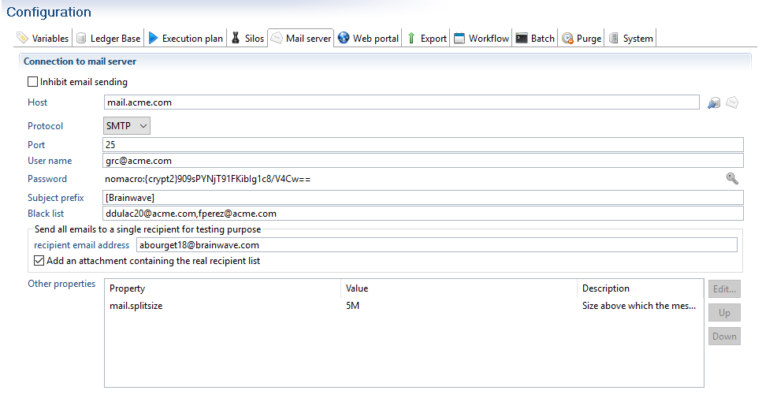    

In the above snapshot, all emails sent by the portal, the workflow or the notify rules will be prefixed by [Brainwave] in the subject. This allows the user to change the prefix of the project without having to edit each notify rule.    

A black list is now part of the configuration. You can specify several email addresses separated by a coma. These recipients will never receive an email from the product. 

This feature is often used to avoid sending emails to the president or C-level employees within the company when rules are used to select candidates for workflow tasks.     


---

<span style="color:grey">**Note:**</span> The prefix, blacklist and test options will only function within notification rules, not in the mail sent at the end of the execution plan.

<span style="color:grey">**Note:**</span> In the case of a workflow the recipient will not receive the associated email, however the task will be present the their "inbox" in the webportal.

---

A test mode has also been implemented.    
If you wish to test a workflow process with real data, the real email addresses will be used by the workflow engine as they are found in the Ledger. To prevent the product from sending emails everybody while performing your test, you can specify one (and only one) recipient who will receive all the emails sent by the product. This way, you can check that the process has sent all the expected notifications by reading the mailbox of this unique recipient. The real recipient emails are however lost, replaced by the unique recipient.   
It is also possible the check the original list of recipients. You can check an option to add a text file as an attachment. This text file contains the list of real email addresses initially found in To, Cc and Bcc fields.   

The property `mail.splitsize` should be set with the size limit of your mail server. If the product needs to send a message with several attachments with a total size greater than this limit, it will split the message in several ones to keep each message under the limit.   

In version 2016 R3 SP13 a new parameter, `mail.maxmailsbysession`, has been added that allows the user to configure the maximum number of emails sent by session. By default this value is set to 0 which corresponds to an unlimited number of emails.   

---

<span style="color:red">**Important:**</span> Note that this feature is only used to dispatch attachments in different messages but it does not cut, truncate or split a single attachment into several pieces.

---

##### Web Portal  

The web portal configuration is very extensive, but the properties that you will most likely need to change have been highlighted in the "General parameters", "Date and time format" and "Display" sections.  
    

##### Export  

The configuration of the web portal application (`.war` file) is defined in the 'Export' tab of the configuration.   
This helps store the options used to export the application, which means that once it is set you can use the web portal generation as many times as you want without having to remember the right settings. It is also possible to have different settings for each configuration, and thus each environment, which can be quite handy.   

Aside from the application name, you can choose to embed the project inside the archive or conversely to have it separated, either at the current studio location or in a given folder. The same applies to the folder holding the license, and optional overriding properties files as well as the location of the webapps workspace.  

A notable option is the possibility to very easily set up a standard JNDI data source, which will bear the same name as the web application itself. The disk button generates the additional configuration file that has to be dropped inside the Tomcat container. There is no additional setup required, which is why we recommend to use this option as a best practice whenever possible.  

---

<span style="color:red">**Important:**</span> If "Use a JNDI data source" is enabled, you will have to configure an other technical configuration and choose it when you will run the Execution Plan (batch) or execute a `igrc_notify` batch.

---
    

For more information on the configuration of the webportal please refer to the corresponding documentation:   
[Brainwave's webportal](igrc-platform/installation-and-deployment/brainwaves-web-portal.md)

##### Workflow Configuration

In addition to the workflow database settings, the workflow configuration holds two interesting options to help debugging the processes:    

- It is possible to execute all processes in a a non-persistent database held in memory, which can help save the time needed to set up a database, and cleaning it up regularly while implementing new processes. It goes without saying that it remains crucial to test the processes in a real database when they are ready enough.
- A special option helps tinker with the timers, to the effect described [here](/docs/how-to/workflow).

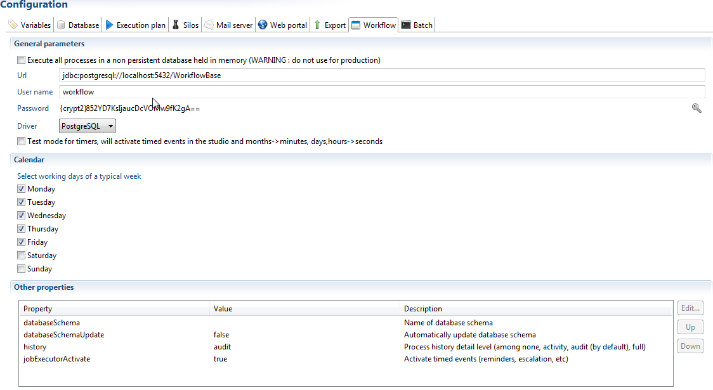    

##### Batch Mail Configuration

The batch mail settings, which existed previously in the project editor, have been moved to the configuration, so that there can be a different mail sent for each configuration.    
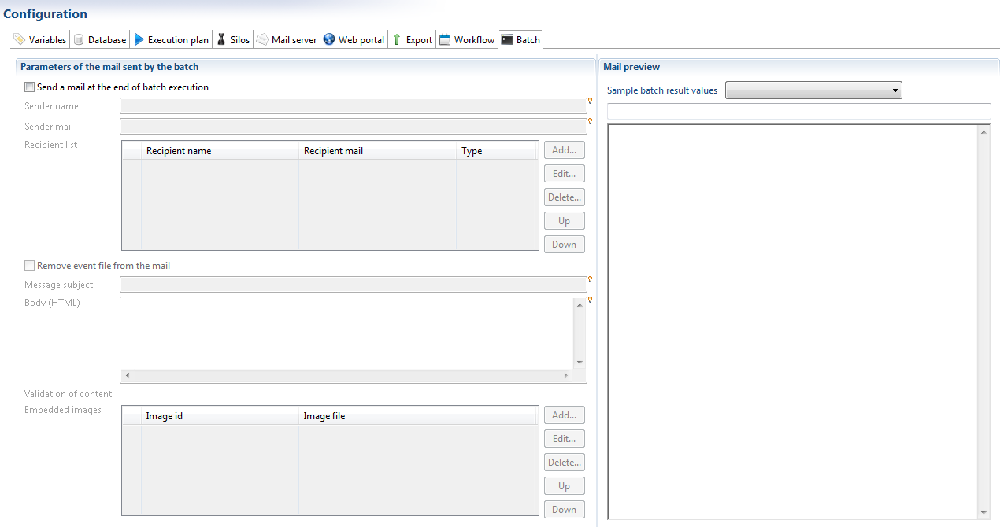    

##### PDF Signature Configuration

This functionality allows the user to activate and configure the signature of PDF files issued from workflows (i.e. the compliance reports) and attached in mail notification. This functionality has been implemented for security reasons to verify that the produced reports are not tampered with.

---

<span style="color:grey">**Note:**</span>  PDF files exported for pages and reports using the export to PDF option will not be signed.

---

The configuration is done in the tab detailed bellow:   
    

- **KeyStore path:** The path of the keystore file containing certificate
- **KeyStore passsword:** The password used to unlock the keystore
- **KeyPair passsword:** Pin code protecting the private key
- **Activate secure timstamping:** Activates a secure timestamping. It is necessary to configure a timestamp authority provider  
- **Timestamp authority server url:** The url of timestamp authority service  
- **Timestamp authority login:** The username used to log into timestamp server
- **Timestamp authority password:** The password used to log into the timestamp server
- **Activate visible signature:** Activates a visible signature in PDF files
- **Image path:** The image to use in the PDF file
- **Page number:** The page number that will contain signature image
- **Location in the page:** The location in the page where to include the signature image  

#### Exporting and overriding properties

Having a single configuration file can prove inconvenient, as it will need to be updated regularly from various persons.   

For instance, if there is a policy enforcing that passwords are changed on a regular basis, the database, the mail server and the workflow database will have their password changed, probably by different people, who only need to know the information pertaining to their specific task. Furthermore, editing an XML file is not always easy if you have to do it remotely without the help of a dedicated editor.   

This is why the `datasource.properties`, `mail.properties`, `config.properties`, `workflow.properties` and project.properties (for the global variable values) files are still active, and will override the selected configuration.   

You can generate them from a given configuration using the "export to properties files" option in the configuration editor.   
This will create files with minimal key settings, so that they can be edited and updated separately from the rest of the configuration.    
    

These properties are not taken into account in the studio, where only the active configuration file will be used.    

## The Project Archive Concept

### Context

This new feature provides an easy method to update the web portal content during run-time. This method can be used to include updated Reports, Pages and even Workflows to a currently running instance of the web portal.   
This method does not require a reboot of the web server nor a redeployment of the web portal.    

Through the studio, a project archive (`.par` files) can be created that can later be uploaded onto the web portal using the dedicated pages.    

### Prerequisites

This functionality is available as of version 2016 R3 only.  

### Recommendation

It is highly recommended that only one person be responsible for the action of uploading the project archives. This will allow to avoid conflicts between several versions of the same product that do not include the same files.    
If you are working in a team, please use a version management software such as git or svn that allows you to follow the evolution of your project.  

### Project Archive Content

A project archive contains the difference between the installed default project and the current version of project.

---

<span sytle="color:grey">**Note**</span> When using project archive to update web portal it is not recommended to update web portal manually because manual update will be lost.
- Web portal and project archive must be based on same default project version. 
- Only last installed project archive can be uninstalled.
- Project archive can not be installed on web portal generated with IGRC version older then 2016 R3.

---

### Exporting Web Portal

To use the project archive feature you must export your web portal using version 2016 R3 or greater of IGRC. If your web portal was generated using an older version, project archives cannot be exported/uploaded and used.   

This feature adds two new files to web archive:    
- Default project facet
- The hidden `.installedarchive` file   

These two files are mandatory when using the project archive feature.     

When exporting the web archive several configurations are possible for the location of the project:    
1. Embedding the project into the Web archive
2. Point to the current iGRC project directory
3. Point to a specified directory   

The configuration used will determine the method used to export the project.   

---

<span sytle="color:red">**Important**</span> Using project archives will **ONLY** work when the project is:
- Embedded in the web archive
- Pointing to a specified directory

Uploading par files is **NOT** compatible when the export is configured to point to the current iGRC project studio

---

#### Embedded Project

If the project is embedded the product will automatically include a the previously mentioned files to the web archive. No further manipulations are necessary.  

#### Detached Project: Pointing to a Specific Folder

If the export of the web archive is configured such that the project is located in a separate folder it is necessary to export a version of the project compatible with the Project archive feature. In order to accomplish this the export functionality of the studio has been enhanced.  

Navigate to File \> Export:    

   

Select the Export project functionality under iGRC analytics and then chose the project to export using the displayed combo box:    

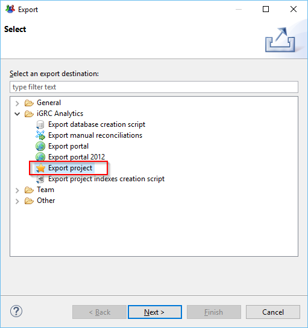   

Select the desired format of the exported project. It is possible to export the project to an archive (`.auditprj` extension archive) or directly to a folder    
Please remember to add the `.auditprj` extension when exporting to an archive file (see caption bellow).    

   

The `.auditprj` is a zip file. You can simply extract the project into the specified folder and then launch the webportal   

### Exporting Project Archive

Project archive can be exported from "Audit" menu:    

   

---

<span sytle="color:grey">**Note**</span> When exporting a project archive the product will ignore the flowing folders and their contents: 
- collector
- db
- discovery
- importfiles
- logs
- `.settings`
- `library/facet` (except of default project facet)

This means that all files present in the previously mentioned folders will never be updated using this method.

---

### Installing and uninstalling project archive in web portal

Please see the following link for more information:  
[Project Update Manager](igrc-platform/getting-started/default-project/project-update-manager.md)

## Step-by-step Tutorial

### My First Discovery

This section will allow you to discover the data discovery editor. After this tutorial, you will be able to import, analyze, and process a file in CSV format.   
You can also see the various "screencasts," videos about discovery creation, by logging on to [http://expert-exchange.brainwavegrc.com](http://expert-exchange.brainwavegrc.com/)

#### Create a Discovery

Follow the steps below to create a discovery:   

1. Create a new audit project and add the demonstration facet
2. Activate the 'iGRC Project' view.
3. Go to the main menu of your audit project
4. Click on New -\> Data file inspector
   
**_Creating a new discovery_**   
5. Name your discovery, and don't forget to use its extension   
   
**_Discovery file_**   
6. Click on generic formats and select CSV format.   
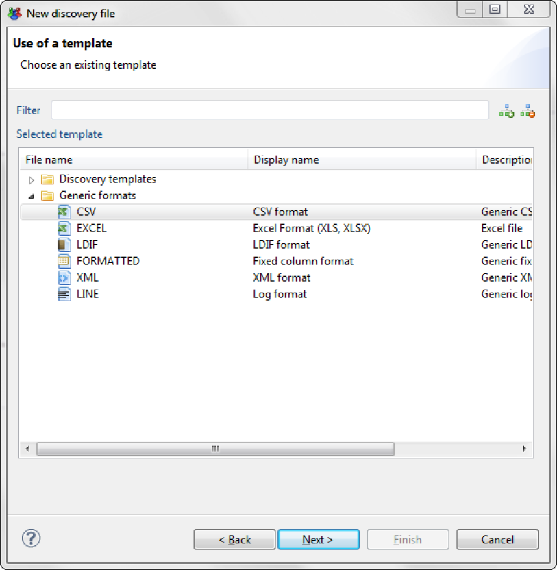   
**_Using a CSV file format_**   
7. Select the CSV file to import. Don't forget to specify the type of separator (";", ",", "|"...) in the file.   
   
**_Importing the file to process_**   
8. Click on "Next"   
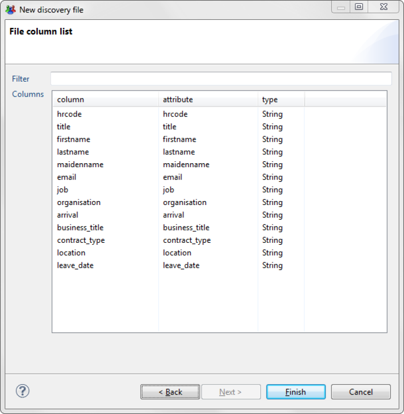   
**_Verifying the attributes of the file to process_**   
9. Click on "Finish"
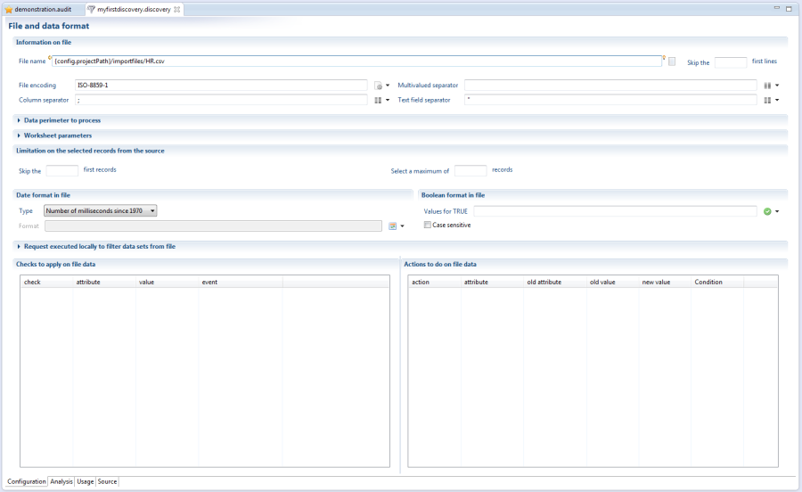   
**_Discovery configuration interface_**   

#### Set up Rejection of Empty Data

Follow these steps to reject empty data   

1. Go to the "Analysis" tab
2. Right-click on any attribute in the Attributes view, then on "Reject empty values"
   
**_Rejecting values_**    
3. Enter a reason for the rejection   

   
**_Rejection event_**    
4. Click on OK    
The rejected values are automatically added in the Rejected Values view of the work area.
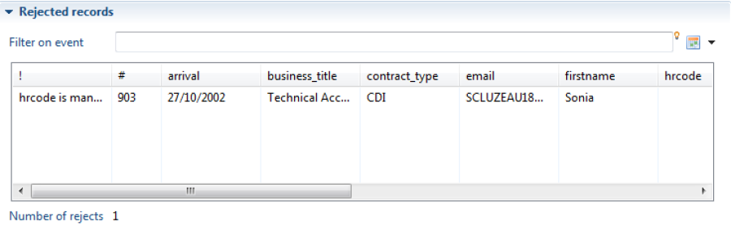   
**_Rejected values_**   

#### Delete Duplicates

These steps are required to delete duplicates:   

1. Go to the "Analysis" tab
2. Right-click on any attribute, then select the "Reject duplicated values" option
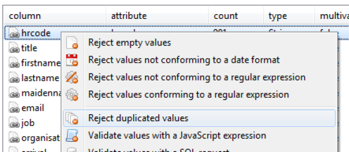    
**_Criteria for rejecting a duplicate_**    
3. Enter the event, then click on OK
    
**_Rejection event_**    
The rejected values are automatically added to the "rejected values" view.   
    
**_List of rejected values_**  

#### Add an Additional Attribute

To add an additional attribute, follow these steps:   

1. Go to the "Analysis" tab
2. Right-click on any attribute in the "Attributes" view
3. Select the **Create a computed attribute**  option

    
**_Computed attribute creation wizard_**    
4. Name your new attribute and give it a value and a description    
    
**_New attribute creation wizard_**    
5. Then click OK   
    
**_Adding a computed attribute_**   

#### Export the Results in CSV Format

To export the results in CSV format, follow these steps:   

1. Right-click in the upper right side of the editor
2. Select "Export all in CSV and open in external editor"

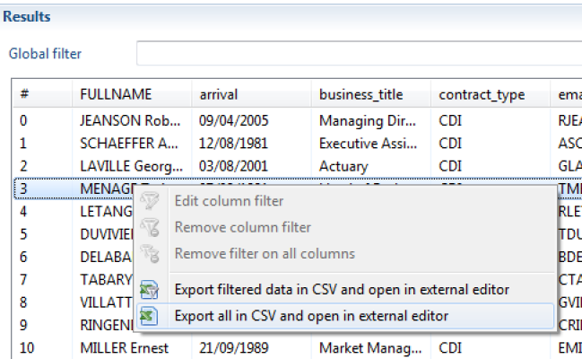    
**_Exporting results in CSV format_**   

### My First Reconciliation Rule

This section will introduce you to the reconciliation rules editor. To do this we are going to configure a rule that will seek to reconcile an account based on the user's email.   

#### Create the Reconciliation Rule

In the software's main menu, click "New..." and choose "Reconciliation rule".   

   
**_New reconciliation rule_**   

Name your reconciliation rule remembering to add the extension ( **.reconrule** ) and click on **Next**

   
**_Reconciliation rule file_**   

1. Enter a unique identifier for your reconciliation rule, for example **'account\_reconciliation'**
2. Enter a description for your reconciliation rule, for example **'Reconciliation based on email address'**
3. Click **Finish**

   
**_Reconciliation rule settings_**   

#### Select Main Concept Criteria

1. Click the magnifying glass. Criteria applicable to the 'Identity' concept appear in the palette
2. Open the **'Criteria on email and phone'**  section
3. Drag and drop the **'mail is {mail}'** criteria onto the magnifying glass

   
**_Add a Criterion_**   

1. Double click the hyperlink **'{mail}'**
2. Check **'Set the criterion with a global parameter of the rule'** box and select **'account user email'** , in the list of parameters.
3. Confirm the criteria entry by clicking **OK**

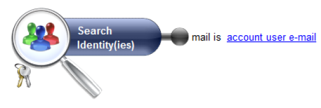   
**_Main concept criterion_**   

#### Configure a Relationship Constraint

It is possible to link the identity repository with the repository when the reconciliation criterion is not in the identity repository.   

1. Open the **'Link from identities'**  section
2. Drag and drop the **'link with accounts (using reconciliation)'** relationship on the magnifying glass.   

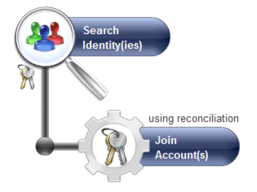   
**_Add a relationship_**   

#### Select Criteria Based on Linked Concepts

1. Click on the 'Account' join. The criteria which are applicable to the 'Account' concept appear in the palette
2. Open the **'criteria on identifiers'**  section
3. Drag and drop the **'account login is {login}'** criteria on the Account join   

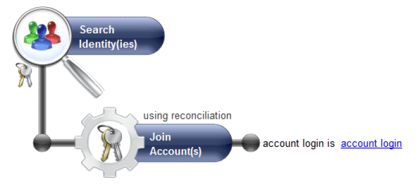   
**_Relationship criterion_**   

#### Display Results

1. Click the **'Results'** tab
2. You can click on the items, from the Ledger tab, to see them in detail,
3. You can select another 'Time slot' to execute this analysis on another Ledger data import date
4. You can filter the displayed results by clicking on 'Filter' and by replacing the text in the search field.   

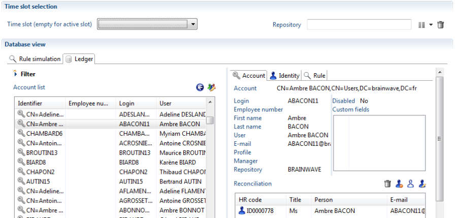   
**_Displayed Results_**   

### My First Reconciliation Policy

This section will introduce you to the reconciliation policy editor. To do this, we are going to configure a policy that will execute a reconciliation rule in each of the Active Directive (ADD) and OpenLDAP depositories.   
We will consider two reconciliation rules ('identity **full name**  looks like **account user name'** ) for the AD repository and the login ('**HR Code**  looks like **account login**') for the OpenLDAP repository.   

- Enable the '**iGRC Analytics**' view    

1. In the product's main menu, click on "New..." and choose "Reconciliation policy".   
   
**_New reconciliation policy_**   
2. Name your reconciliation policy remembering to add the extension ( **.reconpolicy** ) and click **Next**   
   
**_Reconciliation policy file_**   
3. Enter a unique identifier for your reconciliation policy, for example **'reconPolicy'**
4. Enter a description for your reconciliation policy, for example **'Reconciliation policy'**
5. Click **Finish**
   
**_Reconciliation policy settings_**   
6. Click on ' **Add...**' located in the center of the policy editor. The list of all the repositories which have been declared in the Ledger can be open in the "Repository" field.
7. Select the AD repository (BRAINWAVE in our screenshot).   
   

#### Add AD Repository

1. In order to select the rules associated with the AD repository, click on '**Add...**' located on the right of the reconciliation policy editor.
2. Double click on the reconciliation rule name that you want to associate with the AD repository. Check that the rule appears in the '**Rule list**' column.    
   
**_Adding the rule to the AD repository._**   
3. Follow the same principle for the OpenLDAP repository
   
**_Creating a reconciliation policy_**   

#### Display Results

1. Click on the '**Results**' tab
   
   
**_Displaying reconciliation policy results_**     

The reconciliation policy results are displayed in the same way as reconciliation rules.   

1. You can click the items, from the Ledger tab, to see them in detail
2. You can select another 'Time base' to execute this policy on another Ledger data import date
3. You can filter the displayed results by clicking on 'Filter' and by replacing the search field text.
4. By selecting an account, you can display the result of the policy for this account with the    
5. You can intervene dynamically in an account reconciliation to perform manual reconciliation operations.

### My First Audit View

This section will get you to be more familiar with the Audit View Editor. To this end, you will create an Audit View that lists all the identities contained within the Main Ledger and for each one, list the entire range of access accounts.   
You can also see a video capture of a report being created with an associated Audit View by visiting [http://screencasts.brainwave.fr](http://screencasts.brainwave.fr/)

#### Create an Audit View

1. Activate the 'iGRC Analytics' view
2. Open the 'views/custom' folder in the project view and right click
3. Select 'new/audit view'
4. Name your Audit View, making sure to add the .view extension and click on **Next**   
   
**_Selecting the file name_**   
5. Key in a unique identifier for your Audit View and a description, and select _Identities_ from the drop-down    
   
**_Configuring the Audit View_**   

#### Set Attributes of the Main Concept

1. Drag and drop the following attributes from the **'Identity Attributes'**  toolbox to your **'identity'** concept:   

  - recorduid
  - hrcode
  - givenname
  - surname
  - mail
  - internal

   
**_Configuring attributes_**   

#### Configure a Link to a Secondary Concept

1. Drag and drop the 'Join with accounts through reconciliation' from the 'Links from identities' toolbox
2. Select the 'Account(s)' concept in the graphical editor

#### Sett Attributes of a Secondary Concept

1. Drag and drop the following attributes from the 'Account attributes' toolbox to your 'account' concept:   

  - recorduid
  - login
  - username
  - disabled
  - locked

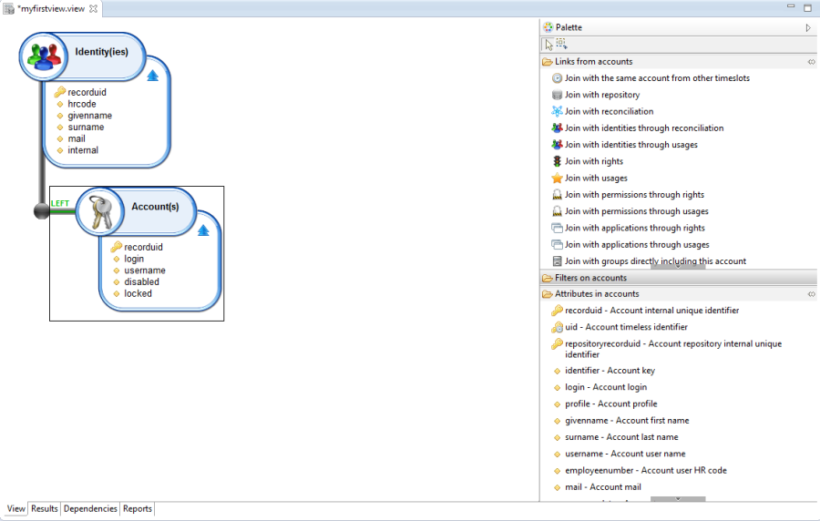   
**_Configuring a secondary concept_**   

#### Rename Attributes of a Secondary Concept

1. Right-click on the 'account' concept and select 'Modify table prefix'
2. Key in the 'account\_' value   

   
**_Renaming attributes_**   

#### Sort Search Results

1. Select the 'Sort' tab in the Properties Editor
2. Configure a sort operation by 'hrcode', then by 'account\_login'   

   
**_Configuring a sort operation_**   

#### View Audit View Results

1. Click on the 'Results' tab of the Audit View Editor
2. If desired, click on 'Export to CSV and open in linked program' to view values in your spreadsheet software   

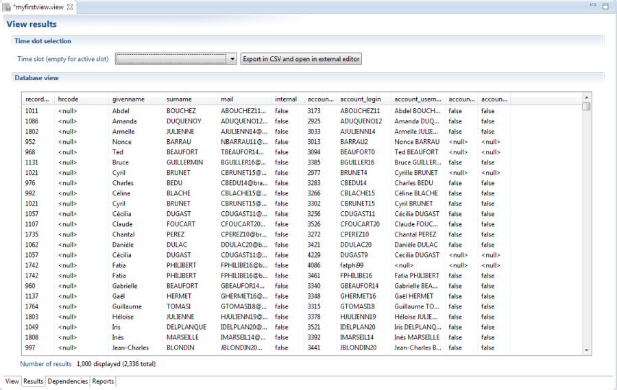   
**_Viewing results_**

### My First Report

This section allows you to familiarize yourself with the graphic report editor by creating a report yourself with just a few clicks. This report lists the identities contained in the Identity Ledger with, for each identity, his/her position and the organization s/he is attached to. The data is sorted by the HR unique ID of the identities displayed.   

#### Create a List Report

1. Activate the 'iGRC Reports' perspective
2. Place the cursor on the 'reports/custom' directory in the project view, and right click
3. Select 'new/audit report'
4. Enter a name for your report, without forgetting its extension (.rptdesign) and click on Next
5. Select the template 'Search List Report' and click on 'Finish'

   
**_Select the report template to use_**   

The report editor then opens with your new report.   

   
**_Report editor after the wizard has run_**    

#### Reference Data to be Used

1. Select the 'Data Explorer' view
2. Right-click on the 'Data Sets' entry, then select 'New Data Set'
3. Name your Dataset, then do Next
4. Click on the 'folder' icon to select the Ledger view to associate with this Dataset
5. Select the 'identity/identitydirectorganisation.view' entry and click on OK
6. Click on Finish    
   
**_View selection_**   
The Dataset editor then opens and allows you to verify the attributes that are retrieved by the view, to refine the dataset settings, and to preview the data in an unformatted display.   
   
**_Dataset editor_**   
7. Click OK   

#### Associate Data with the Table

1. Select the table in the report editor
2. Select the 'Binding' tab in the properties area
3. Select your Dataset in the 'Data Set' drop-down list   
Your table is now paired with your Dataset, it is therefore now able to display data from this Dataset.    
   
**_Associating the Dataset with the table_**   
4. Expand the tree section under your dataset in the 'Data Explorer' view
5. All of the attributes associated with the Dataset appear ; drag/drop the following columns in your table:   
  - hrcode
  - givenname
  - surname
  - internal
  - jobtitledisplayname
  - org\_displayname   

   
**_Associating attributes in the table_**   

#### Format Columns

1. From the palette, drag and drop the 'label' item in each column header
2. Double-click on the various labels to edit them
  - hrcode
  - givenname
  - surname
  - internal
  - jobtitledisplayname
  - org\_displayname

   
**_Formatting the labels_**   

#### Organize Data

1. Select the table in the graphical editor
2. Select the 'Sorting' tab in the property editor
3. Click on 'Add' and then select the 'hrcode' value in the drop-down list, click on OK

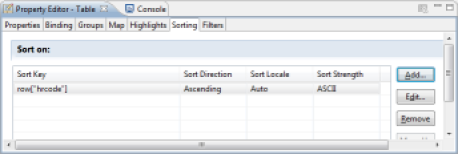   
**_Table results sorted_**     

#### View the Results

1. On the main menu, click on Run/View report/In Web Browser   

   
**_Previewing the results_**   

| **Note**: <br> If you're using Internet Explorer 11, please follow [these directions](how-to/misc/IE-11-preview-errors.md)|
