# Brainwave's Data Model

## General principles

### Characterizing Identities

In practice, carrying out controls usually corresponds to identifying inconsistencies between a person's role and his or her access to the Information Systems. As an example, only people whose occupation is "payroll manager" in HR are authorised to access the payroll files in the HR system.

In order to accomplish this, Brainwave's data model integrates the following concepts:

- Organisations
- Occupations
- Managerial links
- User Statuses (dates, types of contract, areas of competence etc.)

Furthermore, it is possible to attach the organisations to the "assets". Assets usually enable the establishment of patterns within the control model of the different processes of the enterprise.

As we shall see later, Brainwave's data model enables the modelling of the most simple to the most complex organisations (hierarchical organisations, multi-hierarchical organisations, matrix organisations, managerial links by department, interpersonal managerial links etc.).

### Finely Grained Standardization of the Representation of Access to the Information Systems

A control-oriented data model is very different from an authorization management data model, such as may be found for example in an identity management solution (IAM).

The first aim of an identity management system is to improve the operational efficiency of management actions of the authorization managers. In order to do this, the identity management systems usually encourage gathering the permissions into groups of permissions, occasionally interlinked, and to give them a semantic (we often talk of technical roles and occupational roles). From the perspective of identity management, the link chain is thus the following:

A user has Occupational Roles and these roles give him or her access to Technical Roles, which in turn give access to permissions on the systems. For technical reasons, the notion of "fine" permission is usually absent from the identity management systems, which satisfy themselves by managing automatically the allocation of user accounts to user groups in the target systems. It remains the responsibility of the application's technical administrator to assign fine permissions to user groups.  
Although this data model may be efficient within operational authorization management logic, it rapidly shows its limits, however, with regard to controlling access and meeting compliance requirements.

In practice, it is the auditors who are directly interested in the fine transactions, as it is a matter of identifying whether the "operational" rights are authorized in an inappropriate way in the systems (for example, does a person have the right to modify clients' IBAN numbers and issue payments to these same clients? Does the responsibility of junior clientele include undertaking 1m$ plus contracts? Etc.).

In order to do this, it is necessary to examine the fine rights stored in the systems to answer the question "Who has the right to..."  
Only then does the need arise to take an interest in groups and roles in order to answer the question: "Why does this person have the right to..."  
This applies over all the enterprise's systems (the key processes of the enterprise often depending in practice on several applications in order to be completed successfully).  
The link chain for a control model is thus the following: A user has several access accounts. These accounts enable fine transactions on the systems and this is because the user has roles and profiles within the authorization model.

The Brainwave data model takes up this paradigm:

1. It prioritizes the loading of fine permissions of all types of IT systems (applications, file servers, physical access, ECM systems etc.).
2. It homogenizes the fine permissions of different systems by putting them on the same level, so that it is then possible to carry out controls mixing fine transactions, access to shared repositories, physical access etc. For this, permissions are "revealed" in order to recreate account links \> fine permissions (by abstracting from roles, profiles, interlinked groups etc.).
3. It enables the paradigm to be changed easily, thus enabling as it goes along, refinement of the controls (and the increasing maturity of the client) and the loading of increasingly finer permissions into the model (for example, we begin with a simple yes/no access, then by loading the profiles, then finally the fine transactions).

In order to do this, Brainwave data model integrates the following concepts:

- Access accounts
- Applications
- Permissions
- Rights
- Perimeters

It should be noted that, in the Brainwave data model, everything is modelled in the form of an "application", whether it be IT applications, file servers or even physical access security systems. The notion of permission is in itself declarative. These are the permissions declared in the "applications" (profiles, roles, transactions, shared directories, SharePoint nodes, physical access typology etc.). Finally, as for the concept of "right", this plays the role of link between the access account and the permission. It can carry the information linked to the instantiation of the permission (for example, access to the directory type permission in a single reading, access to the transaction type payment permission with a limit of 10,000€ and on the Perimeter (transaction authorized with regard to Europe clients only etc.)).  
Finally, it is possible to attach permissions to assets, in order to identify which permissions participate in which of the assets of the enterprise. One speaks therefore of support assets in the meaning of standard ISO 27005.

### Integration of Fine Time Management

Controlling authorization and guaranteeing the compliance of access is a repetitive, recurring task, which is usually aimed at identifying:

1. Inconsistencies between the functions of individuals and their permissions on the systems (principle of lesser priority)
2. Accumulation of forbidden permissions (principle of task separation)

Once the situation has been taken in hand, it is laborious to maintain this state. In practice, the volume of data to be processed is such that it is difficult to make demands systematically on the managers with the whole of the information.  
Nevertheless, it is interesting to note (particularly on the first point) that an event may be at the origin of new anomalies: the movement/departure of a member of staff of the enterprise, or even the assignment of new permissions.  
It is vital in a control system to be able at least to identify the changes that have taken place since the last audit period, in order to be able to highlight this information.

Management identity systems integrate this historic notion through tracks left by the different management workflows of the life cycle of the users. Unfortunately, these workflows are inadequate when it comes to controlling authorizations, since they do not give a picture of the fine permissions actually assigned in the systems and they supply a partial and event driven picture, such that it is not possible to map the enterprise at a particular moment. This information is nevertheless vital when it comes to making analyses a posteriori.

The Brainwave Identity GRC data model fully integrates the notion of time. The model is constructed according to the "discreet time linear" principles. In other words, the product acts as a camera and takes snapshots at regular time intervals of the whole of the information (for example, every week). On the one hand, Brainwave Identity GRC identifies all the modifications occurring between each "snapshot" and, on the other, enables analysis of the mapping of any snapshot (no information is deleted from the model).

## Data Model Overview

Brainwave's data model can be modelled as following :

Please refer to the included subpages for a more detailed overview.  

### Identities: the Physical Users who have Access to the Information System

This information often comes out of the enterprise's HR systems. It may also be consolidated from an existing repository (directory, identity management system etc.).

Standard available attributes :

- Identifier
- Alias
- Forename
- Second forename
- Family name
- Alternative name
- Full name
- Email
- Arrival date
- Departure date
- Internal

### Organizations: Organizational Nodes

The organizations can be organized in the form of a tree (an organization can be attached to a parent organization). The model supports multiple hierarchies.  
The identities can be attached to organizational nodes (senior management, departments etc.). The attachment is done through an occupation: a person performs roles within organizations.  
This information often comes out of the enterprise's HR systems. It may also be consolidated from an existing repository (directory, identity management system etc.).

#### Modelling of Organizations

The data model enables modelling of organizations from the simplest to the most complex.

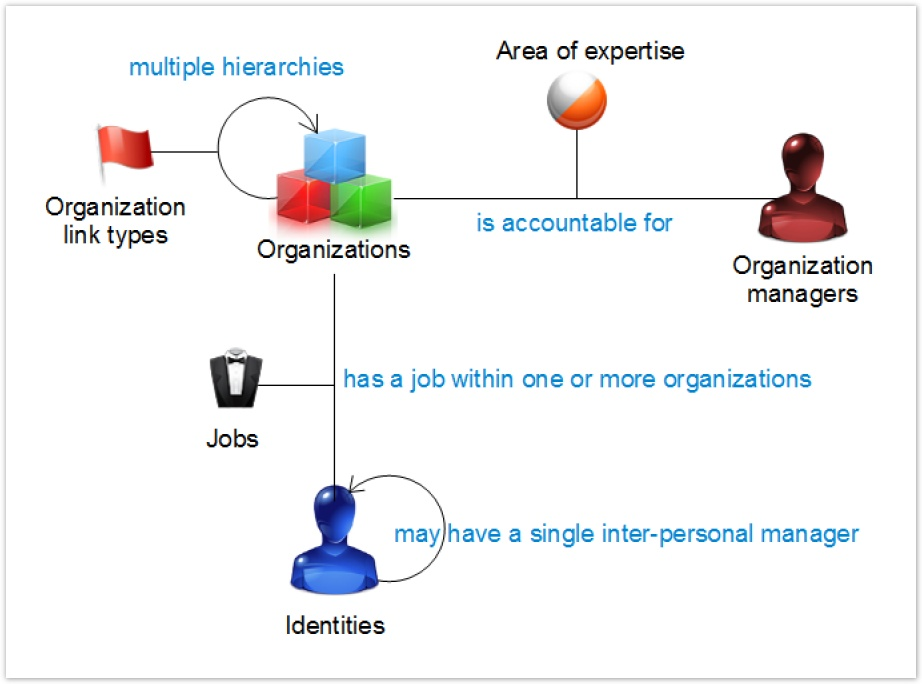

The principle of modelling is based on the following notions:

- Organization: represents the organizational nodes. The organizational nodes may be organized in the tree fashion (for example, board of directors, then directors of operations, administration and finance directors etc.)
- Occupation: Represents an identity's role
- Organization managers: defines the organizational node managers
- Manager: Defines the interpersonal managerial relationships

All the power of the model hangs on the fact that the links are given a type (these are in fact ternary links) which enables assignments to be multiplied:

- When a relationship is defined through connection between two organizational nodes, a type of relationship must be defined. This relationship type enables differentiation between the various relationships that can exist between the organisational nodes, for example: hierarchical relationship, legal, center of competence etc. An organizational node may have several relations, in as much as they are assigned to different related types. For example, a business unit may be attached hierarchically to organization A and legally attached to organization B. Each organizational node can also be typed. The typing of nodes facilitates future analysis in focusing itself on, for example, management, sections, departments etc. This system facilitates modelling of simple hierarchical organizations and also of matrix organizations, which results in the accumulation of several hierarchical organizations, sometimes intermingled.
- When an identity is assigned to an organization, an occupation is assigned that this person carries out within the organization (ternary links). If we take the example of a hospital center, an identity can at the same time be head of geriatrics and doctor in the emergency department. An identity can therefore perform several occupations in different organizations and can be attached to several organizations.
- It is possible to define the organization managers. This relation is a ternary relation: an organization manager is responsible within the limit of his or her field of competence. There may be several managers per organizational node to the extent that each has different areas of competence. Similarly, a given identity may be responsible for several organizations.
- It is ultimately possible to define the interpersonal managerial relationships at the level of identities. A given identity may, moreover, have several managers through his or her organizational attachments. This modelling is useful particularly in the case of matrix organizations where it is necessary to know the manager of the identity.

> [!warning] It is imperative at the time of data collection to specify an occupation when one is seeking to assign an identity to an organizational node. If not, the allocation will not be done. If the occupation is unknown, it is advisable to create the default occupation "Unknown".
>
> It is imperative at the time of creation of links between the organizations to specify a relationship link. Otherwise the relationship will not be created.
>
> It is imperative at the time of creation of structure managers to specify the field of competence. Otherwise the relationship will not be created.
>
> The types of relationship, occupations and fields of competence form part of the tables of nomenclatures. The values corresponding must be detailed in the Ledger via the collection target "Nomenclature" with the aid of the Discovery dedicated action.

Standard available attributes:

- Code
- Short name
- Display name
- Type of organisation

### Accounts: the Means of Access to the Information System

These accounts comprise an identifier (login) and a means of authentication (usually a password). The accounts are used by the identities and allow them to carry out operations on the enterprise's applications because of the permissions that are granted to them.
This information comes from extraction from applications (SAP) or infrastructure repositories (Asset Directory, RACF etc.).

Standard available attributes:

- Key
- Login
- Profile
- Forename
- Family name
- Full name
- Email
- Account owner identifier
- Date of creation
- Date of last connection
- Date of last change to password
- Date of expiry
- Service account
- Account deactivated
- Account blocked
- Login number
- Number of incorrect passwords
- Password optional
- Password changeable
- Non-standard account
- Password not expired
- Password expired
- Smart card required

### Applications: an Asset Support of the Enterprise

Identities act within theses applications in order to complete the tasks assigned to them.  
An application may be an IT application (HR Access, SAP, Microsoft Exchange etc.), a data server (shared repositories, Sharepoint etc), a physical access control system, a server etc. In fact, it is possible to model any of the enterprise's asset supports as an application in the Ledger, from when this asset authorizes the identities to interact with it through permissions.  
This information is usually declarative and is occasionally extracted from infrastructure repositories when the latter manage the rights of the whole of an application (Asset Directory, RACF, WAM etc.).

Standard available attributes:

- Key
- Display name
- Type

### Permissions: Pieces of Declarative Information that Forms an Integrating Part of an Application

A permission is granted to accounts and permits interaction with all or part of the application. The granularity and type of permission depend on the application. As the Ledger is a data oriented control model, there is no limit or constraint on the type of permission that it is possible to declare in the Ledger. The principle to retain is that it is necessary to load as permission the relevant information to carry out controls. This may be application profiles, transactions and also shared repositories, SharePoint nodes, typology of physical access (access 24/7) etc.  
This information is extracted from applications or infrastructure repositories that manage the rights of a whole application (Active Directory, RACF, WAM etc.).

#### Modeling of Permissions

As we have seen, each access is modelled in the form of the "Application" and "Permission" concepts.

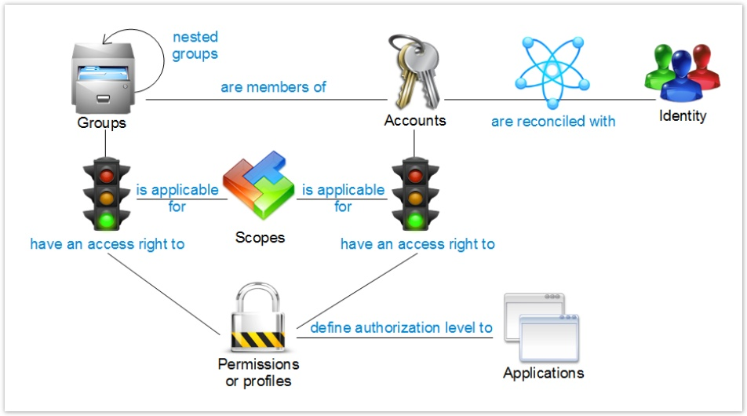

The notion of permission is thus a central notion in the Identities Ledger.  
The general principle is to load as "Permission" the level of information necessary for the control operations or the audit targeted.

**Example**:

If the objective is to do a review of the SAP profiles, it will be a matter of loading the composite roles and the simple SAP roles into the Permissions.  
If the objective is to do SAP separation tasks it will instead be a case of loading the SAP transactions into the Permissions.  
The same for the analyses on the semi-structured data. The loading will be prioritized as a Permission of repositories rather than of a groups' Asset Directory, which are used for giving access to repositories via the ACLs.

The data model has deliberately "banned" the notion of interlinked permission in the analysis model, the objective being, on the contrary, to standardise the permissions by putting them on the same level. We have, on the other hand, introduced a manner of typing the permissions, enabling the permissions to be regrouped by family of the same type at the time of analyses and reports (profiles, transactions, physical access, etc).

A permission is a piece of declarative information, forming an intrinsic part of the application. It is a directory, a transaction name, a role name etc.
When a permission is granted to an access account, this permission is instantiated. It is the concept of "Right" in the Ledger.

**Example**:

The account "ABC" has access to the shared directory type Permission "\share\COMEX" with a "Read Only" Right type.  
Account "ABC" has access to the SAP transaction type Permission "PAYMENT" with an "Amount \< 10 000$" Right type.

The Right therefore details the context in which the Permission may be used by the Account. A Right item in the Ledger has numerous attributes, amongst which: action (the type of action authorized) and limit (the limits of the right).
It is sometimes necessary to model the Right's gateway also.

**Example**:

The account "ABC" can carry out trading operations only in the zones "Europe", "Africa".  
This type of modelling occurs frequently on the ERP systems.

The Ledger deals well with this notion with the aid of the "Perimeter" concept. The perimeter concept has numerous attributes that enable better characterization of what it represents.  
At the time of assignment of a Permission to an account, two paths are possible:

1. The account may be seen to assign the permission directly (discretionary right of access)
2. The account may be seen to assign the permission through a group. The assignment then follows an indirection: the Permission is assigned to the Group, all the members of the group, direct and indirect (groups of groups), having access to the permission.

The notion of group enables both modelling of the application groups and also of roles, interlinked profiles etc. It should be noted that in the Ledger a group may give access to permissions that do not form part of the same Repository.  
Once the accounts are reconciled, it is thus possible to know which persons can access which applications and with which privileges.

Standard available attributes:

- Key
- Display name
- Type

### Rights: Constraints Associated with the Account/Permission Couple

Rights models the constraints associated with the account/permission couple.

A permission is a piece of declarative information, particular to the application. Numerous applications "instantiate" the permissions at the moment they assign the permissions to the user accounts.  
If we take the example of SAP, a fine permission may be, for example, a payment type transaction. At the time an SAP account is authorized to make payments, the parameters are going to be set for a certain number of constraints (to whom the payments are authorized, maximum amount authorized etc.).  
If we take the example of shared repositories, a fine permission is the shared repository (\share\comex), at the time an account is authorized to access this repository, the parameters are going to be set for the rights granted on this same repository (read only access etc.).  
The concept of "right" in the Identity Ledger enables contextual information to be carried and at the same time the concept of right models the constraints associated with the account/permission couple (maximum amount etc.) and, in addition, the gateway authorized (payments authorized only in the SEPA zone), this notion of gateway coming under the heading of "Perimeter" in the Identity Ledger.  
This information is extracted from the applications or infrastructure repositories that manage the rights of a whole application (Asset Directory, RACF, WAM etc.).

Standard available attributes:

- Display name
- Action
- Limit
- Perimeter

### Repositories: Receptacles for Access Accounts and User Groups

The repositories represent in the Ledger the systems that host the access accounts. This may be transverse infrastructure systems (Asset Directory, RACF, etc.) and also usually directly some applications. In this second case, a repository is declared by application in the Ledger.  
The Repository vision is a vision that is closer to the technical infrastructure of the Information System. This enables more technical controls to be carried out as well as data quality controls. It is ultimately on the Repositories that the identity/accounts reconciliation operations are configured.  
This information comes from extraction from applications (SAP etc) or from infrastructure repositories (Asset Directory, RACF etc.).

#### Modelling of Repositories

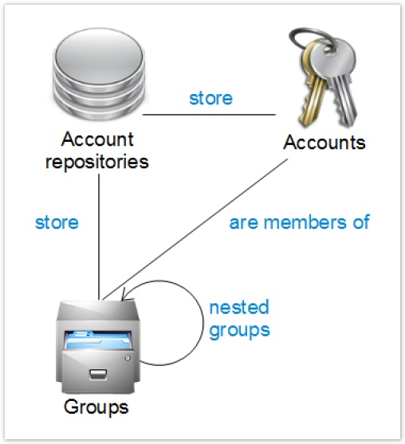

The accounts and groups are stored in different repositories. The notion of repository enables modelling in the Ledger of the account bases: Asset Directory, RACF, Top Secret and also the application accounts bases (SAP etc.).

Several applications may depend on the same repository. This is mainly the case at the time the applications delegate the management of their accounts to a Repository (Asset Directory, for example).
Some Brainwave Identity GRC processing and analyses make direct reference to the notion of repository. This is mainly the case for reconciliation of accounts.

> The groups may well be interlinked (acyclic oriented graph).

Standard available attributes:

- Key
- Display name
- Media name
- Date of extraction
- Type of repository

### Groups: Concept Currently Used in the Repositories in order to Regroup the Account Users

This may, for example, correspond to Asset Directory groups but also to everything that allows user accounts to be aggregated in applications such as, for example, the composite roles and the simple roles of SAP.
The groups enable the user accounts to be linked to the permissions.
It should be noted that the notion of group in the Ledger is not linked solely to one repository. In other words, a group may contain user accounts coming from several repositories.
This information comes from extraction from applications (SAP etc.) or from infrastructure repositories (Asset Directory, RACF etc.).

Standard available attributes:

- Key
- Display name
- Comments
- Type of group
- Date of creation
- Date of modification

### Assets: Enable Modelling of the Enterprise's Key Processes

The notion of asset approaches its definition in standard ISO 27005.
The assets usually enable modelling in the Ledger of the enterprise's key processes, thus facilitating the constitution of reports and synthesis dashboards.
The assets are connected to organizational nodes (the entities in charge of carrying out the process) as well as to permissions on applications. (Thus we talk of support assets, since these permissions participate in the performance of the process).
This information is declarative or comes out of ITIL management systems (CMDB).

#### Modelling of Applications and Assets

The notion of asset is a notion inherited from standard ISO 27005. It enables the organizational and technical aspects to be united at the time of control operations:

The organizations that participate in the process, as well as the application permissions necessary for performing the tasks of the processes.
The assets may be classed by category. The assets are linked to the organizations and to the permissions. An identity may additionally be appointed manager of the assets.
With regard to the applications themselves, these make reference to a repository. It is in this same repository that the accounts permitting access to the said application will usually be found.  
The permissions are associated with the applications. The permissions may follow a hierarchy (tree model), as is the case, for example, for shared directories or SharePoint trees.

> The notion of hierarchy is suited to the modelling of directories. On the other hand, it is not suited to the modelling of profiles/transactions since, in this second case, we then have to make an acyclic oriented **_graph_**  model. The modelling of roles/transactions is carried out with the aid of the notion of "groups" of accounts. The groups enable accounts and permissions to be united in accordance with a graph model (a graph can, in effect, have several "relations").  
>
> - Do not forget that in the data model it is all about application, whether this is IT applications, shared directories, SharePoint servers, physical access etc. An attribute of the application concept enables differentiation between the applications by family in order to adapt the analyses and reports as a function of these same families. This attribute is named "applicationtype". It takes, for example, the following values: "Profile" for the IT applications, "Filesystem" for the file systems, 'Physicalaccess" for the physical access systems etc. You can create completely new types of application, as this attribute is free text.

Standard available attributes:

- Code
- Display name
- Category

#### Collect

In the collect, assets are a combination of three different targets:

- [Asset target](igrc-platform/collector/components/targets/asset-target/asset-target.md)
- [Support target](igrc-platform/collector/components/targets/support-target/support-target.md)  
- [Actor target](igrc-platform/collector/components/targets/actor-target/actor-target.md)

Here is a preview :

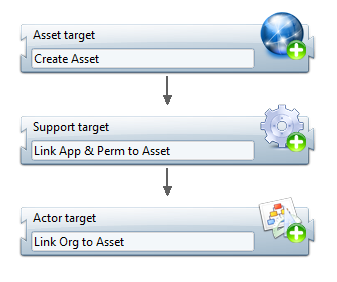

### Reconciliation: Matching Accounts and Identities

In order to be able to complete the controls successfully, it is necessary to match up the users with their access on the Information System. For this reason it is necessary to know to which accounts each person has access. This operation that consists of matching up the accounts and the identities is called "reconciliation".  
Reconciliation is the only information that is deduced from the data in accordance with the rules for reconciliation. The parameters for these rules are set within the Brainwave Identity GRC.  
This information is declarative, which corresponds to a parameter set-up in the product.

### Usage: Operations Carried Out

All of the preceding concepts enable the organization of the enterprise to be modelled, as well as the permissions granted on the various support assets.  
The notion of usage relates to the notion of consolidation and analysis of access logs, in such a way that it is possible at the same time in the Ledger to have information on permissions (this person has access to...) and to operations (this person has accessed...).  
This information comes out of the access logs of the applications and systems.

#### Modeling of uses

Brainwave Identity GRC consolidates within the Identities Ledger all the information concerning:

- The users
- Their physical or logical permissions

The approach of Identity GRC is a control oriented approach. This information is consolidated at a regular time interval in the Ledger, a posteriori. In this sense, Identity GRC has a "photographic" approach to the status of the information system, with a given sampling frequency (often in the order of a week since the objective is to give the operators time to remedy any deviations recorded).
Identity GRC is also capable of loading information into the Ledger regarding the usages of accounts on the systems: access logs. This information is represented at the centre of the following diagram:

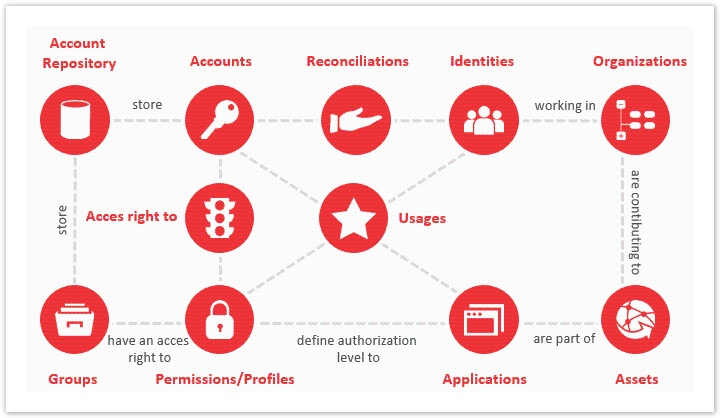

Depending on the richness of the usage log, it is possible to link this information at the same time:

- To the account
- To the permission used
- To the application accessed
- To the person using the account

This information, loaded as an addition to the authorization map is a precious piece of data since it opens up a new section of analyses:

- Accounts/permissions/unused applications
- Recorded traceability of access to the critical resources (applications, directories, SharePoint elements etc.).
- "Abnormal" access
  - Access at night, at the weekend, from a remote site etc.
  - Access when the account does not have the permission
  - Repeated failed access
  - ...

At the time the access logs are loaded into the Identities Ledger, Identity GRC aggregates the logs in accordance with categories defined at the time the parameters are set, for example:

- Access authorized/access refused
- Access as a function of time slots
- Remote/local access
- Data family accessed
- ...

Identity GRC therefore does not store a log (which in any case is present in the file) but usages which are represented by:

- An account
- An identity
- A permission
- An application
- An aggregation key
- The number of times that this usage has been recorded over the time interval corresponding to the frequency of data loading into the Identity GRC (for example, over the previous week) - this attribute can be either calculated by identity GRC (count of occurences) or the value of an already aggregated attribute.

This information is consolidated a posteriori, on the basis of the log files presented to the product at the time data is loaded.

Standard available attributes:

- Display name
- Aggregation key
- Start date of aggregation slot (Identity GRC determines the MIN value of the date that generated the usage)  
- End date of aggregation slot (Identity GRC determines the MAX value of the date that generated the usage)
- Meter usage

## Order of Supply of Different Concepts of the Model

At the time the data is configured, it is advisable to follow a certain order in the feeding of concepts in order to facilitate the approach between the different sets of information. This is summarized in the following diagram:

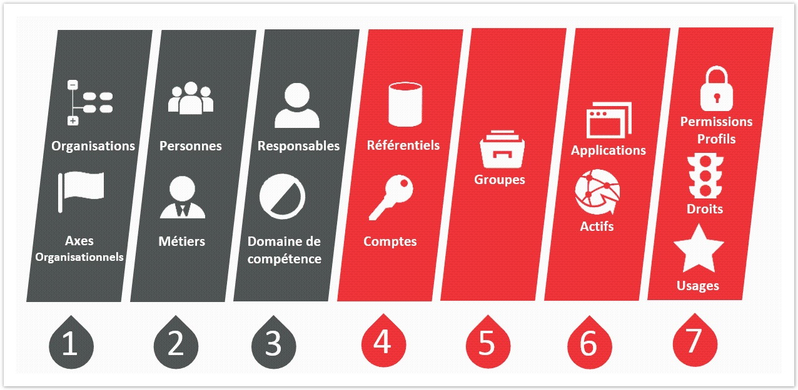

Note that for a given concept, it is not necessary that the data be loaded in a particular order. For example, when you load the organizations, you can make references in advance about the relationships that have been connected. Firstly, load a departmental section and then make a reference to the related department, even though the department in question may not have yet been loaded into the Ledger.

|**Concept**|**Description**|**Graphical representation**|
|-|-|-|
|Organization|Loading organisations, as well as relationships between the organisational nodes.|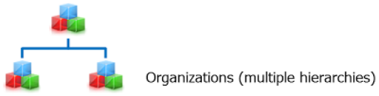 |
|Identities|Loading identities, loading occupations, attachment of identities to the organisations, loading organisation managers.|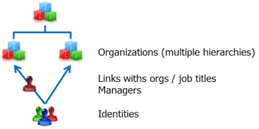|
|Accounts|This stage is repetitive and is done each time a new application is added into the Ledger.Loading repositories, loading accounts, loading groups, attachment of accounts and groups to groups.|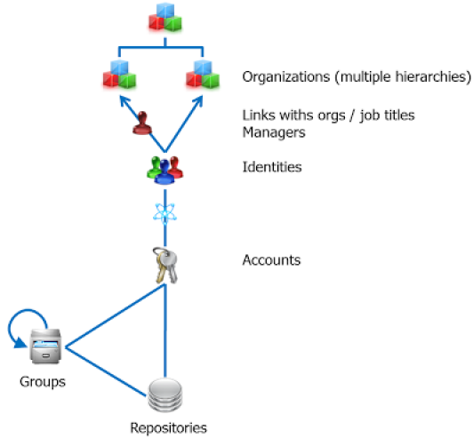|
|Applications and permissions|This stage is repetitive and is done each time a new application is added into the Ledger.Loading applications, loading permissions, creation of rights (linking permissions to the accounts/groups).|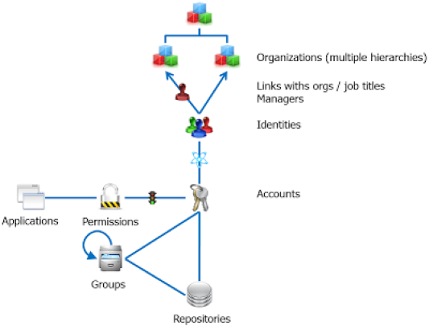|
|Usage|Loading access log.||
|Assets|Loading assets|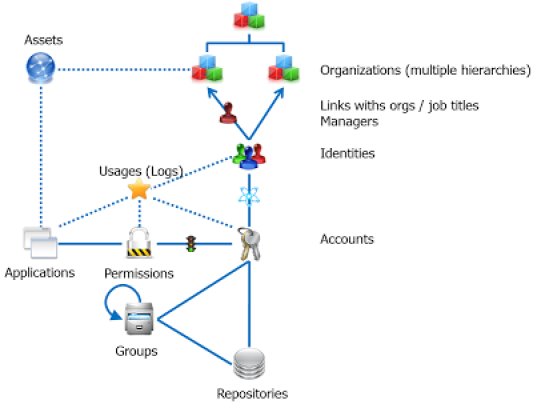|

## Extension of the Data Model

The strength of the data model is homogenization of all the permissions persons have in order to facilitate analyses and reporting.
It is therefore not possible to modify the cardinalities of the database.  
It is however possible to extend each of the concepts:

- By adding specific attributes of the project
- By creating specific nomenclatures and linking them to concepts

## Time Management in the Data Model

### General Time Management Principles

Whether it be a question of control, audit and even direction, it is vital to identify the movements and changes occurring in the enterprise: arrivals, departures, HR movements, creation/modification/reactivation of accounts, modification of permissions, rights etc.  
In practice, the control intervals usually result in inconsistencies between the HR assignments to a person and his or her access on the information systems. Highlighting the modifications enables concentration on the sources of new anomalies and thus to tighter management of the System's security.

Identifying movements is also important when the volume of data to be processed is large. Once the situation returns to a nominally stable state, it is more efficient to concentrate on the movements rather than recommence global control and data validation operations.  
The Brainwave data model integrates time management. The mode of operation is a discreet time linear mode, which means that the data model will to "take a photograph" at a regular time interval of the whole of the information (for example every week) and conduct analysis based on these photographs.

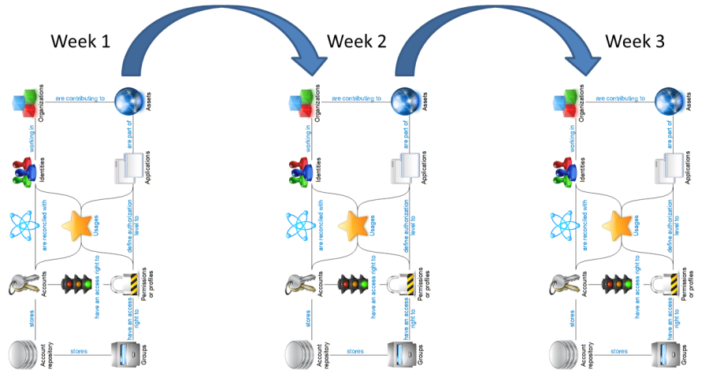

The advantages of this time management model are multiple:

- Brainwave preserves the photographs taken in their entirety, which means that it is possible to "go back in time" and analyze any photograph. This is especially powerful in the case of forensic analysis, used in conjunction with log analysis tools (SIEM) since Brainwave can even supply the full context of the situations (who was working in such and such a department, what was their access to applications, who was able to write in such and such directory three months ago etc.)
- Brainwave reconstructs the movements on the basis of simple abstractions from the systems. The systems do not need to supply the list of modifications occurring from one period to another, a simple global export of data suffices. This functionality is vital to the extent that the majority of systems and applications are not able to extract the actions added to their data over a period of time. In the case of Brainwave, for example, a simple weekly HR extraction from the list of employees enables reconstruction of the arrivals, departures, alterations, organizational changes etc.
Each "photograph" is processed autonomously in the Ledger. It is complete, giving the whole of the information of the organization, identity, account, access etc. This means that at the time of a new loading of data it is necessary to supply the whole of the information.

In practice, the data loaded is "tagged" with the date/time of the data source (file) in the Ledger. Good practice is therefore to work in "best effort" mode at the time of a new loading of data: loading all the information using older files if the recent data has not been made available. Note, however, that this can lead to inconsistencies in the analyses (unidentified departures etc.).  

At the time of a new loading of data, Brainwave Identity GRC automatically processes a certain number of operations:

- It reconciles the newly loaded concepts with those already previously loaded into the Ledger in order to link them
- It reports the account reconciliation information
- It identifies the organization changes, as well as the changes to assignment of rights

The whole of the previous information corresponds to dedicated attributes in the data model.

- One case is quite specifically processed: the departure of an identity of the enterprise. When a person leaves the enterprise, good practice is not to load the corresponding identity concept into the Ledger. This may be implicit (the person disappears from the HR extraction) or explicit (filtering is done at the time of loading of data with the leaving date of the individual). Brainwave Identity GRC automatically detects who has disappeared, changes their status in the Ledger and switches all the accounts that were associated with this person to a "reconciled without owner" status, the reason for which is "leave" and the description is the full name of the person with whom this account was associated.

- The discreet time linear data model implies that several "instances" of the same item are present in the Ledger. For example, for a weekly loading of data the same identity will thus be present 52 times at the Ledger year end: once per photograph.

### Specific Attributes linked to Time

#### Temporal and Non-Temporal Unique Identifiers of Items

Each data model item has two identifiers:

- **recorduid**  : Corresponds to a unique global identifier in the Ledger (non temporal identifier). As this identifier is attached to each Ledger item, it enables unique referencing of an item in a photograph. This means that if several photographs are present and an item is loaded each time (for example, a John Doe identity), each John Doe Identity item will have a different recorduid value.  This attribute is an attribute technique that in addition enables relations to be forged between the different Ledger concepts in the same photograph. Good practice: It is recommended that this attribute be used in reports when it is a matter of referencing an item on a given photograph.
- **uid** : Corresponds to a unique identifier per entity in the Ledger (non time related identifier).  This identifier is attached to each different identity in the Ledger, including all the photographs in which this identity is present. If we take the example of the John Doe Identity, a UID value is assigned to the John Doe item at the time it first appears in the Ledger. This value is then kept identical on the John Doe Identity over the whole of the subsequent loadings of data. This attribute is a technical attribute that enables threads to be woven between the photographs in order to, for example, reconstruct all the events that might have occurred in the Ledger items. Good practice: It is recommended that this attribute be used at the time that reports call upon several photographs (historic, trend graphs etc).

#### New Items, Updated Items, Identical Items, Deleted Items

Each item in the Ledger comprises attributes enabling rapid identification if changes have occurred on this same item.

- **importaction** : Enables identification if an item is new (it is the first time that this item appears;  it is then created _ex nihilo_, a new UID is created), if attributes comprising the item have evolved since the last loading of data or if the item is identical to the last loading of data. This attribute may also take the following values: C (Created: newly created item), U (Updated: item the attributes of which have been modified since the last loading of data), N (None: item the attributes of which are unchanged since the last loading of data). Good practice: use this attribute to perform filtering in reports (for example: who the newly arrived persons are since 1st January 2012).

The detection of changes only applies to the attributes of the item and not to the cardinalities, for example, an access account that has an additional permission could well stay in "N" status if, in addition, none of the attributes comprising the account (date of last login etc) has changed since the last loading of data.

- **deletedaction:**  This attribute is a Boolean attribute. It indicates if this item has disappeared in the next photograph. This is the case, for example, with Identities that leave the enterprise and thus disappear from the HR file. Good practice: Use this attribute in reports for highlighting the changes: persons who have left the enterprise, deleted accounts etc.

This attribute only has a value on a given photograph when a more recent photograph has been loaded and validated. Similarly, making reports on this attribute presents data from the photograph following. It is best therefore to be vigilant over the presentation associated with these reports.

#### Specific Attributes on Identities

The Identity items have a certain number of attributes enabling easy identification if changes have occurred in the item's cardinalities. These attributes are calculated automatically at each loading of data, on the basis of the previous photograph.

- **allocationchanged** : is a Boolean attribute. It enables identification if the identity "assignments" have changed since the last loading of data: change of occupation and/or change of organisation.
- **organisationchanged** : is a Boolean attribute. It enables identification if the assignments to the organisation of the identity have changed since the last loading of data. This attribute concentrates on the organisations and does not take account of changes in occupation.
- **accountchanged** : is a Boolean attribute. It enables identification if the Identity has had a change that has intervened at the level of accounts since the last loading of data: New accounts reconciled, accounts deleted. This attribute also takes account of the "deactivated" status of accounts. It is therefore true if an Identity account has been deactivated, reactivated etc.
- **permissionchanged** : is a Boolean attribute. It enables identification if the Identity has had a change that has intervened at the level of its permissions since the last loading of data. The calculation of this attribute passes through the accounts reconciled to the identity. This attribute takes account of the "deactivated" status of accounts. It only takes account of "asset" accounts reconciled to the identity.

Brainwave Identity GRC performs an implicit filtering on the rights inherited in the hierarchies of rights (directories etc). This enables, for example, the avoidance of this attribute passing as true if the Ledger contains file trees, that an Identity has a right of access on a directory and that a file has been added to this directory since the last loading.

#### Specific Attributes on the Accounts

Similarly to Identity items, Account items have a certain number of attributes enabling easy identification if changes have occurred in the item's cardinalities. These attributes are calculated automatically at each loading of data, on the basis of the previous photograph.

- **permissionchanged** : is a Boolean attribute. It enables identification if the account has had a change that has intervened at the level of its permissions since the last loading of data.

Brainwave Identity GRC performs an implicit filtering on the rights inherited in the hierarchies of rights (directories etc). This enables, for example, the avoidance of this attribute passing as true if the Ledger contains trees of files, that an Identity has a right of access on a directory and that a file has been added to this directory since the last loading.

- **groupchanged** : is a Boolean attribute. It enables identification if the account has had a change that has intervened at the level of its attachments to groups since the last loading of data. Brainwave Identity GRC only takes account of direct attachments to groups; the modification of a group (addition to a group within a group) will therefore not have an effect on passing this attribute as "true".  
