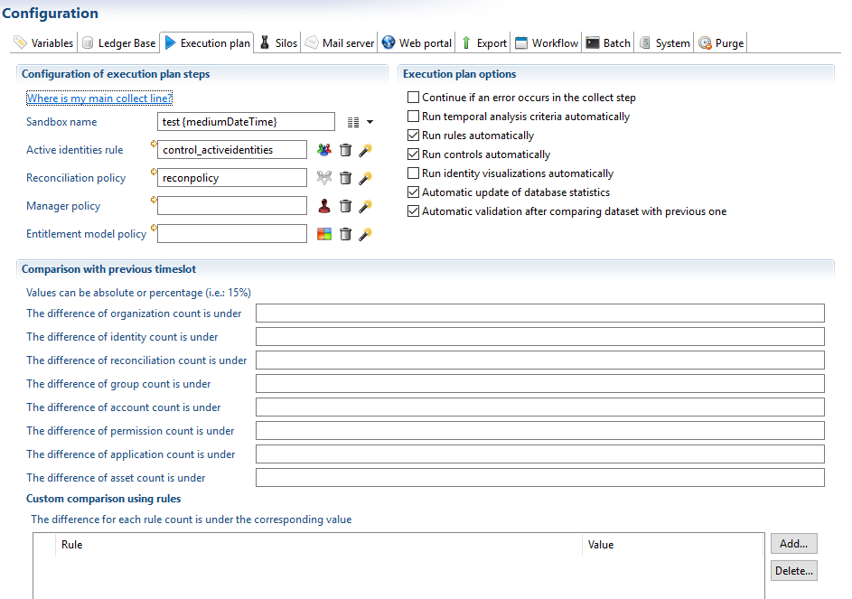
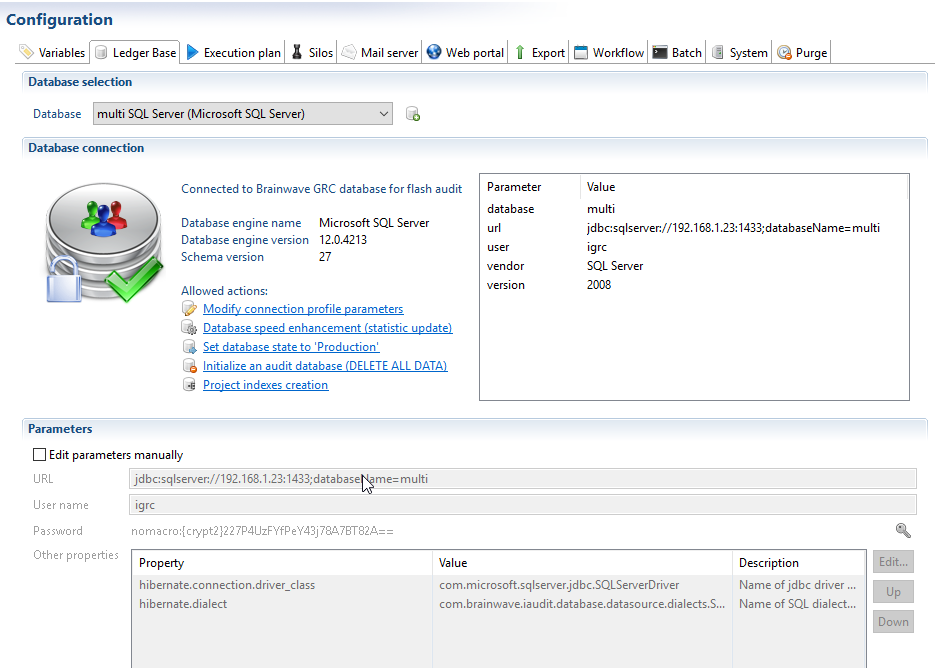
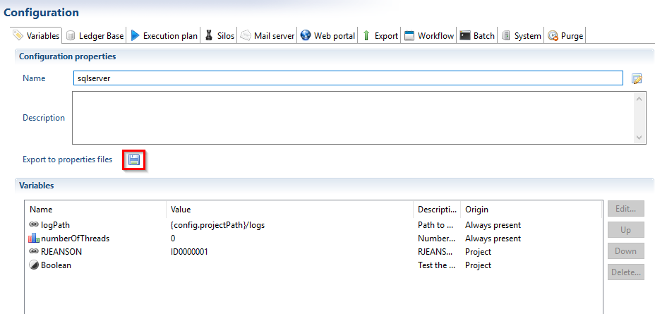
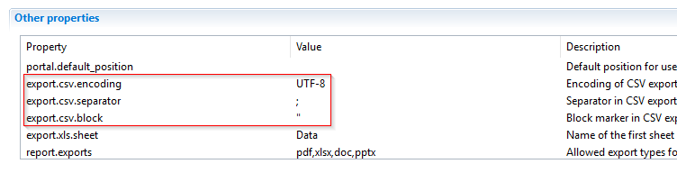
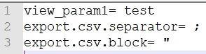

# Batch configuration and usage

## Batch script list  

Upon installation of Brainwave GRC a number of batch script files (`.cmd` files for a windows environment and `.sh` files for a linux environment) are included in the the iGRC analytics home folder:  

-`igrc_batch.cmd[cmd|sh]`: to execute the entire execution plan  
-`igrc_auditlog.cmd[cmd|sh]`: to execute the data loading of auditlogs  
-`igrc_extract.cmd[cmd|sh]`: to execute the extraction of data
-`igrc_facetbuild.cmd[cmd|sh]`: to build a facet  
-`igrc_notify.cmd[cmd|sh]`: to launch a notification campaign  
-`igrc_purge.cmd[cmd|sh]`: to execute a purge of specified data  
-`igrc_sqlscript.cmd[cmd|sh]`: to export the necessary sql scripts to create or update iGRC database, create or update Activity database and export custom indexes creation script
-`igrc_validate.cmd[cmd|sh]`: to validate an activated timeslot  
-`igrc_workflow.cmd[cmd|sh]`: to launch à workflow
-`igrc_portal.cmd[cmd|sh]`: to export web portal
-`igrc_project.cmd[cmd|sh]`: to export project
-`igrc_archive.cmd[cmd|sh]`: to export project archive  

## Automatic data loading

For more information on how to configure Brainwave GRC to perform automatic data loading please use the following steps. These steps are given for a Windows environment, please adapt accordingly if you wish to use a Linux environment.

## Installation and planning

In order to access batch mode, iGRC Analytics must be installed on the computer. The home installation includes the `igrc_batch.cmd` script that runs all steps of the execution plan as configured in the technical configuration within the project. The executed steps are defined in the Execution plan tab:  

  

Once the execution plan is completed, the command `igrc_batch.[cmd|sh]` ends and returns control.

## Configuration

In order to run the execution plan via batch mode the following elements are required:  

- The project
- The data files (extracted from different repositories)
- A valid technical configuration defined in the project
- A valid license for product license

The project to be executed must be copied in the product installation directory workspace and the data files must be placed in the appropriate directory. The license file must be located in the configuration directory that will be used in the command line statement. It is therefore necessary to create a directory (for example: `c:\igrcanalytics\igrc_config`), where technical configuration files will be placed.

In the technical configuration of your project it is necessary to define the database to use in the Ledger base tab:



All parameters and elements configured in the technical configuration are automatically used when executing the execution plan in batch mode. It is nevertheless possible to use the legacy properties files to override the information provided by the technical configuration. To be taken into account when execution the batch command these `.properties` files must be place in the same folder as your valid license file. These files can automatically be created base on a technical configuration by using the export to properties functionality in the Variables tab of the technical configuration:  

  

> As the information present in the `.properties` files overwrites the values provided in the technical configuration the best practice is to use this methodology only for sensitive data, such as DB connection credentials or passwords.

See [here](./05-legacy-property-files.md) for more information on the `.properties` configuration.  

## Command line

The command line requires at least 3 parameters:  

- The project name: for example demo  
- The absolute path to the configuration directory. This directory MUST contain the license file and can contain `.properties` files to override the information provided in the technical configuration
- The name of the technical configuration to use  

As an example: `igrc_batch.cmd demo "c:\igrcanalytics\igrc_config" default`

> When running the batch command without any parameters defined a message is displayed providing information on how to use said command:
>
> ```bash
> "Expecting at least 3 parameters: <project name> <config directory path> <config name> [SIMULATE]. Aborting..."
> "usage: igrc_batch <project name> <config folder> <config name> [SIMULATE]"
> "<project name> is the project name"
> "<config directory path> can contain several of these files:"
> "       - project.properties: file containing project configuration variables"
> "       - datasource.properties: file containing database connection configuration"
> "       - mail.properties: file containing mail server connection configuration"
> "       - workflow.properties: file containing workflow database connection configuration"
> "       - license.lic: file containing the Brainwave product license"
> "<config name> is the name of the configuration (defined in a project .configuration file)"
> "[SIMULATE] simulation mode nothing will be written in Database"
> "Command line example: igrc_batch demonstration /var/igrc/config default SIMULATE"
> "Another example: igrc_batch demonstration /var/igrc/config default"
> ```

## Execution

The command `igrc_batch.cmd` goes through the following steps:

- Verification of the license and display of the key of no license is found.
- Launching the steps of the execution plan in accordance with the project settings
- Creation of a zip file containing all of the logs generated, and deletion of all the log files.
- **Optional**: Sending of a message to administrators, along with an attachment containing the zip file with the logs. This is defined in the Batch tab of the technical configuration

The zip file contains a file called `result-XXXXXXX.txt`, which gives the overall results of the operation, as well as any errors, if found.

> It is possible to remove the log files and/or the event files from the email sent to the administrators once the batch execution is terminated. Please see the Batch tab of the technical configuration for more information.  

## Sequencing the execution

Run the windows task scheduler and configure a batch execution task `igrc_batch` to the desired frequency.

## Batch commmands

When running the any of the following batch commands without any parameters defined a message is displayed providing information on how to use said command. This message includes the expected parameters and a brief description of each parameter.

### igrc_auditlog

This command allows you to run the execution plan for auditlogs via command line. The configuration is performed in the technical configuration of your project.  

```powershell  
"usage: igrc_auditlog <project name> <config folder> <config name>"
"<config folder> can contain several of these files:"
"- project.properties: file containing project configuration variables"
"- auditlog.properties: file containing database connection configuration"
"- mail.properties: file containing mail server connection configuration"
"- license.lic: file containing the Brainwave product license"
"<config name> is the name of the configuration (defined in a project .configuration file)"
"Command line example: igrc_auditlog demonstration /var/igrc/config default SIMULATE"
"Another example: igrc_auditlog demonstration /var/igrc/config default"
```

### igrc_batch

This command allows you to run the standard execution plan via command line. The configuration is performed in the technical configuration of your project. See [here](#batch-configuration-and-usage) for more information.  

```powershell  
"Expecting at least 3 parameters: <project name> <config directory path> <config name>
['SIMULATE' or 'FORCE'] [<reference timeslot tag>]. Aborting..."
```

As of version 2016 R3 it is possible to run the different independent silos in parallel. To do so, you have to add the following parameter, `-Dparallelsilos=true`, to the `JAVA_OPTS` of the `.cmd` or `.sh` file:  

```powershell  
"Expecting at least 3 parameters: <project name> <config directory path> <config name>. Aborting..."
"usage: igrc_batch <project name> <config folder> <config name> ['SIMULATE' or 'FORCE'] [<reference timeslot tag>]"
"<project name> is the project name"
"<config directory path> can contain several of these files:"
" - project.properties: file containing project configuration variables"
" - datasource.properties: file containing database connection configuration"
" - mail.properties: file containing mail server connection configuration"
" - workflow.properties: file containing workflow database connection configuration"
" - license.lic: file containing the Brainwave product license"
"<config name> is the name of the configuration (defined in a project .configuration file)"
"[SIMULATE] simulation mode nothing will be written in Database"
"[FORCE] Launch execution plan even if non validated timeslot has been found in database"
"-f <csv file path> Csv File containing list of account identifiers and repository codes, csv preferences must be the same as in the configuration file"
"-a <account identifier column name> Column name in csv file containing account identifiers"
"-r <repository code column name> Column name in csv file containing repository codes"
"[-f -a -r] options are mandatory only if you need to break the postponement of specific bad reconciliations, refer to the documentation for more details"
"<reference timeslot tag> is the tag (32 char max) to mark the timeslot as a reference one"

Command line example: igrc_batch demonstration /var/igrc/config default SIMULATE"
Another example: igrc_batch demonstration /var/igrc/config default"
```

#### Break Reconciliation

Please refer to the following page for more information on how to break reconciliations:

[Delete Reconciliations](../reconciliation/index#delete-account-reconciliation)

#### Restart

In some situations it can be useful to execute specific steps of an execution plan via command line (batch). This can be the case when issues occur during the batch execution of the execution plan such as disconnections to the data base.  

> [!warning] The following commands only work if:  
>
> 1. A single sandbox is present in the database or
> 2. An activated timeslot is present in the database

The Batch cmd and sh commands have been enhanced to accept a new option `-restart`. This allows the user to restart the execution plan at given step of the execution plan. The option takes a mandatory attribute:  

- `before-activation`: To re-execute all step starting from the activation of the timeslot (requires a minimum of a sandbox state timeslot)
- `after-activation`: To re-execute all post activation steps, just before the computation of active identities (requires a minimum an activate state timeslot)

> [!warning] When the option before-activation is used and if the current working timeslot is partially or completely activate it is reverted to a sandbox state before re-executing the activation.  

A command example  for `Windows`:  

```powershell  
.\igrc_batch.cmd myProject D:\igrc\properties\ dev_conf -restart before-activation
```

A command example for `Linux`:  

```sh  
./igrc_batch.sh myProject /opt/igrc/properties/ dev_conf -restart before-activation
```

### igrc_extract

This command allows you to run the extraction of data using the extractors as defined in the silos via command line. The configuration is performed in the technical configuration of your project and you can define silos that you wish not to extract the data in the Silos tab of the technical configuration.  

```powershell  
"Usage: igrc_extract <project name> <config folder> <config name> [<silo name>]"
"<config folder> should contain these files:"
"- project.properties: file containing project configuration variables"
"- datasource.properties: file containing database connection configuration"
"- mail.properties: file containing mail server connection configuration"
"- license.zip: file containing the Brainwave product license"
"<config name> is the name of the configuration (defined in a project .configuration file)"
"<silo name>  is the name of silo containing connectors to be executed. Empty to execute all silo's connectors"
"Command line example: igrc_extract demonstration C:\config default"
```

### igrc_facetbuild

This command allows you to automatically build facets via command line.  

```powershell  
"Usage: igrc_facetbuild <project name> <config folder> <config name>"
"<config folder> can contain several of these files:"
"- project.properties: file containing project configuration variables"
"- datasource.properties: file containing database connection configuration"
"- mail.properties: file containing mail server connection configuration"
"- workflow.properties: file containing workflow database connection configuration"
"- license.lic: file containing the Brainwave product license"
"<config name> is the name of the configuration (defined in a project .configuration file)"
"Command line example: igrc_facetbuild demonstration /var/igrc/config default"
```

### igrc_notify

This command line allows you to send notify rules via command line. See [here](../notification-rules/index) for more information on how to configure a notification campaign/rule  

```powershell  
"Usage to send emails : igrc_notify <project name> <config folder> <config name> SEND <email campaign name> ['ALL' or <notify rule list>]"
"Usage to save reports: igrc_notify <project name> <config folder> <config name> SAVE <save directory> ['ALL' or <notify rule list>]"
"<config folder> can contain several of these files:"
"- project.properties: file containing project configuration variables"
"- datasource.properties: file containing database connection configuration"
"- mail.properties: file containing mail server connection configuration"
"- workflow.properties: file containing workflow database connection configuration"
"- license.lic: file containing the Brainwave product license"
"<config name> is the name of the configuration (defined in a project .configuration file)"
"<email campaign name> is a name identifying a single campaign. Used for error recovery."
"<save directory> is an absolute directory where the reports will be stored."
"<notify rule list> is either 'ALL' to send all notify rules or the list of notify rule identifiers separated with space."
"This command works on the last validated timeslot (not on activated timeslot or sandbox)."
"Command line examples:"
"   igrc_notify demonstration /var/igrc/config default SEND ALL"
"   igrc_notify demonstration /var/igrc/config default SEND managernotify auditornotify hrnotify"
"   igrc_notify demonstration /var/igrc/config default SAVE /var/igrc/reports ALL"
"   igrc_notify demonstration /var/igrc/config default SAVE /var/igrc/reports managernotify auditornotify hrnotify"
```

### igrc_purge

This command allows you to perform a data purge via command line. Please see [here](../timeslots-and-execution-plan/02-purge-of-timeslots) for more information on how to configure the purge functionality.  

```powershell  
"Usage: igrc_purge <project name> <config folder> <config name> <keep value> <keep unit> <action>"
"<config folder> can contain several of these files:"
"- project.properties: file containing project configuration variables"
"- datasource.properties: file containing database connection configuration"
"- mail.properties: file containing mail server connection configuration"
"- workflow.properties: file containing workflow database connection configuration"
"- license.lic: file containing the Brainwave product license"
"<config name> is the name of the configuration (defined in a project .configuration file)"
"<keep value> is a positive value expressed in <keep unit>"
"<keep unit> is either 'days' or 'timeslots' or 'states'"
"<action> is either 'PURGE' or 'SIMULATE'"
"If unit is 'states', then value is the status of timeslot (I for sandbox, W for activated timeslot)"
"If <keep unit> and <keep value> are empty, purge will load timeslots retention criteria from configuration)"
"Command line example: igrc_purge demonstration /var/igrc/config default 365 days PURGE"
"Example: igrc_purge demonstration /var/igrc/config default IW states PURGE"
"Another example to lunch purge from configuration: igrc_purge demonstration /var/igrc/config default PURGE"
```

### igrc_setenv

To centralize the configuration of batch commands a file has been added: `igrc_setenv.cmd` or `igrc_setenv.sh`.  
This file is used to the configuration of the:  

- `JAVA_OPTS` for example the memory allocated to the batch scripts
 `IGRC_WORKSPACE` to declare the path to the workspace to be used by the batch scripts
- `USER_JAVA_HOME` to declare the path to the JAVA home folder to be used by the batch scripts

The following lines can be updated (`set ...`):  

```sh  
rem (Optional) Java runtime options used when any command is executed.
set JAVA_OPTS=-Xms256m -Xmx2g

rem (Optional) IGRC workspace path containing the project.
set IGRC_WORKSPACE=%IGRC_HOME%/workspace

rem (Optional) point to a specific Jdk/Jre home, otherwise the product will search in JAVA_HOME or JRE_HOME environment variable
rem example: set "USER_JAVA_HOME=C:\Program Files\Java\jdk1.8.0_131"
set "USER_JAVA_HOME="
```

### igrc_sqlscripts

This command allows you to extract the sql creation and/or upgrade scripts for the iGRC ledger database.  

```powershell  
"Expecting at least 3 parameters: <technology> <database_version> <output file> <project name> <period> <retention>"
"Usage: igrc_sqlscript <technology> <database_version> <output file>"
"   <technology> is either oracle, postgres, sqlserver or sqlservermultilang"
"   <database_version> is either the current version of the database to upgrade or one of these keywords"
"     - CREATE for the initialisation script without the DROP section"
"     - FULL for the initialisation script with the DROP section"
"     - INDEX for the custom project indexes export"
"     - INDEXDROP for custom project indexes DROP script"
"     - ACTIVITYCREATE for the export of activity database creation scripts"
"     - ACTIVITYDROP for the export of activity database drop scripts"
"     - AUDITLOGCREATE for the export of AUDITLOG database creation script"
"     - AUDITLOGDELETE for the export of AUDITLOG database drop script"
"   <output file> file or folder path that will hold resulting files (file for ledger and folder in the case of Activity scripts)"
"   <project name> is the project name, mandatory in the case of INDEX and INDEXDROP, otherwise optional"
"   <period> determines how the data will be broken down between different tables to ensure optimal performance (this mechanism is called data partitioning)";
"               possible values are (d, w, m), d: one day, w: one week, m: one month";
"               this parameter is mandatory only in the case of AUDITLOGCREATE";
"   <retention> indicates for how long Logs data must be stored in the database, Data that exceed the retention period are replaced by newly inserted data";
"               possible values are :(1m, 3m, 6m, 1y, 2y), 1m: one month, 3m: 3 months, 6m: 6 months, 1y: one year, 2y: 2 years";
"               this parameter is mandatory only in the case of AUDITLOGCREATE";
"    Command line example 1: igrc_script sqlserver CREATE c:\\temp\\igrc.sql";
"    Command line example 2: igrc_script sqlserver FULL c:\\temp\\igrc.sql";
"    Command line example 3: igrc_script sqlserver INDEX c:\\temp\\igrc_index.sql";
"    Command line example 4: igrc_script sqlserver INDEXDROP c:\\temp\\igrc_dropindex.sql";
"    Command line example 5: igrc_script sqlserver ACTIVITICREATE c:\\temp\\activiti";
"    Command line example 6: igrc_script sqlserver AUDITLOGCREATE c:\\temp\\auditlog_create.sql m 1y";
"    Command line example 7: igrc_script sqlserver AUDITLOGDELETE c:\\temp\\auditlog_delete.sql";
```

### igrc_validate

This command allows you to validate an activated timeslot via command line.  

```powershell  
"Usage: igrc_validate <project name> <config folder> <config name> [<activated timeslot uid>] <action>"
"<config folder> should contain these files:"
"- project.properties: file containing project configuration variables"
"- datasource.properties: file containing database connection configuration"
"- mail.properties: file containing mail server connection configuration"
"- license.zip: file containing the Brainwave product license"
"<config name> is the name of the configuration (defined in a project .configuration file)"
"<activated timeslot uid> is the timeslot uid to validate. Empty to validate the activated timeslot if only one is present"
"<action> is either 'VALIDATE' or 'SIMULATE'"
"Command line example: igrc_validate demonstration C:\config 20140923150245 VALIDATE"
```

### igrc_workflow

This command allows you to execute a workflow via command line.  

```powershell  
"Usage: igrc_workflow <project name> <config directory path> <config name> <process name>"
"<config directory path> can contain several of these files:"
"- project.properties: file containing project configuration variables"
"- datasource.properties: file containing database connection configuration"
"- mail.properties: file containing mail server connection configuration"
"- workflow.properties: file containing workflow database connection configuration"
"- license.lic: file containing the Brainwave product license"
"<config name> is the name of the configuration (defined in a project .configuration file)"
"<process name> is a name of a workflow definition"
"This command works on the last activated or validated timeslot."
"WARNING : This command refuses to work on memory configuration for the workflow"
```

### igrc_campaign

This command allows you to check if a campaign should start or execute a specific campaign via command line.  

```powershell  
"Usage: igrc_campaign <project name> <config directory path> <config name> <campaign code> [FORCE] [DEBUG]"
"<config directory path> can contain several of these files:"
"- project.properties: file containing project configuration variables"
"- datasource.properties: file containing database connection configuration"
"- mail.properties: file containing mail server connection configuration"
"- workflow.properties: file containing workflow database connection configuration"
"- license.lic: file containing the Brainwave product license"
"<config name> is the name of the configuration (defined in a project .configuration file)"
"<campaign code> is a code of a valid campaign"
"[FORCE] is used to launch the campaign regardless of the disabled flag and the next execution date"
"[DEBUG] debug mode to dump workflow logs"
"This command works on the validated timeslot."
"WARNING : This command refuses to work on memory configuration for the workflow"
"NOTE : FORCE option does not launch the campaign if it is already running."
```

### igrc_portal

This command allows you to export web portal via command line.  

```powershell  
"usage: igrc_portal <project name> <config folder> <config name> <output directory> <isFolder>  <file name>"
"<config folder> can contain several of these files:"
"- project.properties: file containing project configuration variables"
"- datasource.properties: file containing database connection configuration"
"- mail.properties: file containing mail server connection configuration"
"- workflow.properties: file containing workflow database connection configuration"
"- license.lic: file containing the Brainwave GRC product license"
"<config name> is the name of the configuration (defined in a project .configuration file)"
"<output directory> is directory path where the output files are exported"
"<isFolder> can be 'true' or 'false', if true portal will be exported as files and folders otherwise a war file, false by default"
"<file name> is the name of exported folder or war file (depending on argument isFolder)"     
            "if argument not set 'Web Application name' parameter in project configuration will be used"
            "if argument not set and no web application name in project configuration is set, batch will automatically calculate a name (pattern:                                    portal_<timestamp>.war) "
"Command line example: igrc_portal demonstration /var/igrc/config default /var/output false portal_export.war"
"Command line example: igrc_portal demonstration /var/igrc/config default /var/output/folder true"
"Another example: igrc_portal demonstration /var/igrc/config default /var/output"
```

### igrc_project

This command allows you to export project via command line.  

```powershell  
"usage: igrc_project <project name> <config folder> <config name> <path> <isFolder>"
"<config folder> can contain several of these files:"
"- project.properties: file containing project configuration variables"
"- datasource.properties: file containing database connection configuration"
"- mail.properties: file containing mail server connection configuration"
"- workflow.properties: file containing workflow database connection configuration"
"- license.lic: file containing the Brainwave GRC product license"
"<config name> is the name of the configuration (defined in a project .configuration file)"
"<path> is a path that will contain the exported project, according to <isFolder> argument it can be a folder(export as folders and files) or a file(export as an            archive)"
"<isFolder> can be 'true' or 'false', false by default"
"           if true the <file name> argument is a directory name"
"           if false the <file name> argument is a file name must end with 'auditprj' extension"
"<file name> is the name of exported folder or war file (depending on argument isFolder)"
"Command line example: igrc_project demonstration /var/igrc/config default /var/output false archive_03042017.auditprj "
"Another example: igrc_project demonstration /var/igrc/config default /var/output true project_folder"
```

### igrc_archive

This command allows you to export a project archive via command line.  

```powershell  
"usage: igrc_archive <project name> <config folder> <config name> <output directory> <file name>"
"<config folder> can contain several of these files:"
"- project.properties: file containing project configuration variables"
"- datasource.properties: file containing database connection configuration"
"- mail.properties: file containing mail server connection configuration"
"- workflow.properties: file containing workflow database connection configuration"
"- license.lic: file containing the Brainwave GRC product license"
"<config name> is the name of the configuration (defined in a project .configuration file)"
"<file_path> is the path where the archive file will be saved, must end with '.par' extension"
"<archive_name> is the name(title) of the the archive"
"<archive_author> is the author exporting the archive"
"Command line example: igrc_archive demonstration /var/igrc/config default /var/output/archive_file.par exchange_repots batch_server"
```

### igrc_version

This command shows the currently installed igrc version:  
`"usage: igrc_version`

### igrc_view

This command allows you to export view results to csv file.  

```powershell  
"usage: igrc_view <project name> <config folder> <config name> <view name> <output path> [-p params file] [-t timeslot uid]"
"<project name> is the name of the project"
"<config folder> can contain several of these files:"
"- project.properties: file containing project configuration variables"
"- datasource.properties: file containing database connection configuration"
"- mail.properties: file containing mail server connection configuration"
"- workflow.properties: file containing workflow database connection configuration"
"- license.lic: file containing the Brainwave GRC product license"
"<config name> is the name of the configuration (defined in a project .configuration file)"
"<view name> the identifier of the view"
"<output path> path of the output csv file"
"[-p params] properties file containing view parameters values and/or csv preferences (optional)"
"    to override portal csv export properties add (export.csv.encoding, export.csv.separator, export.csv.block) to parameter file"
"[-t timeslot] timeslot uid to execute the view on(optional), if not set the view will be executed on current timeslot"
"Command line examples: "
"    igrc_view demonstration /var/igrc/config default br_identity /var/data/br_identity.csv"
"    igrc_view demonstration /var/igrc/config default br_identity /var/data/br_identity.csv -p param.properties"
"    igrc_view demonstration /var/igrc/config default br_identity /var/data/br_identity.csv -p param.properties -t 20190320184651_1"
```

If the csv preferences are not set in parameters file, the command will use same preferences of csv export as portal configuration.  

- export.csv.encoding
- export.csv.separator
- export.csv.block

  

To override default csv preferences, please add (export.csv.encoding, export.csv.separator and\or export.csv.block) entries to parameters file.  

Example of parameters file containing csv preferences:  

  

To map a multivalued parameter (`view_param1`) please use pilcrow sign '¶' to separate values, example:  
`view_param1=val1¶val2¶val3`

### igrc_migratereports

This command line option can be used to migrate reports from using `int` to `bigint` following the upgrade of the schema related to version Curie.  

This action should only be done once, when migrating the project.  

```powershell
Expecting at least 3 parameters: <project name> <config directory path> <config name>. Aborting...
Usage : igrc_migratereports <project name> <config directory path> <config name> [WITHTEMPLATES] [WITHBACKUP]
<project name> is the project name
<config directory path> can contain several of these files:
        - project.properties: file containing project configuration variables
        - datasource.properties: file containing database connection configuration
        - mail.properties: file containing mail server connection configuration
        - workflow.properties: file containing workflow database connection configuration
        - license.lic: file containing the Brainwave product license
<config name> is the name of the configuration (defined in a project .configuration file)
WITHTEMPLATES to also migrate review template reports
WITHBACKUP to save a backup (.old) file for migrated reports
Command line example: igrc_migratereports demonstration /var/igrc/config default WITHTEMPLATES WITHBACKUP
Another example: igrc_migratereports demonstration /var/igrc/config default WITHTEMPLATES
```

> [!warning] This command line requires the project to be imported in the studio using the dedicated wizard in the GUI. When using a Linux environment without a GUI it is recommended to preform the action in a windows environment using the command line or the studio option and then import the updated project.  
