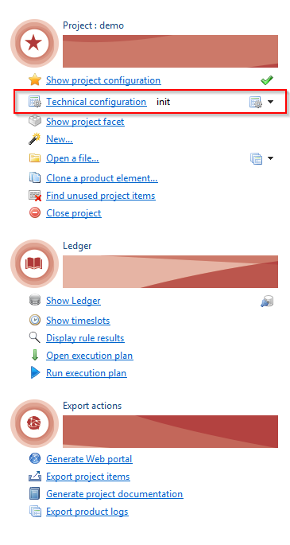
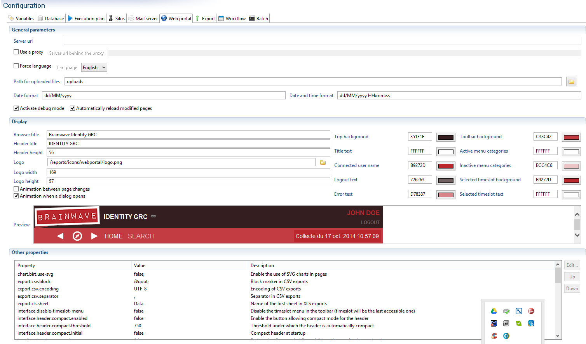
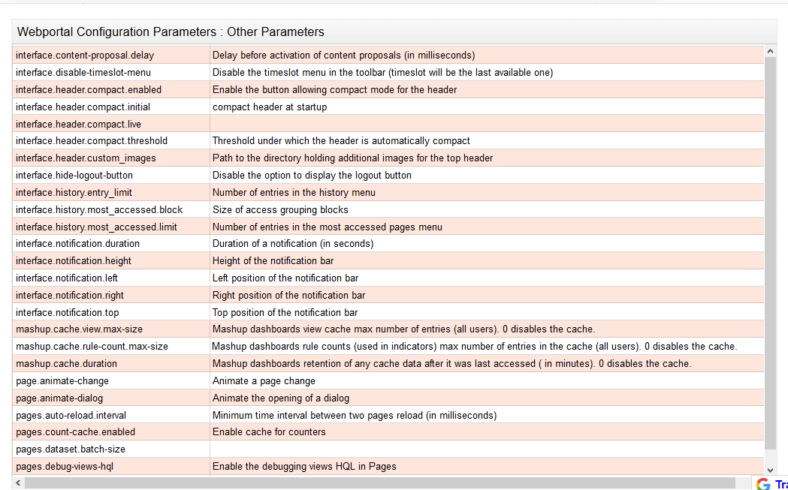
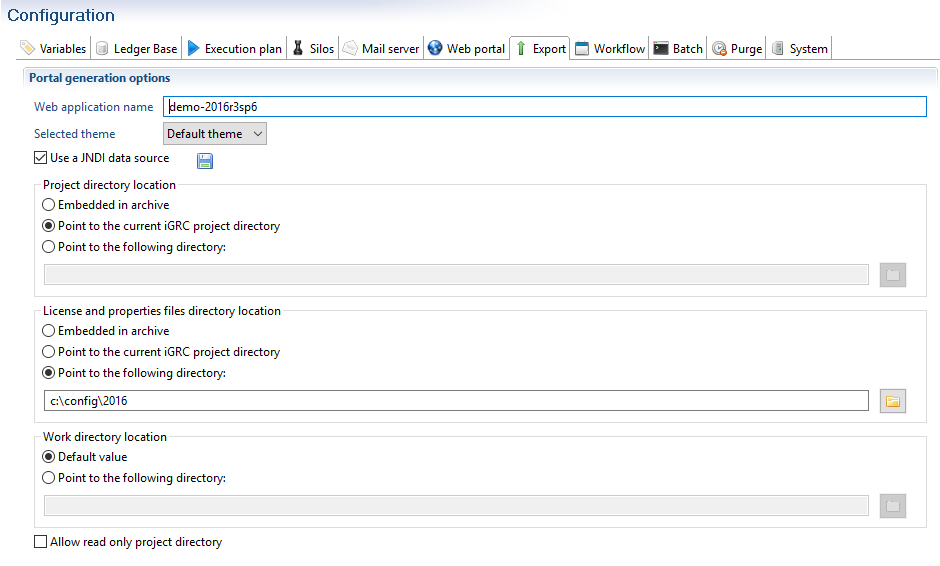
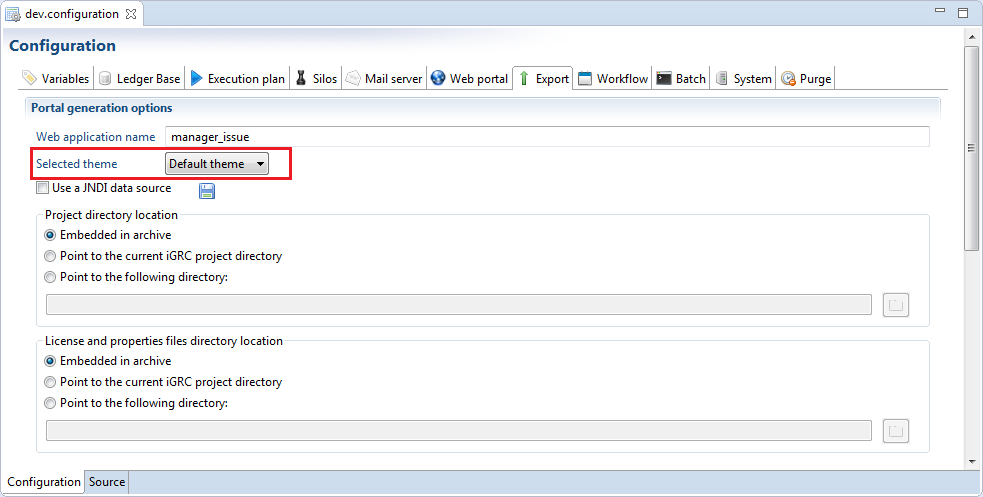
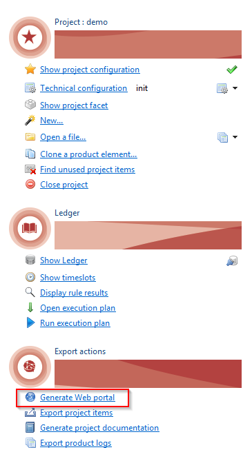
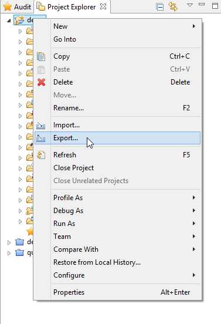
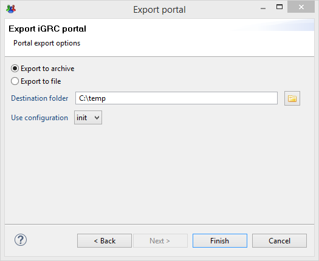

# Deployment

## File Configuration

From the 2015 version of the Brainwave GRC software and onward the project configuration is set via the technical configuration file. Before generating the WAR file, or the archive to be deployed in your tomcat instance you can modify the configuration settings of your portal.  

  

The technical configuration is accessible via the **Audit** tab of the studio. The tabs that include configuration parameters of the web portal are **Web Portal** and **Export**. The 'Web Portal' allows you to modify the web portal settings while the tab **Export** allows you to configure the export options of the web portal.  

## Web portal parameters  

The **web portal** tab allows you to configure the options of the web portal.  

  

The general parameter section allows you to determine your portal's URL. This is used in the links sent in the workflow emails, or if you choose to use a proxy. You can force the language of the portal. Two languages are at your disposal: English and French. You can also define the file upload path and the date format to be used.  

To facilitate the development of pages you can choose to activate the debug mode and enable the automatic reload of pages. This allow you to visualize the parameters used in the current page and automatically update it after each modification. These two options are to useful when the project folder of the WAR file points to the current project folder of the studio (see the next section for more information).  

The display section allows you to configure the header of you web page. You can define the dimensions, the colors and the logos to be use to personalize the header to the style of your company. A preview is displayed.  

The final section allows you to change the parameters that control the behavior of your web page. The parameters that can be changed are listed here:  

  
[Open here](https://docs.google.com/spreadsheets/d/19fytvmtX3PWUi8zTsRhliyef3bSICxFjUIecRhFj07U/edit#gid=0)

> [!warning]  
>
> If the parameter `reports.compress-cache` is modified from `False` to `True` or vice versa it is imperative to purge the report cache directory before restarting the portal.  
> By default the report cache directory is located:  
>
> ```powershell
> <TOMCAT HOME>\webapps\<PROJECT>\WEB-INF\workspace\.metadata\.plugins\com.brainwave.portal.ui.handler.pages\birt_reports`  
> ```
>
> It is possible to display dynamically the name of the person assigned to the task. To do so the message must start with the code `nomacro:` and the assignee is declare using `{assignee}`. See the example below:  
>
> ```powershell
> nomacro:The task has already been assigned to {assignee}
> ```

For more information on web portal configuration please refer to the demonstration project included in the software as an example.

### Date formatting

To ensure the correct handling of dates in the portal, it is necessary to configure the date formats in the other properties of the webportal tab of the technical configuration.  

By default the following languages are handled:  

```properties
pages.formats.date.en_US="MM/dd/yyyy"
pages.formats.time.en_US"="HH:mm:ss"
pages.formats.datetime.en_US"="MM/dd/yyyy SH:mm:ss"
pages.formats.date.en_GB"="dd-MM-yyyy"
pages.formats.time.en_GB"="HH:mm:ss"
pages.formats.datetime.en_GB"="dd-MM-yyyy HH:mm:ss"
pages.formats.date.fr"="dd/MM/yyyy"
pages.formats.time.fr"="HH:mm:ss"
pages.formats.datetime.fr"="dd/MM/yyyy HH:mm:ss"
```

For additional languages, add the corresponding language suffix to the `pages.formats.date.`, `pages.formats.time.` and `pages.formats.datetime.` parameters.  

> [!warning] Converting dates using the page NLS is **NOT** supported

## Export parameters  

The export tab allows you to configure the web portal generation options.  

In this tab you can configure:  

- The desired theme
- The use of a JNDI datasource (see [here](./02-parametrization) for more information)
- The project location
- The location of the license and properties files
- The location of the webapps work directory

  

> As of version 2016 R3 it is also possible to configure the location of the webapps workspace. This corresponds to the bottom section Work directory location.
> This is also the case for the theme. See [here](#select-the-web-portal-theme) for more information.
> As of version 2016 R3 SP6 and when using a Linux OS, it is possible to declare the project folder as read-only. In this case it is necessary to check the check box "Allow read only project directory".|  

The configuration of each option is independent from one another.  

### Project Location

The project can either be embedded in or detached from the web archive.  
Detaching the project from the web archive is useful in the development stages of the project as coupled with the automatic reload of pages (the 'Automatically reload modified pages' option in the 'Webportal' tab of the project's technical configuration). This option can also be used if you wish to reduce the size of the web archive.  

> When the project is detached it is possible to point to the current iGRC project location or to provide directly the path to the desired directory. In the first case the product automatically uses the path to the current project in the studio's workspace.

As of version 2016 R3 if you choose to detach the project from the workspace and definer the path yourself it is imperative that you export the project using the dedicated method 'Export project' under iGRC Analytics of the 'File \> Export menu.

#### Select the web portal theme

The selection of different themes is available as of version 2016 R3.

It is possible to change the default theme used by the web portal.  
To do so navigate to the technical configuration of your project and open the Export tab. In this tab you will find a combo-box "Selected theme" that contains names of available themes. There are at the moment two themes available :  

> 1. The default theme
> 2. And the DSG theme used by the DSG booster

You can select the desired theme and it will automatically included to the exported web archive.

  

> 1. If no theme is selected in your technical configuration then the product will automatically use the default theme.  
> 2. It is necessary to (re-)export and (re-)deploy the web archive after each modification of the theme as only the selected theme is included in the exported web archive.  

### Licence and properties location

In the same way the location of the licence file and the properties files can either be embedded in or detached from the web archive. The use of property file is optional but allows the user to overwrite the information provided in the technical configuration. Please see [here](../../getting-started/05-studio-editors#using-the-editors)for more information.  

### Work directory location

As of version 2016 R3 it is possible to detach the webapps workspace, that contains all temporary files created/used in the webportal.  

> When using this method to detach the workspace form the webapp it is imperative to include the project into this folder.  

## Deployed File generation  

The portal file to be deployed is generated in Brainwave's studio. To show data in the web portal it is necessary to have an activated timeslot in the identity ledger. Once data is activated in the ledger it is no longer possible to delete it.  
To generate the web portal it is recommended to use the main menu tab of the audit project by clicking of **Generate web portal** :  

  

It is nevertheless possible to generate the web portal archive directly of the menu: **File/Export...** , or from the contextual menu at the root of the audit project: **Export...**.  

  

A window is opened where it is necessary to select **'Export portal'** under the folder iGRC Analytics.  
Once the export wizard open, you will have to define the folder where you want the web portal to be created. You can choose to export the web portal in the form of an archive or a WAR file. We recommend exporting to a WAR file.  

  

The export configuration is done in the technical configuration window. During the export wizard you must:  

- Define the destination folder of the archive
- Define the technical configuration to use  

Once the file generated, you then need to deploy it in your web server.  

Please refer to the documentation of your server for more information on deploying the WAR file: [Tomcat Web Application Deployment](https://tomcat.apache.org/tomcat-9.0-doc/deployer-howto.html)
