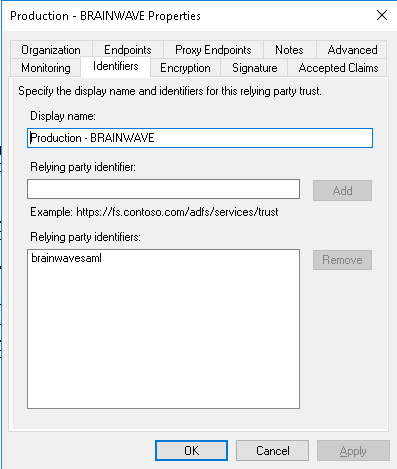
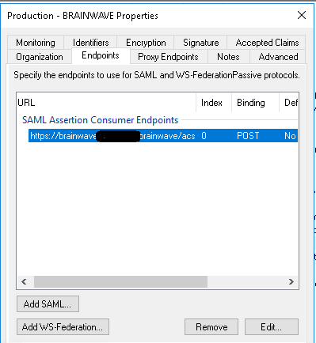

# ADFS application declaration

> [!warning] The information listed here is provided as an example only. This methodology is not supported by Brainwave GRC, but has been tested.

See attachments (`sample_ADFS*` files) for generated configuration.  

Search for `[URL]` and `[TEST]` for keywords.  
