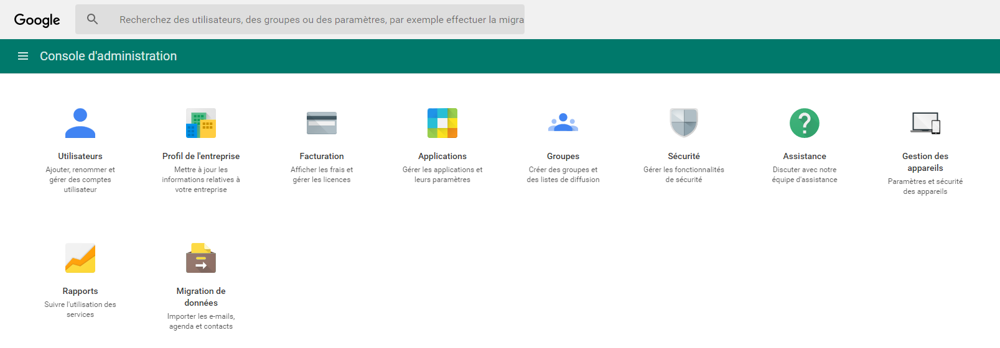
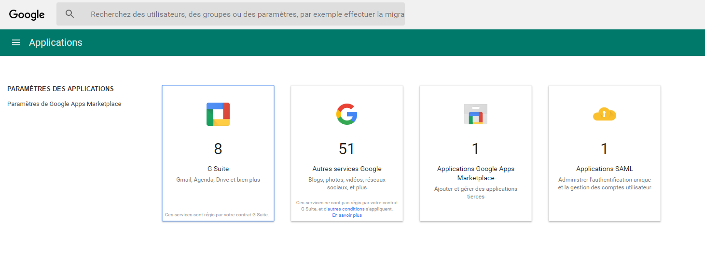
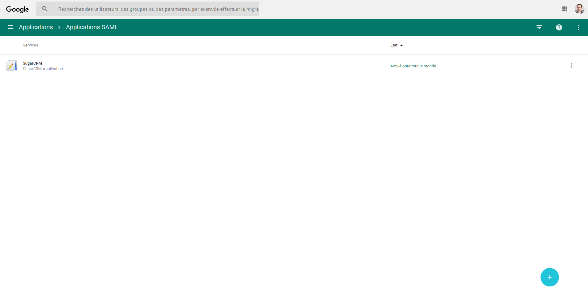
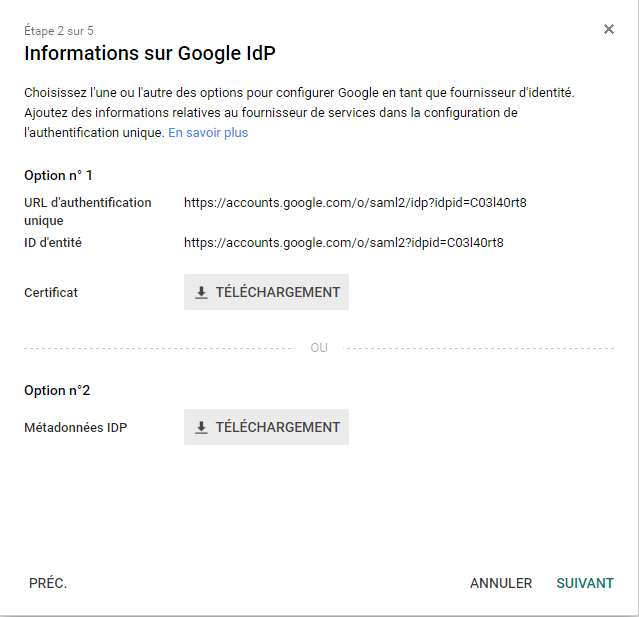
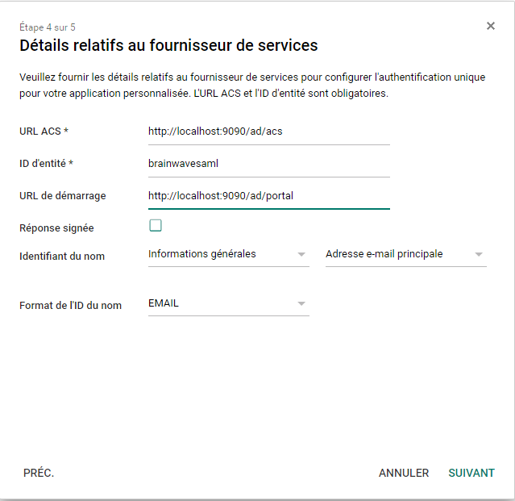
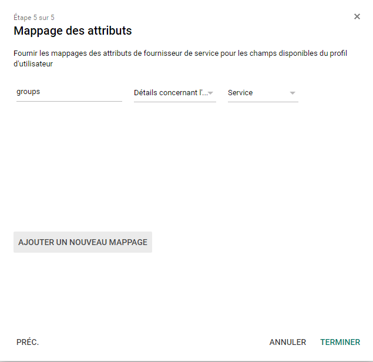
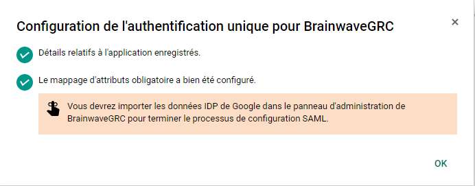
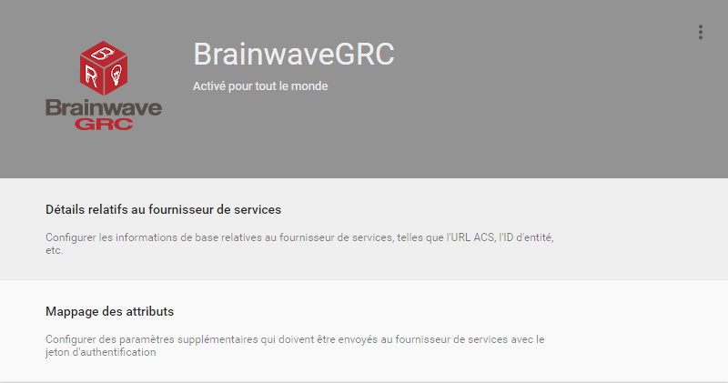

# G-Suite application declaration

> [!warning] The information listed here is provided as an example only. This methodology is not supported by Brainwave GRC, but has been tested.

Open your **Google suite** admin console and click on `applications`.  

Clic on `SAML applications`

Clic on the plus sign (➕)  

Clic on `configure a custom application`  

Download the `IDP metadata` file  

Type a name, a description and upload a logo for your application  

Fulfill the **Service Provider** informations.  
Don't forget to select `EMAIL` as the **name ID**.  
**Do not click** the `sign response` option (as it will sign the `SAML envelope` **instead** of the `SAML assertion`).  

Map the **OU** information to an `SAML attribute`, if needed  

The configuration is done on the **G-Suite** side  

Don't forget to **activate** the application in `G-suite` (it is disabled by default)  

