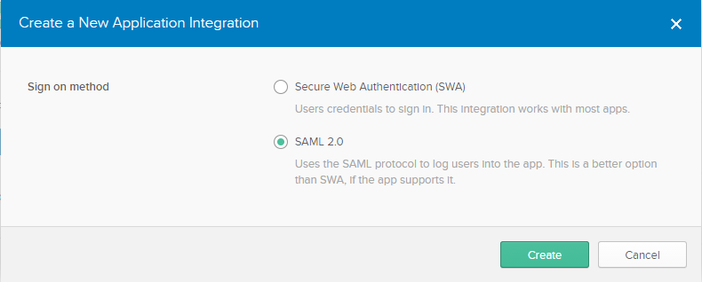
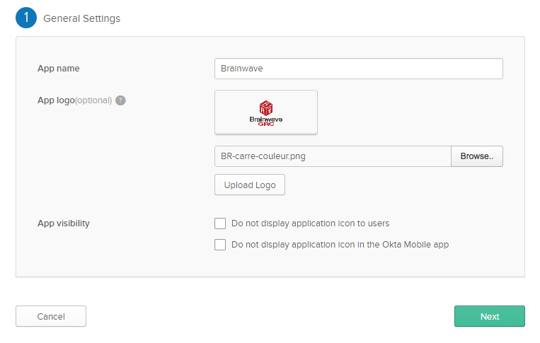
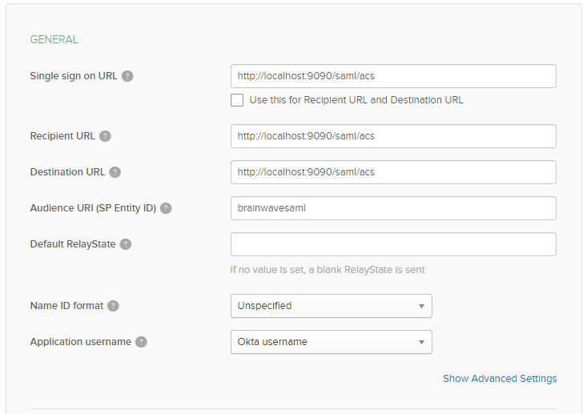
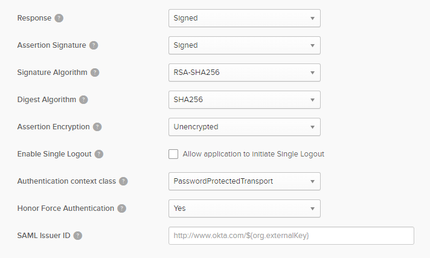
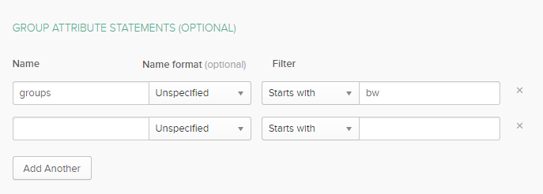
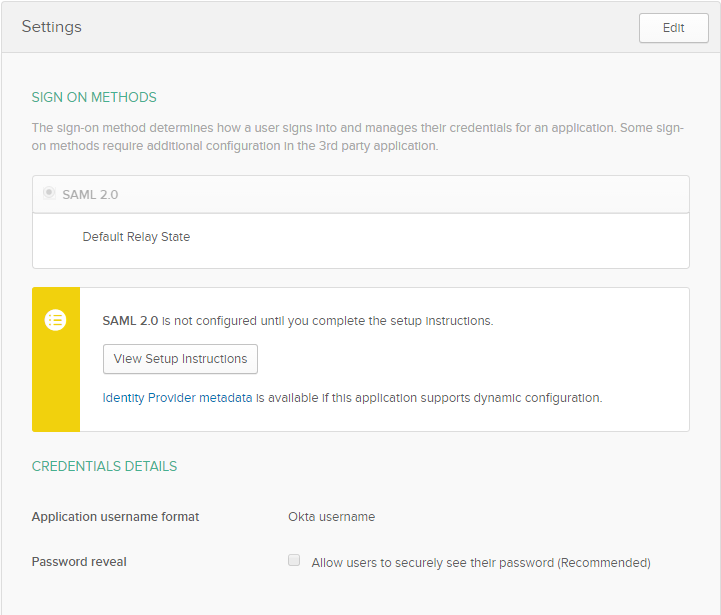
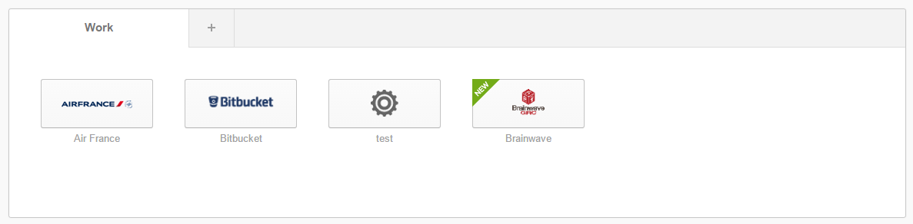

# OKTA application declaration

> [!warning] The information listed here is provided as an example only. This methodology is not supported by Brainwave GRC, but has been tested.

Connect to your Okta admin console and add a new application.  
Select `SAML 2.0` Sign on method.  

Fulfill the general settings: the nick name of your Brainwave project, a logo, ...  

Fulfill the SAML attributes:  

The **SAML URI** is `/acs` within your Brainwave portal. For instance, if your deployment is `https://myhost/mybrainwaveapp`.  
The **SAML URL** to use will be `https://myhost/mybrainwaveapp/acs`.  

The **Audience URI** is `brainwavesaml`, it can be updated if needed (see below).  

Keep the default parameters in the advanced settings.  

If you want to propagate roles from the Identity Provider you need to fulfill the `group attribute statements`.  
The name will contain the name of the `SAML` attribute which will contain the groups, the filter will select the groups to send to the Brainwave instance amongst the total list of user groups.  

Once the configuration is done, click on `Identity Provider metadata` to download the idp configuration. Rename the file to `idp-metadata.xml`.  
You will use it to declare your **Okta** instance in **Brainwave**.  

Assign the application to an **Okta** user, it should appear in his menu.  

