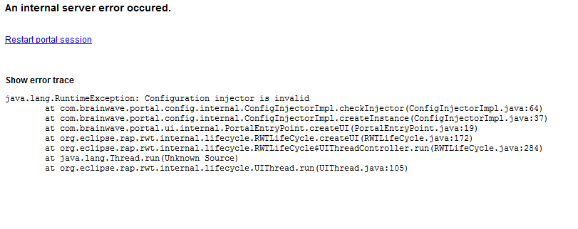
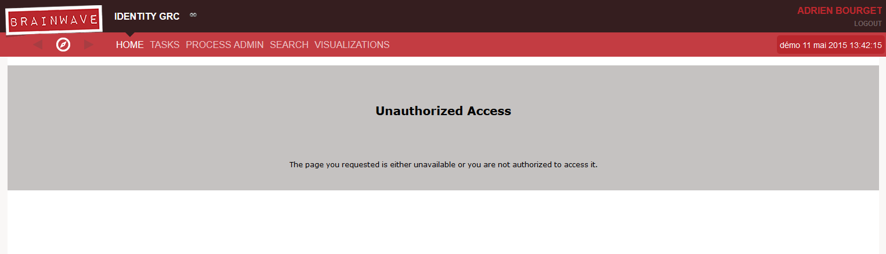

# Troubleshooting

Here is a non-exhaustive list of typical issues and their solutions.  

## No validated Timeslot

The data is only visible in the web portal if there exists a validated timeslot. If there are no validated timeslots the following error can be found in the file **'igrcportal.log'** :  

```log
2015-05-11 13:46:54,313 ERROR [com.brainwave.portal.ui.internal.PortalUI] - Error starting session
java.lang.Exception: There is no validated timeslot!  
```

If your project was setup such as it points to the current studio's workspace or another folder it will not be necessary to re-generate the WAR file. If this is not the case, then it is necessary to generate a new WAR file and to re-deploy it.  

## Unknown user in the identity ledger

To log onto the web service the user must fill two conditions:  

- He must be a tomcat use: [Parametrization](./02-parametrization)
- He must be present in the identity ledger  
As such, a user only authenticated in the Tomcat instance will not be able to log onto the web portal.  

## Database connection errors

  

If the previous page is shown, it is possible that the connection to the database has been severed. If that is the case the following error can be found in the **'igrcportal.log'** file in the installation folder of Tomcat:  

```log
Caused by: org.hibernate.exception.SQLGrammarException: Cannot open connection
at org.hibernate.exception.SQLStateConverter.convert(SQLStateConverter.java:92)
at org.hibernate.exception.JDBCExceptionHelper.convert(JDBCExceptionHelper.java:66)
at org.hibernate.exception.JDBCExceptionHelper.convert(JDBCExceptionHelper.java:52)
at org.hibernate.jdbc.ConnectionManager.openConnection(ConnectionManager.java:449)
at org.hibernate.jdbc.ConnectionManager.getConnection(ConnectionManager.java:167)
at org.hibernate.jdbc.JDBCContext.connection(JDBCContext.java:160)
at org.hibernate.transaction.JDBCTransaction.begin(JDBCTransaction.java:81)
at org.hibernate.impl.SessionImpl.beginTransaction(SessionImpl.java:1473)
at org.springframework.orm.hibernate3.HibernateTransactionManager.doBegin(HibernateTransactionManager.java:555)
... 58 more
Caused by: com.microsoft.sqlserver.jdbc.SQLServerException: échec de l'ouverture de session de l'utilisateur 'igrc'.
```

If this is the case the connection to the database need to be reinitialized. This is done in the technical configuration window of the studio.  

## An external project that does not point to the correct folder

If the page shows the error in the image above and that the following information can be found in the **'igrcportal.log'** file, then the WAR file cannot find the project folder.  

```log
2015-05-11 13:52:29,529 ERROR [com.brainwave.portal.config.internal.ConfigInjectorImpl] - Failed to create configuration injector
com.google.inject.CreationException: Guice creation errors:

1) Binding to null instances is not allowed. Use toProvider(Providers.of(null)) if this is your intended behaviour.
at com.brainwave.portal.config.modules.ConfigurationModule.configure(ConfigurationModule.java:48)

2) Missing constant value. Please call to(...).
at com.brainwave.portal.config.modules.ConfigurationModule.configure(ConfigurationModule.java:50)

3) An exception was caught and reported. Message: Cannot find the project name
at com.google.inject.internal.InjectorShell$Builder.build(InjectorShell.java:133)
```

To correct this, please refer to section: [Deployement](./01-deployment)

## Unauthorized access

Access to the web portal can be refused if a page has a non-unique name in the project.  

  

The previous page can then be seen. The following error will also be present in the **'igrcportal.log'** file.  

```log
2015-05-11 14:36:49,515 ERROR [com.brainwave.portal.ui.handler.pages.internal.PagesRegistry] - Error loading model
java.lang.RuntimeException: Duplicate name: accountSearchPage in pages
```

To correct this error please rename the duplicated page, accountSearchPage in this example.
