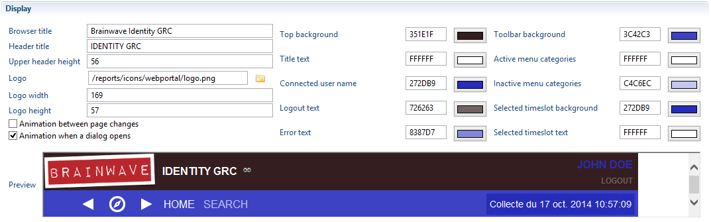
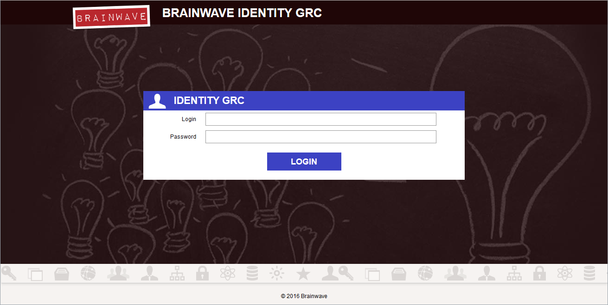

 
# Web portal customization

## Introduction

Customizing the Brainwave web portal means modifying different elements of the look and feel, typically to match your company's graphical chart.  
Customization can be done at different levels, ranging from simply changing the header logo and title to match your company logo and application, customizing the styles, fonts, colors and images of the portal framing and as far as changing the layout of the portal and even hiding some UI elements or adding your own.  

This chapter explains how to carry out different types of customization for the common use cases.  

There are 4 levels of customization , depending on the techniques and skills involved.  

- **Level 1- Configuration** : via the project technical configuration wizard
- **Level 2 - Css** : technical configuration plus customizing one css file
- **Level 3 - Css with resources** : customizing css file , providing custom image files or font files
- **Level 4 - Java** : same as level 3 plus some simple java coding to modify the display layout  

The table below gives an overview of the different changes that can be achieved at each customization level  

|  **Level** |  **skills** | **Customization tasks / Customizable elements** |
|:--|:--|:--|
| **Level 1 - Configuration** | project configuration |<br> - Selecting one of the two standard themes (Default and Classic)<br>- Changing the header image logo and title<br>- Changing the background and text colors of the top header<br>- Changing the height of the top header<br>- Changing the background and text colors of different elements in the navigation panel|
| **Level 2 - Css** |  css syntax |<br>- font style (family, size and weight) of the header title<br>- font style of the user name in the header<br>- font style of the navigation menu items , in both normal and selected states.<br>- Changing the global font used in the portal<br>- Changing the styles ( font, background and text colors, border styles ) of different components displayed in pages ( tables, combo box, labels, tabs, etc.)|
| **Level 3 - Css with resources** | css syntax |<br>- Changing the icons used in the header and navigation panel ( eg. user icon, favorite icons, timeslot icon, etc.)<br>- Changing some icons used in components displayed in the page ( eg. checkbox, radio, sort, etc.)
| **Level 4 - Java** | css syntax <br>+ basic java coding |<br>-  Changing the layout of items in the header and the navigation panel<br>- optionally hiding parts<br>- optionally adding custom parts|

### Out of scope

It is not possible to modify the behavior of standard UI elements of the portal framing. For example, you cannot change the items displayed in standard menus or modify the labels of dynamic buttons.  

Similarly, it's not possible to modify the behavior or layout of widgets inside pages content. For example changing the behavior of a table widget.  

## Simple customization

A simple and automated customization of the login page is available since the 2016 R3 version where the colors and texts defined in the technical configuration are also used in the login page.

For instance, if the Web portal Display section of the technical configuration is defined as

  

then the Portal Login page will be

  

Part of the technical configuration automatically reused for the login page are:

- the logo
- the 'Browser title' and 'Header title' texts
- the 'Toolbar background' and 'Active menu categories' colors  

Note also that this page is now localized as a function of the browser default language.  

## Advanced customization

The following method applies if you are using version 2016 R2 or older or if your customization needs go beyond what is available in the simple method.

In the workspace of your studio locate the folder `/static`. Download from this page the "login.zip" file available as attachement below, copy it into the "static" folder and unzip it.  
It is required to perform modifications into the following two files for the desired changes to be taken into account:  

- The "web.xml" file into Webapps to indicate where the customised files are located
- The attached ".html" files of the login.zip archive for the actual customisation of the login page

> Once all following modifications are performed, if the project is embedded in the webportal at a former export, it is necessary to re-export the web portal and modify the generated "web.xml" file while deploying the new webportal.

### Web.xml file configuration

> The `/static/static` paths below are not typos:  
>
> - The first one is the servlet for static content  
> - The second one is the static folder in the project  

The "Web.xml" file is located into the "Webapps" folder of your web server instance under `<Portal Web Application Name>/WEB-INF/web.xml`. Add the following block in the `<servlet>` tags:  

```xml  
<init-param>
    <param-name>loginPrefix</param-name>
    <param-value>/static/static/login/</param-value>
</init-param>
```

You should then modify the `<url-pattern>` parameter in the `<security-constraint>` tag. Below, you will find a modified version of the default generated web.xml file:  

```xml
<security-constraint>
 <web-resource-collection>
 <web-resource-name>Portal Login</web-resource-name>
 <url-pattern>/</url-pattern>
 <url-pattern>/static/static/login/*</url-pattern>
 </web-resource-collection>
</security-constraint>
```

You also have to modify the `<form-login-page>` and `<form-login-error>` parameters in the `<login-config>` tag. You will find below a modified version of the default generated "web.xml" file:  

```xml
<login-config>
<auth-method>FORM</auth-method>
<realm-name>UserDatabase</realm-name>
<form-login-config>
<form-login-page>/static/static/login/login.html</form-login-page>
<form-error-page>/static/static/login/login_err.html</form-error-page>
</form-login-config>
</login-config>
```

> [!warning] It is necessary to verify that the value of the webportal parameter "static.directories" attribute contains the "static" directory. However, this should be the default value. The webportal parameters are located in a file named `config.properties` under the `webportal` folder of your project for 2014 versions (of the product) the web portal tab of the technical configuration for 2015 and later versions.  

### login.html file configuration

The actual customisation of the login pages are done in the two files `login.html` and `login_err.html`. These are the two login pages available in the web portal:  

- `login.html` is the initial login page
- `login_err.html` is the login page after an authentication error

These pages should also be edited to bring the desired changes. Default `login.html` and `login_err.html` pages are included in the attached login.zip file.  

> You can generate the webportal including your new customized web.xml by renaming the file in **custom-web.xml** and placing it in your project directory **/webportal**.

### Downloads

[login.zip](https://download.brainwavegrc.com/index.php/s/r26nk67GTqKEaKw)  
[web.xml](https://download.brainwavegrc.com/index.php/s/Fk62RHo5eBJowW2)
