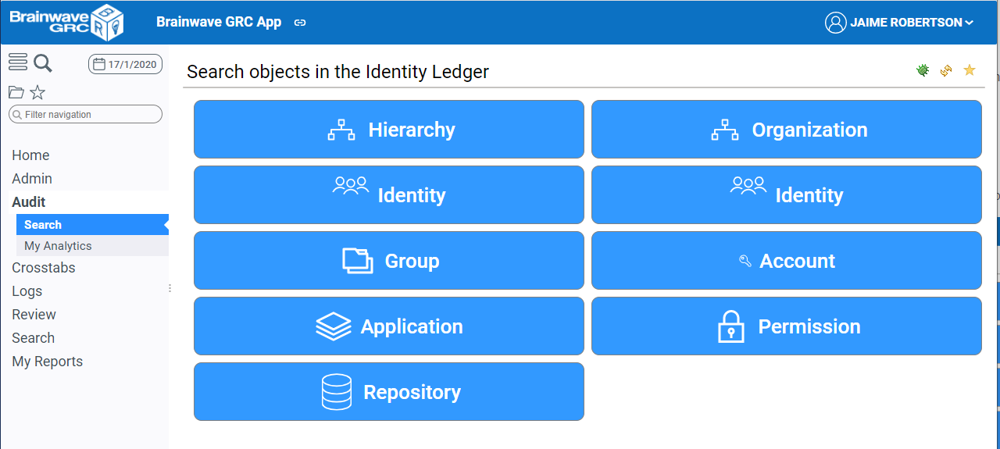
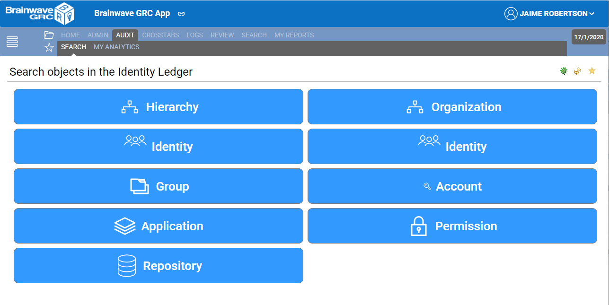
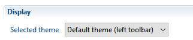
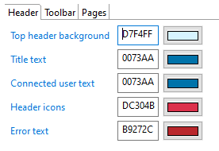
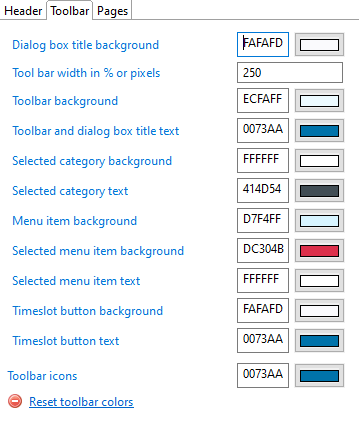
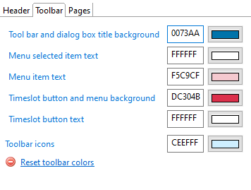
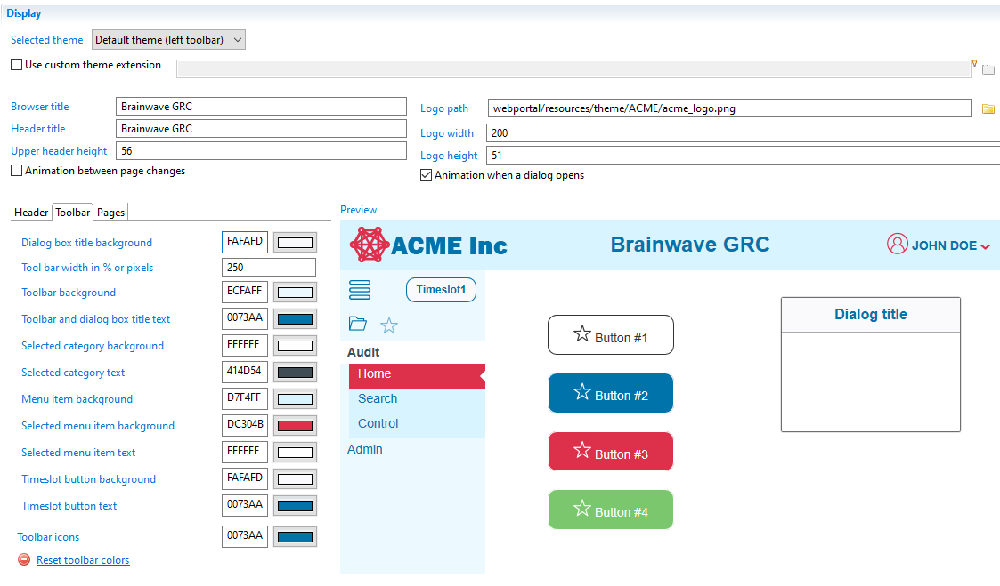

# Level 1 - Customization via configuration

You can achieve the following customization via configuration:  

- Selecting one of the two standard themes (Default or Classic)
- Changing the header image logo and title
- Changing the background, icon and text colors of the top header
- Changing the height of the top header
- Changing the background , icon and text colors of different elements in the navigation panel
- Changing the background , icon and text color of user defined items that can be used in pages ( buttons, etc...)
- Changing *system" colors such as focus and selection.

You can select and optionally configure one of the two predefined themes :  

- **Default Theme** : header to the top, and enhanced vertical navigation panel to the left  

- **Classic Theme** : header to the top, and horizontal navigation panel below  

## Theme selection

To use one of the predefined theme in your application, do the following:  

- Select the theme to use in the technical configuration's **Theme**  tab

- The **Preview** panel displays how the theme will look like
- **Save** the configuration
- Generate the web portal and deploy it to the web server

## Theme configuration

To configure the selected theme, do the following:  

- Modify the different fields in the **Display** section
  - **Browser title**
  - **Header title**
  - **Header height** in pixels ( default value is 56 pixels)
  - Logo displayed to the left of the header
    - The **Logo path** can be absolute, or relative to the current project (note that the logo file must be accesisble to the web server)
    - **Logo width** and **logo height** : If the logo is at the correct dimension, type the dimensions of the image, otherwise type the desired width and height and the image will be scaled in the browser.
  - Page and dialog box animations
  - **Colors** of items in the header, navigation toolbar and pages

> Each time you modify the configuration of the selected theme, do the following to make the changes effective:
>
> - If the project source is embedded in the war file, you need to regenerate and redeploy the war file to Tomcat.
> - If the project is dynamically linked to the war file, you only need to restart the Tomcat server

## Configuring colors

To change any color, type an hex value (without the #) or click the color picker. you can also copy/paste from the color text field.

Configurable colors are divided into three tabs:

### header colors

Configuration of colors in the top header area. Header colors will usually match your company's graphical chart. You can configure both background, text and image colors.

### toolbar colors for Default theme

Configuration of colors in the left toolbar when *Default theme* is selected. You can configure the width of the toolbar in pixels of percentage and the colors of various items in the toolbar.
Note that some colors will also affect dialog boxes background and text color.

The reset colors button sets the header colors to their default values.

### Toolbar colors for Classic theme

Configuration of colors in the top navigation toolbar when *Classic theme* is selected. You can configure text and background colors of various items in the toolbar as well as toolbar icons color.
Note that some colors will also affect dialog boxes background and text color.

The reset colors button sets the header colors to their default values.

### page colors

Colors that may be used in pages as well as *system* colors.
These colors can also be referenced in pages using `Theme.<colorname>` typically in **Styling** statements.

The **Reset page colors** button sets the pages colors to their default values.

| Color| Meaning and usage |
|:---|:---|
| **Foreground#1**   | text and icon color of general un-styled buttons in pages. This color can also be used in pages using `Theme.foreground1` |
| **Background#1**   | background color of general , un-styled buttons in pages This color can also be used in pages using `Theme.background1` |
| **Foreground#2**   |  intended for text and icons of *primary* buttons in pages. This color can be used in pages using `Theme.foreground2` |
| **Background#2**   | intended for background color of *primary* buttons in pages. This color can also be used in pages using `Theme.background2` |
| **Foreground#3**   |  intended for text and icons of *secondary* buttons in pages. This color can be used in pages using `Theme.foreground3` |
| **Background#3**   | intended for background color of *secondary* buttons in pages. This color can also be used in pages using `Theme.background3` |
| **Foreground#4**   | this color can be used in pages using `Theme.foreground4` |
| **Background#4**   | this color can be used in pages using `Theme.background4` |
| **Selection**   | color of selected items in common widgets in pages (eg. table selected rows, tab folder selected tab,  combo box selection, etc...). This color can be used in pages using `Theme.selection`  for example in custom html widgets |
| **Focus** | color of highlighted area when a widget is in focus (eg. button, check-box, table, tab-folder, text edit, etc...) |
| **Custom#1 through Custom#5** | these colors can be freely used in customer projects pages using `Theme.user1` through `Theme.user5` |

- The **Preview** panel reflects the current values
- To make your changes effective in the web application, do the following , depending on the **Export** options :
  - If the project directory is **embedded in the web archive** , you have to **generate the web portal**  over again
  - If the project directory **points to the current project directory** , simply restart the web server  

Below are two examples of the **Default** and **Classic** themes, customized through configuration:  

- **Default Theme** : header to the top, and vertical navigation panel to the left

- **Classic Theme** : header to the top, and horizontal navigation panel below

