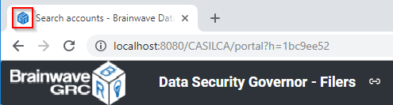
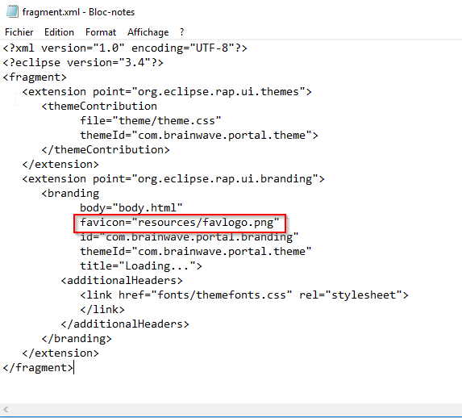
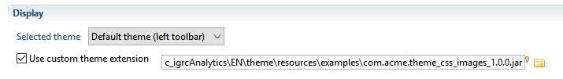

# Level 3 - Customization via Css with resources

You can perform the following customization via a custom CSS file with additional resources:  

- Changing the icons used in the header and navigation panel ( eg. user icon, favorite icons, timeslot icon, etc.)
- Changing some icons used in components displayed in the content area ( eg. checkbox, radio, sort, etc.)  

> Required skills
>
> - Audit project configuration
> - CSS syntax
> - Working with zip files

## Referencing additional resources in CSS

To reference additional resources in CSS, use the **url()** syntax for the css properties to change.  

- To change the image of an icon button, set the **background-image** css property for that button class  
For example, to change the image of the timeslot button in the navigation panel :  

```page
Button.timeslot[PUSH] {
  background-image: url(resources/frame/timeslot_btn_16.png);
}  
```

- To change the icons of a two-state button, you need to set the **background image** for both normal and selected states.  
For example, to change the icons in the navigation favorites menus:  

```page
Button.nav-favorites[RADIO][FLAT] {
   background-image: url(resources/frame/nav_fav_off_20.png);
}
Button.nav-favorites[RADIO][FLAT]:selected {
  background-image: url(resources/frame/nav_fav_on_20.png);
}
```

- Two states buttons have the `[CHECK]` style if alone or `[RADIO]` style if grouped
- Icon-only buttons have the `[FLAT]` style so that they have no borders or background.  

You can also change images used in base components.  
For example you can change the icons used in a check-box with the following css:

```page
Button-CheckIcon {
  background-image: url(resources/theme/checkbox-unselected.png);
}
Button-CheckIcon:hover {
  background-image: url(resources/theme/checkbox-unselected.png);
}
Button-CheckIcon:selected {
  background-image: url(resources/theme/checkbox-selected.png);
}
Button-CheckIcon:selected:hover {
  background-image: url(resources/theme/checkbox-selected.png);
}
```

Browse through the `theme_custom_template.css`  file attached to the previous chapter to know which components images can be overridden.  

## Building a custom theme with css and image files

### Packaging your custom CSS and image files

The paths in the CSS **url()** properties are relative to a specific internal package inside the portal web app directory.  
It cannot reference files outside of this directory or in the Audit project itself ( as is the case for the custom logo file).  
For this reason, you need to package your additional resources along with the css file in a special ZIP file known as a **JAR Bundle** file , so that it's accessible to the web application.  

To package your images files into a JAR bundle, do the following:  

- download the `com.brainwave.theme.template.css_images.jar` file attached below
- give it a different name (eg. mycompany.customtheme.jar)
- using a zip utility, such as 7-zip , add your image files in the **resources/** folder of the jar file
- modify the **theme/theme.css** file with the customized image css entries and update it inside the JAR package  

You can find an example of customized CSS+resource package attached as `com.acme.theme\_css\_images\_1.0.0.jar`, which replaces the white outline menu icon by a black one.  

#### JAR directory and file structure

```page
META-INF/
  MANIFEST.MF

resources/
  frame/
    burger_bk_20.png

theme/
  theme.css

fragment.xml
```

#### theme/theme.css

```css
Button.nav-main-menu[PUSH][FLAT] {
   background-image: url(resources/frame/burger_bk_20.png);
}
```

### Use case: customizing the browser "fav-icon" for Brainwave web portal

The browser **fav-icon** is the icon that is displayed in the browser's tab or title bar for each web site.  

  

To customize the fav-icon for the Brainwave Web application, for example to match your company's logo, do the following:  

- download the `com.brainwave.theme.template.css_favicon.jar`  file attached below
- give it a different name (eg. `mycompany.customtheme.jar`)
- provide an icon file to use as the favicon (typically 32x32 .ico file, but a regular PNG image file of size 32x32 will work as well )
- Make sure the **favicon image file is NOT named favicon.png**, for example name it **favlogo.png** .
- using a zip utility, such as 7-zip or win-zip , copy your image file in the **resources/**  folder of the jar archive
- using a zip utility, update the file **fragment.xml**  at the root of the jar archive so that it references your fav image file,  
for example:  

  

You can of course add more customizations to your theme jar file ( css, images ,etc..).  
Once you are done , proceed to the next section using your updated theme jar archive.  

### Using the theme JAR bundle in your web application

To use the theme JAR bundle file (with the CSS and image files) in your application do the following:

- Check **Use custom theme extension** option in the **Web Portal** tab of the configuration
- Select **\*.JAR (Theme Bundle JAR file)** as the file type, then select your custom jar file to use.
- **Generate the web-portal** so that the jar bundle file is included in the web app
- Redeploy the web app to the web server  

  

## Fine tuning your custom JAR bundle

As it is the case for the css files, it's unlikely that your custom JAR bundle will be satisfactory at the first deployment.  
As such, you will most likely have to try successive changes and verify their impact on the display until you are finished.  

To fine tune your JAR bundle, the initial steps are similar to when working on a css file:  

- Check Activate debug mode in the web portal tab of the configuration
- Select the custom JAR bundle to use as described above.
- Generate the web portal and deploy the web server  

The difference with the css file is that you cannot modify directly the JAR bundle in the project. When exporting and deploying the portal the theme JAR bundle is unzipped in the work directory of your Tomcat installation:  
`<TOMCAT_HOME>\work\Catalina\localhost\<PROJECT>\portal\plugins\com.brainwave.portal.theme.custom`  

All changes done to modify the theme should be applied to this folder:  

- All icons must be added to the **resources** folder
- All modifications applied to the theme must be done in the file `theme\theme.css`  

> [!warning] Shutting down the tomcat server will cause you to loose all the modifications applied.  

Once you are satisfied with the results, to make your changes permanent, you must, before shutting down the server, zip the `com.brainwave.portal.theme.custom folder` and modify the file extension to .jar to have your custom JAR bundle. As explained above you can also rename the resulting file and save it outside of the work folder.

## Download file

[com.acme.theme_css_images_1.0.0.jar](./jar/com.acme.theme_css_images_1.0.0.jar)  
[com.brainwave.theme.template.css_favicon.jar](./jar/com.brainwave.theme.template.css_favicon.jar)  
[com.brainwave.theme.template.css_images.jar](./jar/com.brainwave.theme.template.css_images.jar)  
[theme_custom_template_level3.css](./css/theme_custom_template_level3.css)  
