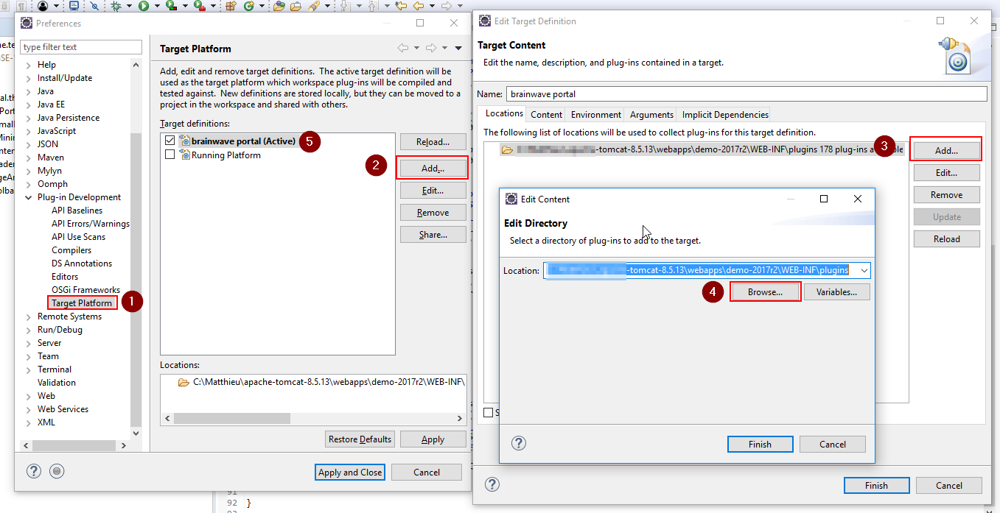
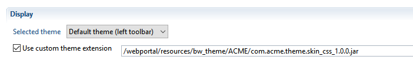
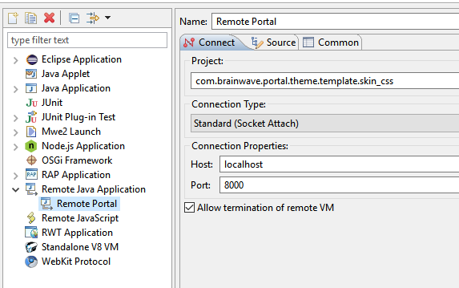

# Level 4 - Customizing the layout via Java coding

You can perform the following layout customization via java coding  

- Changing the positions and layout of the header , navigation panel and the page content
- Changing the position of items inside the header and navigation panel
- Optionally hiding items of the header and navigation panel
- optionally adding custom items to the header and navigation panel  

> Required skills  
>
> - Audit project configuration
> - CSS syntax
> - Simple java coding skills  

> All following procedures are intended for Eclipse (Java EE IDE).

## Customizing page layout via Java coding

### Principle

The layout and content of the different parts of the portal page (header, navigation panel and content) are provided by a java class known as **Portal Skin class** , which can be customized.  
The Portal Skin class follows the _Passive View_ paradigm of _MVC_ :  

- The skin class creates the widgets and containers tree and positions them.
- However, the skin class must not provide any logic to the UI widgets ( such as event listeners and so on), so that its behavior cannot be broken .  
- The UI Logic is attached externally by the controller to the skin object after it has been instantiated.
- In order to do so, the Skin Class must implement a specific interface (see below)
- If some elements must be masked from the UI, they are simply not instantiated (the getters from the interface must return null).
- For convenience, you can add your own UI elements, besides of the interface , but you also have to provide the logic for these custom UI elements , as they are not known of the controller.  

As an example , the standard Default and Classic themes are both implemented using two skin classes, and complemented with specific CSS and resources.

### Writing a Portal Skin class

A portal Skin java class is a regular java class that must implement the interface [IPortalSkin Java reference](#interface-iportalskin).It's strongly recommended that your implementation be a subclass of `com.brainwave.portal.ui.skin.PortalSkinBase`:  

- it provides all the required member variables and associated getters,
- it provides a default implementation for the top header
- it's also the superclass for the default Classic and Default skin classes.  

The UI widgets, containers and layouts that you can use in your custom skin class are those provided by Eclipse RAP, plus a number of brainwave custom widgets, such as a vertical and horizontal navigation panels.  
Eclipse RAP widgets follow the same interface and behavior as Eclipse SWT (Standard Widget Toolkit) but will generate HTML/Javascript/CSS output.  

Useful external links:  

- Eclipse RAP developer' guide: [https://www.eclipse.org/rap/developers-guide/](https://www.eclipse.org/rap/developers-guide/)
- Eclipse RAP API Reference: [http://download.eclipse.org/rt/rap/doc/3.4/guide/reference/api/overview-summary.html](http://download.eclipse.org/rt/rap/doc/3.4/guide/reference/api/overview-summary.html)
- Eclipse RAP widgets API Reference: [http://download.eclipse.org/rt/rap/doc/3.4/guide/reference/api/org/eclipse/swt/widgets/package-summary.html](http://download.eclipse.org/rt/rap/doc/3.4/guide/reference/api/org/eclipse/swt/widgets/package-summary.html)  

**Resources:**  

- `com.brainwave.theme.template.skin_css.zip`

This file is an archive for an Eclipse fragment bundle project , that serves as a template for writing a custom portal theme with a skin class and optional css/images.  
It's ready to use and provides a minimal skin class implementation. It's intended to speed up the implementation of your custom theme.  

The table bellow lists the files included in the package and the possible modifications.  

|  **File** | **Purpose** | **May be changed** | **Must not be changed** |
|:--|:--|:--|:--|
| MANIFEST.MF |  Manifest for the fragment bundle,<br> hosted by com.brainwave.portal.ui |  You can change the fragment name,<br> symbolic name and vendor of the fragment | Do not change the fragment host,<br> and the singleton state |
| fragment.xml |  Extensions : <br> - custom theme contribution <br>- custom skin class | you can change the id and skin class to point to yours <br> you may change the theme file | Do not remove the extensions <br> Do not change the themeId |
|  theme/theme.css |  Default css file for custom css entries | You can modify the contents of this file<br> You may change the name of the file <br>but also change the reference <br>in the theme contribution extension |  |
|  resources/ |  Empty folder to hold additional css resources (images) <br>The resources must be referenced in the CSS |  You can add subfolders and files <br>(typically images) |  Don't change the name and location of the folder,<br>as it is referenced in the build |
|  src/Custom...Skin.java |  Sample custom skin class <br>that displays a minimalistic top header <br>and no navigation bar. <br>Intented for documentation purposes |  You can create another skin class<br>with a different name and package. <br>also change the reference <br>in the skinClass extension <br>You can remove this class if necessary |  |
|  reference/IPortalSkin.java| Source code for the skin class interface, <br>for documentation purposes <br>Not used in the build and not included in the JAR |   |  |
|  reference/ PortalSkinBase.java |  Source code for abstract implementation <br>of IPortalSkin interface for documentation purposes <br>Not used in the build and not included in the JAR |  |  |
|   reference/PortalLeftSkin.java <br>PortalSkin.java | \* source code for the **Default theme**  skin class , <br>with top header and left vertical navigation panel <br><br>\* source code for the **Classic theme**  skin class, <br>with top header and top horizontal navigation panel<br><br>Not used in the build and not included in the JAR |  |  |

It's out of the scope of this documentation to explain in deep Eclipse RAP widgets or the internals of Brainwave web portal implementation.  
We recommend to read the source code of the different classes provided in the package, to gain familiarity and inspiration when writing your own skin class.

### Packaging and deploying a custom theme with a skin class

Your custom theme must be an Eclipse fragment bundle.  
The fragment will include the source code for your skin class, so it needs to be compiled and exported as a "Deployable fragment".  
We provide a ready-to-use template package that can be customized.  

To package and deploy your custom theme with a skin class do the following:  

- download the template project **com.brainwave.theme.template.skin\_css.zip**  from the attached files below
- import the project in Eclipse, or in your favorite java IDE (IDEA, Netbeans, etc.)
- rename the project and the plugin to your company's name
- Define your custom **target platform** in eclipse. This must point to the plugins folder of the deployed WAR file  

  

- write your custom skin class, either by modifying the provided template class **CustomMinimalPortalSkin**  
or getting inspiration from the source code provided in the **reference/** folder
- reference your skin class in the **com.brainwave.portal.ui.skin** extension point. There is already one extension created, so you only need to set the skin class
- add custom CSS entries in the **theme.css** file if needed
- embed any required image files in the **resources/** folder and reference them in the CSS
- Export the bundle fragment as a JAR using Eclipse **File \> Export \> Deployable plug-ins and fragments** command or the equivalent.
- Reference the JAR file in the configuration's **web portal** tab ( select JAR bundle file type)  

  

- Generate the web portal WAR and deploy it to the server  

### Debugging the custom skin class

In order to debug your skin class and set breakpoints, you need to connect to your tomcat server using a remote connection.  
The exact procedure will depend on your configuration and IDE, but basically it looks like this  

- set a breakpoint in your skin class, for example in the constructor; or the createContent method
- start tomcat in remote debug mode  

```sh
SET JPDA_SUSPEND=y
catalina jpda start
```

- Start your remote debug session in Eclipse  

  

## Download file

[com.brainwave.theme.template.skin_css.zip](./zip/com.brainwave.theme.template.skin_css.zip)  

## Interface IPortalSkin

Public interface IPortalSkin  

This interface provides a contract for Brainwave custom skin classes base implementation: com.brainwave.portal.ui.skin.PortalSkinBase  

### Method Summary

| **Modifier and Type** | **Method and Description** |
|:--|:--|
| `void` | `compactHeader(boolean compact)`<br> expands / collapse the top header.|
| `void` | `createContent(org.eclipse.swt.widgets.Composite parent)` <br> this method is called to create the portal content: header, toolbar and page content area|
| `com.brainwave.portal.ui.utils.widgets.BreadCrumbBar` | `getBreadCrumbBar()` <br> an instance of BreadCrumbar to display the optional breadcrumbs for a page, at the top of the page area.|
| `org.eclipse.swt.widgets.Button` | `getErrorLogButton()` |
| `org.eclipse.swt.widgets.Button` | `getHeaderCompactButton()`<br> a two-state button (of type SWT.TOGGLE)<br>to hold that button that expands/collapse the top header|
| `org.eclipse.swt.widgets.Label` | `getHeaderTitle()` |
| `org.eclipse.swt.widgets.Control` | `getLoadingIcon()`<br> the icon that will dynamically hold the loading animated image.|
| `org.eclipse.swt.widgets.Button` | `getMainMenuButton()`<br>the burger button in the toolbar|
| `com.brainwave.portal.ui.visualization.navbar.INavBar` | `getNavBar()`<br>the navigation panel, which implements INavBar.|
| `org.eclipse.swt.widgets.Composite` | `getPageArea()`<br>a composite that will hold the selected content of the page, without the bread crumbs|
| `org.eclipse.swt.widgets.Button` | `getPermaLinkButton()` |
| `org.eclipse.swt.widgets.Button` | `getTimeslotLabel()`<br>The button that displays the name of the current timeslot, and allows selecting another timeslot |
| `org.eclipse.swt.widgets.Button` | `getUserBtn()`<br>the widget to display the name of the current user, <br>and a drop down menu.|
| `org.eclipse.swt.widgets.Control` | `getUserIcon()` |

### Method Detail

#### createContent

```java
void createContent(org.eclipse.swt.widgets.Composite parent)  
```

This method is called to create the portal content: header, toolbar and page content area  
**Parameters**:  
`parent`: the container for the page,

### compactHeader

```java
void compactHeader(boolean compact)  
```

Expands/collapse the top header.  
**Parameters:**  
compact

### getHeaderTitle

```java
org.eclipse.swt.widgets.Label getHeaderTitle()  
```

**Returns:** the widget for the header title, or null if not present  

### getPermaLinkButton

```java
org.eclipse.swt.widgets.Button getPermaLinkButton()  
```

**Returns:** the widget for the permalink button , or null if not present  

### getUserIcon

```java
org.eclipse.swt.widgets.Control getUserIcon()  
```

**Returns:** the widget to hold the dynamic image of the user. Usually it's an icon button return null if not present  

### getUserBtn

```java
org.eclipse.swt.widgets.Button getUserBtn()  
```

The widget to display the name of the current user, and a drop down menu. It's usually a Button  
**Returns:** the widget if present, or null if not present  

### getErrorLogButton

```java
org.eclipse.swt.widgets.Button getErrorLogButton()
```

### getMainMenuButton

```java
org.eclipse.swt.widgets.Button getMainMenuButton()
```

The burger button in the toolbar  
**Returns:** the widget or null if not present  

### getNavBar

```java
com.brainwave.portal.ui.visualization.navbar.INavBar getNavBar()
```

The navigation panel, which implements INavBar. Two implementations are provided: HNavTabs and VNavTabs  
**Returns:** the widget, or null if not present  

### getLoadingIcon

```javascript
org.eclipse.swt.widgets.Control getLoadingIcon()  
```

The icon that will dynamically hold the loading animated image. It's usually a Button widget  
**Returns:** the widget, or null if not present  

### getHeaderCompactButton

```javascript
org.eclipse.swt.widgets.Button getHeaderCompactButton()  
```

A two-state button (of type SWT.TOGGLE) to hold that button that expands/collapse the top header  
**Returns:** the widget, or null if not present  

### getTimeslotLabel

```java
org.eclipse.swt.widgets.Button getTimeslotLabel()  
```

The button that displays the name of the current timeslot, and allows selecting another timeslot  
**Returns:** the widget, or null if not present  

### getPageArea

```java
org.eclipse.swt.widgets.Composite getPageArea()  
```

A composite that will hold the selected content of the page, without the bread crumbs  
**Returns:** the widget, or null if not present  

### getBreadCrumbBar

```java
com.brainwave.portal.ui.utils.widgets.BreadCrumbBar getBreadCrumbBar()  
```

An instance of BreadCrumbar to display the optional breadcrumbs for a page, at the top of the page area.  
**Returns:** the widget, or null if not present
