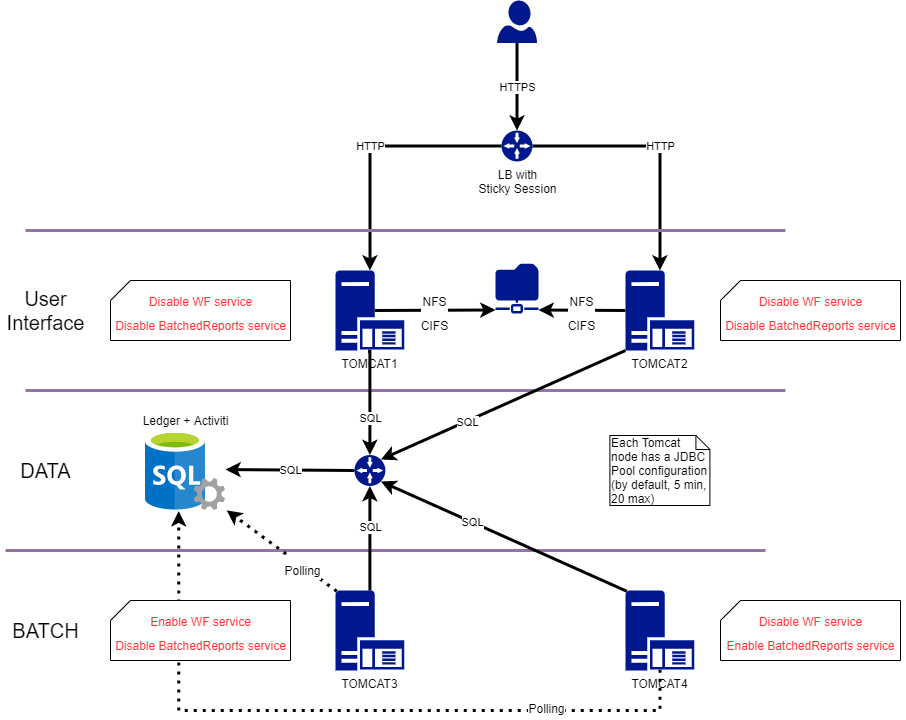
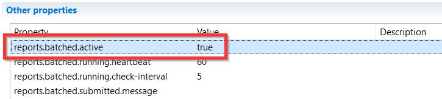

# Tomcat nodes: Dedicated Instance

Different services are included in the web portal.  
These are:  

- User interface (Portal)
- Workflow tasks and reminders (asynchronous)
- Reports (asynchronous)

All services are active by **default**. However, when using multiple tomcat nodes it can be interesting to dedicate a node to a specific service.  

For example, the generation of reports can be resource intensive. Dedicating a node to that process can limit the impact of the report generation on the user experience.  

> Even if there is a node dedicated to Reports, the **compliance reports** will always be run on the **workflow node**

The `Portal` (User Interface) cannot be de-activated in the product. It is necessary to block the access network level for a given node However, you can deactivate the `Workflows` or `reports` to have a dedicated instance for either of them.

> [!warning]  
>
> - All `Tomcat instances` **must** point to the same database!  
> - If there are more than one portal behind a load balancer, you need a share for the reports (cache directory).  

## Architecture

The instances are passive, they will retrieve tasks to perform by querying the database according to activated features.
The instances don't have to be specialized, they can have all the functionalities activated.

When behind a load balancer, a sticky session is required as the session information is in memory only and not shared between nodes (see schema below).

The following schema shows an example of an architecture including specialized nodes (two for `UI`, one for `Reports` and one for asynchronous `Workflow`):  

  

## Workflow and report service activation

The activation and deactivation of worfklow and report services is done through the `technical project configuration`:

### Workflow

To configure the activation or not of the `Workflow` node it is necessary to change the value of the following properties in the workflow tab of technical configuration, in the other properties field:  

- `taskExecutorActivate`
- `jobExecutorActivate`

When both parameters are set to `false` the workflow node is deactivated. If both parameters are set to `true` the workflow node in then activated.

> [!warning] When multiple servers are dedicated for the execution of workflows is necessary that only **one** server be dedicated to the execution of reminders, escalations ... This means that only **one** server should be configured with `jobExecutorActivate` set to `true`. For example:
>
> - Workflow server 1: task and jobs
>   - `taskExecutorActivate=true`
>   - `jobExecutorActivate=true`
> - Workflow server 2: tasks only
>   - `taskExecutorActivate=true`
>   - `jobExecutorActivate=false`

  

### Batched reports

In the "Other Properties" field of the "Web Portal" tab in the the Technical Configuration change the value of the Property `reports.batched.active` to `false` to disable the generation of batch report generation on that node.
 

### Possible configurations

Here are some available configurations for a web node:  

| Technical configuration property settings | Page Navigation | Workflow Tasks Execution | Batched Reports Execution |
|:--------------------|:---------------|:------------------------|:-------------------------|
|taskExecutorActivate='False'   jobExecutorActivate='False'   reports.batched.active='False' |     Enabled     |         Disabled         |         Disabled          |
|taskExecutorActivate='False'   jobExecutorActivate='False'   reports.batched.active='True' |     Enabled     |         Disabled         |          Enabled          |
|taskExecutorActivate='True'   jobExecutorActivate='True'   reports.batched.active='False' |     Enabled     |         Enabled          |         Disabled          |
|taskExecutorActivate='True'   jobExecutorActivate='True'   reports.batched.active='True' |     Enabled     |         Enabled          |          Enabled          |

> [!warning] Each environment should have a dedicated "Technical Configuration" per node role.  

## Technical corner

If report and/or batch services are active in the node, the Tomcat frequently sends a poll request to the database in order to check if there are some tasks in the queue:  

- To check if a workflow is waiting for execution, the table to request is `tworkflowexec`
- To check if a Batched report is waiting for execution, the table to request is `tbatchreport`

Due to this kind of architecture, it is important to size and tune SQL Server accordingly to the forecasted workload:

- Number of end user connections
- Number and volume of batched reports
- Number and volume of workflow launched

For a Tomcat node, the JDBC connection configuration allows, by default, a minimum of `5` SQL actives connections in parallel and a maximum of `20`. In our example above, we can have, potentially, a maximum of `100` actives connections at the same time.

Some workflow parameters in the `technical configuration project` allow to tune the number of workers and tasks per workers in order to increase workflow performance:

- `executionPoolSize`: number of threads (workers) that handle a task in work stack
  - Default is `0` (means number of available vCPUs – 1)
  - Multiple nodes increase processing capability
- `maxNumberOfTasks`: size of work stack where tasks are enqueued for workers
  - Default is `20` (means 20 tasks are available for workers)
  -Tune this parameter is a compromise between efficiency and nodes capability

