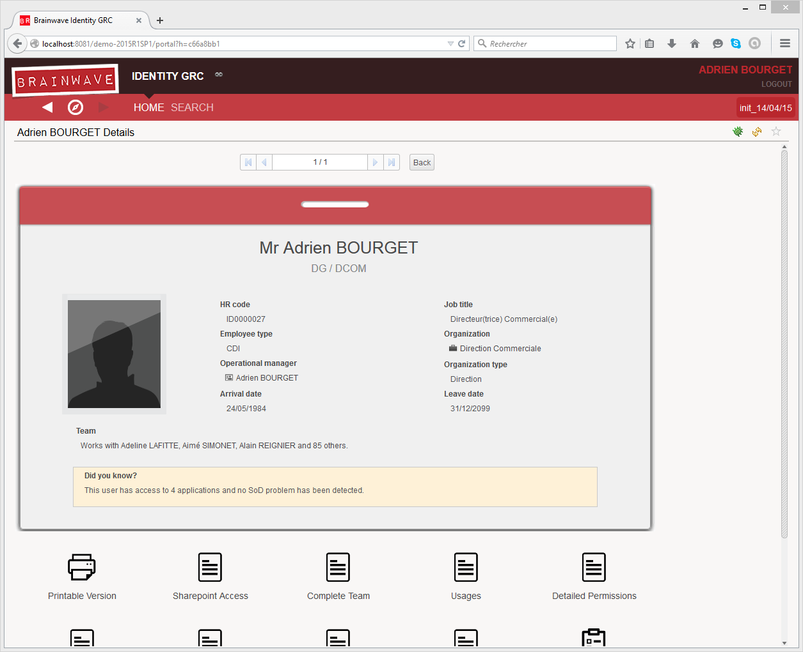

# Brainwave's web portal

Brainwave GRC integrates a 2.0 web portal that will allow you to publish the information contained in the identity ledger as well as the results of your personalized data analysis and controls. These results can then be shared with all security and compliance actors of your company.  

The web portal allows a read only access of the data present in the identity ledger on all loaded timeslots. It also allows you to execute, follow and shut down workflow events such as people or organization reviews.  

  

The web portal is compatible with the standard Java technologies and can be deployed on a tomcat type web server. For more information on Brainwave GRC supported environments please refer to the online documentation.  

The rights model depend on the content of the web portal. As such, it is possible to authenticate a user based on the company's' infrastructure (authentication by Active Directory, the company's directory, using a previously deployed SSO system...). A system of right management that uses roles facilitates the publication of information. The published information can be tailored to the specific profile of the connected user.  

> **Note**: This administration guide is destined for the administrator of the web portal and details how to publish, manage and parametrizes the portal. The user guide, however, is contained in the portal itself.  

Screencasts of Brainwave GRC are available online. Theses short videos illustrate how to setup and use the software, Brainwave GRC. In addition to reading this documentation, we advise you to log onto the following Brainwave web site to watch the video presentations of the main functionalities of the software.  

## Technical architecture

The web portal is a 2.0 web service that follows the Java J2EE standards (JSP, Servlet). This application is provided in the form of a WAR file, a package to be deployed in your instance of a tomcat server.  

The web service can include all configuration settings and information pertaining to the audit project or point directly to the studio's workspace. The data, however, is contained in a database (the identity ledger) and can be accessed by the web service using a JDBC connection (the technical nature of the connection is dependent of the type of database used).  

The security of the application is delegated to the java web server on which it is installed. This is done while respecting the JAAS standard:  

- Stream encryption
- User Authentication
- User role management  

The web service is based on the model of roles.  
