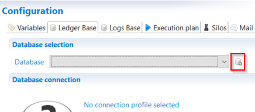

# Microsoft Integrated Authentication

The JDBC driver supports the use of Type 2 integrated authentication on Windows operating systems through the integratedSecurity connection string property.  

Please refer to the following link for more information:

[Building the connection URL: Integrated authentication](https://docs.microsoft.com/en-us/sql/connect/jdbc/building-the-connection-url?view=sql-server-ver15#Connectingintegrated)

## Pre-requisites

To use integrated authentication, download the latest version of the JDBC driver [here](https://docs.microsoft.com/en-us/sql/connect/jdbc/download-microsoft-jdbc-driver-for-sql-server?view=sql-server-ver15) and copy the `mssql-jdbc_auth-<version>-<arch>.dll` file to a directory on the Windows system path on the computer where the JDBC driver is installed.

> The version of the DLL and the version of the JDBC driver used should be identical.
>
> For example :
>
> - mssql-jdbc-8.4.1.jre8.jar
> - mssql-jdbc_auth-8.4.1.x64.dll

## Configuration in the studio  

To use Microsoft's integrated authentication in the studio it is necessary to inhibit the connection through DTP and and the path to the location of the used DLL.

This is done by adding the following parameters to the end of the `igrcanalytics.ini` file located in the home installation of Brainwave.

```ini
-Ddisabledtpconnection=true
-Djava.library.path=C:\\<PATH>\\<TO>\\<THE>\\<DLL>
```

## Creating the connection profile

Once the studio is open navigate to the ledger tab of the technical configuration and create a new connection profile:  



To use the integrated authentication select the the "Use integrated authentication" option available in the Connection profile.


When using this configuration there is a know limitation caused by the DTP profile of eclipse that will systematically request a password even though this is not necessary.

To avoid this behavior the work around is to:  

- Un check the "Use integrated authentication"
- Enter a random string both in the username and password fields (it will never be used)
- Check the "Use integrated authentication"
- Save the technical configuration

> [!warning] When using this authentication method it is not possible to initialize and upgrade the database.

## Configuration of the batch

To use Microsoft's integrated authentication when running the batch add the path to the DLL to the `JAVA_OPTS` parameters.

These are located in the `igrc_setenv.cmd` file located in the home installation of tomcat:

```sh
set JAVA_OPTS=-Xms512m -Xmx2g -Djava.library.path="%PATH%;C:\\<PATH>\\<TO>\\<THE>\\<DLL>"
```

> [!warning] the backslash should escaped with another backslash. This explains the `\\` in the path above.  

## Configuration in tomcat

To use Microsoft's integrated authentication in the running instance of Tomcat it is necessary to add the path to the DLL in the `JAVA_OPTS`.

In the `setenv.bat]` add the following lines:  

```sh
SET JAVA_OPTS=%JAVA_OPTS% -Djava.library.path="%PATH%;C:\<PATH>\<TO>\<THE>\<DLL>"
```

This file is located in the bin folder of the home installation of the instance of tomcat. If the file does not exist then it should be created

## JNDI configuration

When using a JNDI type connection to the database the xml file generated should be updated.
The `username` and `password` attributes should be left empty, and the url attribute should include the `integratedSecurity=true` parameter.

Please find a configuration example below:

```xml
<?xml version="1.0" encoding="UTF-8"?>
<Context override="true" path="/demo">
    <Resources cachingAllowed="true" cacheMaxSize="512000" />
    <Manager pathname="" />

    <Resource
        factory="org.apache.tomcat.jdbc.pool.DataSourceFactory"
        name="jdbc/BRAINWAVEDB"
        auth="Container"
        type="javax.sql.DataSource"
        maxActive="15"
        maxIdle="10"
        maxWait="5000"
        testOnBorrow="true"
        testOnReturn="false"
        testWhileIdle="false"
        validationQuery="SELECT 1"
        validationInterval="30000"
        autoReconnect="true"
        driverClassName="com.microsoft.sqlserver.jdbc.SQLServerDriver"
        username=""
        password=""
        url="jdbc:sqlserver://dataserver.acme.com:1433;databaseName=ader-demo;integratedSecurity=true"
    />

    <Resource
        factory="org.apache.tomcat.jdbc.pool.DataSourceFactory"
        name="jdbc/BRAINWAVEWORKFLOWDB"
        auth="Container"
        type="javax.sql.DataSource"
        maxActive="15"
        maxIdle="10"
        maxWait="5000"
        testOnBorrow="true"
        testOnReturn="false"
        testWhileIdle="false"
        validationQuery="SELECT 1"
        validationInterval="30000"
        autoReconnect="true"
        driverClassName="com.microsoft.sqlserver.jdbc.SQLServerDriver"
        username=""
        password=""
        url="jdbc:sqlserver://dataserver.acme.com:1433;databaseName=ader-demo;integratedSecurity=true"
    />
</Context>
```

## Alternate configuration

It is not necessary to add the path to the used DLL file through the use of `-Djava.library.path` option if it is located in the `c:\windows\system32`.  
