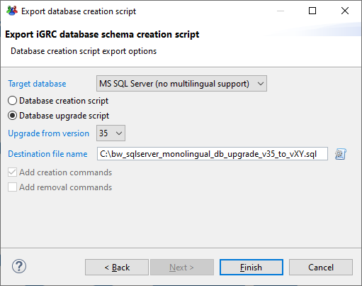
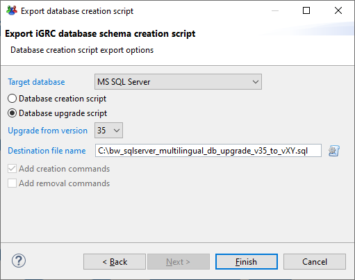

# SQL server  

## Pre-requisites

Before attempting any upgrade of the database please go through all steps detailed in the page below.

[**Release notes**](./index)

In addition if executing the sql requests directly in powershell is necessary to install the SqlServer powershell module. This is done by running the following command in a powershell window using administrative privileges:  

```powershell
Install-Module -Name SqlServer
```

Please refer to the following documentation for more information:  
[https://docs.microsoft.com/en-us/sql/powershell/download-sql-server-ps-module?view=sql-server-ver15](https://docs.microsoft.com/en-us/sql/powershell/download-sql-server-ps-module?view=sql-server-ver15)

### User rights

> If the `<LOGIN>` is the owner of the `<SCHEMA>` to upgrade, this step should not be necessary.

The upgrade script requires the execution of stored procedures. To determine if the account get this right, you can execute the below command.

```sql
EXECUTE AS USER = '<LOGIN>';

USE "<DATABASE>";

SELECT * FROM fn_builtin_permissions(DEFAULT)
  WHERE permission_name = 'EXECUTE' AND class_desc = 'SCHEMA'

GO
```

If the above command returns no result, use the following command to grant the right to execute stored procedures to the user.

```sql
GRANT EXECUTE ON SCHEMA :: "<SCHEMA>" TO "<LOGIN>" ;
```

Where:

- `<SCHEMA>` corresponds to the schema containing the tables
- `<LOGIN>` corresponds to the login of the user performing the upgrade  
- `<DATABASE>` corresponds to the database to upgrade

> At the end of the migration, do not forget to remove the previous granted right to the account.

```sql
DENY EXECUTE ON SCHEMA :: "<SCHEMA>" TO "<LOGIN>" ;
```

## Procedure

### Determining script

To determine the script to execute in order to update the database schema, please execute the following sql request.

```sql
IF ( SELECT top 1 cpropertiesuid FROM tproperties WHERE cpropertiesuid = 'SQLSERVER_MULTILINGUAL') is not null
BEGIN
-- PRINT 'Multilingual'
  SELECT cvalue AS "Curent Schema version",
    CASE 
      WHEN (cvalue = '35') THEN 'Schema version up to date - Multilingual version' 
      WHEN (cvalue = '32') THEN 'mssql_BrailleR1_to_Curie.sql'
      WHEN (cvalue = '31') THEN 'mssql_AderR1_to_Curie.sql'
      WHEN (cvalue = '30') THEN 'mssql_2017R3_to_Curie.sql'
      WHEN (cvalue = '29') THEN 'mssql_2017R2_to_Curie.sql'
      ELSE 'Schema version not recognised. Please contact the support service' 
    END AS "Script to execute"
  FROM     
    tproperties
  WHERE
    cpropertiesuid='VERSION'
END
ELSE
BEGIN
-- PRINT 'Monolingual'
  SELECT cvalue AS "Curent Schema version",
    CASE 
      WHEN (cvalue = '35') THEN 'Schema version up to date - Monolingual version' 
      WHEN (cvalue = '32') THEN 'mssql_noml_BrailleR1_to_Curie.sql'
      WHEN (cvalue = '31') THEN 'mssql_noml_AderR1_to_Curie.sql'
      WHEN (cvalue = '30') THEN 'mssql_noml_2017R3_to_Curie.sql'
      WHEN (cvalue = '29') THEN 'mssql_noml_2017R2_to_Curie.sql'
      ELSE 'Schema version not recognised. Please contact the support service' 
    END AS "Script to execute"
  FROM     
    tproperties
  WHERE
    cpropertiesuid='VERSION'
END
```

#### Powershell execution

It is possible to execute directly the SQL request within a Powershell commandlet. The following commands can be used to hide the user's password

```powershell
$key=Read-Host -AsSecureString
Invoke-Sqlcmd -Query "<query>" -ServerInstance "<ServerInstance>" -Database "<Database>" -Username "<USER>" -Password $key
```

#### SQL server management studio execution

When executing the previous command in SQL server management studio please insure that the correct database and login is used.  

This is done by adding:  

```sql
USE "<database>"
EXECUTE AS LOGIN='<USER>'
```

Where `<DATABASE>` is the database and `<USER>` is the user with which to execute the request.  

### Download the Script

Depending on the version of the script displayed after the previous SQL request, please download the correct script from the following list:  

|                                       Script                                        |
|:-----------------------------------------------------------------------------------:|
|         [mssql_2017R2_to_Curie.sql](../sqlscripts/mssql_2017R2_to_Curie.sql)         |
|         [mssql_2017R3_to_Curie.sql](../sqlscripts/mssql_2017R3_to_Curie.sql)         |
|         [mssql_AderR1_to_Curie.sql](../sqlscripts/mssql_AderR1_to_Curie.sql)         |
|      [mssql_BrailleR1_to_Curie.sql](../sqlscripts/mssql_BrailleR1_to_Curie.sql)      |
|    [mssql_noml_2017R2_to_Curie.sql](../sqlscripts/mssql_noml_2017R2_to_Curie.sql)    |
|    [mssql_noml_2017R3_to_Curie.sql](../sqlscripts/mssql_noml_2017R3_to_Curie.sql)    |
|    [mssql_noml_AderR1_to_Curie.sql](../sqlscripts/mssql_noml_AderR1_to_Curie.sql)    |
| [mssql_noml_BrailleR1_to_Curie.sql](../sqlscripts/mssql_noml_BrailleR1_to_Curie.sql) |

### Execute the script

Once the correct script to execute identified  

#### Powershell

```powershell
$key=Read-Host -AsSecureString
Invoke-Sqlcmd -InputFile "<FullPathToUpgradeScript>" -ServerInstance "<ServerInstance>" -Database "<Database>" -Username "<USER>" -Password $key
```

#### SQL server management studio  

When executing the desired opened script in SQL server management studio please ensure that the correct database and login are used.  

This is done by uncommenting the following block in the script:

```sql
USE "<database>"
EXECUTE AS LOGIN='<USER>'
```

Where `<DATABASE>` is the database and `<USER>` is the user with which to execute the request.  

## After CURIE R1 upgrade

### Checking

To ensure the CURIE R1 upgrade script has been executed successfully, two below SQL requests can be launched on the database.  

> Both requests must be executed with **sysadmin** rights on the Brainwave Ledger database.

- Check if all needed columns has been moved from **INT** to **BIGINT** type

```sql
SELECT (T.name) AS Table_Name, schema_name(t.schema_id), C.name AS Column_Name, c.is_nullable
FROM   sys.objects AS T 
  JOIN sys.columns AS C ON T.object_id = C.object_id
  JOIN sys.types AS P ON C.system_type_id = P.system_type_id
WHERE
  T.type_desc = 'USER_TABLE'
  AND P.name = 'int'
  AND (C.name = 'crecorduid' 
    OR C.name like '%fk' 
    OR C.name in ('cforeignrecorduid','cobjectrecorduid','cobjectuid','coptionuid','crequestid','cworkrecuid')
  );
```

This request should return **0** result if the CURIE R1 upgrade successfully worked.

- Check the global number of indexes

```sql
SELECT 
     count(ind.name) nb_index
FROM 
     sys.indexes ind 
INNER JOIN 
     sys.tables t ON ind.object_id = t.object_id
```

This request should return **1192** if the CURIE R1 upgrade successfully worked and if there are no project/custom indexes.

- Check the number of indexes per table

```sql
SELECT 
     count(ind.name) nb_index,t.name
FROM 
     sys.indexes ind 
INNER JOIN 
     sys.tables t ON ind.object_id = t.object_id
GROUP BY 
     t.name
ORDER BY t.name ASC;
```

In CURIE R1, and without project/custom indexes, this request should return [this result](./assets/bw_sq bw_sqlserver_CURIE_R1_indexes_number_per_table_aggregation.csv) if the CURIE R1 upgrade successfully worked.

### Lingual mode

If the database schema final version target is not CURIE R1 (v35) but a further version (CURIE R3 - v38 for instance) and you want to perform the upgrade using SQL script, **beware** to use the right **lingual** mode (MONO or MULTI) when exporting the upgrade script.

The lingual mode information is provided when executing the [Determining script](#determining-script) procedure.

> Do not forget to precise the `<DATABASE>` and the `<USER>` with which to execute the request by adding two below lines at the beginning of the script.

```sql
USE "<database>"
EXECUTE AS LOGIN='<USER>'
```

#### Monolingual mode  

- From Studio  



- Using batch command line  

```powershell
<IGRC_ANALYTICS_ROOT_INSTALLATION_FOLDER>\igrc_sqlscript.cmd sqlserver 35 "C:\bw_sqlserver_monolingual_db_upgrade_script_v35_to_vXY.sql"
```

#### Multilingual mode  

- From Studio  



- Using batch command line  

```powershell
<IGRC_ANALYTICS_ROOT_INSTALLATION_FOLDER>\igrc_sqlscript.cmd sqlservermultilang 35 "C:\bw_sqlserver_multilingual_db_upgrade_script_v35_to_vXY.sql"
```
