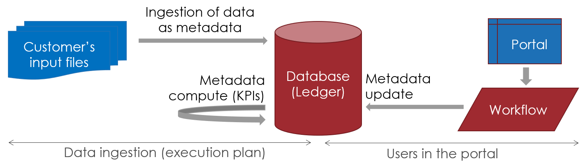
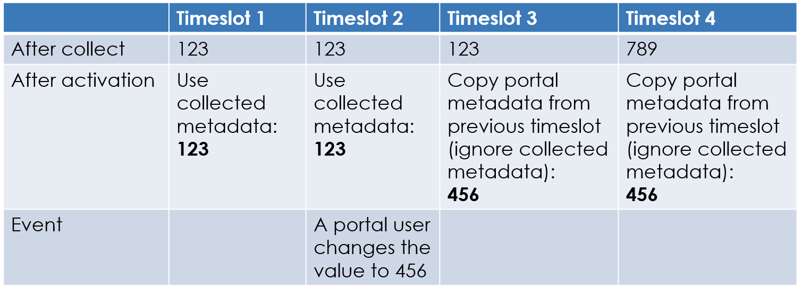

# Metadata life cycle

## Metadata sources

For those familiar with Brainwave, a metadata will follow more or less the the same life cycle as managers.  

As such, there are 3 ways to add, update or delete a metadata:

1. In a collect line. We will refer to this metadata type as 'collected metadata'. A dedicated component has been added to be able to create metadata. This component is described later in this document.
2. At the end of the execution plan. We will refer to this metadata type as 'computed metadata'. A new step has been added after all the execution plan steps to compute KPIs for example.
3. In the portal using a workflow. We will refer to this metadata type as 'portal metadata'. A dedicated component has been added in the workflow editor.

### Collected metadata

Collected metadata correspond to the standard methodology to add project specific data into the Ledger.
This can be either data on existing entities (Identity, Account...) or on links (links from Organization to Application for example).

### Computed metadata

Computed metadata are often used for performance enhancements. Upon completion of the execution plan, the computed metadata are used to prepare data for the portal. Using computed metadata, all queries (rules and views) can be simplified to use metadata instead of complex cascading joins or aggregation functions.

### Portal metadata

A metadata can be created and/or added by the user directly in the web portal. This is done through the configuration of a workflow.
This is useful for metadata that can not be ingested because it does not exist in any customer's repository.

### Joint collection and computation

There are use cases where collected and computed metadata work together. This is the case when the input files contain data considered as the raw information. This data is not the one that will be displayed in the portal to the end user. As a result, from the collected metadata, we need to compute aggregated metadata. In a page it is then possible to display:

- The computed metadata
- The collected metadata, to display the root cause if desired

> [!warning] If an error occurs during the calculation of a metadata then the execution plan will fail and stop. An error is displayed to help the user diagnose the issue.

## Metadata and timeslots

Metadata are attached and belong to a given timeslot. This means that when collecting a metadata in 2 different timeslots will result in 2 different versions of the same metadata. One for timeslot 1 and another for timeslot 2. This is the case for all Ledger entities. It is important to note that collected and computed metadata are not copied from a timeslot to another one. They are re-collected and/or re-computed on each run. For example, if a metadata is collected in timeslot 1 and not in timeslot 2, then there is no metadata in timeslot 2.

Metadata can also be created by a user in the portal. This is a 'portal metadata'. On the contrary to collected or computed metadata, this type is automatically copied from a timeslot to the next timeslot. For example, if a metadata is created in timeslot 1, the same metadata will be automatically present in timeslot 2. This can be assimilated to the reconciliation information or managers links.

However a metadata is attached to an entity, and as such, the metadata can not exist without the 'parent' entity. For example, if a metadata is attached to Paul Martin in timeslot 1 and Paul Martin is not collected in timeslot 2, then the metadata is __NOT__ in timeslot 2. If, however, Paul Martin is collected again in timeslot 3, then the metadata from timeslot 1 will be copied to timeslot 3.

There is another use case where the metadata is collected in all timeslots and then updated in the portal. For example, a metadata is declared to store a numerical value associated with an identity. This information is contained in an extracted repository of the customer's information system and is collected each time an execution plan is run. In the first timeslot, for Paul Martin, the metadata contains the value 123. In the next timeslots, this value does not change in the source repository (import file) so the same value is collected over and over. The metadata is of the 'collected metadata' type.
However in a given timeslot a user changes the value of the metadata to 456. With this update, the metadata type is changed to 'portal metadata'. This means that this metadata will be automatically copied from timeslot to timeslot starting with timeslot 3.
In timeslot 3, the collect step still loads the value 123 from the input file into the Ledger. But in the activation phase, the product copies all portal metadata from the previous timeslot and it overrides the collected ones having the same key. In this example, the value for Paul Martin will be 456.

As a rule of thumb, the portal metadata has a higher priority and will 'overwrite' the collected or computed metadata.
In this example, the value will remain 456 even if the collected data changes from 123 to 789 in timeslot 4.

> It is possible to delete a metadata (and all of it's values) in the current timeslot using a workflow. When a user triggers this operation, it resets the priority of the collected metadata. As a result, in the next timeslot, the metadata values will be collected.
