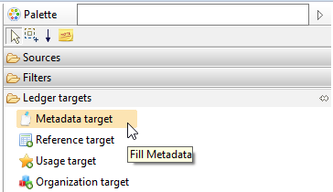
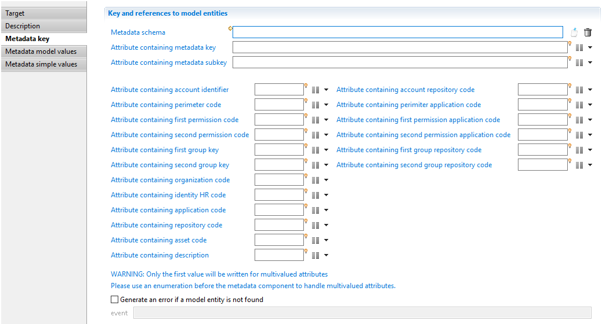
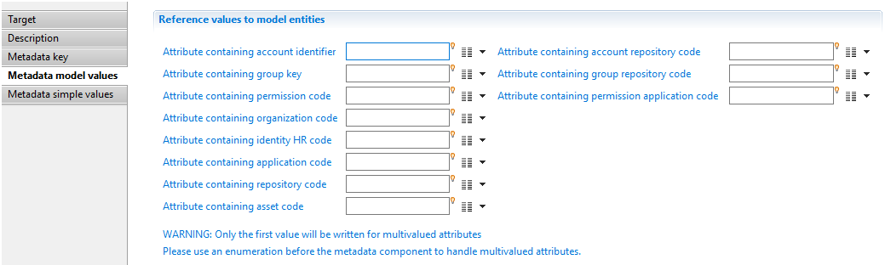
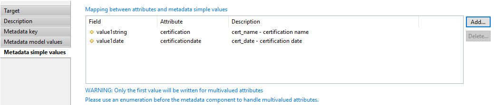
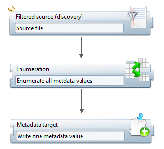

# Collecting Metadata

In the collect editor, a new component has been added to add data to a metadata. 

This component is located in the palette:

In the properties tab of the component, there are 3 tabs:

- 'Metadata key' is used to select a declared metadata and map the attributes containing the **key** (references to Ledger entities).
- 'Metadata model values' contains the mapping for the metadata **entity values** (other Ledger entities).
- 'Metadata simple values' contains the mapping for the **simple values** (2 strings, 2 integers, 2 floats, 2 dates, 1 boolean and 1 blob).

## Metadata schema

There are 2 ways to use the metadata component: with or without a metadata schema reference.

When specifying a metadata schema, the unused fields in the defined schema are automatically disabled. This helps the user sees what key mapping has to be provided.
In a mode without a selected metadata, the collect remains based on a generic metadata with all the fields active.

> [!warning] It is **highly** recommended to select a pre existing metadata schema. When using this configuration, both the editor and the runtime conform to your schema definition.  
> 
> In the editor, only the active fields can be filled. And during the runtime, only the active fields are written to the database.  
>
> The free style mode to collect metadata without schema is rarely used but can be useful to get the metadata key from the input files instead of having to declare them in the project.  
> 
> Keep in mind that using a metadata schema declaration is the best practice.

## Component properties

### Metadata key

The following screenshot shows the 'Metadata key' tab:

This tab is used to define relationships with Ledger entities as keys.

In this tab, you can:

- Select a schema using the first field
- Map an attribute containing the metadata name (second field).

The differences between these 2 modes are explained in the next chapter.

The rest of the interface is used to map attributes with the code of the entity in order to link the metadata and the Ledger entity.
For some entities, you must provide 2 codes. For example, to point to an account, you must provide the account identifier and the repository code.

In a metadata having 2 or more entities mapped to attributes, it is allowed to have no value at runtime for one or more attributes.

For example if a metadata schema defines a new link between 3 entities, for example account, application and asset, during runtime links can be created in the database with only 2 entities, account and application.
In this particular case, the asset is considered as optional and some records in the metadata will have an asset but not all of them.

This is the responsibility of the developer to be sure that a non empty value is provided for a mandatory entity.

### Metadata model values

The following screenshot shows the 'Metadata model values' tab:

This tab is used to define relationships with Ledger entities as values. These are **not** part of the metadata key.

The list of metadata fields depends on whether a metadata schema has been selected or not.
If a metadata schema has been selected in 'Metadata key' tab, then only the active fields are enabled, otherwise all fields are enabled.

### Metadata simple values

The following screenshot shows the 'Metadata simple values' tab:

This tab is used to map the attributes to the simple values values of the metadata. The following list of values are available:

- 20 strings
- 20 integers
- 2 floats
- 2 dates
- 1 boolean
- 1 blob

The column named 'Description' displays the name and the label from the metadata schema if a schema has been selected.

## Metadata component behavior

### Database operation

The component always behaves in an incremental mode.
This means that every time the component is entered, a new metadata with its values is added to the database.

> [!warning] There is no way to update a metadata already written in a previous collect line.

The component does not check if the given value already exists for the given metadata key.
As a result the component allows insertion of duplicate values. It is of the responsibility of the collect line to remove duplicates before entering the metadata component.

By default, if an attribute is mapped, using the code or the identifier, to a Ledger entity that code is unknown, then an error is triggered.
When the option 'Generate an event if a model entity is not found' is checked, then no error is triggered during the execution plan but an event is generated in the event file located in the `\log` folder of the project.

All attributes mapped in the tab named 'Metadata simple values' are subject to automatic conversion.
For example, if a String attribute containing '123' is provided for the field 'First integer', a conversion from String to Number is performed.
But the best practice is to provide the right attribute type without automatic conversion.

#### Multivalued attributes

The component in the collect line only supports single values.
If you want to write several values for a metadata, you need to enter the metadata component once for each value.
This is accomplished by using an enumeration above the metadata component as shown in the following screenshot:

#### Links between metadata

In addition metadata can be linked together in order to create a tree structure.

However This feature is not accessible using the collect component but is available in the workflow.

The use cases and the configuration to create such a metadata tree are explained in the following chapter:

[Modifying metadata in a workflow](./07-workflow.md)
