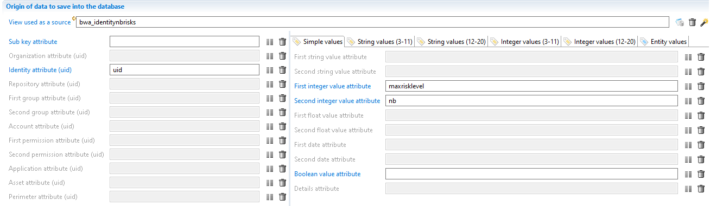
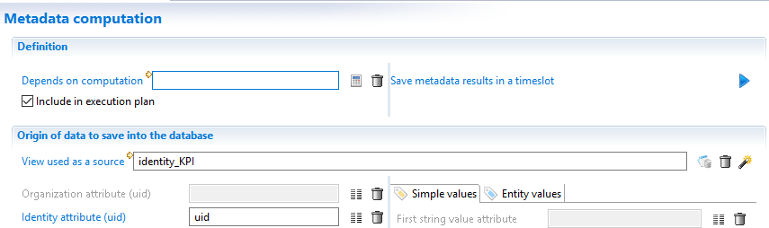
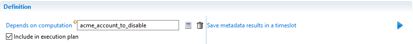
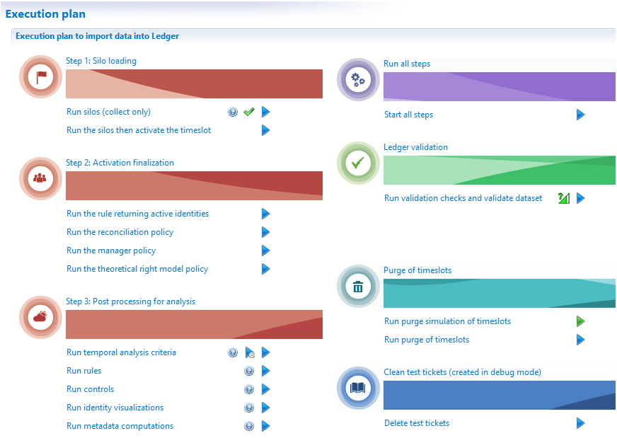

# Computing metadata

It is also possible to compute a metadata. Some of the use cases that have been described in [this document](./02-use-cases) to computed metadata.

The use case that calculates KPIs requires computation of metadata. Computing KPIs can be difficult at collect time because they can require information collected or computed during the activation phase. In the case of the KPI of the number of privileged accounts per identity the reconciliation phase needs to be computed.

Computed metadata are computed during the very last step of the execution plan just before the validation step.
As a consequence, the computation may use the control results to compute metadata.

Computed metadata can also used to improve performances and user experience in the portal. For example, links between entities may be created to speed up the queries on the portal side. A link between groups and applications could be created using a computed metadata.
This would allow the portal to display which Active Directory groups have rights on which applications.
In a view, fetching the list of applications related to a specific group would be very fast compared to the standard join way (groups->rights->permissions->applications)

> [!warning] Metadata can be either collected or computed but not both.
If you need to collect metadata and then compute values based on those collected values, you must declare 2 metadata schemas: a collected one and a computed one.

## Computed metadata editor

The way metadata are computed is using a view. The result of the view is used to fill the metadata.
The configuration is shown with the following screenshot:

The above example produces a KPI (an integer number).
Aggregation of values is not handled during the runtime of computing a metadata. As a result the view must return a single integer.
In the case of a counter, the view must include the aggregation (COUNT or COUNT DISTINCT) to produce the desired counter.

It can be very tricky to build a view returning all the information needed for a single metadata.
This can happen if a metadata contains several counters. It may be impossible to compute the counters in a single view.
In such complex situation, a business view should be used and probably a script filter to compute the attribute values.

Once the view has been designed, configuring the computed metadata is easy. This is done by mapping the view attributes to the metadata fields.
During runtime the view is executed and, for each line returned by the view, a new metadata value is written.

As for the collect, the runtime does not check for duplicates.
All lines from the view are written as a metadata value even if some keys and values are the same among the lines.  

## Metadata execution

### Execution plan

Computed metadata are executed at the end of the execution plan.
The product loads all metadata declarations and runs the computation if:

- The checkbox 'Include in execution plan' is checked and
- A view has been selected in the field 'View used as a source'.

As metadata computation is performed at the end of the execution plan, the view can then leverage control results and add KPIs on entities to speed up the display of dashboard or pages statistics.

For example, it is possible to add a KPI on identities and then a KPI on organization about the number of discrepancies having a risk level of 5.

### Metadata dependency

If there are more than one computed metadata in a project, metadata are computed in no particular order.

However there are cases when the view used to compute a metadata needs is based on the the result of another computed metadata. As a result the concept of dependency has been added to computed metadata.

For example, we want to build a counter for each account and save this information in a metadata called `acme_account_to_disable`.
We then want to build a counter for each repository which is the sum of all the account counters and save this result in a metadata called `acme_rep_nb_accounts_to_disable`.
It is obvious that the second metadata `acme_rep_nb_accounts_to_disable` should be computed after `acme_account_to_disable` to be able to sum the accounts to disable.

This is the purpose of the dependency. The metadata `acme_rep_nb_accounts_to_disable` depends on `acme_account_to_disable`.
During runtime this information is used to order the metadata computation so `metadata acme_account_to_disable` is executed before `acme_rep_nb_accounts_to_disable`.

In the above screenshot, the metadata named `acme_rep_nb_accounts_to_disable` depends on the metadata named `acme_account_to_disable`.

> You should take care of avoiding dependency cycles.

## Manual execution

In the metadata editor in tab called 'Metadata computation', there is a button (blue arrow) that allows the user to save the result of a computed metadata to a given timeslot.
When the button is clicked, the product opens a dialog box to select a timeslot and then saves the results in the Ledger.

If you want to execute all metadata computations, there is an option in the execution plan tab of the audit menu.

The option 'Run metadata computations' has 2 buttons:

- The icon with a question marks displays the order used by the product to execute all metadata computations.
- The icon with a blue arrow is used to select a timeslot and save the metadata results in the Ledger.

As all operations available in this tab, only an activated timeslot can be selected.
