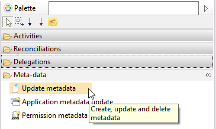
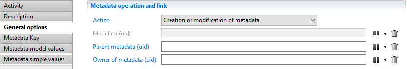
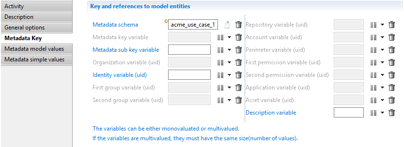
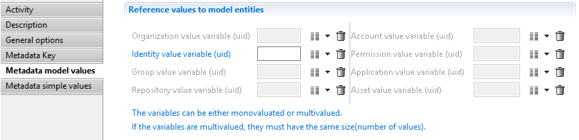
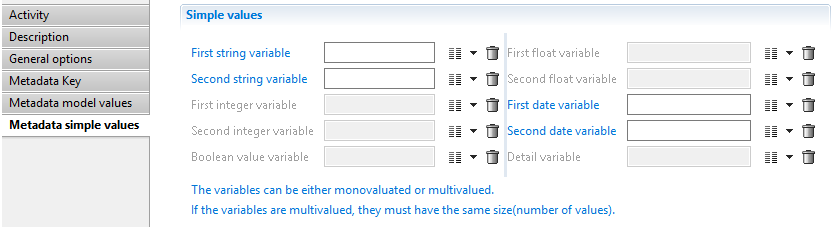
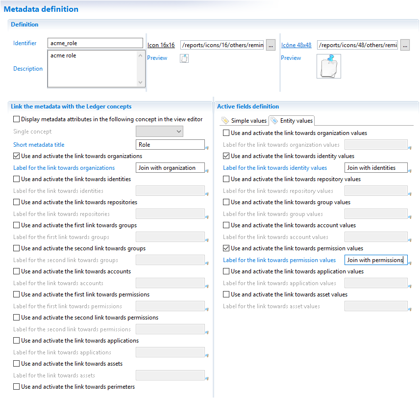
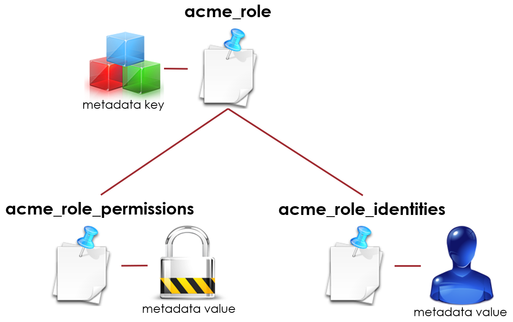
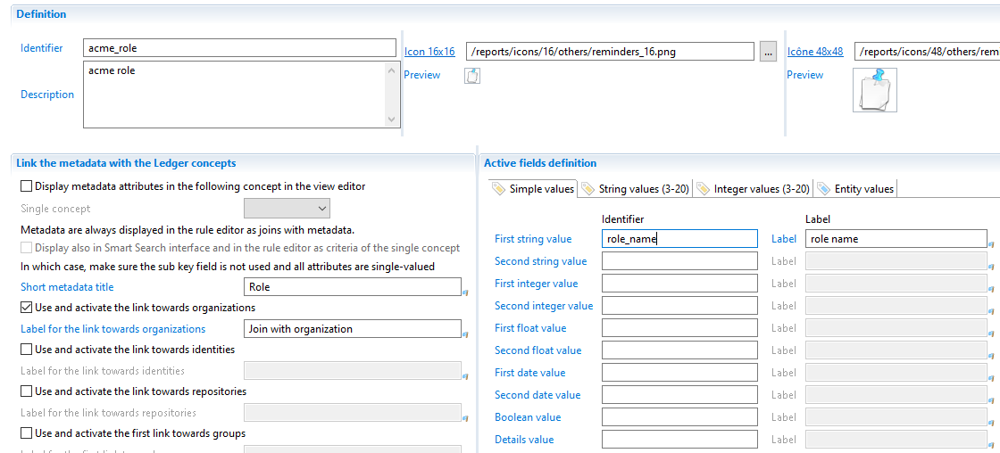
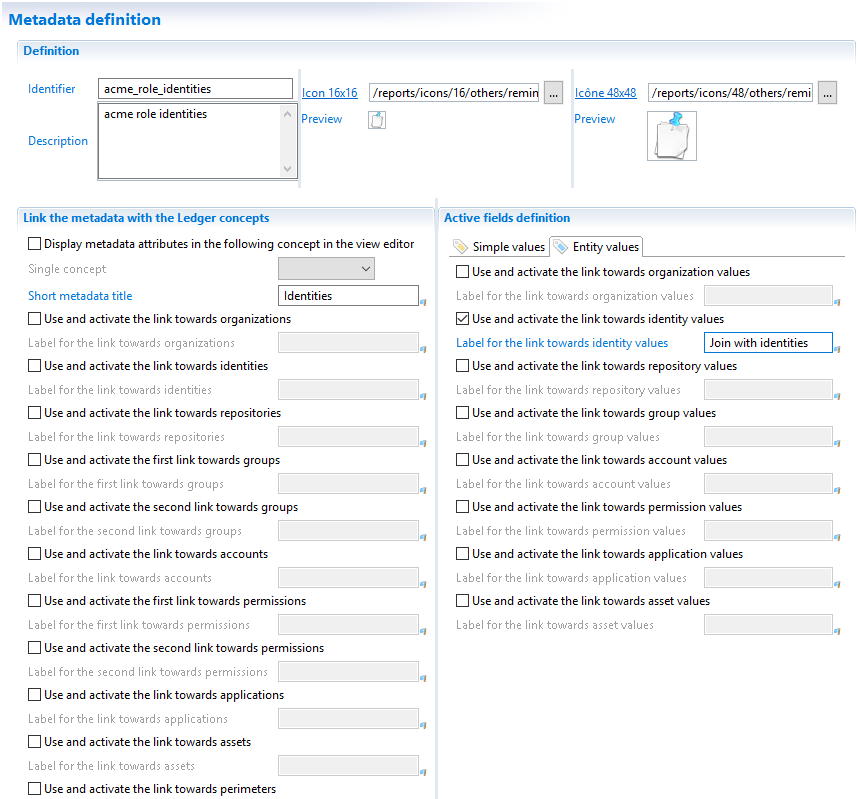
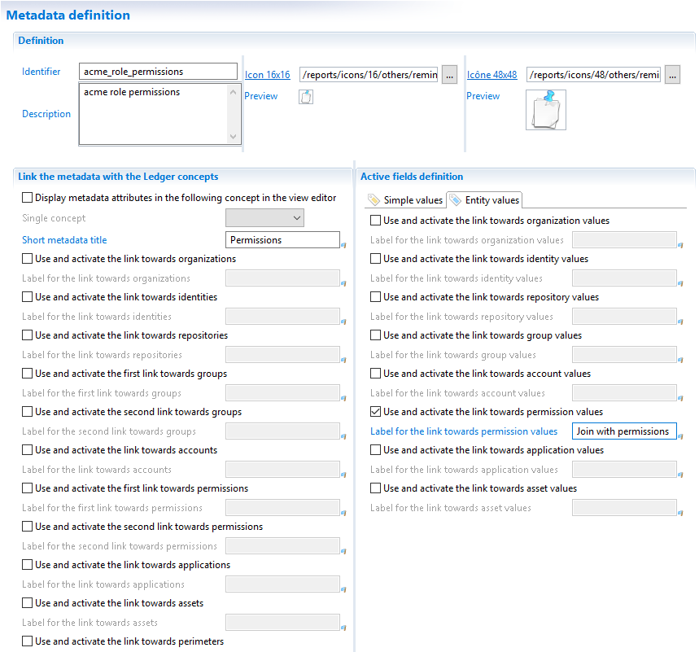

# Updating metadata in a workflow

Metadata can also be changed by the user through a workflow.

## Metadata activity

The workflow editor has a new component in the palette in the Metadata section.

The component is composed of several tabs that let you create, modify or delete some metadata.

> [!warning] The workflow component supports multivalued variables to create, update or delete several metadata at once.  
> If 5 metadata have to be created or updated, all variables mapped in the component should have 5 values.

### General options

The tab named 'General options' is used to select the operation to perform at runtime.

The field 'Action' contains the operation. The available actions are:

- Creation or modification of metadata,
- Deletion of metadata (gives back priority to the collect).

Upon creation and update, the metadata is identified by all the fields contained in the 'Metadata key' tab.
For deletion, there is the choice of identifying the metadata using its uid or using all the fields contained in the 'Metadata key' tab.

**Only** the workflow component lets you create a metadata tree. The use case for creating such a tree is explained in a following chapter.
The field called 'Parent metadata (uid)' is used to specify which workflow variable contains the parent metadata uid (or several if the metadata is multivalued).

The field called 'Owner of metadata (uid)' is used to store the metadata creator.
A workflow variable containing an identity uid (or several if metadata is multivalued) can be mapped in this field.

### Metadata key

The following screenshot shows the 'Metadata key':

In this tab, you can either select a schema using the first field or map an attribute containing the metadata key variable (second field).
This is used to select between the 2 modes: with or without a schema.
When specifying a schema, the interface is adapted to enable only the active links or attributes in the metadata definition.

The rest of the interface is used to map attributes with variables containing Ledger entity uid which are part of the metadata key.

In a metadata having 2 or more entities mapped to attributes, it is allowed to have no value at runtime for one or more attributes.
For example if a metadata schema defines a new link with 3 entities (account, application and asset), the runtime may create links in the database with only 2 entities (account and application).
In this particular case, the asset is considered as optional and some records in the metadata will have an asset but not all of them.

This is the responsibility of the developer to be sure that a non empty value is provided for a mandatory entity.

### Metadata model values

The following screenshot shows the 'Metadata model values':

This tab is used to define relationships with Ledger entities but as values (not part of the metadata key).

The list of metadata fields depends on whether a metadata schema has been selected or not.
If a metadata schema has been selected in 'Metadata key' tab, then only the active fields are enabled, otherwise all fields are enabled.

### Metadata simple values

The following screenshot shows the 'Metadata simple values':

This tab is used to map the attributes for simple values:

- 2 strings
- 2 integers
- 2 floats
- 2 dates
- 1 boolean
- 1 blob named 'Detail variable'

## Metadata tree

It is possible to generate a metadata hierarchy. A metadata can have a parent, and only one.
It means that the metadata can be organized as a tree and a metadata can not appear at 2 different places in the tree.

The use case for a metadata tree is to build a complex data organization.
The need for a tree often comes when a metadata should contain several attributes with a different cardinality.
For example, we want to define a metadata for a role belonging to an organization. This metadata has a name, a role type and 2 lists:

- An identity list to know who has the role
- A permission list to know which permissions are part of this role.

We could try to define everything in one metadata but the result would be bad.
Anyway, let's try to do it the wrong way to understand the problem:

- The organization is a metadata key
- The identities and the permissions are defined in the metadata values

The name can be stored in the first string in 'Simple values' tab.

Now let's try to save a role with the following data:

- Role name: `Account manager`
- Organization: `Sales division`
- Identities: `Paul Martin`, `Greg Wilson`
- Permissions: `add_customer`, `update_customer`, `delete_customer` and `send_proposal`

A multivalued metadata means that the whole set of fields is multivalued.
In the above example, we can add a first set of value (Account manager, Sales division, Paul Martin and add_customer).
If we want a second set of values, we must give the content of the 4 fields.
The problem here is that we want a different cardinality on each field:

- Role name: only 1 value
- Organization: only 1 value
- Identities: x values
- Permissions: y values

The only way to get different cardinalities is to have different metadata.
In this example, we have 3 cardinalities (1, x, y) so we need 3 metadata definitions:

- A first metadata is the main metadata containing the organization as the link and the role name as the value.
- A second metadata contains the list of identities as values. This metadata is linked to the first metadata.
- A third metadata contains the list of permissions as values. This metadata is also linked to the first metadata.

The following screenshots show the 3 metadata definitions.

As you can see, there is nothing to link this schema with the first one in the definition.
The parent link is given at runtime when this second metadata is written.

> Metadata parent link is not related to the 'Depends on computation' parameter in 'Metadata computation'. The parent link is a way to logically link several metadata in the Ledger at runtime. The dependency link is a way to find the right computation order during the execution plan.
