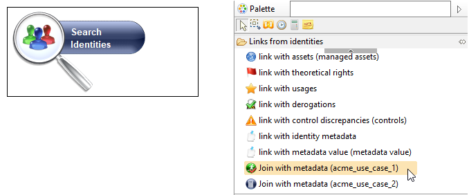
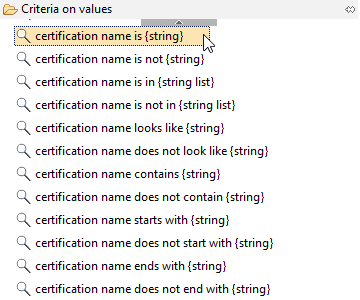
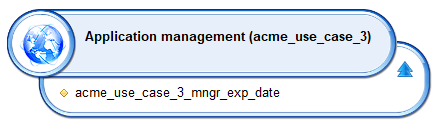
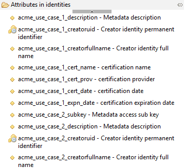
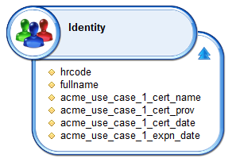
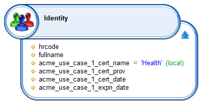
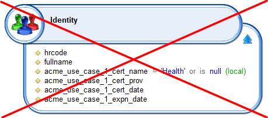
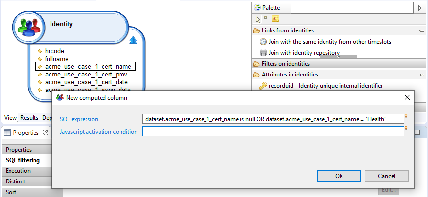
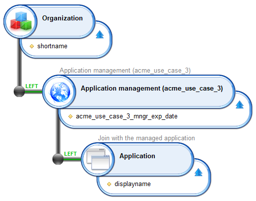

# Using Metadata in rules and views

Views and rules offer a way to fetch metadata.
Metadata are handled as any other concept in both editors.
They leverage the metadata schema to use the attribute names and the join names.

## Metadata in the rule editor

### Rule editor overview

In the rule editor, metadata are always accessed through a join.

> The option in the metadata schema definition to embed the attributes into an entity is only relevant in the case of view editor.



### Rule links

When building a rule from the main entities of the ledger (Identity, Account, Permission...), the palette contains 2 kinds of links:

- The generic links to metadata. In the above screenshot these correspond to the "Link with identity metadata" and "Link with metadata value (metadata value)"
- The links towards project defined metadata. In the above screenshot these correspond to the "Join with metadata (acme_use_case_1)" and "Join with metadata (acme_use_case_2)"

The best practice is to use the links to the project defined metadata as when choosing such a link, the query will automatically filter on the selected metadata.
In the above screenshot, using the link named `acme_use_case_1` filters on the data belonging to this metadata.

If using the generic link, then no automatic filtering is performed.
In the above screenshot, using the generic link would result in fetching all metadata for the identity, regardless of the metadata name.

The difference between 'link with identity metadata' and 'link with metadata value (metadata value)' is the type of link:

- 'link with identity metadata' joins the identity to the metadata through the metadata key. The metadata key can reference an identity
- 'link with metadata value (metadata value)' joins the identity to the metadata entity value. The metadata entity value can reference an identity.

### Embedded metadata in rule editor

The rule editor always displays embedded metadata as standalone metadata.

The embedded metadata can be multivalued. In the rule editor, filtering entities is achieved using criteria.
These criteria usually contain all the combinations of verbs. For example:

- HR code is {value}
- HR code is not {value}
- HR code is in {value}
- HR code is not in {value}
- HR code looks like {value}
- HR code does not look like {value}
- HR code contains {value}
- HR code does not contain {value}
- HR code starts with {value}
- HR code does not start with {value}
- HR code ends with {value}
- HR code does not end with {value}

All the negative criteria (containing 'not' in their labels) can be ambiguous when used on multivalued attributes.
As an example, let's consider the identity certification list but declared as an embedded metadata in the Identity concept.
People may have several certifications such as `Health` and `ISO27000`.

In the rule editor, when selecting the Identity concept, the palette could display all the criteria for the certification name.

- Certification name is {value}
- Certification name is not {value}
- Certification name is in {value}
- Certification name is not in {value}
- Certification name looks like {value}
- Certification name does not look like {value}
- Certification name contains {value}
- Certification name does not contain {value}
- Certification name starts with {value}
- Certification name does not start with {value}
- Certification name ends with {value}
- Certification name does not end with {value}

However, we want to search for identities not certified for `Health`.
If we use the criterion 'Certification name is not {value}' and type `Health` for the value. This would create the following HQL query that returns a false result :

```sql
select distinct root.recordUid
from PortalIdentity root
     left outer join root.metadatas x1 with x1.key='acme_use_case_1'
     left outer join x1.values x2
where ((x1.value1String<>'Health' or x1.value1String is null) and x1.recordUid is not null) and (root.dates.timeslot.uid='20190613165015_1')
```

The query, when translated in plain English, is:

> "Who are the people having a certification with a name NOT equals to 'Health'."

In this case an identity having both `Health` and `ISO27000` certifications will be included in the result as this identity has a certification `ISO27000` that is different to `Health`.
Obviously, the result is false.

Let's revert to a standalone metadata and have a look at this rule:


Again, this rule is false as it would give the exact same result as detailed above.

The correct way to ask this question in plain English is:

> "Who are the people **NOT** having a certification with a name equals to 'Health'."

As a result an identity owning 2 certifications (`Health` and `ISO27000`) will not be included in the results as expected.

The usual way to translate the above question in the rule editor is shown below:


This generates the following HQL query:

```sql
select distinct root.recordUid
from PortalIdentity root
where (not (root.recordUid in (
select distinct x1.recordUid
from PortalIdentity x1
     left outer join root.metadatas x1 with x1.key='acme_use_case_1'
     left outer join x1.values x2
where ((x1.value1String<>'Health' or x1.value1String is null) and x1.recordUid is not null) and (root.dates.timeslot.uid='20190613165015_1')))) and (root.dates.timeslot.uid='20190613165015_1')
```

Filtering with negative criteria requires the **NOT** group between the Identity and the Metadata.
Building this type of query would be impossible if the certification criteria was embedded in the Identity concept.

### Rule criteria

When the metadata component is selected in the editor, the palette shows the list of criteria.

- The drawer named 'Criteria on key' contains the sentences to filter on  the subkey and on metadata creator.
- The drawer named 'Criteria on values' contains the sentences to filter on all the attributes declared in the metadata definition.

For each attribute, the list of criteria is automatically created as a function of the attribute type as shown in the following screenshot for the attribute 'certification name':



## Metadata in the view editor

### View editor overview

There are many ways, in the view editor, to leverage metadata.

- Metadata can be used as the root component in the query.
- Metadata attributes can be embedded in a target entity.
- Metadata can appear as a separate entity accessed through a join from another entity (or several entities).

### Metadata root component

To add metadata as a root component, you need to delete the current root entity.
In the palette, you can see all the entities that can be used as a root component.
The palette contains:

- A generic metadata component used to enumerate all metadata
- All project specific metadata.

When you drop a project specific metadata in the editor, a filter is automatically applied on the metadata name to fetch only the selected ones.
Here is a screenshot where a metadata `acme_use_case_3` has been set as the root component and a first attribute has been added.



From there, you can add attributes and apply criteria.
Joins are also available to jump to other entities either through the declared metadata keys or the metadata entity values.

As for the other main entities, timeslot attributes are also available on Metadata.
This is useful to get metadata from any timeslot, allowing to filter using timeslot attributes like UID or dates.

### Embedded metadata

When the option 'Display metadata attributes in the following concept in the view editor' is checked, all attributes of the metadata are embedded in the target concept.
For example, if the metadata is attached to the identity, the attributes available in the palette for the identity component will contain:

- The standard identity attributes,
- The attributes from all the metadata declared in the project.



As you can see, all attributes from a metadata have their names automatically composed of 2 parts:

- the metadata name
- the attribute name

For example the attribute `cert_name` in the metadata `acme_use_case_1` becomes the attribute `acme_use_case_1_cert_name` in the palette.

If the certification metadata was declared as embedded, the view editor palette would display the following attributes in the identity:



#### Result cardinality

Even when the metadata is embedded in an entity (for example, the certification for an identity), the underlying implementation uses a join on the metadata table.
A user may have several certifications. For example, the user `Paul Martin` may own 3 certifications.
In this situation, the view result will show 3 lines for `Paul Martin` to display all 3 certifications.
The duplicates are the result of the hidden join towards metadata with 3 values attached.

This is exactly the same behavior as with allocations. If a user works for several organizations, a view will display several times the user.
The difference between allocations and embedded metadata is that the join is hidden and grabbing a metadata attribute can generate these duplicates, on the contrary to a standard entity attribute.

> [!warning] When a metadata is multivalued for a given key (an identity for example), the best practice is to keep the metadata as a standalone one.  
> This way there is no bad surprise because the join is now explicit. Embedded metadata is recommended for single valued attributes.

#### Filtering multivalued attributes

With embedded metadata, the implicit joins can be tricky to filter.
Again, we will use the certification metadata in our example as if it was declared as embedded metadata.
We want to get the list of identities having a `Health` certification.



The above view returns only the identities having a certification called `Heath`.
Identities having no certification or not the `Health` certification are not returned.
Internally, the join towards metadata has been converted to an inner join because there is at least one filter on the `cert_name` attribute.

Now we want to get the full list of identities and display in a column a boolean if they have the `Health` certification.
We could change the filter to keep the identity when the `cert_name` is null like this but it does not work !



This does not work as the join is an inner join and the condition `cert_name is null` is executed after the inner join has filtered the identities.
Changing the filter scope as global does not change the result. It is still wrong as the join remains inner and identities without certifications get filtered.
The correct way to do this is to remove the filter from the attribute so that the join reverts to outer left, there is then no filtering anymore.
Then add the filter in the 'SQL filtering' with an SQL syntax like this:



### Separate metadata

When the option 'Display metadata attributes in the following concept in the view editor' is not checked, the metadata appears as a separate component.
This design is mandatory if the metadata defines a link between several entities.
Here is an example with a metadata defining a link between an organization and an application:



This view starts from organization and fetches all metadata regarding the managed applications. Left joins are used to get all organizations in the result.
The metadata appears as a standalone component containing the attributes (the expiration date) and having links towards organizations and applications.

### Recommendations

Metadata that include detail type simple values correspond to a blob in the database. The handling of blobs is database specific and as a result issues can arise when sorting and/or filtering said column type depending on the database management system used.

When querying a detail type value the recommendation is to create 2 different views to query:

1. First a view to query the entire list information included in the desired metadata
2. Second a dedicated view filtering on the desired metadata and querying ONLY the detail simple value

This can be thought as a sort of master/detail presentation.

In addition blobs being large values, the execution of a view filtering on a specific metadataUID can increase the performance.  
