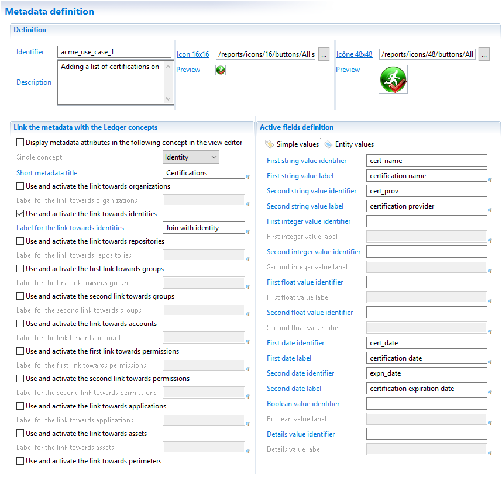
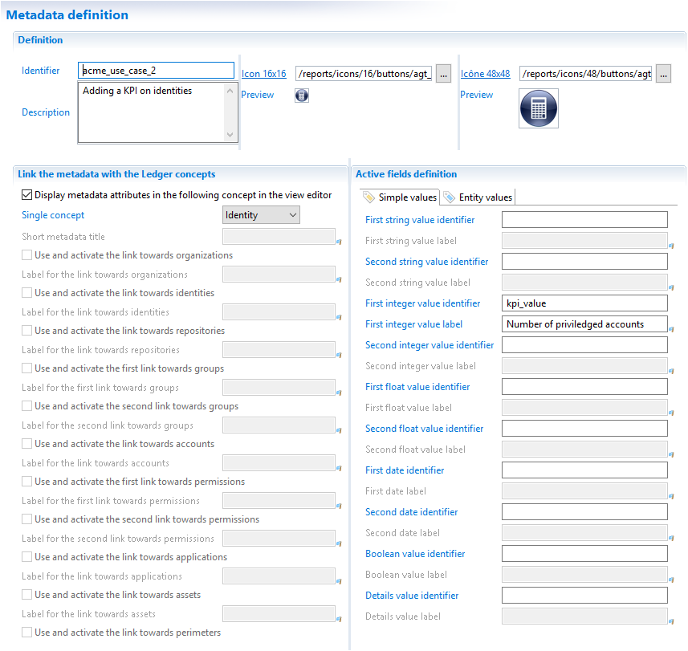
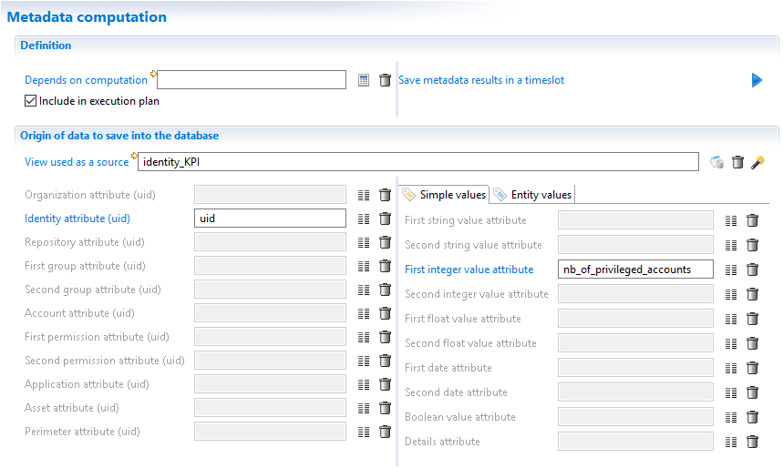
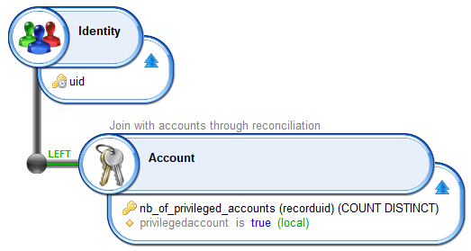
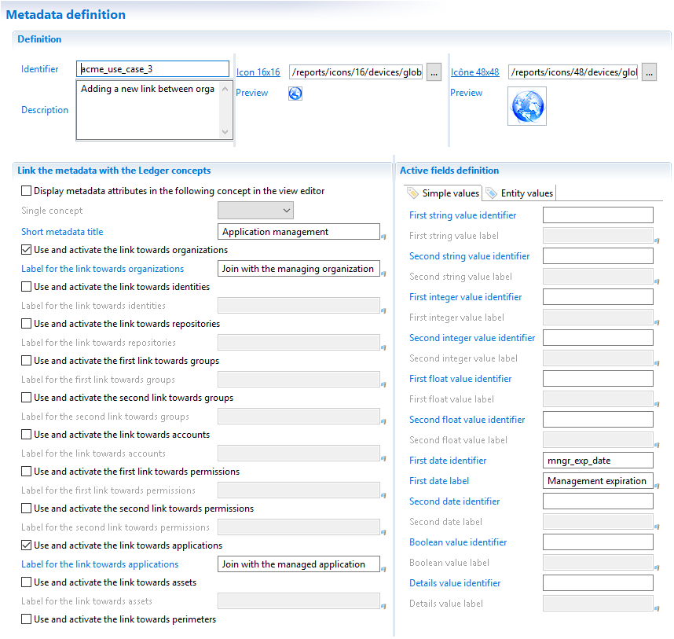

# Metadata examples

This chapter examines the 4 use cases described at the beginning of the document (detailed [here](./01-concept)) and explain how to configure and query the metadata.

## Adding a list of certifications to identities

We want to attach a list of certifications to identities.

This is a single entity metadata, the metadata is attached to an identity and no other Ledger entity.
We could embed the metadata in the identity concept but, when a metadata is multivalued, the best practice is to keep it as a standalone concept and use explicit join from an account to the metadata.

## Adding a KPI to identities

We want to compute the number of privileged accounts per identity.

For a given identity, there is only one KPI and there will be no review on it so it is best to embed the KPI in the identity concept.

KPIs are computed so the second tab of the metadata editor, called 'Metadata computation', is filled.

The view `identity_KPI` counts the number of privileged accounts for each Ledger identity. The view uses a `COUNT DISTINCT` to aggregate the accounts for each identity.
In this view, the attribute `privilegedaccount` used to filter accounts is not returned by the view.

### Adding a new link between organizations and applications

We want to store a link between organizations and applications meaning that an organization is in charge of an application.

In a previous chapter, we explained the difference between having links in the metadata keys or metadata values if the metadata is both ingested and edited in the portal (see [here](./03-life-cycle)).

In this example, the management link between the organization and an application is only set from the portal so both links are declared as metadata keys.

