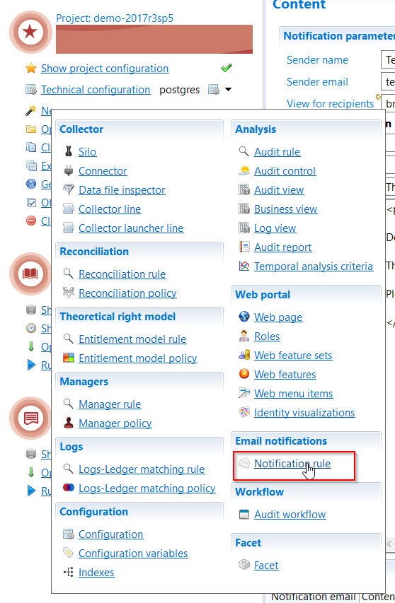
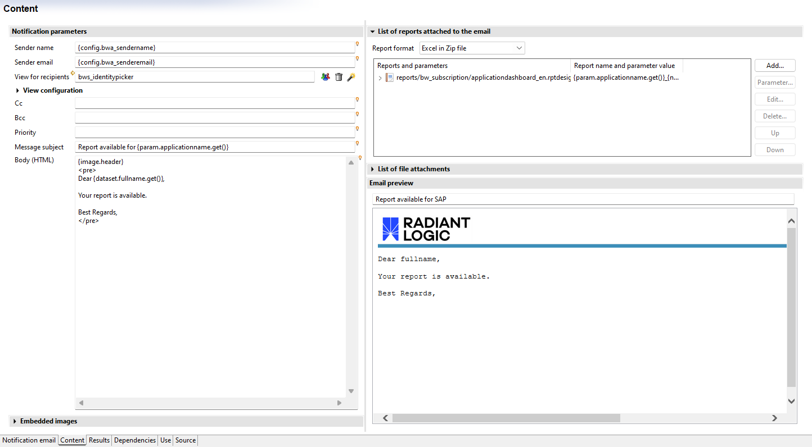
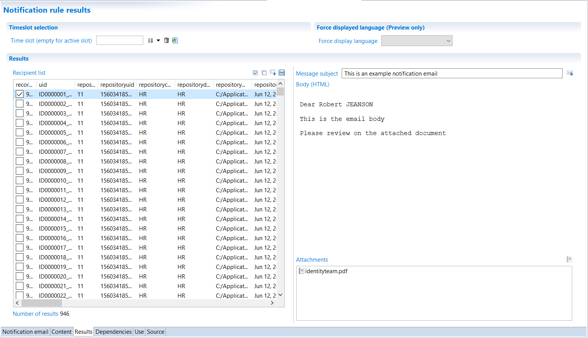
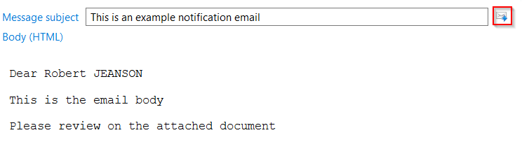
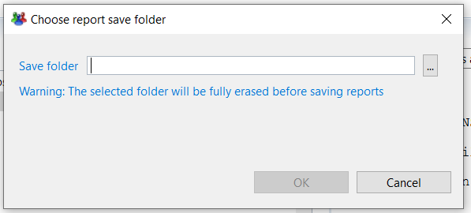

# The notification editor

## Email content

To create a new notification rule, click on "New..." in the main menu and choose "Notification rule" in the "E-mail notifications" section, as shown here:  

This opens a creation wizard in a pop up window. Once the rule identifier, among others, is set via the creation wizard, the editor opens the newly created notification rule.  

The tab named "Content" is the main editor in which you find the usual information required to send emails, as shown below:  

  

The first two fields define the properties for the sender of the email. A valid email must be provided for the sender even if the email is to be sent by the studio. The "Sender name" field is the display name of the sender that will be seen by recipients in the "from" field.  

A notification rule is a mailing system that sends a email to multiple recipients. In order to select the recipients, the user has to look up the desired identities in the ledger. Views are used to determine the group of identities to which the emails are sent. It is possible to select a standard view, but it is recommended to design a specific view for each notification rules to precisely select the correct list of recipients and match the exact needs . The view must be selected in the field "View for recipients". The chapter on [Selecting Recipients](./02-selecting-recipients) explains this process in detail.  

It is possible to specify a "CC e-mail list" and a "BCC e-mail list" to have other recipients receive a copy of each email (for instance mailing lists).  

> Use the comma character `,` as a separator if multiple addresses are added to the `cc` ob `bcc` field (e.g. `security@acme.corp, contact@contoso.com`)

The "Message subject" field corresponds to the subject of the message. As it is the case in most email applications, this is a one line text field. It is possible to customize it with the recipient's information like his name for instance. This personalization of these field can be done using macros that are explained here: [Macros](./03-macros).  

The "Body (HTML)" is the body of the message. The content has to be written using the HTML language. This editor does not a behave as a WYSIWYG (What You See Is What You Get) but is a text editor in which you add HTML tags. To help you configure the layout of the email there is a preview panel on the right side of the editor. This panel shows in real time the final aspect of the email for the recipient. The HTML edition allows the use a template that can be provided by the client. As it is the case for the previous parameters it is possible to customize the email body with information from the ledger. The macro `{dataset.fullname.get()}` for example can be used to add the fullname of the recipient. You can list available information in Dataset entry while clicking on the little light bulb near the Body section.  

Image can also be included, via the "Embedded images" section, just below the body.  
The "Embedded images" section references all the images that are to be included in the email's body. The goal is to set an identifier for each image. This identifier can then be used in the email's body to insert an image at a specific place using the macro `{image.id}`, id being the image identifier. If the chosen image is not in the default project, it is automatically copied to the "/reports/icons" folder to insure that the files is present in the projects tree. When creating the WAR file for the webportal only the element included in the project are integrated. As such it is necessary to include the notification rules embedded images.  

At the top right, the section "List of reports" shows the list of reports that will be included as attachments. The list of reports is the same for all recipients, but the content of each reports can change since you can pass information related to the current user to the reports. For a detailed explanations on how to add an customize reports as attachments, see the chapter on [Reports as Attachments](./04-reports-as-attachments). Note that if multiple reports are configured, they will all have the same format.  

The section "List of attachments" is the list of static files to add as attachments. All the recipients will receive these files. As an example, the common use for this function is to add a user guide to your email.  

## Results

Once the email is configured, the "Results" tab shows the list of recipients on the left side. The screen is implemented as a master/detail page and shows on the right hand side the email that will be sent to person currently selected on the left hand side:  

  

Above the recipients list, there are 4 icons that have the following functionalities:  

1. selects all the recipients in the list
2. unselects all recipients
3. sends an email to all the selected recipients
4. saves the reports onto your hard drive

The icon on the right hand side, in the details section sends an email for the selected users only:  

You can also preview the attachments that will be sent to the recipients. You can then check that the report is properly customized.  

## Sending emails

When starting to send out the emails, a process is initiated that prepares all emails by performing the following steps:  

- Verification that all recipient have an email address. Those without are ignored.
- Verification of the use of macros called in the subject, body and report parameters
  - If no macros are used the email is the same for all recipients. As such, only one email is built, including the list of emails for all recipients.
  - If macros are used the email is customized for each recipient. The product then calculates all macros included in each field of the email and/or in the attachments for each recipient. This process creates an separate email for each recipient and each email is only sent to one email address.  

Once all steps performed and the preparation process terminated, a pop-up window, including some statistic, will ask you to confirm the sending of the emails.  

If a maximum size is set for the emails, the number of emails to send can be different from the number of recipients. This setting can be changed in the "Mail server" tab of the configuration by modifying the value for `mail.splitsize`. This parameter should be defined as the maximum size supported by the email server:  

  

If the size of the email including all attachments is larger than the limit size imposed in the technical configuration, then the message will be split into separate messages. The subject will automatically be appended with the message number, for instance (1/2) and (2/2). The Split is done depending on the attachments' size. For instance if 3 reports are included in the email, with the sizes of 3Mo, 250Ko and 4Mo, the product will send two emails: the first one with the 3MB and 250KB attachments, the second with 4MB attachment. If an attachment is above the size limit, it is sent but in a separate email.  

## Saving reports

Saving reports is useful to gather all reports generated by a notification rule without sending them. This allows for instance to make them available for people other than the recipients of the mailing. If this option is chosen, a pop-up window will open asking to select the target folder:  

  

In the example above, the product will create a folder for each recipient. The attachments are added to each folder separately. If the reports `prembyorg.xls` and `team.xls` are declared in the notification rule the product will generate the following folder tree, each folder including both files.  
