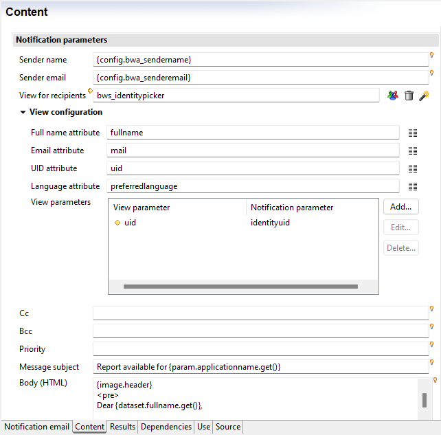
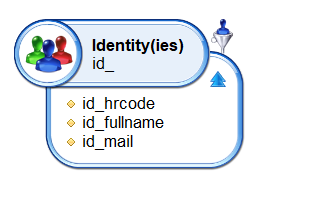
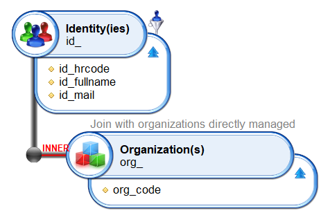
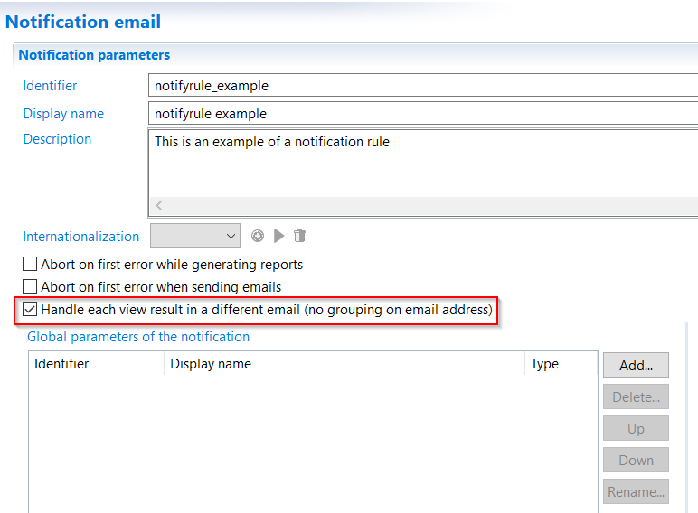

# Selecting Recipients

## Configuration

The selection of recipients is done using a view. During this phase there are two goals:  

- To retrieve tthe list of email addresses
- To retrieve the information required to customize the mails (_i.e._ subject, content, report)

In order to have a valid notification rule, at least three attributes MUST be present in the view:  

- fullname of the identity
- email of the identity
- identity's uid

In the "Content" tab of the notification rule, select the view to be used to retrieve the recipients and then map the view's attributes to the fullname, email and uid. If the view requires parameters as an input, it is possible to declare them in the table below.  

## Number of emails sent  

It is important to understand that the number of emails sent is to the number of distinct email addresses returned by the view. In general, the view retrieves one identity by line, and each identity has a different email address, so the number of emails sent is equal to the number of results from the view. But if some identities have no email address, the number of emails sent will be lower than the number of results from the view.  
Here is an example with a simple view:  

  

What happens if we add a join to get, for instance, the organizations managed by the identities selected?  
Some identities actually do not managed organization, some manage one, and others manage more than one.  

  

The view's result is similar to this one:  

| Hrcode   | Fullname       | Email                     | Organisation |
| :------- | :------------- | :------------------------ | :----------- |
| ID000027 | Adrien Bourget | `ABOURGET18@brainwave.fr` | DCOM         |
| ID000432 | Paul Grall     | `PGRALL28@brainwave.fr`   | DRH          |
| ID000432 | Paul Grall     | `PGRALL28@brainwave.fr`   | DSI          |

The notification rule will send 2 emails since there are only 2 distinct email addresses (event if the view returns 3 results).  

However, in some cases, it might be useful to send an email for result of the view, or each returned line. In the example above, Paul Grall would receive two distinct emails, one for each organization he manages. To do so, you would have to check the following option in the notification rule's first tab:  

  

As you use a view to select recipients, you can also add rules to filter results of the view. See [here](../views/advanced-concepts.md) for explanation.

## Workflow recipients  

When notification rules are used via the Workflow engine to send notifications or reminders, it is the workflow engine that calculates the recipients. But the notification rule is still based on a view that returns results. This chapter explains how the engine handles the two sets of recipients (the candidates from the workflow and the identities from the view).  

When the workflow engine launches a notification rule, it passes to the notification rule the list of candidates (corresponding to a role) that should receive an email. This list usually contains the list of the identities' UIDs, but may also contain email addresses. The notification rule then has a list of identities from the view and a list of identities from the workflow (candidates). In this case it is quite simple:  

**The list of recipients is the list of identities provided by the workflow (candidates). The view is not used to calculate the list of recipients.**

Why then, use a view in this context? The view is used to retrieve the list of email addresses and all other attributes necessary to customize the email (subject, body and reports). Without the view, the notification rule would only have UIDs. The email addresses would be missing. The view then has a different usage:  

**The view includes the information (attributes) regarding the identities that have been designated as recipients by the workflow engine.**  

Internally the following steps are executed:  

- The view is run and returns a list of results. This is the list of identities including all additional information (attributes: email, fullname, etc.)
- The list of candidates is augmented with additional information from the identities. For each candidate, we look in the view's results if the identity exists. If this is the case, then the attributes of the identity are added to the candidate's UID
- Finally, the list of candidates is used to send the emails

It is important to understand that if a workflow candidate does not exist in view's results, no email will be sent to them since their email address is not known. Likewise, if the view returns identities that are not in the list of candidates provided by the workflow, they will not be included in the recipients list since they are not candidates.  

**Therefore, the view must return a larger group of candidates than provided in the workflow.**  

## Tips & Tricks

You can use the view defined in the notification rule to confine recipients passed by the workflow.  
For example, if you want to ensure that no notification will ever be send to managers, even if they are candidates or determined by escalation.  
In order to do that, you can use a rule filter so that the view defined in the notification rule must return only identities that are not managers.  
