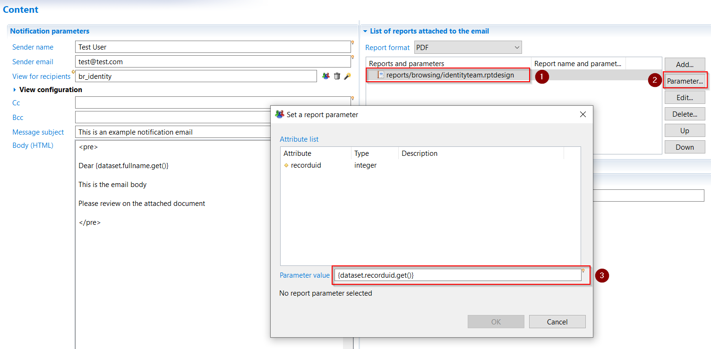

# Reports as Attachments

An important feature of the notification rule is to be able to send different reports as a function of the recipient. Each recipient can receive a customized report.  

The configuration is done as follows:  

- Add a report by clicking the "Add..." button and select a report. You can then select the newly created line and click "Edit..." to set a name for the report. This action is optional. If no name is set for the report, then the attachment will have the name of as the `.rptdesign` file. It is recommended to set a more meaningful name to the report for the end user. Furthermore, the name of the report can be dynamic. It can use the notification rule's parameters, or information related to the user via the use of javascript expressions `{dataset.XXX.get()}`
- If the rapport has parameters, click on the "Parameter..." button to link them one by one. The dialog box allows you to set each parameter, and allows the use of macros (the dataset, config, param and task objects are available).  

By using dataset object and attributes returned by the view, you can customize the report for each recipient. For instance, if you pass the recipient's managed organization to the report, you can list only the organization's identities. This allow to separate the data and send to recipients only information that concerns them.  
