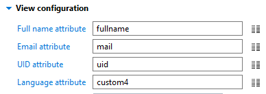
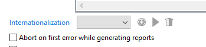
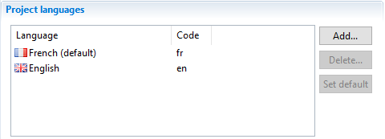
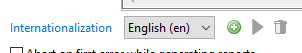
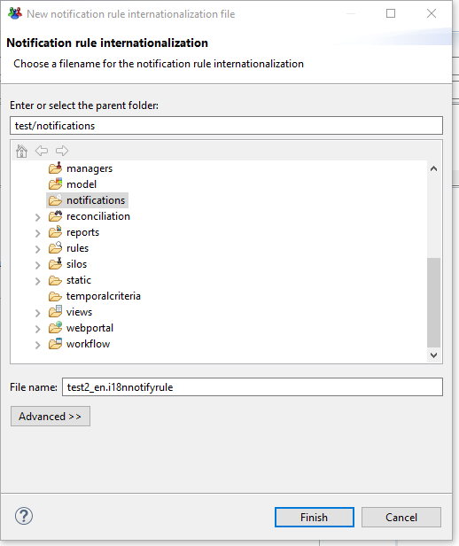
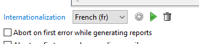
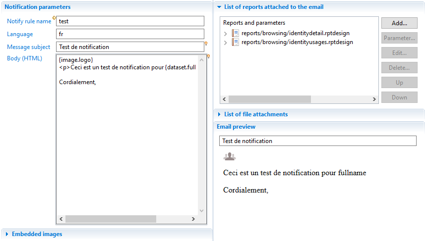
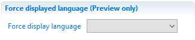

# Internationalization of Notification rules

This functionality allows the internationalization of the content of notification rules according to the language information available for each recipient.  

## Procedure

### Choosing the recipient's language attribute

In the 'View configuration' pane of the 'Content tab' of the notification rule, the 'Language attribute' field allows the definition of which column of the view will contain the country code for this particular recipient (for example en, fr, and so on...). This attribute is optional and can be left empty when not applicable.  

  

If this attribute is left unspecified, default from the project will apply (see the section 'How the internationalization is chosen for a recipient' below).

### Using the user preferred language from portal preferences

In the recipient view, you can use the column 'preferredlanguage' in the identity entity to access the preferred language of the recipient as it is configured in the portal. This column can be used in the 'Language attribute' configuration attribute.  
If a user has accessed the portal application at least once, this column is updated with the language configured in its browser. Its value can also be modified in the user's preferences page. If the user has never accessed to the portal application, default language rules apply (see the last section of this document).  

### Creating and managing notification rule internationalizations

In the 'Notification email' tab of the notification rule editor, the following widget allows the management of the internationalizations of this notification rule:  

  

The content of the drop-down is bound to the languages defined in the 'Project languages' section of the project configuration:  

  

If you select a language for which no internationalization exists, the first button will be enabled, allowing to create a new one:  

  

Clicking this button will open a new file wizard:  

  

The default file name of the new internationalization is the file name of the notification rule suffixed with the '\_' character followed by the language country code. Although not strictly necessary, it is recommended to stick to this convention.  

When creating a new internationalization for a notification rule, the content of the notification rule; subject, body, embedded images, attached reports and file attachments; are copied to the new file and can then be modified independently from the notification rule. The parameters and view attributes defined in the notification rule are accessible in all the macros.

> [!warning] Note that there is no further synchronization of the different elements between the notification rule and its internationalizations. For example adding a new report to the notification rule will not add it to its internationalizations. Conversely adding some element to an internationalization will not modify its notification rule nor any of its other internationalizations.

On the other hand, if there already exists an internationalization for this notification rule and selected language, you will have:  

  

Clicking on the green arrow will open an editor for this particular internationalization. Clicking on the trash can allows to delete the corresponding internationalization.

### Modifying a notification rule internationalization

The editor for the internationalization of a notification rule looks like:  

  

Here you will find a reference to the notification rule as well as the language for which its defined.  
You will also find edition areas for the subject, body, embedded images, attached reports and file attachments. There is also a preview of the resolved subject and body.  

In any of these fields, macros are strictly the same as in the notification rule, allowing the same `config`, `dataset`, `param` and `task` namespaces.  

### Displaying notification rule results

The 'Results' tab of the notification rule editor take into account the language attribute to display the preview in the language configured for the selected recipient.  

Note that for debugging purposes, you can force the display to a given language using the following pane:  

  

This can for example be useful if you plan to have multiple languages in a project but only have a single country in the development database. Using the 'No matching language' value in the combo, you can deactivate all the internationalizations to see only the notification rule itself.  

### How an internationalization is chosen for a recipient

Let's take as an example a project configured as shown above; two language are defined French and English, French being the default.  

If, for a notification rule, the 'Language attribute' field is left empty, then either there exists a 'fr' internationalization which will be used instead of the notification rule (because 'fr' is the project default language) or no such internationalization exists and the notification rule itself will be used (even if internationalization for some other languages exist). This will be true for every recipient in the list.  

If the 'Language attribute' field is set to a column of the recipient view then, for a given recipient:  

- if the value of this field is empty or null then the 'fr' internationalization will be used if it exists (because 'fr' is the project default language),
- if there exists an internationalization whose language is the value of this field, it will be used,
- in all the other cases, the notification rule itself will be used.
