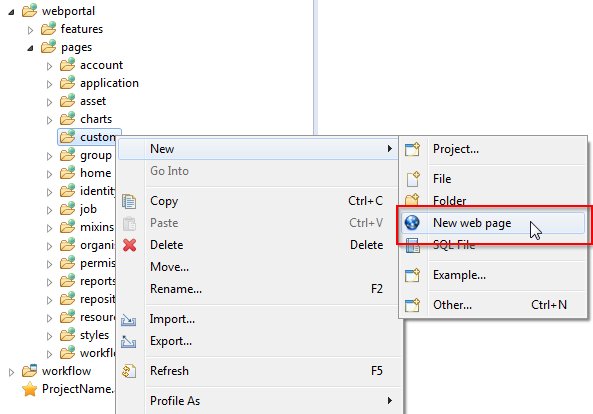
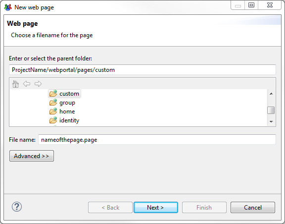
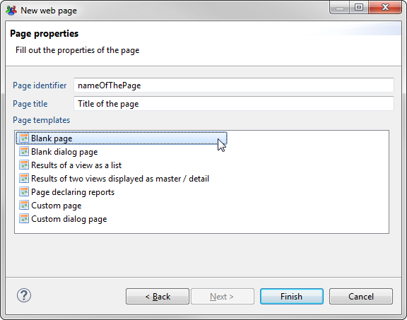
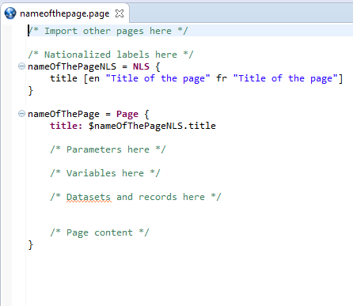

# Using the wizard

IGRC Includes a wizard to easily create new pages. To use we can right click and create new file :  

  

The wizard will show up and ask us to define a name of the file  

  

In the next step we will define a page identifier, and a title ( The only required attribute ). We can also select a template (Blank page in the example):  

  

When we hit finish we will have a new page file created using the best practices for internationalisation and with comments to include the different blocks in the right places.  

  

Page is ready to be modified  

## Things to remember

Creating pages using the wizard is easy and provides templates that help you follow the best practices
