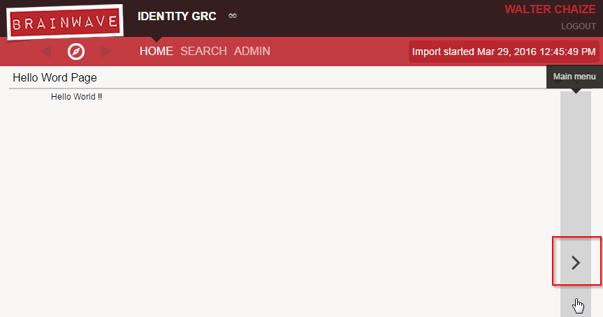

# Home pages

Pages files will be read and parsed during the start of the webportal.  
From that moment they are part of the webportal and they can be identified by using their identifiers.  

However, a page will not be displayed unless:  

- There is an explicit link to it from another page
- There is a menu item that explicitly links to it
- It is defined as a Home Page

## Define a Home Page

Any page can become a Home Page , it just needs to be declared as an attribute in the page object. Using the keyword`homepage-for`  

This attributes support different keywords. Its designed to be used together with [Features](./features-and-roles/index.md) to identify a group of users ( More on this in the [Features segment](./features-and-roles/index.md) ).  

The simplest way to use the **homepage-for** attribute is to use the keyword **All**. This will define this page as a Home page for all the users. Since many pages can be declared to be home page, a priority is also given (optional).  

The priority number will determine the display order of all the different home pages. The highest priorities will be shown first.  

For example, to display our hello world example we can declare:  

```page
nameOfThePage = Page {
 title: "Hello Word Page"
 homepage-for: All priority 200

 Text {
 value: "Hello World !!"
 compact: True
 }
}
```

Now our hello world page will be displayed as a home page. We can also navigate to the next or previous home page by using the buttons on the sides:  



## Things to remember

- Any page can become a home page by using the attribute homepage-for
- We can have several home pages, the order is given by the priority ( highest will be shown first )
- We can navigate to another home page by using the buttons on the side
- A user will only see homepages on which he has access rights to. This is defined through the page 'feature' property
