# Parameters

Parameters objects are defined inside a Page in the Parameters block.  

When creating a link to a page, it will be possible to specify a value for its parameters. Once inside the page, the value of a parameter cannot be modified. The portal includes a Parameters Editor that can display the received values and allow to edit them (i.e. create a link to the same page with the new values for the parameters).

## Example

```page
/* Nationalized labels here */
identityFinderNLS = NLS {
 title [en "Custom Identity Finder"]
 params.organisation [en "Organisation"]
 params.organisation.tooltip [en "Filter by organisation"]
}

identityFinder = Page {
 title: $identityFinderNLS.title
 homepage-for: All priority 200

 /* Parameters here */
 organisationUid = Parameter {
 type: String
 label: $identityFinderNLS.params.organisation
 tooltip:  $identityFinderNLS.params.organisation.tooltip

 }
 /* Variables here */

 /* Datasets and records here */

 /* Page content */
}
```

## Attributes
  
**type** defines the type of value that will be stored (Boolean , Date, Integer or String ). It will modify the way it will be edited in the parameter editor. ( eg: calendar will be displayed for dates )  
**multivalued**  (True or False) defines if the parameter will only receive 1 value or many  
**label** the label of the parameter that will be shown in the parameters editor  
**mandatory**  (True or False) defines if the attribute is mandatory, if its mandatory it must be set explicitly by the calling link. As a side effect, HomePages cannot contain mandatory parameters.  
**default** defines a default value. This value will be discarded if a value is explicitly sent to a page. If the parameter is mandatory, the default value is ignored as the link must contains the parameter anyway  
**hidden**  (True or False) if True the parameter will not be displayed in the parameters editor. False by default  
**tooltip** a tooltip that can contain a description of the parameter

## Parameters Editor

When visiting a page that receives parameters , the portal allows us to explore and modify the values of all the parameters in a page:

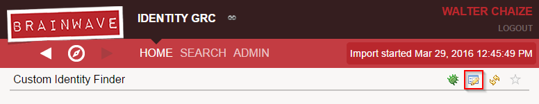  

## Advanced Attributes

**recorduid-of** using the recorduid as a parameter is a risky option. one value of a recorduid is only valid in 1 timeslot.  

If the timeslot changes, the recorduid will no longer be valid. For that reason, the use of uid in parameters is always preferred and recommended.  

However, for backwards compatibility, this attribute **recorduid-of** was included. It can be use when the parameter is a recorduid (Integer).  
It will force the portal to calculate the correct value of the recorduid that matches the current timeslot
Examples:  
`recorduid-of: Organisation`  

**constraint** the parameter can only take values among a given set of values. We support different options, examples:  
`constraint: Int { min: 5  max: 10 }`  

type must be set to Integer. min and max are optional  

This will allow the attribute to take integer values in the range `[5,10]` . In the parameter editor:  

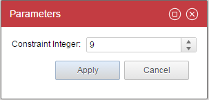  

```page
constraint: Date { type: Date format:"dd/MM/yyyy" date-before: Date("31/12/2016")
  date-after: Date("01/01/2016") }
```

type must be set to Date. date-before and date-after are optional  

It will allow to select a date in 2016. Date selector will be displayed. In the parameter editor  

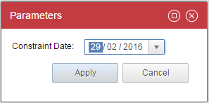  

`constraint: Text { match: "[a-z]*" min-size: 5 max-size: 10 }`

type must be set to String. match , min-size and max-size are optional  

It will allow a text that matches the provided regex with the required length . In the parameter editor:  

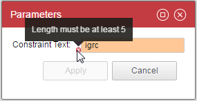  

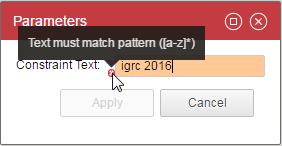  

`constraint: Picker { picker: organisationPicker returning outUid }`

This constraint uses the picker objects ( See more in the pickers segment ). The value of the parameter is the uid :  

  

```page
constraint: Picker { picker: organisationPicker returning outUid display: Display
  { value: Current shortname data: organisations match uid  }}
```

A variation of the last example. This time the value of the parameter is the uid but the display value is the shortname which is more user-friendly.  

The dataset organisations must exists and must be linked to a view that brings all the organisations. The output:  

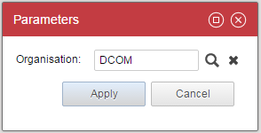  

`constraint: Lookup { data: organisations text: Current shortname value: Current uid }`  

The lookup constraint allows to select a value from an existing dataset organisations.  

In this case the value of the parameter will be the uid. The displayed value will be the shortname  

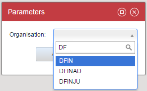  

```page
constraint: Lookup { data: organisations text: Current shortname value: Current uid }
    multivalued: True
```

You can pick several values with a lookup by setting your parameter to "multi valued"  

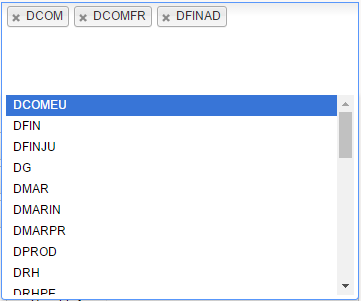  

`constraint: Choice { values: [ "Yes", "No"] presentation: Radio }`  

The Choice constraint lets the user select from a list of values. presentation can be : Radio , List or Combo. In the editor:  

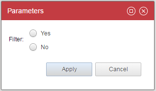  

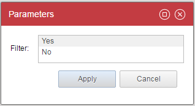  

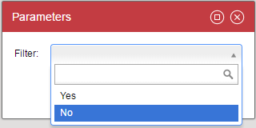  

## How-to pass parameter from Page to Rule

### From Page to Report

Here is a simple Report declaration example

```page
identitydetail_sample = Report{
 report: "/reports/custom/identitydetail_sample.rptdesign" with fullname to fullname
 title: "Report Example"

 fullname = Parameter{
 type: String
 mandatory: True
 hidden: False
        constraint: Lookup {
            data: br_identity
            value: Current fullname
            text: Current fullname
            distinct: True
        }
     }
    br_identity = Dataset {
        view: br_identity
    }
}

```

Here the significant **property** is the **report** one.  
It is the path to the `.rptdesign` and here we pass the parameters of the report.  

If we take a look about the Report, specifically to the **Report Parameters** section.  

  

### From Report to View

Now that the value passed from the Page to the Report we can use it to filter View using Dataset concept.  

When editing the Dataset, parameters can be edited within the Parameters section.  

  

Here you have an overview of all existing parameters declared in the View attached to the Dataset (see [Audit view editor: user guide](https://download.brainwavegrc.com/index.php/s/r9NKmP4BjrJd94m) for detail).  

You only have to map your Report parameter with the View parameter to pass value from Report to View.

> Multivalued does not exist in BIRT (tool used by reporting).
> To bypass this limitation, a mono-valued attribute is provided with '¶' as separator. Usually this is unnoticeable for users. Except for macros used in view.  
> For instance following condition: `param.ATTRIBUTE.isMultivalued()` won't be true as the parameter given by the report is mono-valued.  
> In that case, you have to search for '¶' character. For instance : `param.uid_nis.get().indexOf('¶__') != -1`

### From Page to View

You can use the with property to pass value from a Page parameter to a View parameter.

```page
br_identity = Dataset {
        view: br_identity with fullname to fullname
    }
```

See [View Binding](./04-data-binding.md).  

### From View to Rule

For a parameter to be accessible from outside the rule (view, another rule ...) it is essential that its identifier appear in the display name of the rule. The naming rule is to have the identifier appear between {}.  

When the rule is used, the display name of the parameter will automatically appear in the form of a hyperlink that allows it to be edited.  

From the View editor, when using a rule as a filter.  

  

  

See [Using the parameters of a rule](../audit-rules/02-advanced-concepts#rule-parameters).

### From Control to Rule

For a parameter to be accessible from outside the rule (view, another rule ...) it is essential that its identifier appear in the display name of the rule. The naming rule is to have the identifier appear between {}.  

When the rule is used, the display name of the parameter will automatically appear in the form of a hyperlink that allows it to be edited.  

  

See [Control Methods present in Analytics](../controls/index#control-methods-present-in-analytics).
