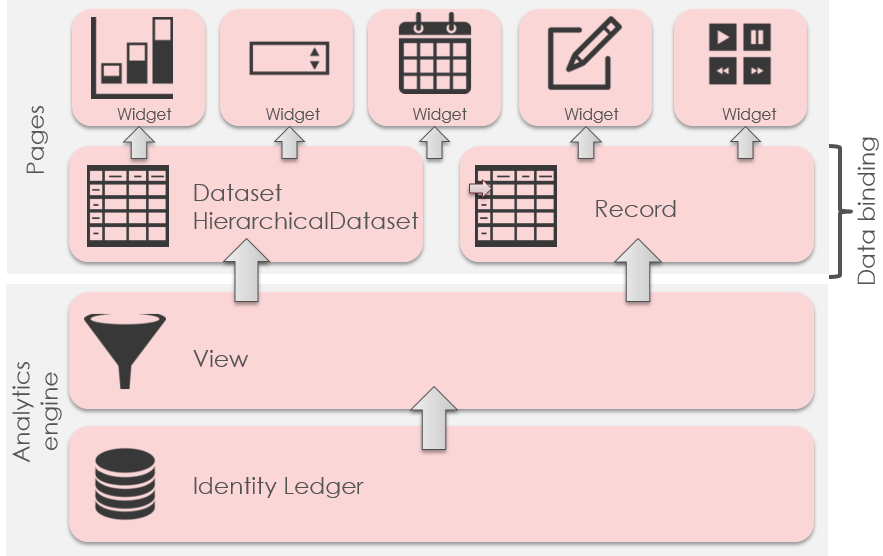
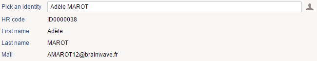
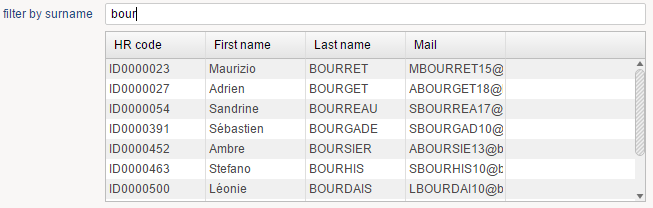
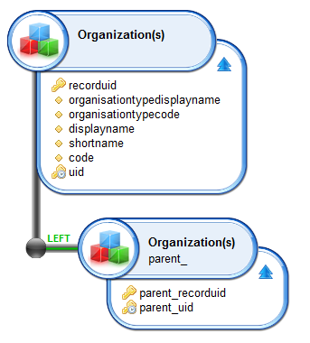
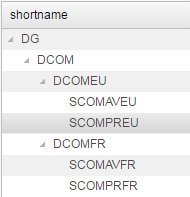
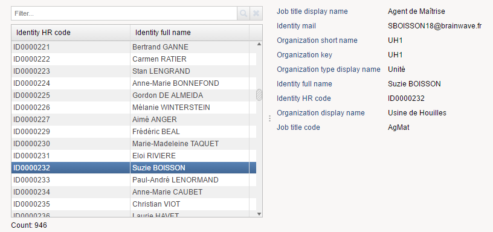
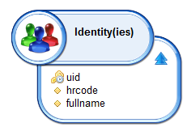
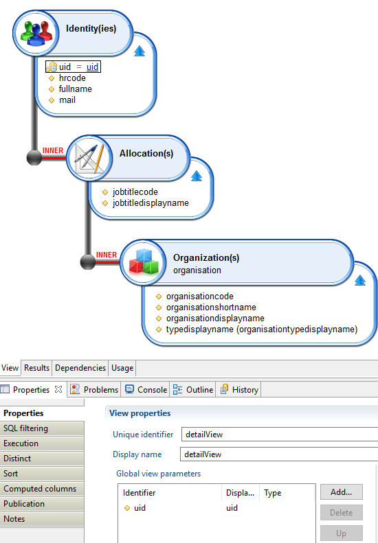

# Data Binding

Data binding allows to obtain information stored in the ledger. Objects declared in the data binding block will obtain information from a view and after they will become sources of data that can be used by several widgets.  

The Data Binding process works like this:  

  

There are three type of objects supported in the data binding block:  

- Record
- Dataset
- HierarchicalDataset

## View Binding

All the data-binding objects support obtaining information from a view. We can use the view attribute for this.  

`view: br_identity`  

This will link the object to the view with the identifier `br_identity`. We can Ctrl-Click on the view identifier to directly open the view using the view editor.  

We can also send values to the parameters of the view. The syntax to send values to the parameters of the view is:  

`view: view_identifier with (value) to paramName [unless-empty]`  

`(value)` can be:  

- Constants of any kind ( String, Int , Boolean, etc...)
- Parameters of the page, using the parameter identifier
- Variables of the page, using the variable identifier

`paramName` is the name of the parameter in the view, we can use Ctrl + space to activate autocompletion and see the options.  

`[unless-empty]` is optional. If its given and the value of (value) is empty , the parameter will not be sent to the view. The view will act the same as it does when the parameter is not set.  

We can send several parameters:  

```page  
view: view_identifier with
    (value) to paramName [unless-empty],
    (value2) to paramName2 [unless-empty]
```

Values that are sent can be modified before sending using one of the many [transformation functions](./18-transform-functions.md), for example:  

```page
view: br_organisations with Concat ( "%", displaynamefilter, "%") to displayname
```

This will take advantage of the "Looks like" filter used in the view by adding '%' before and after the value.  

## Timeslot Selection

When using the view data-binding option, it could be helpful to be able to chose the timeslot that we want to use to execute our view.  

The portalallows the user to select a timeslot. This is the timeslot that will be used when executing all the views.  

This can be changed by using the timeslot attribute of the data binding objects. Some options and examples:  

`timeslot: uidOfTimeslot`  
> **uidOfTimeslot** can be a constant , a variable or a parameter containing the uid of a timeslot  

`timeslot: FromPage (-1)`  
> **FromPage** is a keyword that allows to select a timeslot taking as a reference the current timeslot used in the page.  
In this example, the timeslot will be the previous timeslot. The one that is before the selected timeslot in the page.  

`timeslot: FromPortal (-1)`  
> **FromPortal** is a keyword that allows to select a timeslot taking as a reference the current timeslot selected in the web portal.  
In this example, the timeslot will be the previous timeslot. The one that is before the selected timeslot in the web portal.  

> As of version 2017 R3 SP1, you can tag a given timeslot to indicate that it is a reference timeslot. If at least one timeslot in the ledger is a reference timeslot, offsets in FromPage and FromPortal selections will only take into account reference timeslots.  
> For example `FromPortal (-1)` will be the last reference timeslot collected before the currently selected one. You can use the `no-reference-timeslot` modifier to bypass this behavior, for example:  
> `FromPortal (-1no-reference-timeslot)` will be the timeslot collected before the currently selected one, whether is is a reference timeslot or not.|

## Record

A record is an object that represents 1 item of a view. This item is obtained from 1 row of the linked view.  
In the standard behavior, the record object will execute the view and then take the first returned row.  

```page  
identity = Record {
    view: br_identityDetail with selectedIdentityUid to uid
}
```

Attributes:

- **view** (required) attribute that makes reference to the data binding instruction  
- **timeslot** used for timeslot selection  

Since a record is a single item, we can make reference to the values of their columns like this:  
 `recordIdentifier.columnIdentifier`  

It can be used in all places where a page variable could be used. For example:  

```page  
Text {
    value: identity.fullname
}
```

Here is a full example:  

  

```page  
import "/webportal/pages/resources/pickers.page"
import "/webportal/pages/resources/concepts_nls.page"

test = Page {
    title: 'test'
    homepage-for: Any priority 100

    identityuid = Variable
    idendityname = Variable

    identityDetails = Record {
        view: br_identityDetail with
            identityuid to uid unless-empty  
    }

    Text {
        label: 'Pick an identity'
        value: idendityname
        commands:
            Commands {
                Command {
                    icon:'16/audit/identity_16.png'
                    actions:
                        Dialog identityPicker (
                            identityuid from outUid,
                            idendityname from outDisplayname
                        )
                }
            }
    }
    Text {
        label: $identity.hrcode
        value: identityDetails.hrcode
        compact: True
    }
    Text {
        label: $identity.givenname
        value: identityDetails.givenname
        compact: True
    }
    Text {
        label: $identity.surname
        value: identityDetails.surname
        compact: True
    }
    Text {
        label: $identity.mail
        value: identityDetails.mail
        compact: True
    }
    Text {
        label: $identity.active
        value: identityDetails.active
        compact: True
    }
}
```

When testing this example you will notice something interesting:  
The details start empty (hrcode, given name, ...). This is normal: As nothing as been selected, the record object is empty because it refers to a view who need a parameter to execute (uid).  
As soon as you select an identity, it fulfills the identityuid variable which is used as a parameter for the record.  
The Page engine detects that the record needs to be updated and execute the view. As the record content changed, all widgets are updated in turn.  
This waterfall update is done automatically, you don't have anything to do!

## Dataset

A dataset represents all the items returned by a view  

```page
organisations = Dataset {
    view: br_organisation
}
```

Attributes:  

- **view** (required) attribute that makes reference to the data binding instruction  
- **timeslot** used for timeslot selection  

We can send values to parameters like with Records but a Dataset is always expected to return several results.  
For this reason, the datasets require to be iterated and can only be used by widgets that support Iteration.  
Some of them: Tables, Tiles, Text, Link, Grid.  

Datasets can offer much more data binding features. See the [advanced data binding](./05-advanced-data-binding.md) segment for more information.  

Here is a full example:  

  

```page  
import "/webportal/pages/resources/concepts_nls.page"

test = Page {
    title: 'test'
    homepage-for: Any priority 100

    filter = Variable

    identities = Dataset {
        view: br_identity
            with Concat('%',filter,'%') to surname
    }

    Edit {
        label: 'filter by surname'
        variable: filter
    }

    Table {
        data: identities
        layout: Layout { grab: horizontal True vertical True }
        Column {
            header: $identity.hrcode
            column: hrcode
        }
        Column {
            header: $identity.givenname
            column: givenname
        }
        Column {
            header: $identity.surname
            column: surname
        }
        Column {
            header: $identity.mail
            column: mail
        }
    }
}
```

Once again, when testing this example you will notice that the table content will be refreshed on the fly, based on the content of the edit field (the filter).  
This is done thanks to the waterfall updates managed by the Page engine: As soon as it detects that the filter variable content changed, it executes the dataset and update the corresponding widgets.

## Hierarchical Dataset

A hierarchical dataset is a very particular dataset in which each item can be linked to 1 parent (another item).  

Views used with this datasets should be designed to include hierarchy information.  

Considering the following view (`br_organistation_tree`):  

  

We can create a hierarchical dataset based on it:  

```page  
organisationTree = HierarchicalData {
    view: br_organisation_tree
    initial: parent_uid IsNull
    connect: parent uid to child parent_uid
}
```

`initial: parent_uid IsNull`  
 > Describes the condition to identify the first element of the tree. In this case , is an element that has no parent.  

`connect: parent uid to child parent_uid`  
> Describes the link, meaning that the the value of the column uid of the parent must be the same as the value of the column `parent_uid` of its children  

Attributes:  

- **view** attribute that makes reference to the data binding instruction  
- **timeslot** used for timeslot selection  
- **initial** condition to identify the initial element of the tree  
- **connect** condition to identify the link item `->` item parent  

Hierarchical Datasets are very particular and are supported by a very limited number of widgets.  
The Tree widgets will display:  

  

> The Hierarchical Dataset will need to load all the information of the dataset before rendering. This can have an impact on the performance. A different implementation with better performance is described in the [advanced data binding](./05-advanced-data-binding) segment.

Here is the full example:  

```page  
import "/webportal/pages/resources/concepts_nls.page"

test = Page {
    title: 'test'
    homepage-for: Any priority 100

    organisations = Dataset {
        view: br_organisation_tree
    }

    organisationTree = HierarchicalData {
        view: br_organisation_tree
        initial: parent_uid IsNull
        connect: parent uid to child parent_uid
    }

    Tree {
        data: organisationTree
        layout: Layout { grab: horizontal True vertical True }
        Column {
            header: $organisation.shortname
            column: shortname
        }
    }
}
```

## Master/Details pages

As discussed earlier, the pages engine takes care of propagating the changes automatically.  
This helps you to provide dynamic GUIs to your users without having to deal with complex screen refresh strategy.  

We will illustrate this with a common user interface: a master/detail page.  

In a master/detail page, by selecting an item on a list and you display its details automatically.  

Here is what it looks like:  

  

In order to do this, you have to declare at least 2 views: one for the master section (the list) and another one for the detail section (the entries).  
You will have to instruct the second view to be updated based on the selection on the first view.  

Here is the source of this example:  

```page  
/* Import other pages here */
import "/webportal/pages/resources/mappings.page"

/* Nationalized labels here */
masterdetailsNLS = NLS {
    title [en "Master Details Sample" fr "Master Details Sample"]
    masterviewtable.hrcode [en "Identity HR code" fr "Identity HR code"]
    masterviewtable.fullname [en "Identity full name" fr "Identity full name"]
    detailviewtable.jobtitledisplayname [en "Job title display name" fr "Job title display name"]
    detailviewtable.mail [en "Identity mail" fr "Identity mail"]
    detailviewtable.organisationshortname [en "Organization short name" fr "Organization short name"]
    detailviewtable.organisationcode [en "Organization key" fr "Organization key"]
    detailviewtable.typedisplayname [en "Organization type display name" fr "Organization type display name"]
    detailviewtable.fullname [en "Identity full name" fr "Identity full name"]
    detailviewtable.hrcode [en "Identity HR code" fr "Identity HR code"]
    detailviewtable.organisationdisplayname [en "Organization display name" fr "Organization display name"]
    detailviewtable.jobtitlecode [en "Job title code" fr "Job title code"]
}

masterdetails = Page {
    title: $masterdetailsNLS.title
    homepage-for: All

    /* Parameters here */

    /* Variables here */
    selectionVariable = Variable { type: String }

    /* Datasets and records here */
    masterViewDataset = Dataset {
        view: masterView
    }
    detailViewRecord = Record {
        view: detailView with
            selectionVariable to uid
    }

    /* Page content */
    Splitter {
        disposition: Horizontal
        Group {
            Table {
                data: masterViewDataset
                show-filter: True
                show-count: True
                hide-header: False
                layout: Layout { grab: horizontal True vertical True }
                Column {
                    column: uid
                    selection: selectionVariable
                    hidden: True
                }
                Column {
                    column: hrcode
                    header: $masterdetailsNLS.masterviewtable.hrcode
                    sortable: True
                    filterable: True
                    width: 50%
                }
                Column {
                    column: fullname
                    header: $masterdetailsNLS.masterviewtable.fullname
                    sortable: True
                    filterable: True
                    width: 50%
                }
            }
        }
        Group {
            Text {
                compact: True
                label: $masterdetailsNLS.detailviewtable.jobtitledisplayname
                value: detailViewRecord.jobtitledisplayname
            }
            Text {
                compact: True
                label: $masterdetailsNLS.detailviewtable.mail
                value: detailViewRecord.mail
            }
            Text {
                compact: True
                label: $masterdetailsNLS.detailviewtable.organisationshortname
                value: detailViewRecord.organisationshortname
            }
            Text {
                compact: True
                label: $masterdetailsNLS.detailviewtable.organisationcode
                value: detailViewRecord.organisationcode
            }
            Text {
                compact: True
                label: $masterdetailsNLS.detailviewtable.typedisplayname
                value: detailViewRecord.typedisplayname
            }
            Text {
                compact: True
                label: $masterdetailsNLS.detailviewtable.fullname
                value: detailViewRecord.fullname
            }
            Text {
                compact: True
                label: $masterdetailsNLS.detailviewtable.hrcode
                value: detailViewRecord.hrcode
            }
            Text {
                compact: True
                label: $masterdetailsNLS.detailviewtable.organisationdisplayname
                value: detailViewRecord.organisationdisplayname
            }
            Text {
                compact: True
                label: $masterdetailsNLS.detailviewtable.jobtitlecode
                value: detailViewRecord.jobtitlecode
            }
        }
    }
}
```

The magic trick is in the `selectionVariable`  
This variable is updated with the selected identity UID when the user clic on a line on the Table  

```page  
Column {
    column: uid
    selection: selectionVariable
    hidden: True
}
```

This variable is used in turn as a parameter of the detail view:  

```page  
detailViewRecord = Record {
    view: detailView with
        selectionVariable to uid
}
```

As the pages engine automatically propagate the changes with a waterfall effect, the Record is updated on each variable change (a new SQL request is issued to the Identity Ledger) and the widgets who use this record are updated in turn, such as this one.  

```page  
Text {
    compact: True
    label: $masterdetailsNLS.detailviewtable.organisationdisplayname
    value: detailViewRecord.organisationdisplayname
}
```

This is as easy as that, you have nothing to do to deal wih widget updates, this is fully automated!  

Here are the corresponding views:  

Master view  

  

Detail view (with the parameter)

  
