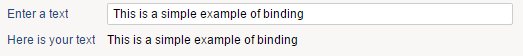

# Variables

Variable objects are declared in the Variables block of a Page. Their scope is limited to the page where they are defined.  
They are similar to the parameters with the difference that they are not handled by the parameter editor and they cannot receive values from the link activating the page. Unlike parameters their value can be modified as many times as needed.  

Variables can be mono-valued or multi-valued and can support different value types.  

Variables are commonly used to share information from one widget to another. They are usually linked to one or more widgets. Each widget support variables in different ways. For example a table widget supports the use of variables to store information about the selected item.  

## A simple example

```page
/* Import other pages here */
import "/webportal/pages/resources/pickers.page"

/* Nationalized labels here */
identityFinderNLS = NLS {
  title [en "Custom Identity Finder"]
  params.organisation [en "Organisation"]
  params.organisation.tooltip [en "Filter by organisation"]
}

identityFinder = Page {
  title: $identityFinderNLS.title
  homepage-for: All priority 200

 /* Parameters here */

 /* Variables here */
 selectedIdentityUid = Variable {
   type: String
   multivalued: False
 }

 /* Datasets and records here */

 /* Page content */
}
```

## Attributes

Mandatory attributes are marked in bold.  
**type** defines the type of value that will be stored (Boolean , Date, Integer or String ).  
**multivalued** defines if the parameter will only receive 1 value or many.  
**initial** is the initial value of the variable. It can be a constant value, or the value of a parameter.  
If not specified, a variable is of type 'String', not multivalued and empty ('') by default.  

## More examples

### monovalued  

```page
var1 = Variable {
  type: Integer
  initial: 1
}

var1 = Variable {
  type: String
  initial: "some chars..."
}

var1 = Variable {
  type:Boolean
  multivalued:False
  initial:True
}

var1 = Variable {
  type:Date
  multivalued:False
  initial:Date.valueLDAP
}

var1 = Variable {
  type:Date
  multivalued:False
  initial:Date.offset(5 days).valueLDAP
}
```

### Multivalued  

```page
var1 = Variable {
  type: String
  multivalued: True
  initial: ["A", "A", "B", "C", "C", "D"]
}

var1 = Variable {
  type: Integer
  multivalued: True
  initial: [1, 2, 5, 4, 4]
}

var1 = Variable {
  type: Boolean
  multivalued: True
  initial: [True, False, True, True]
}

var1 = Variable {
  type:Date
  multivalued:True
  initial:[
    Date.offset(-5 days).valueLDAP,
    Date.valueLDAP,
    Date.offset(5 days).valueLDAP]
}
```

### With parameters  

```page
param1 = Parameter {
  type: String
  mandatory: False
  multivalued: True
}

var1 = Variable {
  type: String
  multivalued: True
  initial: param1
}
```

## Binding variables

The Brainwave page engine takes care of propagating all changes automatically.  
This means that when a variable value changes, all other changes are operated with in waterfall manner, including GUI refresh.  

This is a powerful feature as you don't have to care for GUI refreshes, this is done automatically, you just have to deal with your variables.  

Here is a simple example:  

```page
myvar = Variable

Edit {
  variable:myvar
  label:"Enter a text"
}
Text {
  value:myvar
  label:"Here is your text"
  compact:True
}
```

  

As you can see, when you type something on the edit field, it updates the variable 'myvar'. As this variable is displayed with a text widget, the text widget content is updated on the fly.  
