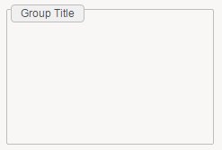
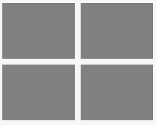
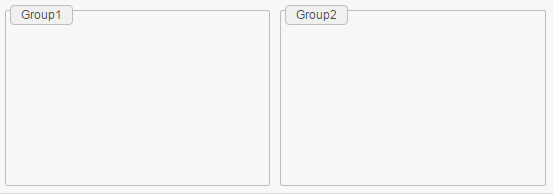
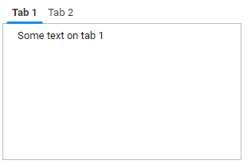
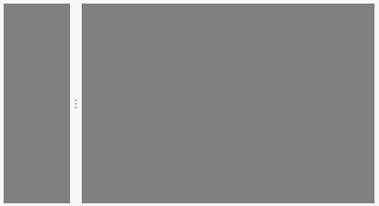
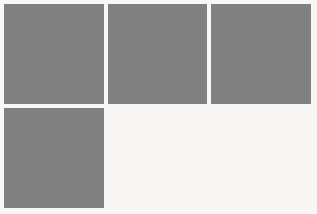

# Container Widgets

## Group

A group is a container that can hold any number of widgets.  

```page
Group {
    title: "Group Title"

    // Any number of widgets
}
```

  

Required attributes are marked in bold.  
**title** the title to be displayed if needed
**border** True/False indicates if a border should be displayed or not. Note that if a title is given then a border will always exists.  
Supports the [common attributes](./07-widgets#common-attributes): **feature , layout, mixins, margins, background and hidden**.  

## ConditionalGroup

Conditional group allows to display a group based on the value of variables, parameters or record columns.  
A conditional group looks just like a normal group and share the same attributes. The different is that the widgets inside can change depending on a condition.  

```page
ConditionalGroup {
  title: "Group Title"

  StringCondition (selectedIdentityUid){
    when IsEmpty then [
      // Any number of widgets to show when the variable is empty

    ]
    otherwise [
      // Any number of widgets to show otherwise
    ]
  }
}
```

  

Required attributes are marked in bold  
**title** the title to be displayed if needed  
**border** True/False indicates if a border should be displayed or not. Note that if a title is given then a border will always exists.  
Supports the [common attributes](./07-widgets#common-attributes): **feature , layout, mixins, margins , background and hidden**.

4 Condition structures are supported depending of the variable type, their syntax is very similar to the corresponding [Predicate Functions](./16-predicate-functions.md):  

```page
StringCondition ( variable ) {
    when "value" then [
        //widgets
    ]
    when IsEmpty then [
        //widgets  
    ]
    otherwise then [
        //widgets  
    ]
}
```

Used to test String variables, many conditions are supported and tested in order. An otherwise condition can be used at the end.  

```page
IntCondition ( variable ) {
    when InvalidInteger then [
        //widgets  
    ]
    when = 0 then [
        //widgets  
    ]
    when < 10 then [
        //widgets  
    ]
    otherwise [
        //widgets  
    ]
}
```

Used to test Int variables, many conditions are supported and tested in order. An otherwise condition can be used at the end.  

```page
BooleanCondition ( bol) {
 when False then [
 //widgets
 ]
 when True then [
         //widgets
 ]
}
```

Used to test boolean variables, only 2 conditions are supported True or False.  

```page
DateCondition ( variable ) {
    when DateAfter DateLDAP(date) then [
        //widgets
    ]
    otherwise [
        //widgets
    ]
}
```

Used to test Date variables, many conditions are supported and tested in order. An otherwise condition can be used at the end.  
As for the DatePredicate the supported keywords are: DateAfter, DateBefore, DateBetween, TimeAfter, TimeBefore, TimeBetween.

## Grid

Grid is an structure of rows and columns to organize and contain other widgets in cells.  
For a grid the most important is to declare how many columns it will have. We need to declare them in the required columns attribute

```page
Grid {
 columns: GridColumn { width: 50 } , GridColumn { width: 50 }
 gap: 10

 GridRow {
 GridCell{
 background: Color gray
 // Cell for row 1 , col 1
 // Any number of widgets
 }
 GridCell{
 background: Color grey
 // Cell for row 1 , col 2
 // Any number of widgets
 }
 }
 GridRow{
 GridCell{
 background: Color gray
 // Cell for row 2 , col 1
 // Any number of widgets
 }
 GridCell{
 background: Color gray
 // Cell for row 2 , col 2
 // Any number of widgets
 }
 }
}
```

  

Required attributes are marked in bold:  

**columns** declare the columns , and optionally their size in pixels or set them to grow to take as much as possible. syntax is `GridColumn {}` or `GridColumn {width: 100}` or `GridColumn { width: grow}`  
many columns can be declared separated with ',' and in order: `GridColumn { width: 50 } , GridColumn { width: grow  }`  
gap is the size in pixels to have between cells  
insets size in pixels of the margin inside the cells  
fill allows the grid to fill the available space using keywords: `None, Horizontal, Vertical, Both`  
Supports the [common attributes](./07-widgets#common-attributes): **feature , layout, mixins, background and hidden**.

In order to define the structure of the grid , it will take different kind of objects: `GridRow , GridCell`:  

Grid  
&emsp;GridRow  
&emsp;&emsp;GridCells ( one per column)  
&emsp;&emsp;&emsp;Can contain any number of widgets  

&emsp;GridRow  
&emsp;&emsp;GridCells ( one per column)  
&emsp;&emsp;&emsp;Can contain any number of widgets  

GridRow Attributes:  
**height** declares the height of all the row in pixels  

GridCells Attributes:  
**span** declares the number of cells that it will take. if 2, it will take the space of 2 cells  

## Flow

Flow is a transparent container. It can only contain a limited number of supported widgets and it allows to chose the disposition of the widgets.  

Supported Widgets:  

Group, ConditionalGroup, Flow, Grid, Splitter, TabFolder and Tiles.  

```page
Flow {
 disposition: Horizontal

 Group {
 title: "Group1"
 }
 Group {
 title: "Group2"
 }
}
```

  

Required attributes are marked in bold  
**disposition** it defines the disposition of the subcontainers. options are `Horizontal` or `Vertical`.  
Supports the [common attributes](./07-widgets#common-attributes): **feature , layout, mixins, background and hidden**.  

## TabFolder

TabFolder is a container that holds widgets in form of tabs.  

```page
TabFolder {
 position: Top

 TabItem {
 text: "Tab 1"
 // Any number of widgets
 }
 TabItem {
 text: "Tab 2"
 // Any number of widgets
 }
}
```

  

Required attributes are marked in bold  
**position** defines if the tabs are positioned at the top or at the bottom. Options are `Top` or `Bottom`  
Supports the [common attributes](./07-widgets#common-attributes): **feature , layout, mixins, background and hidden**.  

To organize the widgets in tabs , we use the `TabItem` object  

TabFolder  
&emsp;TabItem  
&emsp;&emsp;Can contain any number of widgets  

TabItem Attributes  
**text** describe the text display on the tab  
**icon** path to an icon displayed on the tab (e.g. `"16/famfamfam_silk_icons_v013/accept.png")`)

> Note: the path for icons is relative to `ProjectFolder/reports/icons`  

**hidden** dynamic boolean expression that controls whether the tab item is visible or hidden in the parent tab folder.  
If an active tab item becomes hidden, then the next visible tab starting from the left will be selected.  
Moreover, you must ensure that at least one tab item is visible at any time.

Example:  

```page
TabItem {
  hidden: Eval " nbPermissions > 0 "
}
```

## Splitter

Splitter is a container that split the area in two pieces. It can be done Horizontally or Vertically. It requires an initial size but it can be resized by the user.  

An splitter can only hold 2 other containers:  
Group, ConditionalGroup, Flow, Grid, Splitter, TabFolder and Tiles  

```page
Splitter {
 disposition: Horizontal
 size: 20%

 Group {
 background: Color gray
 }

 Group
 {
 background: Color gray
 }
}
```

  

Required attributes are marked in bold  
**disposition** defines the disposition of the splitter, it can be : `Horizontal` or `Vertical`  
**size** defines the initial size of the first group, it can be a percentage or pixels ( eg `20%` or `20px`).
Supports the [common attributes](./07-widgets#common-attributes): **feature , layout, mixins, background and hidden**.

## Tiles

Tiles is a container that hold sub-containers of type `Tile`.  
A Tile is a container with a fixed height , that are organized in columns.  
We can have any number of Tile elements that will be positioned next to each other in next available column.  
If no more columns are available the next Tile will be positioned in a new row:  

```page
Tiles {
 columns: 3
 tile-height: 100

 Tile {
 background: Color gray
 // Any number of widgets
 }
 Tile {
 background: Color gray
 // Any number of widgets
 }
 Tile {
 background: Color gray
 // Any number of widgets
 }
 Tile {
 background: Color gray
 // Any number of widgets
 }
}
```

  

Required attributes are marked in bold  
**columns** the number of columns of tiles  
**tile-height** the number of pixels for the height of each tile  
**gap** number of pixels to customize the space between tiles  
**insets** the number in pixels of the margin inside each tile  
**align**  
Supports the [common attributes](./07-widgets#common-attributes): **feature , layout, mixins, background and hidden**.  

To fill the Tiles object we can use Tile objects:  

Tiles  
&emsp;Tile  
&emsp;&emsp;Can contain any number of widgets  

Tile Attributes  
Supports the [common attributes](./07-widgets#common-attributes): feature, hidden
