# Display Widgets

## Header

```page
Header {
    value: "Header"
}
```

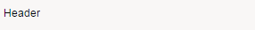  

## Text

```page
Text {
 label: "Text label"
 value: "Text"
}
```

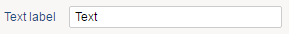  

## Link

```page
Link {
 label: "Link label"
 value: "Click to link"
 target: Page targetPageIdentifier
}
```

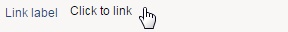  

## Button

```page
Button {
 text: "Button"
 actions: GoTo Page targetPageIdentifier
}
```

  

### ButtonGroup

A button group is a set of buttons horizontally aligned.

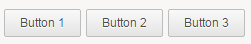  

```page
ButtonGroup {
 Button {
 text: "Button 1"
 actions: GoTo Page targetPageIdentifier
 }
 Button {
 text: "Button 2"
 actions: GoTo Page targetPageIdentifier
 }
 Button {
 text: "Button 3"
 actions: GoTo Page targetPageIdentifier
 }
}
```

Different options allow to control the layout of buttons inside the button group:

| Option      | Values                                                   | Meaning                                                                                                        |
| :---------- | :------------------------------------------------------- | :------------------------------------------------------------------------------------------------------------- |
| **align**   | Left,Center,Right                                        | controls how the buttons are aligned with respect to the boutton group when it's wider than the buttons inside |
| **spacing** | nn                                                       | spacing in pixels between each button                                                                          |
| **uniform** | True,False                                               | if true all buttons will have the same width, regardless of their content                                      |
| **margins** | All, Bottom, Left, Right, Top, Horizontal, Vertical + nn | controls the margins around the button bar container                                                           |

### Foldable button group

Having many buttons in a button bar with both frequent actions and occasional actions does not provide a good user experience. Moreover, it may also cause horizontal scroll bars to be displayed on narrow screens.

It is now possible to have only primary buttons displayed in the button bar and have the remainder buttons accessible through a popup menu.

To do so, indicate how many of the first buttons must be displayed inline inside the button bar using **nb-inline:** attribute. The last buttons in excess will be accessible through a popup menu.  

Note that buttons displayed in the popup menu do not support tooltips and badges. If the attributes are provided, they will be ignored.

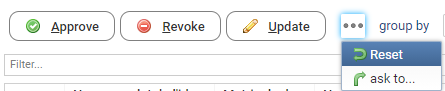  

### Direct shortcuts

It's possible to assign direct (ie. one-key) shortcuts to buttons inside a button-group that target a table, a tree or a cross-table.
The shortcuts will be active when the target widget is in focus.  
This is particularly useful for review tables, where you could assign a shortcut to each review action, to speed up the review process.

In order to assign direct shortcuts inside a button group, do the following:  

- Use **shortcut-targets:** to assign one or more targets (table or crosstable) to the button shortcuts. The target widgets will need to have an id to be referenced.
- Set the shortcut for each button by prefixing one letter (usually the first one) in its label with the & symbol.  
For instance, to use letter **T** as a shortcut for Print button, set it's label to "Print".  
Not all buttons inside the button-group need have a shortcut. If the button text is localized, then the shortcut should be set in each language.

> If you have labels that contain the '&' character, and want it to be displayed as is, you have to double the '&'.
>
> For example: change 'A&B' to 'A&&B' so that it will be displayed as 'A&B' without keyboard shortcut.

Below is a full example:

```page
ButtonGroup {  
   shortcut-targets: reviewTable
    Button {
        text: "&Approve"
        actions:   Flash "Approved!"
    }
    Button {
        text: "&Revoke"
        actions:   Flash "Revoked!"
    }
}

reviewTable = Table {
    data:listreview
    Column {
        column:detail_identityfullname
        selection:selected_detail_identityfullname
    }
    Column {
        column:detail_reviewstatus
    }
}
```

This is another  example of buttons with shortcuts:
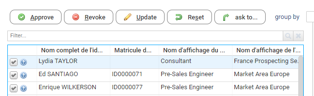

## Image

```page
Image {
    image: "16/famfamfam_silk_icons_v013/accept.png"
}
```

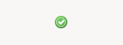  

## Separator

```page
Separator { }
```  

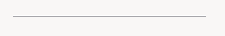  

## Spacer

The spacer is a transparent widget. The purpose is to leave an empty space.  

```page
Spacer {
 height: 50
}
```

## Chart

Using as test this dataset with two columns ( label and total ).  

```page
chartData = Dataset {
 values: [ ( label -> "A" , total -> 10 ),
 ( label -> "B" , total -> 40 ),
 ( label -> "C" , total -> 80 )
 ]
}
```

We can create a chart like this:  

```page
Chart {
 data: chartData
 file: "charts/treemap.chart"
 series: (Current label) as String in "category", (Current total) as Double in "value"
 layout: Layout { grab: horizontal True vertical True}
}
```

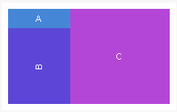  

## Browser

```page
Browser {  
static: "static/hierarchy/organisation_hierarchy.html"  
layout: Layout { grab: horizontal True vertical True }  
}
```

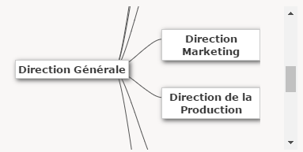  

## OpenURL

```page
OpenURL {
url: "http://www.brainwave.fr"
text: "Go to brainwave.fr"
}
```

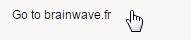  
