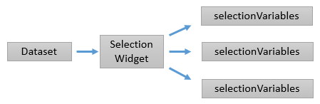
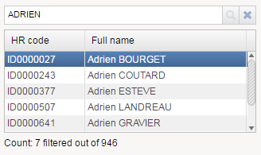
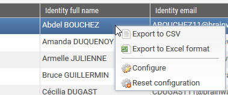
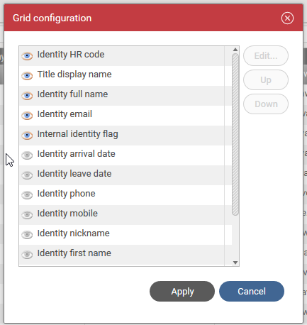
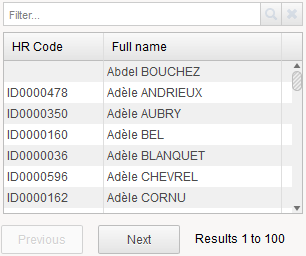
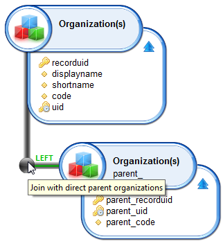
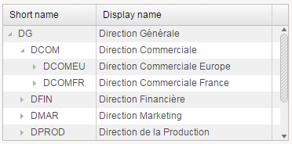
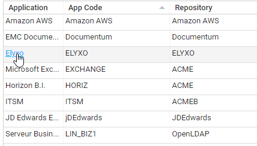

# Selection Widgets

Selection widgets are generally connected to a Dataset, they are meant to display all the information in a Dataset.  

These widgets can offer many functionalities to interact with. For example, they can allow the user to sort the data, or to filter. But their main purpose is to allow the user to select items.  

To accomplish their goal they are also linked to one of many selection variables that they will modify when a selection action is registered.  

  

Selection variables can later be used by Display Widgets, or sent as parameters to secondary Datasets.  

## Table

A Table helps you to present a list of information stored in a Dataset.  
Here is a simple example:

  

```page
sourceData = Dataset {
  view: br_identity
}

Table {
  data: sourceData
  layout: Layout { grab: horizontal True vertical True }
  show-count: True
  show-filter: True

  Column {
    column: hrcode
    header: $identity.hrcode
    sortable: True
    filterable: True
    width: 50%
  }

  Column {
    column: fullname
    header: $identity.fullname
    sortable: True
    filterable: True
    width: 100%
  }
}
```

The Table widget accepts a Dataset through its 'data' property.
Table columns are declared through the Column object, the binding with the corresponding dataset attribute is done through the 'column' property.  
You should try to hit Ctrl+Space when fulfilling the 'column' value as the editor will automatically propose the available attributes of the view.  

In this example we added some other properties such as 'show-count' to display the total number of lines, 'show-filter', used along with 'filterable' in order to present a search bar on top of the table.  
We also used the 'sortable' property to enable user column ordering by clicking on the corresponding headers.  

It can be useful to grab information when a user click on a line of a table.  
Here is an example:  

```page
selectedIdentityUid = Variable {
  type: String
  multivalued: False
}

sourceData = Dataset {
  view: br_identity
}

Table {
  data: sourceData
  layout: Layout { grab: horizontal True vertical True }
  show-count: True
  show-filter: True

  Column {
    column: hrcode
    header: $identity.hrcode
    sortable: True
    filterable: True
    width: 50%
  }

  Column {
    column: fullname
    header: $identity.fullname
    sortable: True
    filterable: True
    width: 100%
  }

  Column {
    column: uid
    hidden: True
    selection: selectedIdentityUid
  }
}
```

  

As you can see, we added a new column for the identity uid along with the selection: `selectedIdentityUid` keyword. It means that when a user click on a line the selectedIdentityUid variable is updated with the corresponding dataset uid content. As the uid is a technical information, this column is hidden from the end user.  

This is used for instance for [master/detail](./04-data-binding.md) pages where you want to present dynamic content.  

### New attributes  

- initial-selection-index: (reference to a parameter): references an integral mono-valued parameter which will contain the table's starting index
- selection-index: (reference to a variable): references an integral mono-valued variable which will contain the table's current index  

As for the SetNavigator widget, initial-selection-index:is ignored if initial-selection: is not provided.  

#### MultivaluedIterate action

This action allows to iterate over the values of one or more multi-valued expressions and execute a given list of actions for each iterated element.  

For example, if `var_elems` is a multi-valued integral variable and `var_sum` is a mono-valued integral variable, the actions  

```page
Set 0 to var_sum, MultivaluedIterate var_elems as elem [ Set Sum(var_sum, Current elem) to var_sum ]
```

will set `var_sum` to the sum of the elements of `var_elems`.  

As another example, if `prm_path` contains the path to a file, for example "/a/b/c/d.txt", the action  

```page
MultivaluedIterate Split prm_path using "/" as part index-as idx [
    IntCase(Current idx) {
      when = 1 then []
      otherwise [
        IntCase(Difference(SizeOf Split prm_path using "/", Current idx)) {
          when > 0 then [
            StringCase(var_directory) {
              when IsEmpty then [ Set Current part to var_directory ]
              otherwise [ Set Concat(var_directory, "/", Current part) to var_directory ]
            }
          ]
        }
      ]
    }
  ]
```

will set the parent directory of the file to the variable `var_directory` ("a/b/c" in the example).  

## Total process progress in TaskInfo and ProcessInfo

The process total progress is accessible in TaskInfo(task, ProcessProgressTotal) and ProcessInfo(process, ProgressTotal).  

## Timeslot UID in TaskInfo and ProcessInfo

The timeslot UID used to launch a process is accessible in TaskInfo(task, TimeslotUID) and ProcessInfo(process, TimeslotUID).

### Preserving table selection on change

By default, a table's selection is cleared when the table's data changes.  
Although this is not an issue in large tables where the table's data changes reflect a complete new set of rows (ie search result tables), it can become problematic when the table data changes is only a change in say, a status column of the selected row, but the table's rows are basically the same: the user has to select again the row to continue working which is detrimental to the user experience.  

The **preserve-selection** option in Table Column  preserves the table's selection when data is changed.  

- It must be set on a key column, which has also its **selection:** property set.  
- There can be only one preserve-selection property set on a table.  
- When data changes, the selection is set back to the first row item that has the same key value.  

If none is found ( eg the item was deleted), then the selection index is preserved, which in  case of deletion, typically means the next row will be selected.

```page
Table {
    Column {
            column: taskId
            hidden: True
             selection: selectedTask
             preserve-selection: True
      }
 }
```

For compatibility reasons, this option is turned off by default. Moreover, it is not compatible with paging so should be limited to tables with less than 1000 rows. It's not compatible with multiple selection either.

## Table configuration in the portal

It is possible to organise the data displayed in a table in the portal. For this it is necessary to add the following parameter to the table:  

`configurable:True`  

Adding this option will then add new menus to the right click:  

  

This allows you to display/hide, using the eye icon and rearrange the columns of a table, using the dedicated buttons, through the following pop-up :  

  

The page designer can control which table columns are initially visible when page loads using the `initially-masked:` attribute. This attribute contains a constant predicate, for example:  

```page
Column {
    column: allocationchanged
    header: $identity.allocationchanged
    width: 100%

    initially-masked: StringPredicate(paramShowChanges) {
        when "All" then False
        when "Allocation" then False
        otherwise True
    }
}
```

An attribute whose '`initially-masked:`' evaluates to True can still be displayed, using the aforementioned dialog.  

Note that table columns also contains an '`hidden:`' predicate attribute which is used to mask technical columns (for example record uids in a master/detail page). These hidden columns does not appear in the configuration dialog.  

To allow the preservation of the display options configured for the table even after a restart of the portal it is necessary to add the following parameter to the table definition in the page:  

`persist-configuration:True`  

You can specify a list of parameters in the persist-configuration-key: attribute to discriminate between different persistent configurations. For example with  

`persist-configuration-key: controlName`  

you will have as many different configurations of this table as value of the controlName parameter.  

> When exporting the table, the user will have the choice to export all the non-hidden columns (whether they are actually displayed or not) or to export only the currently displayed columns.  |

## PaginatedTable

When a table is expected to contain many elements or when computing the size of the underlying dataset is very expensive, it may be advisable to use a `PaginatedTable` widget instead.  

In this widget, the dataset is divided into pages of a given size and the table only show one page at a time, with two buttons below the table to navigate to the previous or to the next page.  

Any attribute supported by the `Table` widget is supported with the exception of `show-count:`. Moreover the `page-size:` attribute is specific to this widget: it can be any positive integer but a reasonable value would be between 100 and 1000.  

Here is an example:  

```page
data = Dataset {
  view: br_identity
}

PaginatedTable {
  data: data
  layout: Layout {
    grab: horizontal True vertical True
  }
  label: Label {
    break: True
  }
  page-size: 100
  initial-sort: fullname ascending
  show-filter: True

  Column {
    column: hrcode
    header: "HR Code"
    width: 100px
  }
  Column {
    column: fullname
    header: "Full name"
    filterable: True
    width: 100%
  }
}
```

  

## Tree

With this variable for selection:  

```page
selectedOrganisationUid = Variable {
  type: String
  multivalued: False
}
```

From a view that is designed as following:  

  

We can create the dataset:  

```page
organisationTree = HierarchicalData {
  view: br_organisation_tree
  initial: parent_uid IsNull
  connect: parent uid to child parent_uid
}
```

This dataset can be used as an input for a Tree :  

```page
Tree {
  data: organisationTree
  layout: Layout { grab: horizontal True vertical True }

  Column {
    column: shortname
    header: $organisation.shortname
    width: 50%
  }

  Column {
    column: displayname
    header: $organisation.displayname
    width: 100%
  }

 Column {
   column: uid
   hidden: True
   selection: selectedOrganisationUid }
}
```

  

## TemplateTable

Using the dataset:  

```page
sourceData = Dataset {
  view: br_identity
}
```

We can use a TemplateTable with pagination:  

```page
TemplateTable {
  data: sourceData
  layout: Layout { grab: horizontal True vertical True }
  pagination: 10

  TextCell {
    top: 5
    left: 5
    width: 200
    height: 20
    column: fullname
  }
  HiddenCell {
    column: uid
     selection: selectedIdentityUid
   }
}
```

  

## Action links

You can set action links in cells of tables, trees , tables with grouping and paginated tables using **actions:** attribute.



The action links are defined per **Column** and can carry out any actions ( eg open a detail dialog box, display a message) , not only opening another page or report.  
You can have one different action link on each column. The actions can reference any dataset column of the row being clicked, using **Current attribute** syntax.

When a link is clicked, the underlying row is also visually selected and any action triggered by the selection performed before the link, including any selection variables.  

The link can be dynamically disabled according to a static condition ( eg. user feature) using **actions-disabled:** attribute . Note that the disabling condition is evaluated only once when the page or dialog is loaded.

You can also set a tooltip on the link, for example to explain its purpose. The tooltip is evaluated dynamically, so it can include information from the current row using **Current attribute** syntax.  

Note that legacy **links:** can be entirely replaced by actions: using **Goto** action .

```page
Column {
  column: displayname
  actions: Message Concat ( "Show detail of : ", Current displayname)
  actions-disabled: FeaturePredicate canDetailApplication
  tooltip: "Show detail of application"
}
```
