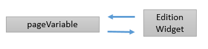
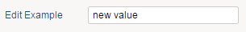
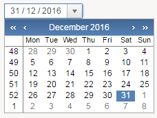
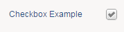
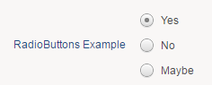
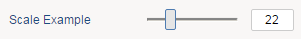
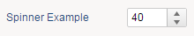
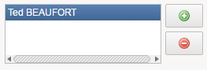
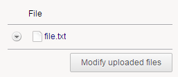

# Edition widgets

Edition Widgets are generally linked to a variable.  

They will display the value of the variable, but they will also allow to user to interact and modify its value.  

  

## Edit

For string variables:  

```page
Edit {
 variable: pageVariable
 label: "Edit Example"
}
```

  

## Combo

For string variables in a combobox. Here the values come from a list (static or dataset).  

```page
Combo {
 variable: selectedIdentityUid
 label: "Combo Example"
 options: Dynamic {
 data: sourceData
 text: Current fullname
 value: Current uid
 }
}
```

  

## DateTime

For Date variables:  

```page
DateTime {
 variable: dateVariable
 type: Date
}
```

  

## Checkbox

For a boolean variable:  

```page
Checkbox {
 variable: booleanVariable
 label: "Checkbox Example"
}
```

  

## RadioButtons

For limited options:  

```page
RadioButtons {
 variable: pageVariable
 label: "RadioButtons Example"
 Option {
 text: "Yes"
 value: 1
 }
 Option {
 text: "No"
 value: 0
 }
 Option {
 text: "Maybe"
 value: 3
 }
}
```

  

## Scale

For integer variables:  

```page
Scale {
 variable: pageVariable
 label: "Scale Example"
 minimum: 0
 maximum: 100
 increment: 10
 show-value: Right
}
```

  

## Spinner

For integer variables:  

```page
Spinner {
 variable: pageVariable
 label: "Spinner Example"
 minimum: 0
 maximum: 100
 increment: 10
}
```

  

## MultiEdit

For multivalued variables :  

```page
MultiEdit {
 add-dialog: identityPicker returning outDisplayname
 buttons-presentation: Icon
 Element {
 variable: multivaluedVariable
 }
}
```

  

## Upload

To upload files:  

```page
Upload {
 variable: pageVariable
 hide-comment: True
 show-controls: True
}
```

  
