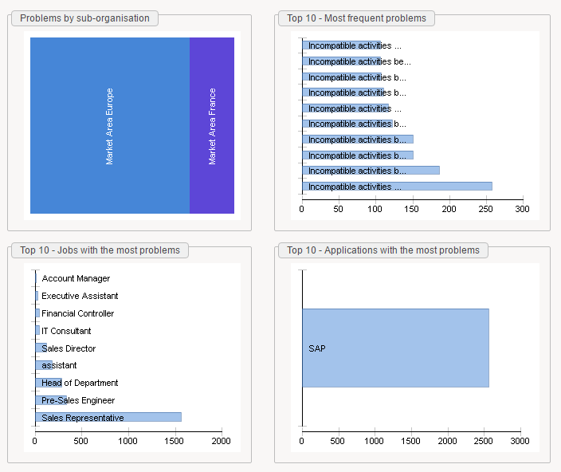
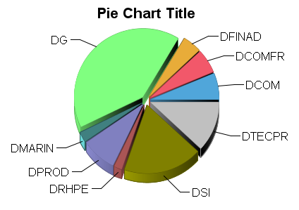
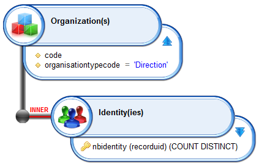
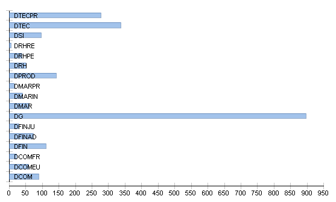
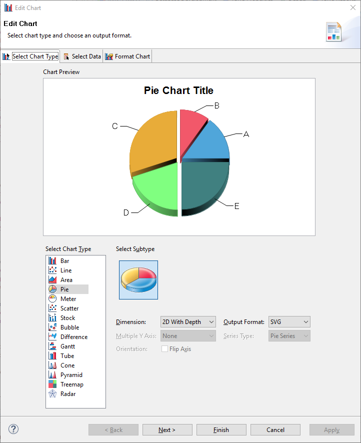
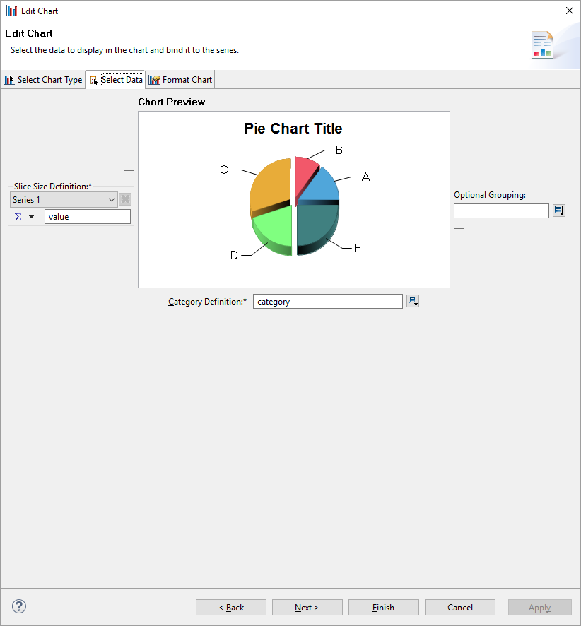
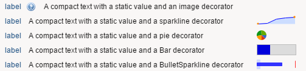

# Chart Widgets

The page technology embed chart capabilities, we will detail in this chapter how to use the default charts, how to define your own charts and how to add charts as a decorator of a widget.  

## Charts

You can easily add  charts in your pages, such as:  

  

In order to do so, you have to use the Chart widget.  

Here is a simple example:  

```page
mydata = Dataset { view:myview  }

Chart {
  file:'charts/pie'
  data:mydata
  series:(Current code) as String in "category", (Current nbidentity) as Integer in "value"
  layout:Layout{grab:horizontal True vertical True}
}
```

  

  

The Chart widget relies on a chart template (more on this on the next chapter). you will find the default chart templates in your project under webportal/pages/charts.  

You have to declare the template without the .chart extension, such as:  

- charts/pie
- charts/histogram
- charts/treemap
- ...  

Modifying the template is sufficient to change the look&feel of your chart, here for instance:  

```page
mydata = Dataset { view:myview  }

Chart {
  file:'charts/histogram'
  data:mydata
  series:(Current code) as String in "category", (Current nbidentity) as Integer in "value"
  layout:Layout{grab:horizontal True vertical True}
}
```

  

In order to declare some data you have to provide a dataset to your chart. This dataset must contain at least one attribute of type string (the category) and one attribute of type Date/Double/integer (the value).  
As a result, your view will most likely contain an aggregation function for computing the value (count, sum, ...).  

You map your attributes to your chart in the series property with this special syntax by replacing `DATASET_CATEGORY_ATTRIBUTE` and `DATASET_VALUE_ATTRIBUTE` with their corresponding attributes in your dataset:  

```page
series:(Current DATASET_CATEGORY_ATTRIBUTE) as String in "category",
  (Current DATASET_VALUE_ATTRIBUTE) as Integer in "value"
```

If the chart contains a title, you can customize it through the Chart widget 'title' property.  

## Custom Charts

Chart templates are provided along with your project under the webportal/pages/charts/ subdirectory.  
You can actually add new templates. In order to do so go to the webportal/pages/charts/,  duplicate a template and double click on it.  

It will open the Chart template editor:  

  

> This editor is the same as the one used in the reports. Please read the Reporting engine documentation for more details about it. We will only focus here on the changes.  

You can customize your chart through the first and the third tabs.  

In order to prepare the data mapping you have to open the second tab and to declare strings in the values and category placeholders.  

  

Those strings are used in the 'series' attribute of the Chart widget:  

```page
Chart {
  file:'charts/mypie'
  data:mydata
  series:(Current code) as String in "category", (Current nbidentity) as Integer in "value"
  layout:Layout{grab:horizontal True vertical True}
}
```

If your chart contains several values (multiple histogram for instance), you just have to declare several value strings, such as value1, value2, ...  
and to map them in the series attributes:  

```page
Chart {
  file:'charts/mypie'
  data:mydata
  series:(Current code) as String in "category", (Current nbidentity)
    as Integer in "value1", (Current nbleavers) as Integer in "value2", (Current nbcontractors)
    as Integer in "value3"
  layout:Layout{grab:horizontal True vertical True}
}
```

Somehow, you will have to use a [join dataset](./05-advanced-data-binding.md) to consolidate those information in a single dataset.  
Note that the pages chart engine does not support embedded chart aggregation functions.  

## Decorators

You can add pre-configured charts to your widgets, this is useful to provide additional information such as a trend, a split, a progress, ...  

Those 'tiny' charts are displayed along with your display widget, such as:  

  

You declare a decorator with the 'decorator' property.  

Here is an example:  

```page
mybarvalue = Variable { type:Integer initial:33}
mybulletrange = Variable { type:Integer multivalued:True initial:[5,13,55,76] }

staticDataset = Dataset {
  values: [(col1 -> "key1",col2->17,col3->"new york"),
    (col1 -> "key2",col2->19,col3->"new york"),
    (col1 -> "key3",col2->33,col3->"new york"),
    (col1 -> "key4",col2->37,col3->"texas"),
    (col1 -> "key5",col2->39,col3->"texas")
  ]
}

Text {
  label:"label"
  value:"A compact text with a static value and an image decorator"
  compact:True
  decorator:Decorator{
    before:Image {image: "16/famfamfam_silk_icons_v013/help.png" width:20}
    width:Fill
  }
}

Text {
  label:"label"
  value:"A compact text with a static value and a sparkline decorator"
  compact:True
  decorator:Decorator{
    after:LineSparkline{data:staticDataset column:col2 width: 64}
    width:Fill
  }
}

Text {
  label:"label"
  value:"A compact text with a static value and a pie decorator"
  compact:True
  decorator:Decorator{
    after:PieSparkline{data:staticDataset column:col2 width: 64}
    width:Fill
  }
}

Text {
  label:"label"
  value:"A compact text with a static value and a Bar decorator"
  compact:True
  decorator:Decorator{
    after:Bar{max-value:100 width: 64 value:mybarvalue higher-is-better:True threshold-normal:66 threshold-critical: 33 tooltip:Concat(mybarvalue,'/100')}
    width:Fill
  }
}

Text {
  label:"label"
  value:"A compact text with a static value and a BulletSparkline decorator"
  compact:True
  decorator:Decorator{
    after:BulletSparkline{width:64 performance-value:33 target-value:50 range-values:mybulletrange }
    width:Fill
  }
}
```

Some decorators rely on a Dataset to display the chart, such as the LineSparkline and the PieSparkline, while the others rely on simple values (Bar and BulletSparkline).  

Widgets compatible with decorators are:  

- Text
- Link
