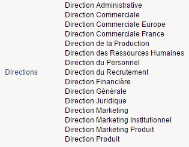
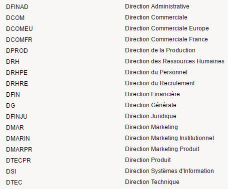
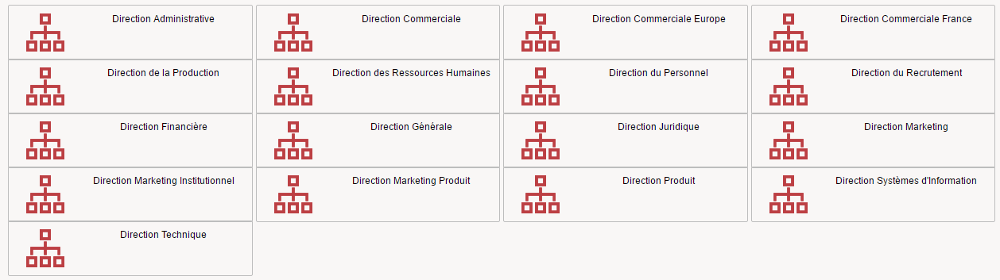

# Iterable Widgets

Some widgets support iterations.  
This is a powerful feature which help you to present data from a dataset in a structured way.

## General principles

As a general principle, the 'iterate-on' property is used to reference a dataset in the widget.  
The dataset attributes are referenced through the 'Current ATTRIBUTE\_NAME' keyword.  

## Text

You can iterate through dataset values in a text widget, it will present all the values.  

Here is a simple example:  

  

```page
directions = Dataset {
  view:directions
}

Text {
  iterate-on:directions
  value:Current displayname
  label:'Directions'
  compact:True
}
```

Note that the dataset is indicated through the 'iterate-on' property.  
If you want to leverage a dataset value in an interation you need to leverage the 'Current' keyword prior to the dataset attribute name, such as:`value: Current displayname`  

## Link

You can iterate through dataset values in a link widget, it will present all the values. If you click on an item the corresponding 'target' property value will be leveraged.  

  

```page
directions = Dataset {
  view:directions
}

Link {
  iterate-on:directions
  value:Current displayname
  label:'Directions'
  compact:True
  target:Activity Organisation Detail with Current uid to paramOrganisationUid
}
```

Note that the dataset is indicated through the 'iterate-on' property.  

If you want to leverage a dataset value in an interation you need to leverage the 'Current' keyword prior to the dataset attribute name, such as: `value: Current displayname`

## GridRowGroup

You can leverage iterations in Grid containers as well. This is a very powerfull feature as it helps you to provide rich layouts with dynamic content.  

Here is an example:  

  

```page
directions = Dataset {
  view:directions
}

Grid {
  columns:GridColumn,GridColumn
  GridRowGroup {
    iterate-on:directions
    GridRow {
      GridCell {
        Text {
          value:Current code
          compact:True
        }
      }
      GridCell {
        Link {
          value:Current displayname
          target:Activity Organisation Detail with Current uid to paramOrganisationUid
        }
      }
    }
  }
}
```

Once again, the dataset is indicated through the 'iterate-on' property.  

If you want to leverage a dataset value in an interation you need to leverage the 'Current' keyword prior to the dataset attribute name, such as: `value: Current displayname`

## TileGroup

You can leverage iterations in Grid containers as well. This is a very powerfull feature as it helps you to provide rich layouts with dynamic content.  

Here is an example:  

  

```page
Tiles {
  tile-height:64
  columns:4
  TileGroup {
    iterate-on:directions
    Tile {
      Group {
        border:True
        Flow {
          disposition:Horizontal
          Group  {
            Image {image:'48/audit/organisation_48.png'}
          }
          Group  {
            Link {
              value:Current displayname
              target:Activity Organisation Detail with Current uid to paramOrganisationUid
            }
          }
        }
      }
    }
  }
}
```

Once again, the dataset is indicated through the 'iterate-on' property.  

If you want to leverage a dataset value in an interaction you need to leverage the 'Current' keyword prior to the dataset attribute name, such as: `value: Current displayname`
