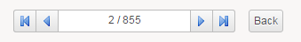

# Special Widgets

## SetNavigator

With the dataset:  

```page
identityList = Dataset {
    search: Search {
 definition: identitySearch
        view: br_identity_searchpoint with nonEmptyUid to uid unless-empty
    }
}
```

We can create a set navigator, that will allow us to navigate the resulting list :  

```page
SetNavigator {
  data: identityList
  column: uid
  selection: selectedIdentityUid
  back-link: Activity Identity Search with SerializeSearch identitySearch to identitySearch,
    paramSearchMode to paramSearchMode,
    selectedIdentityUid to initialUid,
    initialIndex to paramInitialIndex
  initial: paramIdentityUid
  initial-index: paramInitialIndex
  selection-index: initialIndex
  show-count: True
  show-first: True
  show-last: True
  count-width: 150
  hidden: Not BooleanPredicate( paramSearchMode )
}
```

  

Starting with the 2016 version of the product, new attributes have been added in the SetNavigator widget:  

- `selection-changed-event`: (list of actions): actions to execute after the navigator's current position changed
- `selection-index`: (reference to a variable): references an integral mono-valued variable which will contain the navigator's current index  
- `initial-index`: (reference to a parameter): references an integral mono-valued parameter which will contain the navigator's starting index
- `label-image`: (image selection expression): an image built from an image selection expression which is displayed before the label
- `label-styling`: (style selection expression): a style built from a style selection expression which is applied to the label
- `dropdown`: the definition of a drop down box (see below)  

Note that `initial-index`: is ignored if the initial: parameter is not provided. The purpose of `initial-index`: is to speed up the initial selection of the navigator as, if only `initial`: is provided the widget has to find the corresponding index in the dataset, possibly iterating through a substantial part of it. However then `initial-index`: is provided, the navigator starts by querying the dataset at this index and then checks if the `initial`: value matches. If this is not the case (for example because the sorting order has changed), the dataset is iterated as if no `initial-index`: was provided.  

The drop down box is used to display a tabular view of the dataset bound to the SetNavigator, for example:  

```page
SetNavigator {
  data: all_timeslots
  column: uid
  initial: initial_timeslot
  selection: selected_timeslot
  label: Concat(Current displayname, ' (', Current commitdate, ')')
  label-width: 400
  label-image: StringImageSelection(Current status) {
    when "C" then "ts_active.png"
    when "A" then "ts_archive.png"
  }
  label-styling: StringStyling(Current status) {
    when "C" then ts_active
    when "A" then ts_archive
  }
  show-first: False
  show-last: True
  show-count: False
  dropdown: Dropdown {
    text: Concat(Current commitdate, ' - ', Current displayname)
    image: StringImageSelection(Current status) {
      when "C" then "ts_active.png"
      when "A" then "ts_archive.png"
    }
    styling: StringStyling(Current status) {
      when "C" then ts_active
      when "A" then ts_archive
    }
    height: 300
  }
}
```
