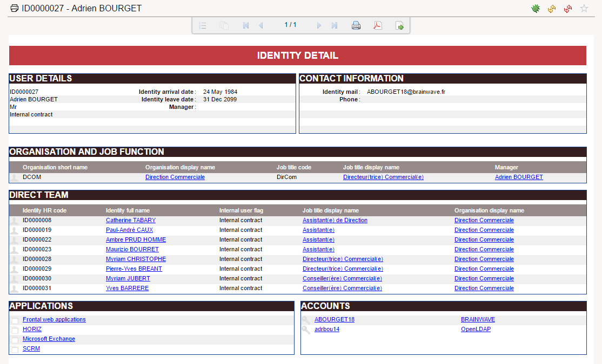
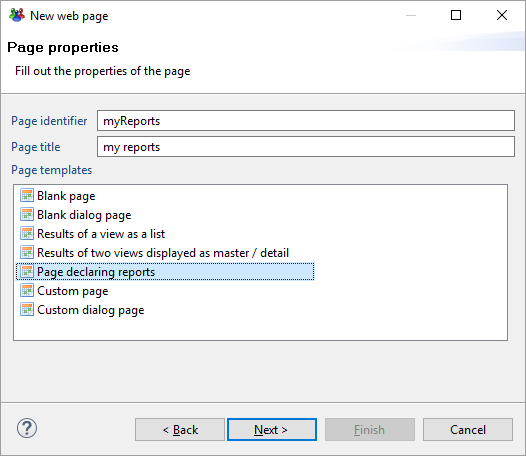
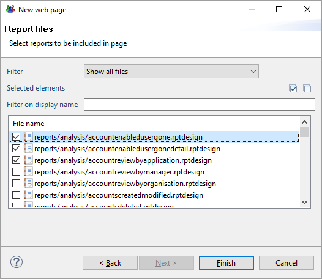
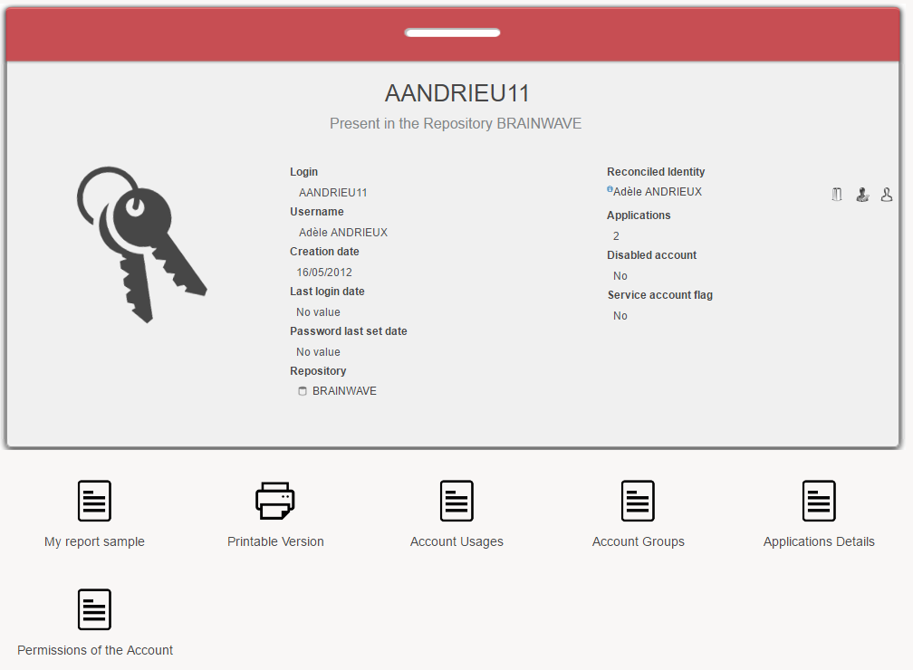
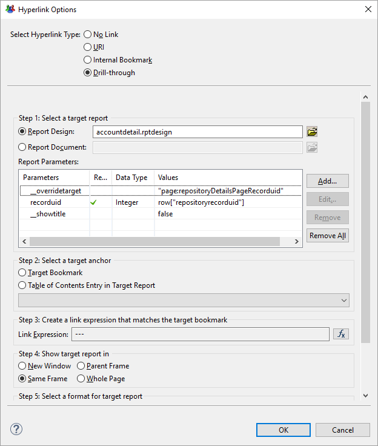
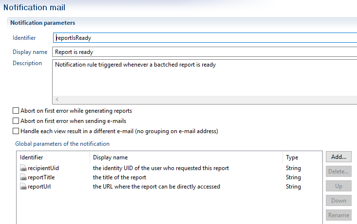
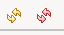
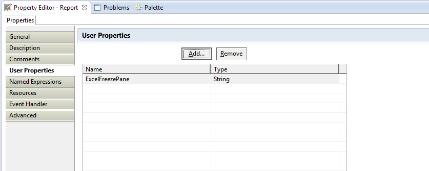
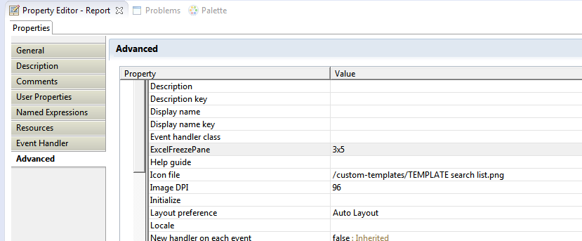
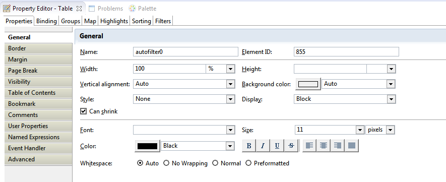

# Reports

## Reports in pages

Pages offer the option to open BIRT reports by pointing to the ".rptdesign" file located in ProjectPath/reports/  

  

Through the report viewer, you will be able to:  

- Navigate through the report content (table of content, pagination)
- Print the report
- Export the report in various formats (pdf, microsoft office, openoffice)

In order to be able to link to a report from pages we can declare the report with the report object Report.  

Reports are not part of the page. They are declared outside like Dialogs, NLS and Styles. They are considered as resources and can be imported from another file.

### Report definition

Here is a simple example  

```page
identityDetailReport = Report{
    report: "/reports/browsing/identitydetail.rptdesign" with recorduid to recorduid
    title: "Report Example"

    recorduid = Parameter{
        type: Integer
        recorduid-of: Identity
        mandatory: True
        hidden: True
    }
}
```

Mandatory attributes are marked in bold:

- **title** the title of the report, similar to a page  
- **report** the path to the .rptdesign and here we pass the parameters of the report  
`report: "pathtoreport" with localparam to reportparam`  
the localparam must be declare in the Report block  
Check for the [parameters chapter](./03-parameters.md) for more information about parameters  
- **tags** here we can define tags an priorities if any, this can be used to create a [dataset of pages/reports](./05-advanced-data-binding.md)  
`tags:"identity" priority 100, "byuid", "printable"`  
The report will be able to be found by using the tags identity,  
byuid and printable  

**dynamic-title** here we can change the name of the report using variables ,  
parameters of record columns  
`dynamic-title:Concat(Transform identity.hrcode using mayBeNullMapping," - ",Transform identity.fullname using mayBeNullMapping)`  
Title of the report will be changed dynamically to show the hrcode and identity fullname  

**icon** can be used to point to a small (16 px ) version of the icon to be used for the report  

`icon: "16/details/printable_16.png"`  

**large-icon** same as icon but an option to give a larger icon

```page
large-icon: "48/details/printable_48.png"
```  

**description** a description for the report  
Supports the [common attributes](./07-widgets#common-attributes): **feature** and **background**
Supports the events: **enter-event** and **exit-event**. [Learn more about events](./20-events-and-actions.md)  

Then, the report can be called using the [GoTo Action](./20-events-and-actions.md).  

For example:

```page
Button {
    text: "Open Report"
    actions: GoTo Report identityDetailReport with selectedIdentityRecorduid to recorduid
}
```

### Declaring reports automatically

All the default reports are already declared in a page, thus you only have to import this page if you want to present a link to a report:  

`import "/webportal/pages/reports/standard.page"`  

For your own reports, most of the time you don't have to deal with the report declaration syntax as you can declare reports automatically through the Pages creation wizard.  

Here is how to do it:  

Create a new page and select 'Page declaring reports'  

  

Select the reports you want to publish in the web portal  

  

It will automatically create a file containing the reports declaration, such as:  

```page
report = NLS {
    analysis_accountenabledusergone.title [en "Active accounts, identities gone" fr "Comptes actifs, identités parties"]
    analysis_accountenabledusergonedetail.title [en "Active accounts, identities leaved the company" fr "Comptes actifs appartenant à des personnes ayant quitté l'organisation"]
    analysis_accountreviewbyapplication.title [en "Account review" fr "Revue de comptes"]
}

analysis_accountenabledusergone = Report {
    report: "/reports/analysis/accountenabledusergone.rptdesign"
    title: $report.analysis_accountenabledusergone.title
}

analysis_accountenabledusergonedetail = Report {
    report: "/reports/analysis/accountenabledusergonedetail.rptdesign" with ^Quarter to ^Quarter, ^Repository to ^Repository
    title: $report.analysis_accountenabledusergonedetail.title
    ^Quarter = Parameter {
        mandatory: False
        hidden: True
        type: String
    }
    ^Repository = Parameter {
        mandatory: False
        hidden: True
        type: String
    }
}

analysis_accountreviewbyapplication = Report {
    report: "/reports/analysis/accountreviewbyapplication.rptdesign" with ^recorduid to ^recorduid, ^permission to ^permission
    title: $report.analysis_accountreviewbyapplication.title
    ^recorduid = Parameter {
        mandatory: True
        hidden: True
        type: Integer
        default: "11"
    }
    ^permission = Parameter {
        mandatory: False
       hidden: False
        type: String
        multivalued: True
        constraint: Lookup {
            data: br_permission
            value: Current applicationrecorduid
            text: Current displayname
            distinct: True
        }
    }
    br_permission = Dataset {
        view: br_permission
    }
}


```

You will then just have to import this file in your pages to link to your reports:  

`import "/webportal/pages/myreports/set1.page"`

```page
mypage = Page {
    title:'test'
    homepage-for: All priority 100

    Button {
        text:'click me'
        actions: GoTo Report analysis_accountenabledusergone
    }

}
```

### Attaching a report to a web portal element

You can dynamically insert your reports into the web portal such as:  

- new items in the menus
- new analytics reports in the search views
- new analytics reports in the detailed views

In order to do so, you just have to leverage the 'tags' property. Any report with the right tags will be automatically added in the corresponding menu.  
Don't forget to specify as well some icons and descriptions as they will be used as well.  

Here is a simple example to add a report named 'My report sample' to the account details page:  

  

```page
myReports = Report {
    title:'My report sample'
    report:"/reports/analysis/accountenabledusergone.rptdesign" with uid to uid
    tags:'account','byuid','browsing'
    icon:'16/details/browsing_16.png'
    large-icon:'48/details/browsing_48.png'
    description:'This is a simple example'

    uid = Parameter {
        label:"Concept Uid"
        type:String
        hidden:True
        mandatory:True
    }
}
```

As you can see, the menu added this new entry dynamically thanks to the 'account' and 'byuid' tags.  
Because of the 'byuid' tag, this report must have a 'uid' parameter positioned.  

### Linking back to a page from a report

Within a report you build links to others reports.  
This is a very convenient feature as, while in a report, the user can continue its drill-down investigations.  

Sometime, it is preferable to link the user back to a page or a standard activity, such as identity detail for instance.  
In order to do so you have to leverage a special syntax within the report engine link editor.  

Here is an example:  

  

While configuring the hyperlink you will have to select "drill-through" and a report.  
Although you have to select a report it won't be used as we will override the information (thus you can select the report itself for instance).  

In the report parameters you have to add a parameter named `__overridetarget`.  

This parameter contains as a string the link type and the target (see [actions and events](./20-events-and-actions.md).  

Here for instance we specified that the link goes to the page named "repositoryDetailsPageRecorduid".  
You then have to add the other parameters, as required.  

Note that the `__overridetarget` parameter value is a string, as such it need to be surrounded by "".

## Batched Reports

Some reports can take a very long time to generate due to the significant amount of data they have to process.  
Two mechanisms are implemented in the portal to mitigate this:  

- Caching: once the report has been generated, an intermediate document is kept on the file system drastically speeding up subsequent accesses to this report.
- Batching: when a report generation is expected to be definitely too long for an interactive web session or if it consumes so much resources that it impacts the other portal users, it can be scheduled to be processed at a later time. It will be built by a background task and a notification can be sent to the issuer when the generation is completed.

We will explain the batching capabilities in this chapter.  

When the generation of a report is expected to be too time and resource consuming to be viewed interactively, the `batched-only: True` attribute can be specified in this report declaration. When a user requests such a report, if the cache intermediate document is found on the file system, the report is rendered immediately, otherwise the user is presented a message stating that the report generation has been scheduled and that it will be available at a latter time. A background process is responsible for managing the queue of scheduled reports, rendering one report at a time, in the order they were scheduled. The queue of scheduled reports can be accessed in a page dataset and displayed accordingly. Once the generation completes, the portal can be configured to execute a notify rule, thus sending an e-mail to the report issuer.  

Note that batched reports can also be anonymous (in the sense given in the previous section), in which case once a user as requested this report, it is available to any other user once it has been completed.  

Attributes:  

**batched-only** (boolean): is the report a batched report  

**batch-start-event** (list of actions): actions to execute when accessing to a batched report that has not yet been scheduled  

**batch-pending-event** (list of actions): actions to execute when accessing to a batched report that has been scheduled but not yet completed  

Here is an example of a batched report declaration:  

```page
test_batched_report_1 = Report {
    report: "/reports/browsing/identitysearch_simple.rptdesign" with hrcodeParam to hrcode, surnameParam to surname, "*" to givenname, "hrcode" to sort
    title: "[Report] Batched report 1"
    tags: "TEST", "GENERAL"
    batched-only: True
    batch-start-event: Message Information "This report is batched. It will be available shortly"
    batch-pending-event: Message Information "This report is already batched. Come back later"

    hrcodeParam = Parameter{
        type: String
        default: "*"
    }

    surnameParam = Parameter{
        type: String
        default: "*"
    }
}
```

When a user will access to this report, instead of being displayed, the 'batch-start-event' or the 'batch-pending-event' will be triggered if the report has not been generated yet.  
The report is generated on a user per user basis, meaning that each user will have to generate the report on the first clic.

In order to present the batched reports available to your user, you have to leverage a dedicated dataset. Here is an example:  

```page
batched1 = Dataset {
    batched-reports: BatchedReports
}

Table {
    data: batched1
    double-click:
        StringCase ( Current status ) {
                when "C" then [
                        GoTo Position Current position
                    ]
                }
    layout:
        Layout {
            grab: horizontal True vertical True
        }
    label:
        Label {
            value: $MyBatchedReports.list
            break: True
        }
    Column {
        column: status
        header: $MyBatchedReports.Status
        width: 100%
    }
    Column {
        column: title
        header: $MyBatchedReports.Title
        width: 100%
    }
    Column {
        column: submissionDate
        header: $MyBatchedReports.Submitted
        width: 200px
    }
    Column {
        column: completionDate
        header: $MyBatchedReports.Completed
        width: 200px
    }
}
```

You can also explicitly specify that a batched report is not related to a specific user context. In that case, once the report is generated it is available for all the users.  
This is called the 'anonymous' mode.  

Here is an example:  

```page
test_batched_report_2 = Report {
    report: "/reports/browsing/identitysearch_simple.rptdesign" with hrcodeParam to hrcode, surnameParam to surname, "*" to givenname, "hrcode" to sort
    title: $BatchReportExample.Title
    tags: "TEST", "GENERAL"
    anonymous: True
    batched-only: True
    batch-start-event:
        Message Information $BatchReportExample.ReportIsBatched
    batch-pending-event:
        Message Information $BatchReportExample.ComeBackLater

    hrcodeParam = Parameter {
        type: String
        default: "*"
    }

    surnameParam = Parameter {
        type: String
        default: "*"
    }
}
```

You can present all the reports, including the anonymous reports to your user with the following configuration:  

```page
Table {
    data: batched2
    double-click:
        StringCase ( Current status ) {
                when "C" then [
                    GoTo Position Current position
                ]
            }
    layout:
        Layout {
            grab: horizontal True vertical True
        }
    label:
        Label {
            value: $BatchReportsDemo.AnonymousAndBatched
            break: True
        }
    Column {
        column: status
        header: $BatchReportsDemo.Status
        width: 100%
    }
    Column {
        column: title
        header: $BatchReportsDemo.Title
        width: 100%
    }
    Column {
        column: submissionDate
        header: $BatchReportsDemo.Submitted
        width: 200px
    }
    Column {
        column: completionDate
        header: $BatchReportsDemo.Completed
        width: 200px
    }
}
```

You can filter batched reports with additional commands within the dataset, for instance:  

```page
batched3 = Dataset {
    batched-reports:
        BatchedReports {
            status: Submitted, Running, Completed
            submission-date: after Date.offset(-5 days)
        }
}
```

The possible attributes of the BatchedReports block are:  

- with-anonymous: (a boolean predicate): also contains anonymous reports along with reported scheduled by the current user,
- status: (a list of execution status): batching statues are Completed, Submitted, Running and Error. A status can be preceded by the Not keyword in order to invert the selection,  
- submission-date: (a date interval): only contains reports submitted after or before a date or between two dates,
- completion-date: (a date interval): only contains reports completed after or before a date or between two dates.  

A notify rule can be specified in the technical configuration under the key reports.batched.completed.notification. It will be executed each time a report generation completes.  

The notify rule must accept the three following parameters:  

- recipientUid the identity UID of the user who requested this report,  
- reportTitle the title of the report,  
- reportUrl the URL where the report can be directly accessed.

  

## Report caching capabilities

Some reports can take a very long time to generate due to the significant amount of data they have to process.  
Two mechanisms are implemented in the portal to mitigate this:  

- Caching: once the report has been generated, an intermediate document is kept on the file system drastically speeding up subsequent accesses to this report.
- Batching: when a report generation is expected to be definitely too long for an interactive web session or if it consumes so much resources that it impacts the other portal users, it can be scheduled to be processed at a later time. It will be built by a background task and a notification can be sent to the issuer when the generation is completed.  

We will explain the caching capabilities in this chapter.  

In BIRT, the rendering of a report is a two phases process:  

- the data used in the report are retrieved and are stored in an intermediate document (an .rptdocument file) along with basic layout preprocessing,
- this document is transformed according to the desired output format (HTML, PDF, etc...).  

By default, the portal keeps a persisted copy of these intermediate documents on the file system so that if the user asks again the same report only the second phase needs to be executed (see below for details on where and when).  

In the cache directory, each user have its own sub-directory (of the form `u_<userhash>` where userhash depends on the portal user login). This directory contains files of the form `<reportname>_<reporthash>.rptdocument` where reportname is the name of the report as defined in the .page file and reporthash is constructed using the following informations:  

- the identifier of the timeslot,
- the date of last modification of the corresponding .rptdesign file,
- the identifier and the roles of the user at the time of the generation,
- the parameters passed to the report.

When a report is displayed in the portal interface, the page header contains two icons used to reload the report:  

  

The left one reload the report using the cache, the right one removes the cached document before reloading the page (thus re-executing both rendering phases).  

Some aspects of report caching can be controlled by the following parameters of the technical configuration:  

- `reports.no-cache(true/false, false` by default: can be used to completely deactivate the caching functionality for all reports.
- `reports.compress-cache (true/false, false` by default: is the kept intermediate document compressed or not.  

> [!warning]  if you change the value of this parameter the cache directory must be emptied before restarting the portal, otherwise all the currently cached reports will be considered as corrupted. enabling this feature has a strong impact on the cache size and almost no impact in performances.

- `reports.log-directory`: The BIRT engine log directory, used for advanced debugging purposes only. If unspecified it will be `<tomcat_home>/webapps/<application>/WEB-INF/workspace/.metadata/birt_logs`.
- `reports.cache-directory`: the filesystem directory where intermediate documents are kept: cached reports and batched reports. It must be the path of an existing writable directory on the file system. If unspecified, it will be `<tomcat_home\>/webapps/<application>/WEB-INF/workspace/.metadata/.plugins/com.brainwave.portal.ui.handler.pages/birt_reports`.  

Caching can be disabled for a given report by using the disable-cache: True report attribute. This can be useful if the report data are expected to change in-between timeslots (for example if it processes workflow informations, such as ticket logs or ticket actions).  

Here is an example:  

```page
test_batched_report_2 = Report {
    report: "/reports/browsing/identitysearch_simple.rptdesign"
    title: $MyCustomNLS.MyReport2
    disable-cache: True
}
```

When a report is designed to have the strictly same content whoever the user viewing it is, it can be declared as an anonymous report using the anonymous: True report attribute. In this case, the cached intermediate document will be used for any user viewing the report and no principal or role information are passed to it. Note that this effectively disable restriction perimeters in views and rules as well as any eventual condition in the report depending on the user or its roles (technically the session in which the report is generated contains no value for the `USER_UID`, `USER_ROLES` and `USER_FEATURES` keys).  

Here is an example:  

```page
test_batched_report_2 = Report {
    report: "/reports/browsing/identitysearch_simple.rptdesign"
    title: $MyCustomNLS.MyReport2
    disable-cache: True
    anonymous: True
}
```

Note: You can, and should, purge the cache directory on a regular basis without having to restart the web application server. Note that if a user is currently using a cached report while deleting the files, a temporary error will displayed on its web browser.  

## Exporting a report next to a user action

You can directly export a report in a given format next to a user action.  

here is a simple example:  

```page
Button {
    text: $MyCustomNLS.ExportToPDF
    actions:
        ExportReport "/reports/browsing/identitysearch_simple.rptdesign"
            with
                "*" to ^hrcode,
                "*" to ^surname,
                "*" to ^givenname,
                "hrcode" to ^sort
            format
                "pdf"
            export-name
                "myreportname"

```

Consider reading [actions and events](./20-events-and-actions.md) for more information about this.

## Excel emitter for reports

### Updates

The following table indicates the updates applied to the excel emitter and from which versions these updates apply.

| Update                                                   | Version |
| :------------------------------------------------------- | :------ |
| Ability to freeze panes                                  |         |
| Ability to manage multiple tabs                          |         |
| Ability to rename tabs                                   |         |
| Ability to activate automatic filter on tables           |         |
| Ability to initiate the report from an XLS template file |         |
| Ability to write protect tabs with a password            |         |
| Ability to set the option "fit to page"                  | 2016 R3 |
| Extensive support of XLSX export                         | 2016 R3 |
| Native Excel properties                                  | 2016 R3 |
| Excel Headers and Footers                                | 2016 R3 |
| Ability to hide sheets                                   | 2017 R3 |
| Data validation in cells using a list of values          | 2017 R3 |

### Updating the emitter

> Starting with version iGRC 2015, the new emitter is provided out of the box. Only older versions may require a manual update.

Whether in analytics or in the portal, the jar must be updated in `\plugins`
The jar is: `org.eclipse.birt.report.Engine.emitter.nativexls`

- Save this jar (do not just rename it, delete it completely from the directory)
- Replace with the new jar
- Analytics: update `c:\igrcanalytics\configuration\org.eclipse.equinox.simpleconfigurator\bundles.info` (edit the line referencing the nativexls bundle, you must update it with the name and version number of the new jar)
- Restart analytics / portal in CLEANUP mode (_e.g.:_ igrcanalytics.exe -clean)

### Excel report properties

The following report properties are transferred as Excel properties:

- Author
- Title
- Subject
- Comments

### Configuration options

#### Multiple tabs

The Excel emitter supports page breaks and will generate a new tab every time a page break is detected.

#### Header and footer

The header and footer defined in the report Master Page are recorded as native Excel header and footer.
Excel only supports a header/footer composed of a single GRID with 1 row and 3 columns (left, center, right) with no image.

By default, if no footer is defined on the right side, the page number is automatically inserted.

#### Renaming tabs

- Select a report item (label, text or other... )
- Give it a name containing `sheetname` (the name must be unique, you can use sheetname1, sheetname2 ... if you have multiple tabs)
- The tab will be renamed as the report item value.

For instance, if your report contains a label which value is `APPLICATION`, naming this report item `sheetname1` will ensure the tab will be named `APPLICATION`.

#### Freeze Panes

##### At workbook level

This is then defined for all the pages.

- Declare a user property at the root of the report named: `ExcelFreezePane`


- Assign a string value to it ( `Advanced` tab of the properties); _e.g.:_ `3x5` where 3 and 5 are the columns and rows (starting with zero) position where frozen panes.


##### At tab level

- the same user property can be defined on the report item carrying the information about the page (eg: its name contains the string `sheetname`, see **Renaming Tabs**)
- Give it value as a string type (3x5) where 3 and 5 are the columns and rows respectively (starting with zero) position where frozen panes.

#### Template

- Declare a user String property at the root of the report called `ExcelTemplateFile`
- Give it a value ( `Advanced` tab of the properties) indicating the path[^1] to the template XLS or XLSX file
- The report will be generated as copy of the template file in which the report data are inserted in a new tab.

#### Protect tabs

##### Protect tabs at workbook level

If this configuration is applied then all sheets are read-only.

- Declare the user property (string) `ExcelPassword` at the root of the report
- Its value is the password protecting all pages

##### Protect tabs at sheet level

- The user property String `ExcelPassword` can be defined on the report item carrying the information about the page (eg: its name contains the string `sheetname`, see **Renaming Tabs**)
- Its value is the password protecting the tab.

#### Manage cell protection

By default, all cells are protected, e.g. they cannot be edited when the sheet is protected.
You can selectively disable cell protection by specifying the following user property on a Cell (Table or Grid) cell: "ExcelUnprotectCell".
This property must be set to "true" or "1" to disable cell protection.

#### Fit To Page

The `ExcelPrintFitToPage` option sets the print area in number of pages in width x height pages.

- Declare the user property `ExcelPrintFitToPage` at the root of the report
- Give it a value of format `111x111`, _e.g._:
  - To print the entire report on one page, provide the value `1x1` parameter
  - To print the report in a page width (_e.g.:_ list report), provide the value `1x999` parameter

#### Automatic filter

In order to define an automatic filter on a table, give the table item a unique name containing the string `autofilter`:


> When exporting to XLS format AND protecting the sheet (using a password), the autofilter is disabled. This is Excel's standard behavior. You can bypass this by exporting in XLSX format.

> This property does not work if a grid is present in the Table

#### Hide Sheet

The `ExcelHideSheet` option allows to hide sheets in a workbook.

- The option must be set on the report item carrying the information about the page (_e.g.:_ its name contains the string `sheetname`, see **Renaming Tabs**)
- Its value must be `1` or `true`

#### Data Validation in cells

You can set a Data Validation constraint in a cell using a static list of values. This may be used, for instance, for forcing the selection of an authorized value when editing a review report.

The behavior of this Data Validation is:

- validation is confirmed against the static list of values
- the list of authorized values is displayed in a drop-down list when clicking on the report cell
- entering an invalid value displays an error message, which blocks the entry.

Two options are available:

- The `ExcelAuthorizedValues` option must be setup on a Cell (Grid, Table...). Its content must be a pipe-separated list of values. Example : `First Value|Second Value|Third Value`
- The `ExcelAuthorizedValuesErrorMessage` option can be setup at the report level. If set, it overrides the default error message when the user enters a value that is not valid. The default message is: `Error, invalid value!`

### Dynamic Property Values

User properties can be set at runtime using scripting.
For instance, for setting the report-wide `ExcelFitToPage` parameter:

```js
reportContext.getReportRunnable().setProperty("ExcelFitToPage","2x3");
```

Conversely, you can access the value of the properties in your report, for instance using a Dynamic Text field:

```js
<VALUE-OF>reportContext.getReportRunnable().getProperty("ExcelFitToPage")</VALUE-OF>
```

### Max Rows per Sheet

By default, the Birt report engine will limit the number of rows in any list or table to 10,000 before issuing a mandatory page break. This also applies to the Excel output, in which case the table content is split among several sheets (each sheet with 10,000 rows).

The following script can be added to any report to circumvent this limitation. The script must be added to the "beforeFactory" section of the report (in addition to the already existing function call `"beforeFactory();"`):

```js
reportContext.getAppContext().put("MAX_PAGE_BREAK_INTERVAL", 500000);
```

### Known limitations

#### FreezePane, Password

Do not define both overall (report) and tab level passwords!

#### Autofilter

Use only **one** auto filter at a time on the same rows (there may be several `autoFilters` in consecutive tables in the vertical direction)

#### FitToPage

The option is set at report level, so it is applied to all tabs in the same way.

### Missing Excel tabs

This is only the case when using a version prior to version 2014R3. When generating the report from the portal, the page breaks are ignored and all data are in a single tab.

[^1]: **WARNING:** an absolute path or a path relative to the directory "reports" of the project may be used to designate the template file.
