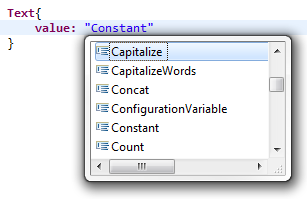

# Transformation Functions

Sometimes it can be useful to modify the values of variable, parameters or record columns before they are displayed.  
As a general rule, every time that a value is required, we can directly use some functions to modify the value of a variable that needs to be displayed.  

## Built-In Functions

Using Ctrl+Space can be useful to discover all the built-in functions and the parameters that are available:  

  

Lets make list of the most useful functions in the main categories:  

### General  

`Transform variable using mappingFunction`: Transforms the value of the variable by sending it to the mappingFunction.  

Learn more about [mapping functions](./17-mapping-functions.md).  

### Dataset Functions  

`Count datasetIdentifier`: Obtains the number of elements of a dataset.  

### Multivalued Variables  

`ElementAt 0 of multivaluedVariable`: Gets the number 0 element of a multivalued variable.

`Join multivaluedVariable using ","`: Converts a multivalued variable into a single value by joining all the items using the given concatenation character.

`Split "val1,val2,val3" using ","`: Converts a mono valued variable into a multi valued variable by splitting the values around a given separator character.  

`SizeOf multivaluedVariable`: Obtains the number of elements of a multi-valued variable.

### String Functions

`Capitalize "hello world"`: Makes sure that the first letter is upper case. Result: Hello world  

`CapitalizeWords "hello world"`: Makes sure that the first letter of every word is in upper case. Result: Hello World  

`Concat( "hello", " ", "world")`: Concatenates all the strings or given variables. Result: hello world  

`LowerCase "HELLO WORLD"`: Converts the string to lowercase. Result: hello world

`UpperCase "hello world"`: Converts the string to uppercase. Result: HELLO WORLD

`TrimSpaces "  hello world  "`: Removes whitespace characters at the beginning and end of a string (as of version Ader R1 SP4). Result: "hello world"

`SubString(1,5) "hello world"`: Grab a substring, starting at the first character, and 5 characters in size. Result: hello

```page
var = Variable {initial:"world"}
Format("Hello {0}", var)
```
  
Formats a string by replacing patterns with their corresponding values. Here for instance 'Hello world'  

This function is mapped to the [Java MessageFormat Class](https://docs.oracle.com/javase/7/docs/api/java/text/MessageFormat.html)  
and is similar to the Pages NLS features.  

> [!warning] As of version 2017 R3, it is possible to [use javascript expression directly in the pages](./22-advanced-concepts#javascript-expressions).  

For this reason, the following string `Format("{0,number,#.### }"` will be treated as a javascript expression and will throw an error in the page.

To bypass this problem you would have to add `\` to escape javascript interpretation: `Format("\\{0,number,#.### }"`

---

`EscapeHTML "<b>hello world</b>"`: Escape HTML characters, in this example the result is `&lt;b&gt;hello world&lt;/b&gt`;  

### Integer Functions  

`Product ( 10 , 5 )`: Calculates the product. Result: 50

`Ratio ( 50, 3 )`: Divides the given values. Result: 16.666666666666668  

To format the result, use the Format function,  
such as `Format("{0,number,#.### }",Ratio(50,3))` to get 16,67

`Sum ( 10, 5 )`: Adds the given values. Result: 15

`Difference ( 10, 5 )`: Sub the given values. Result: 5

`Percent( 7,33 )`: Compute a value in percentage, given a value and the total number of available values. Here for instance, it returns '21 %'  

### Date Functions  

`Date.value`: Returns the current date and time at a default printable format. Here: '31/03/2016 19:24:56'

`Date.valueLDAP`: Returns the current date and time as an LDAP date string. Here: '20160331193126'

`Date( dateVariable ).value`: Obtains the value of the given date as a string in the default printable format.

`Date( dateVariable ).value("dd/MM/yyyy")`: Obtains the value of the given date as a string in the required format.

`Date("31/12/2016").valueLDAP`: Obtains the value of the given date in the LDAP format. Here: '20161231000000'

`Date("01/03/2016", "dd/MM/yyyy").value("yyyy/MM/dd")`: Parse a date provided as a string by using a given pattern a convert it into a string using the given format. Here: '2016/03/01'

`DateLDAP("20160101000000").value`: Transform a date value provided in LDAP format in a default printable format, in this example '01/01/2016 00:00:00'

`Date("31/12/2016").nextWeekday(monday).value`: Find the next monday, given a specific date.

`Date("31/12/2016").offset(5 days).value`: Add 5 days to a given date.

`Date("31/12/2016").offset(-5 months,-1 weeks).value`: Remove 5 months and 1 week to a given date.

`Date("31/12/2016").set(2017 to year).value`: Force the year to a given value.

> The printable date format is defined into the 'Web Portal' item of the technical configuration.  

### Configuration Functions  

`ConfigurationVariable "logPath"`: Obtains the value of a configuration variable.

`CustomLabel( Group , 1 )`: Obtains the label assigned in the project to the custom attribute number 1 of Group

`Principal.uid` Obtains the uid of the user that is using the portal  
