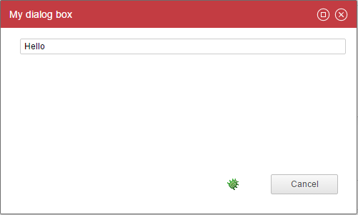
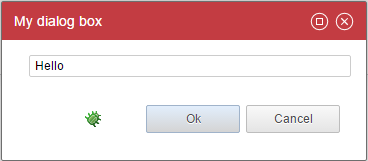
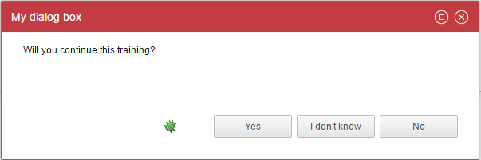
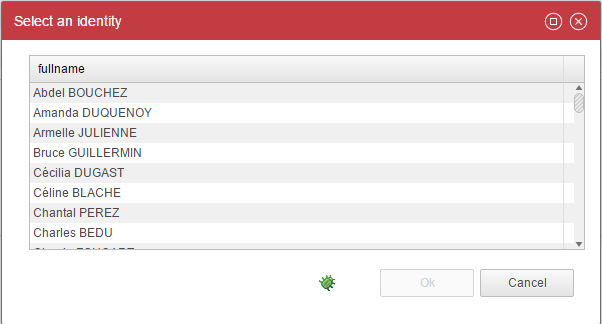
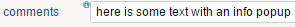
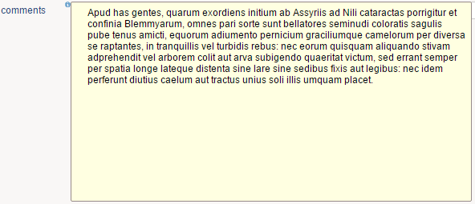
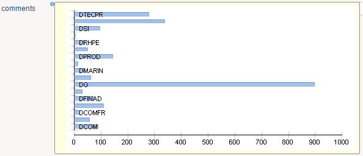
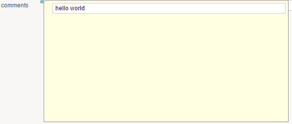

# Dialog Boxes

Pages also support the creation of Dialog Boxes.  

Dialog Boxes are not part of a page. They behave like a resource and are declared outside the page just like NLS , Mappings and Styles.  
It is also possible tho declare Dialog Boxes in a separate file and them import the file from other pages.  

Dialog Boxes are just like a container, and they accept many widgets.  

Dialog boxes are modal. It means that when a dialog box is displayed, the user cannot interact with the underlying page until the dialog box is closed.  
Dialog boxes can display dialog boxes.

Some dialog boxes are provided by default to display messages or ask for a simple confirmation. Check the [actions and events chapter](./20-events-and-actions.md) for more about this.

## Dialogs

Let's start by a simple example:  

  

```page
myDialogBox = Dialog {
    title:'My dialog box'

    Text {
        value:"Hello"
    }
}

myPage = Page {
    title:'test'
    homepage-for: Any priority 100

    Button {
        text:'Show infos'
        actions:Dialog myDialogBox
    }
}
```

As you can see, a Dialog is very similar to a page, there is only one mandatory property: the title.  

A dialog contains a title bar, it can be moved over the screen, it can be maximized, and can be closed from the upper right corner (cancel action). You can also attach action buttons to a dialog box. By default only a Cancel button is displayed.  
You can set the width and the height of the dialog box thanks to properties.  

In order to deal with action buttons you have to leverage the buttons property.  

Here is a simple example:  

  

```page
myDialogBox = Dialog {
  title:'My dialog box'
  width:320
  height:120
  buttons:[OkButton CancelButton]

  Text {
    value:"Hello"
  }
}
```

As you can see, you declare the buttons as an array (with the `[...]`).  
When a user click on an action button, it closes the dialog box. The caller will continue its actions only if the dialog box has been closed with an 'ok' event. More on this on [actions and events](./20-events-and-actions.md).  

You can declare :  

**OkButton**: Closes the dialog box with an ok event  
**CancelButton**: Closes the dialog box with a cancel event  
**ActionButton**: Execute a series of action, do not close the dialog box by default  

You can attach actions to those buttons if you want to deal with variables for instance. In order to do so you have to use the actions property on the action buttons. More on this on [actions and events](./20-events-and-actions.md).  

Here is an example:  

```page
myDialogBox = Dialog {
  title:'My dialog box'
  width:320
  height:120
  buttons:[
   OkButton {
     actions:Flash 'closing the dialog box'
   }
   CancelButton
  ]

  Text {
    value:"Hello"
  }
}
```

The ActionButton is a bit special: the actions property is required and the dialog box is not closed by default when this button is clicked.  

ActionButton can be considered as custom buttons and are useful when you want to customize the text or provide several ok or cancel exits.  

Here is an example:  

  

```page
myDialogBox = Dialog {
  title:'My dialog box'
  width:600
  height:200
  buttons:[
    ActionButton {
      text:"Yes"
      close:True
      status:Ok
      actions:Unset dummy // does nothing but actions is mandatory
    }
    ActionButton {
      text:"I don't know"
      actions:Message "Come on!"
    }
    ActionButton {
      text:"No"
      close:True
      status:Cancel
      actions:Unset dummy // does nothing but actions is mandatory
    }
  ]

  dummy = Variable

  Text {
    value:"Will you continue this training?"
    compact:True
  }
}
```

As you can see, ActionButton does not automatically closes the dialog box, you have to specify it through the close and status properties.  

Note that if you use {...} the actions property is then mandatory. we used a little trick here to do nothing as we just wanted to override the ok button and cancel button labels.  

You can also automatically close a dialog box next to an action on any widget, for instance when a user double click on a line on a table.  

Here is an example:

  

```page
identityPickerDialogBox = Dialog {
  title:'Select an identity'
  width:600
  height:400
  buttons:[
    OkButton{disabled:StringPredicate(selectedIdentity) {when IsEmpty then True}}
    CancelButton
  ]

  selectedIdentity = Variable

  identities = Dataset {
    view:br_identity
  }

  Table {
    data:identities
    layout:Layout{grab:horizontal True vertical True}
    double-click:CloseDialog Ok

    Column {column:uid hidden:True selection:selectedIdentity}
    Column {column:fullname width:100%}
  }
}
```

As you can see, we are using the 'CloseDialog' action in order to close the dialog box automatically upon action. It fires either the Ok or the Cancel event.  
In order to fire the Ok event the Ok button must be declared as well.  

## Input and Output Variables

Just like a Page, we can have variables inside a Dialog. The difference is that variables can also be used to receive and return information to the caller.  

Variables are declared as normal variables inside the Dialog Box:  

```page
inputVariable = Variable {
  type: String
  multivalued: False
}

outputVariable = Variable {
  type: String
  multivalued: False
}
```

But when the Dialog Box is called with the action Dialog from a Page:  

```page
event/actions: Dialog dialogBox ( selectedIdentityUid to inputVariable ,
  pageVariable from outputVariable )
```

## Transient dialog

Transient dialog box are minimal, modal dialog box.  
They can be used to display some contextual information such as a graph.  

Those dialog do not have any title bar and buttons. You can exit a transient dialog with a cancel event only.  

Here is an example:

  

```page
myDialogBox = Dialog {
  title:'test'
  width:600
  height:400

  mydata = Dataset {
    view:test1
  }

  Chart {
    file:'charts/pie'
    data:mydata
    series:(Current code) as String in "category", (Current nbidentity) as Integer in "value"
    layout:Layout{grab:horizontal True vertical True}
  }
}

...
  Button {
    text:'Show infos'
    actions:TransientDialog myDialogBox
  }
```

As you can see a transient dialog box is declared as a standard dialog box. The only difference is in the action: You call a transient dialog box through the TransientDialog order.  

## Info Popup

You can attach contextual , non modal information to a series of widget.  
This will add a tiny (i) icon next to the widget label.  

  

When you clic on the (i), the info popup is displayed  

  

Here is an example:  

```apge
myInfo = InfoPopup {
  width:500
  height:250

  Text {
    value:'Apud has gentes, quarum exordiens initium ab Assyriis ad Nili cataractas porrigitur et confinia Blemmyarum, omnes pari sorte sunt bellatores seminudi coloratis sagulis pube tenus amicti, equorum adiumento pernicium graciliumque camelorum per diversa\nse raptantes, in tranquillis vel turbidis rebus: nec eorum quisquam aliquando stivam adprehendit vel arborem colit aut arva subigendo quaeritat victum, sed errant semper per spatia longe lateque distenta sine lare sine sedibus fixis aut legibus: nec idem perferunt diutius caelum aut tractus unius soli illis umquam placet.'
    compact:True
    lines:10
    layout:Layout{grab: horizontal True vertical True}
  }
}

...
Text {
  value:'here is some text with an info popup'
  label:'comments'
  info-popup:myInfo
}
```

As you can see, an info popup is similar to a dialog box. It is declared as a root element and although is does not contain a title is includes a width and a height property.  
The info popup is attached to a widget through the 'info-popup' property.  

The following widgets can have info popups:  

- Text
- Link
- Image
- Table
- Tree
- TemplateTable

An info popup can contain any kind of information, for instance:  

  

```page
myInfo = InfoPopup {
  width:500
  height:250

  mydata = Dataset {
    view:test1
  }

  Chart {
    file:'charts/histogram'
    data:mydata
    series:(Current code) as String in "category", (Current nbidentity) as Integer in "value"
    layout:Layout{grab:horizontal True vertical True}
  }
}
```

An info popup can also accept parameters with the same syntax as dialog boxes except that only the 'to' keyword is supported.  

  

```page
myInfo = InfoPopup {
  width:500
  height:250

  param = Variable

  Text {
    value:Concat("hello ", param)
  }
}

...

  Text {
    value:'here is some text with an info popup'
    label:'comments'
    info-popup:myInfo("world" to param)
  }
```
